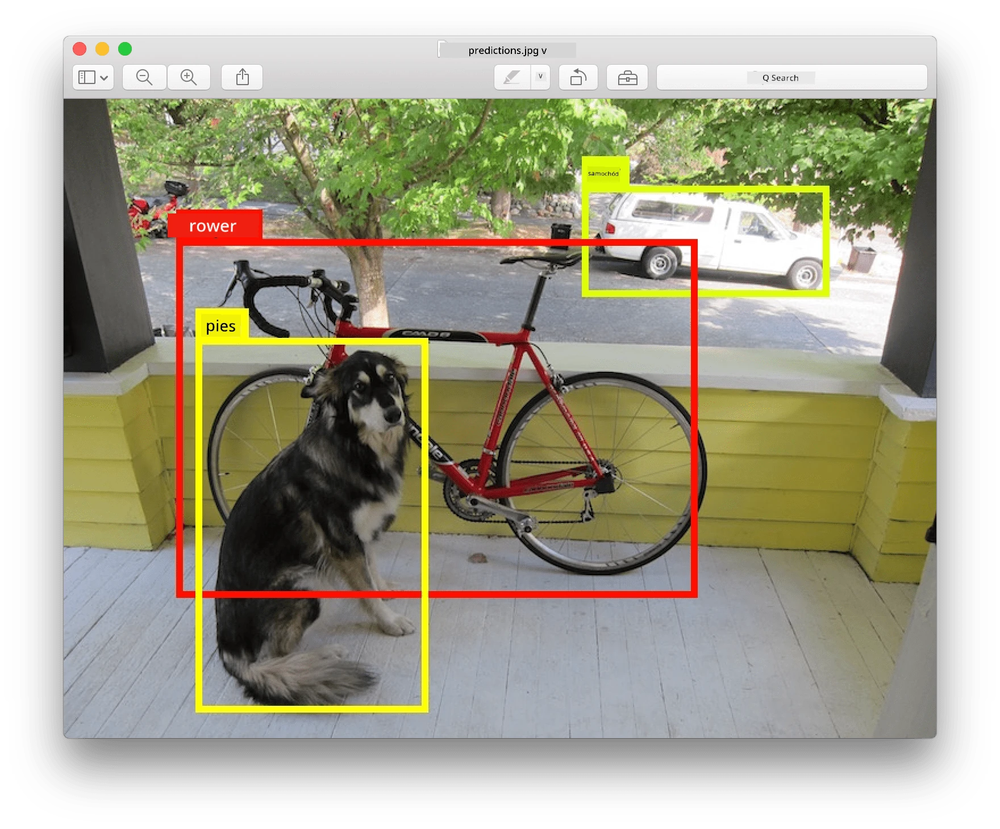
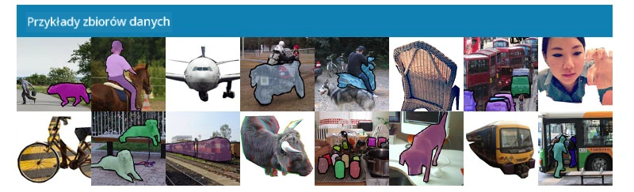
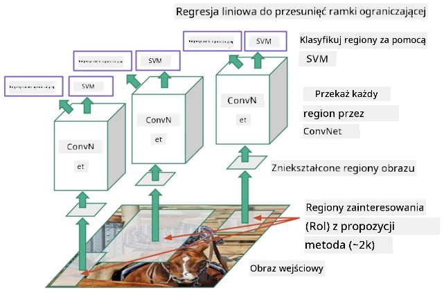
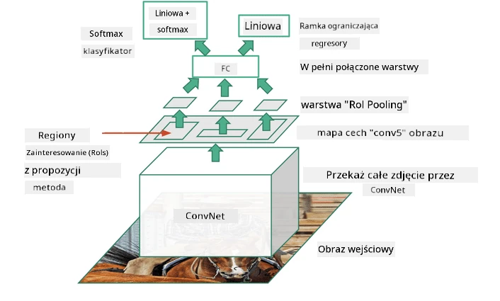
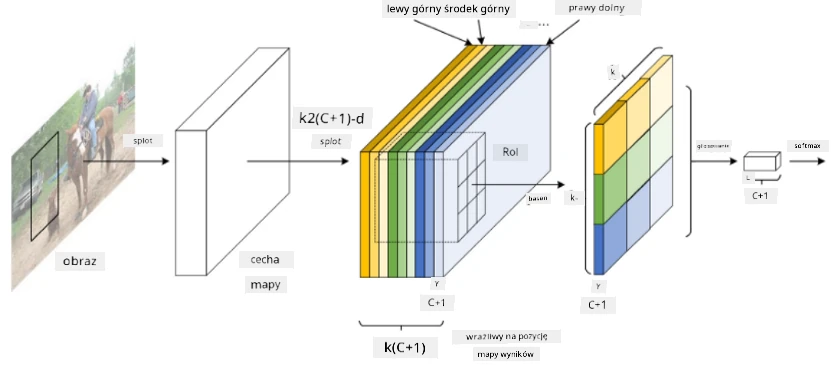
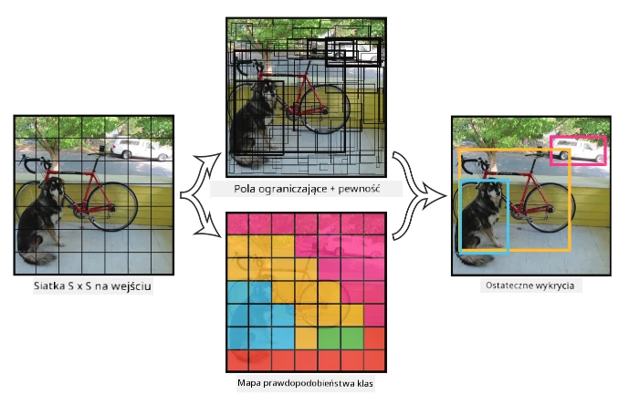

# Wykrywanie Obiektów

Modele klasyfikacji obrazów, które omawialiśmy do tej pory, przyjmowały obraz i zwracały wynik kategoryczny, na przykład klasę 'liczba' w problemie MNIST. Jednak w wielu przypadkach nie wystarczy nam wiedzieć, że na zdjęciu znajdują się obiekty – chcemy również określić ich dokładną lokalizację. Na tym właśnie polega **wykrywanie obiektów**.

## [Quiz przed wykładem](https://ff-quizzes.netlify.app/en/ai/quiz/21)

> Obraz z [witryny YOLO v2](https://pjreddie.com/darknet/yolov2/)

## Naiwne podejście do wykrywania obiektów

Załóżmy, że chcemy znaleźć kota na zdjęciu. Bardzo naiwne podejście do wykrywania obiektów mogłoby wyglądać następująco:

1. Podziel zdjęcie na wiele kafelków.
2. Uruchom klasyfikację obrazu na każdym kafelku.
3. Kafelki, które dają wystarczająco wysoką aktywację, można uznać za zawierające poszukiwany obiekt.

> *Obraz z [notatnika ćwiczeniowego](ObjectDetection-TF.ipynb)*

Jednak to podejście jest dalekie od ideału, ponieważ pozwala algorytmowi bardzo niedokładnie określić ramkę ograniczającą obiekt. Aby uzyskać bardziej precyzyjną lokalizację, musimy zastosować pewien rodzaj **regresji**, aby przewidzieć współrzędne ramek ograniczających – a do tego potrzebujemy specjalnych zbiorów danych.

## Regresja w wykrywaniu obiektów

[Ten wpis na blogu](https://towardsdatascience.com/object-detection-with-neural-networks-a4e2c46b4491) oferuje świetne wprowadzenie do wykrywania kształtów.

## Zbiory danych do wykrywania obiektów

Możesz natknąć się na następujące zbiory danych do tego zadania:

* [PASCAL VOC](http://host.robots.ox.ac.uk/pascal/VOC/) – 20 klas
* [COCO](http://cocodataset.org/#home) – Common Objects in Context. 80 klas, ramki ograniczające i maski segmentacji

## Metryki wykrywania obiektów

### Intersection over Union

Podczas gdy w klasyfikacji obrazów łatwo jest zmierzyć, jak dobrze działa algorytm, w wykrywaniu obiektów musimy ocenić zarówno poprawność klasy, jak i precyzję lokalizacji przewidywanej ramki ograniczającej. Do tego ostatniego używamy tzw. **Intersection over Union** (IoU), które mierzy, jak dobrze dwie ramki (lub dwa dowolne obszary) się pokrywają.

> *Rysunek 2 z [tego doskonałego wpisu na blogu o IoU](https://pyimagesearch.com/2016/11/07/intersection-over-union-iou-for-object-detection/)*

Idea jest prosta – dzielimy obszar przecięcia dwóch figur przez obszar ich sumy. Dla dwóch identycznych obszarów IoU wynosi 1, natomiast dla całkowicie rozłącznych obszarów wynosi 0. W przeciwnym razie wartość IoU waha się od 0 do 1. Zazwyczaj bierzemy pod uwagę tylko te ramki ograniczające, dla których IoU przekracza określoną wartość.

### Średnia precyzja (Average Precision)

Załóżmy, że chcemy zmierzyć, jak dobrze rozpoznawana jest dana klasa obiektów $C$. Do tego celu używamy metryki **Average Precision**, która jest obliczana w następujący sposób:

1. Rozważ krzywą Precision-Recall, która pokazuje dokładność w zależności od wartości progu detekcji (od 0 do 1).
2. W zależności od progu wykryjemy więcej lub mniej obiektów na obrazie, co da różne wartości precyzji i czułości.
3. Krzywa wygląda następująco:

> *Obraz z [NeuroWorkshop](http://github.com/shwars/NeuroWorkshop)*

Średnia precyzja dla danej klasy $C$ to pole pod tą krzywą. Dokładniej, oś Recall jest zazwyczaj podzielona na 10 części, a precyzja jest uśredniana dla wszystkich tych punktów:

$$
AP = {1\over11}\sum_{i=0}^{10}\mbox{Precision}(\mbox{Recall}={i\over10})
$$

### AP i IoU

Rozważamy tylko te detekcje, dla których IoU przekracza określoną wartość. Na przykład w zbiorze danych PASCAL VOC zazwyczaj zakłada się $\mbox{IoU Threshold} = 0.5$, podczas gdy w COCO AP jest mierzona dla różnych wartości $\mbox{IoU Threshold}$.

> *Obraz z [NeuroWorkshop](http://github.com/shwars/NeuroWorkshop)*

### Średnia średnia precyzja – mAP

Główną metryką dla wykrywania obiektów jest tzw. **Mean Average Precision**, czyli **mAP**. Jest to wartość Average Precision, uśredniona dla wszystkich klas obiektów, a czasami także dla różnych wartości $\mbox{IoU Threshold}$. Szczegółowy opis procesu obliczania **mAP** znajdziesz 
[w tym wpisie na blogu](https://medium.com/@timothycarlen/understanding-the-map-evaluation-metric-for-object-detection-a07fe6962cf3)), a także [tutaj z przykładami kodu](https://gist.github.com/tarlen5/008809c3decf19313de216b9208f3734).

## Różne podejścia do wykrywania obiektów

Istnieją dwie główne klasy algorytmów wykrywania obiektów:

* **Sieci propozycji regionów** (R-CNN, Fast R-CNN, Faster R-CNN). Główna idea polega na generowaniu **regionów zainteresowania** (ROI) i uruchamianiu CNN na nich, szukając maksymalnej aktywacji. Jest to trochę podobne do naiwnego podejścia, z tą różnicą, że ROI są generowane w bardziej inteligentny sposób. Jednym z głównych minusów takich metod jest ich powolność, ponieważ wymagają wielu przejść klasyfikatora CNN przez obraz.
* Metody **jednoprzebiegowe** (YOLO, SSD, RetinaNet). W tych architekturach projektujemy sieć tak, aby przewidywała zarówno klasy, jak i ROI w jednym przebiegu.

### R-CNN: Region-Based CNN

[R-CNN](http://islab.ulsan.ac.kr/files/announcement/513/rcnn_pami.pdf) wykorzystuje [Selective Search](http://www.huppelen.nl/publications/selectiveSearchDraft.pdf) do generowania hierarchicznej struktury regionów ROI, które następnie są przetwarzane przez ekstraktory cech CNN i klasyfikatory SVM w celu określenia klasy obiektu oraz regresję liniową w celu określenia współrzędnych *ramki ograniczającej*. [Oficjalny artykuł](https://arxiv.org/pdf/1506.01497v1.pdf)

> *Obraz z van de Sande et al. ICCV’11*

> *Obrazy z [tego bloga](https://towardsdatascience.com/r-cnn-fast-r-cnn-faster-r-cnn-yolo-object-detection-algorithms-36d53571365e)*

### F-RCNN - Fast R-CNN

To podejście jest podobne do R-CNN, ale regiony są definiowane po zastosowaniu warstw konwolucyjnych.

> Obraz z [oficjalnego artykułu](https://www.cv-foundation.org/openaccess/content_iccv_2015/papers/Girshick_Fast_R-CNN_ICCV_2015_paper.pdf), [arXiv](https://arxiv.org/pdf/1504.08083.pdf), 2015

### Faster R-CNN

Główna idea tego podejścia polega na użyciu sieci neuronowej do przewidywania ROI – tzw. *Region Proposal Network*. [Artykuł](https://arxiv.org/pdf/1506.01497.pdf), 2016

> Obraz z [oficjalnego artykułu](https://arxiv.org/pdf/1506.01497.pdf)

### R-FCN: Region-Based Fully Convolutional Network

Ten algorytm jest jeszcze szybszy niż Faster R-CNN. Główna idea jest następująca:

1. Wyodrębniamy cechy za pomocą ResNet-101.
2. Cechy są przetwarzane przez **Position-Sensitive Score Map**. Każdy obiekt z $C$ klas jest dzielony na $k\times k$ regiony, a sieć jest trenowana do przewidywania części obiektów.
3. Dla każdej części z $k\times k$ regionów wszystkie sieci głosują na klasy obiektów, a klasa z największą liczbą głosów jest wybierana.

> Obraz z [oficjalnego artykułu](https://arxiv.org/abs/1605.06409)

### YOLO - You Only Look Once

YOLO to algorytm jednoprzebiegowy w czasie rzeczywistym. Główna idea jest następująca:

 * Obraz jest dzielony na $S\times S$ regiony.
 * Dla każdego regionu **CNN** przewiduje $n$ możliwych obiektów, współrzędne *ramki ograniczającej* oraz *pewność* = *prawdopodobieństwo* * IoU.

 

> Obraz z [oficjalnego artykułu](https://arxiv.org/abs/1506.02640)

### Inne algorytmy

* RetinaNet: [oficjalny artykuł](https://arxiv.org/abs/1708.02002)
   - [Implementacja w PyTorch w Torchvision](https://pytorch.org/vision/stable/_modules/torchvision/models/detection/retinanet.html)
   - [Implementacja w Keras](https://github.com/fizyr/keras-retinanet)
   - [Wykrywanie obiektów za pomocą RetinaNet](https://keras.io/examples/vision/retinanet/) w przykładach Keras
* SSD (Single Shot Detector): [oficjalny artykuł](https://arxiv.org/abs/1512.02325)

## ✍️ Ćwiczenia: Wykrywanie Obiektów

Kontynuuj naukę w następującym notatniku:

[ObjectDetection.ipynb](ObjectDetection.ipynb)

## Podsumowanie

W tej lekcji odbyłeś błyskawiczną podróż po różnych sposobach wykrywania obiektów!

## 🚀 Wyzwanie

Przeczytaj te artykuły i notatniki o YOLO i wypróbuj je samodzielnie:

* [Dobry wpis na blogu](https://www.analyticsvidhya.com/blog/2018/12/practical-guide-object-detection-yolo-framewor-python/) opisujący YOLO
 * [Oficjalna strona](https://pjreddie.com/darknet/yolo/)
 * YOLO: [Implementacja w Keras](https://github.com/experiencor/keras-yolo2), [notatnik krok po kroku](https://github.com/experiencor/basic-yolo-keras/blob/master/Yolo%20Step-by-Step.ipynb)
 * YOLO v2: [Implementacja w Keras](https://github.com/experiencor/keras-yolo2), [notatnik krok po kroku](https://github.com/experiencor/keras-yolo2/blob/master/Yolo%20Step-by-Step.ipynb)

## [Quiz po wykładzie](https://ff-quizzes.netlify.app/en/ai/quiz/22)

## Przegląd i samodzielna nauka

* [Wykrywanie Obiektów](https://tjmachinelearning.com/lectures/1718/obj/) autorstwa Nikhila Sardany
* [Dobre porównanie algorytmów wykrywania obiektów](https://lilianweng.github.io/lil-log/2018/12/27/object-detection-part-4.html)
* [Przegląd algorytmów głębokiego uczenia do wykrywania obiektów](https://medium.com/comet-app/review-of-deep-learning-algorithms-for-object-detection-c1f3d437b852)
* [Wprowadzenie krok po kroku do podstawowych algorytmów wykrywania obiektów](https://www.analyticsvidhya.com/blog/2018/10/a-step-by-step-introduction-to-the-basic-object-detection-algorithms-part-1/)
* [Implementacja Faster R-CNN w Pythonie do wykrywania obiektów](https://www.analyticsvidhya.com/blog/2018/11/implementation-faster-r-cnn-python-object-detection/)

## [Zadanie: Wykrywanie Obiektów](lab/README.md)

---

