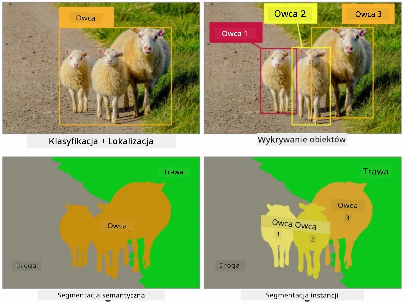

# Segmentacja

Wcześniej nauczyliśmy się o Detekcji Obiektów, która pozwala na lokalizację obiektów na obrazie poprzez przewidywanie ich *ramki ograniczającej*. Jednak w niektórych zadaniach potrzebujemy nie tylko ramek ograniczających, ale także bardziej precyzyjnej lokalizacji obiektów. To zadanie nazywa się **segmentacją**.

## [Quiz przed wykładem](https://ff-quizzes.netlify.app/en/ai/quiz/23)

Segmentację można postrzegać jako **klasyfikację pikseli**, gdzie dla **każdego** piksela obrazu musimy przewidzieć jego klasę (*tło* jest jedną z klas). Istnieją dwa główne algorytmy segmentacji:

* **Segmentacja semantyczna** określa jedynie klasę piksela, nie rozróżniając różnych obiektów tej samej klasy.
* **Segmentacja instancji** dzieli klasy na różne instancje.

W przypadku segmentacji instancji te owce są różnymi obiektami, ale w segmentacji semantycznej wszystkie owce są reprezentowane jako jedna klasa.

> Obraz z [tego wpisu na blogu](https://nirmalamurali.medium.com/image-classification-vs-semantic-segmentation-vs-instance-segmentation-625c33a08d50)

Istnieją różne architektury neuronowe do segmentacji, ale wszystkie mają podobną strukturę. W pewnym sensie przypomina to autoenkoder, o którym wcześniej się uczyliście, ale zamiast dekonstrukcji oryginalnego obrazu, naszym celem jest dekonstrukcja **maski**. Zatem sieć segmentacyjna składa się z następujących części:

* **Enkoder** wyodrębnia cechy z obrazu wejściowego.
* **Dekoder** przekształca te cechy w **obraz maski**, o tym samym rozmiarze i liczbie kanałów odpowiadających liczbie klas.

> Obraz z [tej publikacji](https://arxiv.org/pdf/2001.05566.pdf)

Szczególną uwagę należy zwrócić na funkcję straty używaną w segmentacji. W przypadku klasycznych autoenkoderów musimy zmierzyć podobieństwo między dwoma obrazami, i możemy do tego użyć średniego błędu kwadratowego (MSE). W segmentacji każdy piksel w docelowym obrazie maski reprezentuje numer klasy (zakodowany w formacie one-hot wzdłuż trzeciego wymiaru), więc musimy używać funkcji straty specyficznych dla klasyfikacji - straty krzyżowej entropii, uśrednionej dla wszystkich pikseli. Jeśli maska jest binarna - używa się **straty krzyżowej entropii binarnej** (BCE).

> ✅ Kodowanie one-hot to sposób kodowania etykiety klasy w wektorze o długości równej liczbie klas. Zobacz [ten artykuł](https://datagy.io/sklearn-one-hot-encode/) na temat tej techniki.

## Segmentacja w obrazowaniu medycznym

W tej lekcji zobaczymy segmentację w praktyce, trenując sieć do rozpoznawania ludzkich znamion (znanych również jako pieprzyki) na obrazach medycznych. Będziemy korzystać z <a href="https://www.fc.up.pt/addi/ph2%20database.html">Bazy Danych PH2</a> obrazów dermoskopowych jako źródła obrazów. Ten zbiór danych zawiera 200 obrazów trzech klas: typowe znamię, atypowe znamię i czerniak. Wszystkie obrazy zawierają również odpowiadającą im **maskę**, która obrysowuje znamię.

> ✅ Ta technika jest szczególnie odpowiednia dla tego typu obrazowania medycznego, ale jakie inne zastosowania w rzeczywistym świecie możesz sobie wyobrazić?

> Obraz z Bazy Danych PH2

Nauczymy model segmentować każde znamię z jego tła.

## ✍️ Ćwiczenia: Segmentacja semantyczna

Otwórz poniższe notatniki, aby dowiedzieć się więcej o różnych architekturach segmentacji semantycznej, poćwiczyć pracę z nimi i zobaczyć je w działaniu.

* [Segmentacja semantyczna Pytorch](SemanticSegmentationPytorch.ipynb)
* [Segmentacja semantyczna TensorFlow](SemanticSegmentationTF.ipynb)

## [Quiz po wykładzie](https://ff-quizzes.netlify.app/en/ai/quiz/24)

## Podsumowanie

Segmentacja to bardzo potężna technika klasyfikacji obrazów, która wykracza poza ramki ograniczające, przechodząc do klasyfikacji na poziomie pikseli. Jest to technika stosowana w obrazowaniu medycznym, a także w innych zastosowaniach.

## 🚀 Wyzwanie

Segmentacja ciała to tylko jedno z powszechnych zadań, które możemy wykonywać z obrazami ludzi. Inne ważne zadania obejmują **detekcję szkieletu** i **detekcję pozycji**. Wypróbuj bibliotekę [OpenPose](https://github.com/CMU-Perceptual-Computing-Lab/openpose), aby zobaczyć, jak można wykorzystać detekcję pozycji.

## Przegląd i samodzielna nauka

Ten [artykuł na Wikipedii](https://wikipedia.org/wiki/Image_segmentation) oferuje dobre podsumowanie różnych zastosowań tej techniki. Dowiedz się więcej na własną rękę o poddziedzinach segmentacji instancji i segmentacji panoptycznej w tej dziedzinie badań.

## [Zadanie](lab/README.md)

W tym laboratorium spróbuj **segmentacji ciała ludzkiego** używając [Segmentation Full Body MADS Dataset](https://www.kaggle.com/datasets/tapakah68/segmentation-full-body-mads-dataset) z Kaggle.

---

