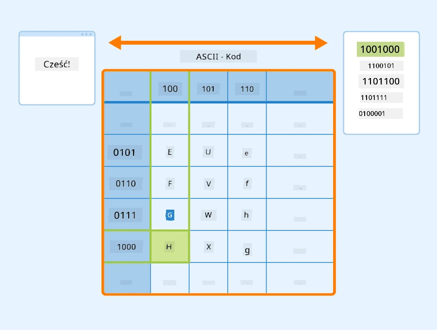
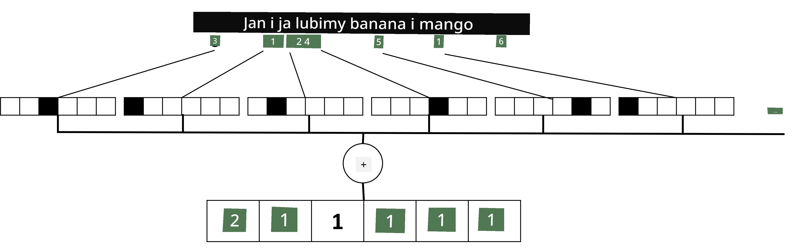

# Reprezentowanie tekstu jako tensory

## [Pre-quiz przed wykładem](https://ff-quizzes.netlify.app/en/ai/quiz/25)

## Klasyfikacja tekstu

W pierwszej części tego rozdziału skupimy się na zadaniu **klasyfikacji tekstu**. Wykorzystamy zbiór danych [AG News](https://www.kaggle.com/amananandrai/ag-news-classification-dataset), który zawiera artykuły prasowe, takie jak poniższy:

* Kategoria: Nauka/Technologia
* Tytuł: Firma z Kentucky zdobywa grant na badanie peptydów (AP)
* Treść: AP - Firma założona przez badacza chemii z Uniwersytetu w Louisville zdobyła grant na rozwój...

Naszym celem będzie sklasyfikowanie artykułu prasowego do jednej z kategorii na podstawie tekstu.

## Reprezentowanie tekstu

Aby rozwiązywać zadania związane z przetwarzaniem języka naturalnego (NLP) za pomocą sieci neuronowych, musimy znaleźć sposób na reprezentowanie tekstu jako tensory. Komputery już teraz reprezentują znaki tekstowe jako liczby, które mapują na czcionki na ekranie, używając kodowań takich jak ASCII czy UTF-8.

> [Źródło obrazu](https://www.seobility.net/en/wiki/ASCII)

Jako ludzie rozumiemy, co każdy znak **reprezentuje** i jak wszystkie znaki łączą się, tworząc słowa w zdaniu. Jednak komputery same w sobie nie mają takiego zrozumienia, a sieć neuronowa musi nauczyć się znaczenia podczas treningu.

Dlatego możemy używać różnych podejść do reprezentowania tekstu:

* **Reprezentacja na poziomie znaków**, gdzie tekst reprezentujemy, traktując każdy znak jako liczbę. Zakładając, że mamy *C* różnych znaków w naszym korpusie tekstowym, słowo *Hello* byłoby reprezentowane jako tensor 5x*C*. Każda litera odpowiadałaby kolumnie tensora w kodowaniu one-hot.
* **Reprezentacja na poziomie słów**, w której tworzymy **słownik** wszystkich słów w naszym tekście, a następnie reprezentujemy słowa za pomocą kodowania one-hot. To podejście jest nieco lepsze, ponieważ każda litera sama w sobie nie ma dużego znaczenia, a używając wyższych poziomów semantycznych - słów - upraszczamy zadanie dla sieci neuronowej. Jednak ze względu na dużą wielkość słownika musimy radzić sobie z tensorami o wysokiej wymiarowości i dużej rzadkości.

Niezależnie od wybranej reprezentacji, najpierw musimy przekształcić tekst w sekwencję **tokenów**, gdzie jeden token to znak, słowo lub czasami nawet część słowa. Następnie konwertujemy token na liczbę, zazwyczaj używając **słownika**, a tę liczbę można wprowadzić do sieci neuronowej za pomocą kodowania one-hot.

## N-Gramy

W języku naturalnym precyzyjne znaczenie słów można określić tylko w kontekście. Na przykład znaczenia *sieć neuronowa* i *sieć rybacka* są zupełnie różne. Jednym ze sposobów uwzględnienia tego jest budowanie modelu na parach słów i traktowanie par słów jako oddzielnych tokenów słownika. W ten sposób zdanie *Lubię chodzić na ryby* będzie reprezentowane przez następującą sekwencję tokenów: *Lubię chodzić*, *chodzić na*, *na ryby*. Problem z tym podejściem polega na tym, że rozmiar słownika znacznie rośnie, a kombinacje takie jak *na ryby* i *na zakupy* są reprezentowane przez różne tokeny, które nie dzielą żadnego podobieństwa semantycznego mimo tego samego czasownika.

W niektórych przypadkach możemy rozważyć użycie tri-gramów — kombinacji trzech słów. Takie podejście nazywane jest **n-gramami**. Warto również używać n-gramów w reprezentacji na poziomie znaków, gdzie n-gramy będą mniej więcej odpowiadać różnym sylabom.

## Bag-of-Words i TF/IDF

Podczas rozwiązywania zadań takich jak klasyfikacja tekstu musimy być w stanie reprezentować tekst za pomocą jednego wektora o stałym rozmiarze, który będzie używany jako wejście do końcowego klasyfikatora gęstego. Jednym z najprostszych sposobów na to jest połączenie wszystkich indywidualnych reprezentacji słów, np. przez ich dodanie. Jeśli dodamy kodowania one-hot każdego słowa, otrzymamy wektor częstotliwości, pokazujący, ile razy każde słowo pojawia się w tekście. Taka reprezentacja tekstu nazywana jest **bag-of-words** (BoW).

> Obraz autorstwa autora

BoW zasadniczo reprezentuje, które słowa pojawiają się w tekście i w jakich ilościach, co może być dobrym wskaźnikiem tego, o czym jest tekst. Na przykład artykuł prasowy o polityce prawdopodobnie zawiera słowa takie jak *prezydent* i *kraj*, podczas gdy publikacja naukowa może zawierać słowa takie jak *zderzacz*, *odkryto*, itd. Zatem częstotliwości słów mogą w wielu przypadkach być dobrym wskaźnikiem treści tekstu.

Problem z BoW polega na tym, że pewne powszechne słowa, takie jak *i*, *jest*, itd., pojawiają się w większości tekstów i mają najwyższe częstotliwości, maskując słowa, które są naprawdę ważne. Możemy obniżyć znaczenie tych słów, uwzględniając częstotliwość, z jaką słowa występują w całej kolekcji dokumentów. To jest główna idea podejścia TF/IDF, które jest szczegółowo omówione w notatnikach dołączonych do tej lekcji.

Jednak żadne z tych podejść nie jest w stanie w pełni uwzględnić **semantyki** tekstu. Potrzebujemy bardziej zaawansowanych modeli sieci neuronowych, aby to zrobić, co omówimy później w tym rozdziale.

## ✍️ Ćwiczenia: Reprezentacja tekstu

Kontynuuj naukę w poniższych notatnikach:

* [Reprezentacja tekstu w PyTorch](TextRepresentationPyTorch.ipynb)
* [Reprezentacja tekstu w TensorFlow](TextRepresentationTF.ipynb)

## Podsumowanie

Do tej pory poznaliśmy techniki, które mogą dodawać wagę częstotliwości do różnych słów. Nie są one jednak w stanie reprezentować znaczenia ani kolejności. Jak powiedział słynny językoznawca J. R. Firth w 1935 roku: "Pełne znaczenie słowa zawsze jest kontekstowe, a żadna analiza znaczenia poza kontekstem nie może być traktowana poważnie." W dalszej części kursu nauczymy się, jak uchwycić informacje kontekstowe z tekstu za pomocą modelowania języka.

## 🚀 Wyzwanie

Wypróbuj inne ćwiczenia, korzystając z bag-of-words i różnych modeli danych. Możesz zainspirować się tym [konkursem na Kaggle](https://www.kaggle.com/competitions/word2vec-nlp-tutorial/overview/part-1-for-beginners-bag-of-words)

## [Quiz po wykładzie](https://ff-quizzes.netlify.app/en/ai/quiz/26)

## Przegląd i samodzielna nauka

Ćwicz swoje umiejętności z technikami osadzania tekstu i bag-of-words na [Microsoft Learn](https://docs.microsoft.com/learn/modules/intro-natural-language-processing-pytorch/?WT.mc_id=academic-77998-cacaste)

## [Zadanie: Notatniki](assignment.md)

---

