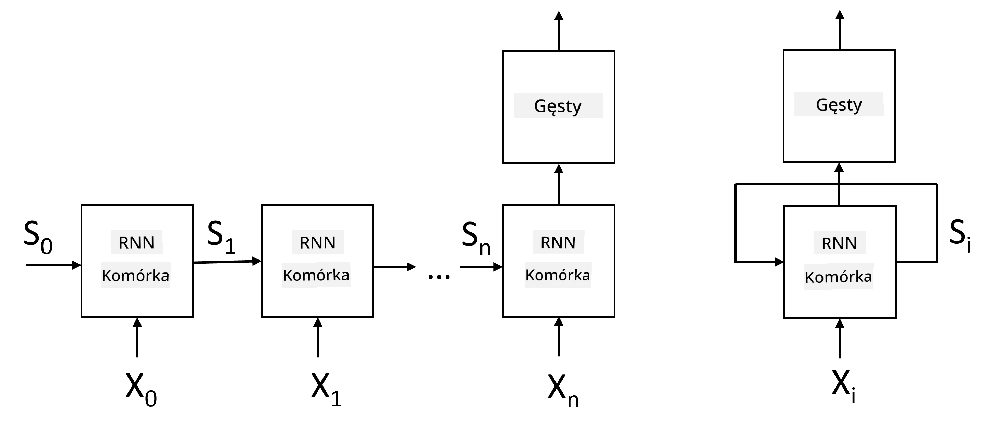
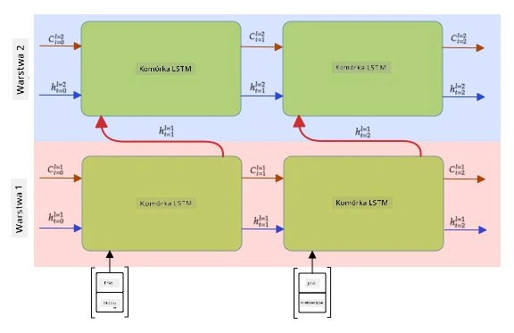

# Sieci Neuronowe Rekurencyjne

## [Quiz przed wykładem](https://ff-quizzes.netlify.app/en/ai/quiz/31)

W poprzednich sekcjach korzystaliśmy z bogatych semantycznych reprezentacji tekstu oraz prostego klasyfikatora liniowego na bazie osadzeń. Taka architektura pozwala uchwycić zagregowane znaczenie słów w zdaniu, ale nie uwzględnia **kolejności** słów, ponieważ operacja agregacji na osadzeniach usuwa tę informację z oryginalnego tekstu. Z tego powodu modele te nie są w stanie modelować kolejności słów, co uniemożliwia rozwiązywanie bardziej złożonych lub niejednoznacznych zadań, takich jak generowanie tekstu czy odpowiadanie na pytania.

Aby uchwycić znaczenie sekwencji tekstu, musimy użyć innej architektury sieci neuronowej, zwanej **siecią neuronową rekurencyjną** (RNN). W RNN przekazujemy nasze zdanie przez sieć symbol po symbolu, a sieć generuje pewien **stan**, który następnie przekazujemy z kolejnym symbolem.

> Obraz autorstwa autora

Dla wejściowej sekwencji tokenów X0,...,Xn, RNN tworzy sekwencję bloków sieci neuronowej i trenuje tę sekwencję end-to-end za pomocą propagacji wstecznej. Każdy blok sieci przyjmuje parę (Xi,Si) jako wejście i generuje Si+1 jako wynik. Końcowy stan Sn (lub wyjście Yn) trafia do klasyfikatora liniowego, który generuje wynik. Wszystkie bloki sieci mają te same wagi i są trenowane end-to-end w jednym przebiegu propagacji wstecznej.

Ponieważ wektory stanów S0,...,Sn są przekazywane przez sieć, jest ona w stanie nauczyć się zależności sekwencyjnych między słowami. Na przykład, gdy w sekwencji pojawia się słowo *nie*, sieć może nauczyć się negować pewne elementy wektora stanu, co prowadzi do negacji.

> ✅ Ponieważ wagi wszystkich bloków RNN na powyższym obrazku są wspólne, ten sam obrazek można przedstawić jako jeden blok (po prawej) z pętlą sprzężenia zwrotnego, która przekazuje wyjściowy stan sieci z powrotem na wejście.

## Anatomia komórki RNN

Przyjrzyjmy się, jak zorganizowana jest prosta komórka RNN. Przyjmuje ona poprzedni stan Si-1 oraz bieżący symbol Xi jako wejścia i musi wygenerować wyjściowy stan Si (a czasami interesuje nas również inne wyjście Yi, jak w przypadku sieci generatywnych).

Prosta komórka RNN ma wewnątrz dwie macierze wag: jedna przekształca symbol wejściowy (nazwijmy ją W), a druga przekształca stan wejściowy (H). W takim przypadku wyjście sieci obliczane jest jako &sigma;(W&times;Xi+H&times;Si-1+b), gdzie &sigma; to funkcja aktywacji, a b to dodatkowe przesunięcie.

> Obraz autorstwa autora

W wielu przypadkach tokeny wejściowe są przekazywane przez warstwę osadzeń przed wejściem do RNN, aby zmniejszyć wymiarowość. W takim przypadku, jeśli wymiar wektorów wejściowych wynosi *emb_size*, a wektor stanu wynosi *hid_size* - rozmiar W to *emb_size*&times;*hid_size*, a rozmiar H to *hid_size*&times;*hid_size*.

## Długie Krótkoterminowe Pamięci (LSTM)

Jednym z głównych problemów klasycznych RNN jest tzw. problem **zanikających gradientów**. Ponieważ RNN są trenowane end-to-end w jednym przebiegu propagacji wstecznej, mają trudności z propagowaniem błędu do pierwszych warstw sieci, co uniemożliwia naukę relacji między odległymi tokenami. Jednym ze sposobów uniknięcia tego problemu jest wprowadzenie **jawnego zarządzania stanem** za pomocą tzw. **bramek**. Istnieją dwie dobrze znane architektury tego typu: **Długie Krótkoterminowe Pamięci** (LSTM) oraz **Jednostka Przekaźnikowa Bramkowana** (GRU).

> Źródło obrazu TBD

Sieć LSTM jest zorganizowana w sposób podobny do RNN, ale istnieją dwa stany, które są przekazywane z warstwy do warstwy: rzeczywisty stan C oraz wektor ukryty H. W każdej jednostce wektor ukryty Hi jest konkatenowany z wejściem Xi, a następnie kontrolują one, co dzieje się ze stanem C za pomocą **bramek**. Każda bramka jest siecią neuronową z aktywacją sigmoid (wyjście w zakresie [0,1]), którą można traktować jako maskę bitową przy mnożeniu przez wektor stanu. Na powyższym obrazku znajdują się następujące bramki (od lewej do prawej):

* **Bramka zapominania** przyjmuje wektor ukryty i określa, które komponenty wektora C należy zapomnieć, a które przekazać dalej.
* **Bramka wejściowa** pobiera pewne informacje z wektorów wejściowego i ukrytego i wprowadza je do stanu.
* **Bramka wyjściowa** przekształca stan za pomocą warstwy liniowej z aktywacją *tanh*, a następnie wybiera niektóre z jego komponentów za pomocą wektora ukrytego Hi, aby wygenerować nowy stan Ci+1.

Komponenty stanu C można traktować jako pewne flagi, które można włączać i wyłączać. Na przykład, gdy w sekwencji napotkamy imię *Alice*, możemy założyć, że odnosi się ono do postaci kobiecej i podnieść flagę w stanie, że mamy rzeczownik żeński w zdaniu. Gdy dalej napotkamy frazę *i Tom*, podniesiemy flagę, że mamy rzeczownik w liczbie mnogiej. W ten sposób manipulując stanem możemy teoretycznie śledzić właściwości gramatyczne części zdania.

> ✅ Doskonałym źródłem do zrozumienia wewnętrznej struktury LSTM jest ten świetny artykuł [Understanding LSTM Networks](https://colah.github.io/posts/2015-08-Understanding-LSTMs/) autorstwa Christophera Olaha.

## Dwukierunkowe i wielowarstwowe RNN

Omówiliśmy sieci rekurencyjne, które działają w jednym kierunku, od początku sekwencji do końca. Wydaje się to naturalne, ponieważ przypomina sposób, w jaki czytamy i słuchamy mowy. Jednakże, ponieważ w wielu praktycznych przypadkach mamy losowy dostęp do sekwencji wejściowej, może mieć sens uruchomienie obliczeń rekurencyjnych w obu kierunkach. Takie sieci nazywane są **dwukierunkowymi** RNN. W przypadku sieci dwukierunkowej potrzebne będą dwa wektory ukryte, po jednym dla każdego kierunku.

Sieć rekurencyjna, czy to jednokierunkowa, czy dwukierunkowa, wychwytuje pewne wzorce w sekwencji i może je przechowywać w wektorze stanu lub przekazywać na wyjście. Podobnie jak w przypadku sieci konwolucyjnych, możemy zbudować kolejną warstwę rekurencyjną na szczycie pierwszej, aby uchwycić wzorce wyższego poziomu i budować na bazie wzorców niskiego poziomu wyodrębnionych przez pierwszą warstwę. Prowadzi to do pojęcia **wielowarstwowego RNN**, który składa się z dwóch lub więcej sieci rekurencyjnych, gdzie wyjście poprzedniej warstwy jest przekazywane jako wejście do następnej warstwy.

*Obraz z [tego wspaniałego artykułu](https://towardsdatascience.com/from-a-lstm-cell-to-a-multilayer-lstm-network-with-pytorch-2899eb5696f3) autorstwa Fernando Lópeza*

## ✍️ Ćwiczenia: Osadzenia

Kontynuuj naukę w poniższych notatnikach:

* [RNN z PyTorch](RNNPyTorch.ipynb)
* [RNN z TensorFlow](RNNTF.ipynb)

## Podsumowanie

W tej jednostce zobaczyliśmy, że RNN mogą być używane do klasyfikacji sekwencji, ale w rzeczywistości mogą obsługiwać wiele innych zadań, takich jak generowanie tekstu, tłumaczenie maszynowe i inne. Rozważymy te zadania w następnej jednostce.

## 🚀 Wyzwanie

Przeczytaj literaturę na temat LSTM i rozważ ich zastosowania:

- [Grid Long Short-Term Memory](https://arxiv.org/pdf/1507.01526v1.pdf)
- [Show, Attend and Tell: Neural Image Caption
Generation with Visual Attention](https://arxiv.org/pdf/1502.03044v2.pdf)

## [Quiz po wykładzie](https://ff-quizzes.netlify.app/en/ai/quiz/32)

## Przegląd i samodzielna nauka

- [Understanding LSTM Networks](https://colah.github.io/posts/2015-08-Understanding-LSTMs/) autorstwa Christophera Olaha.

## [Zadanie: Notatniki](assignment.md)

---

