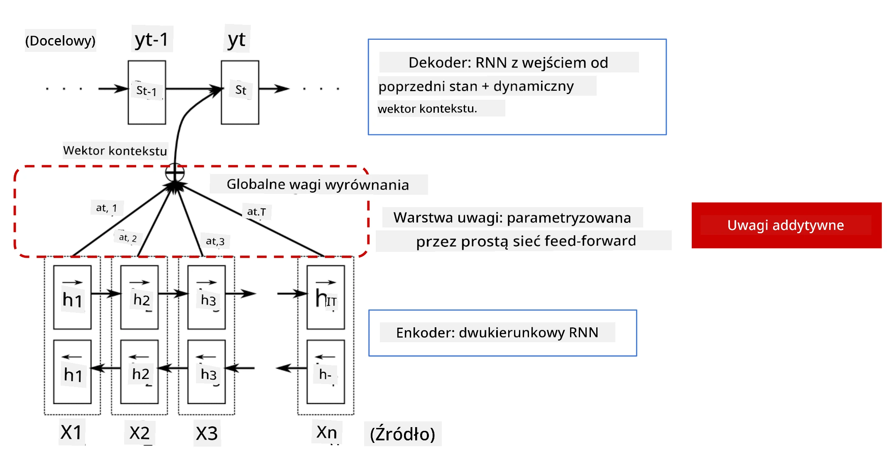
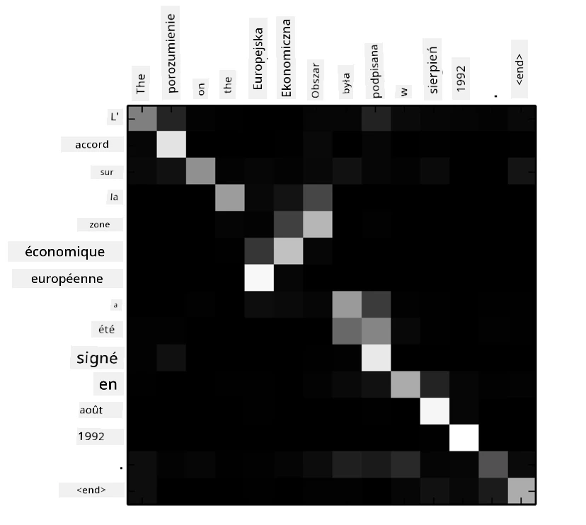
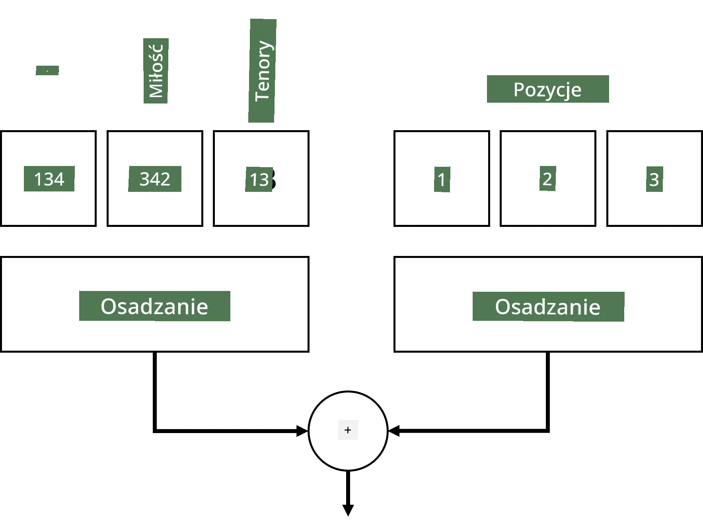
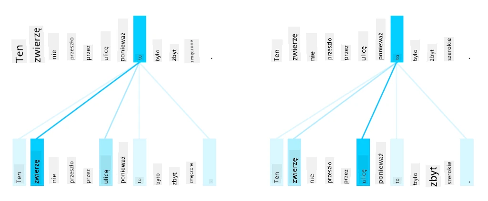
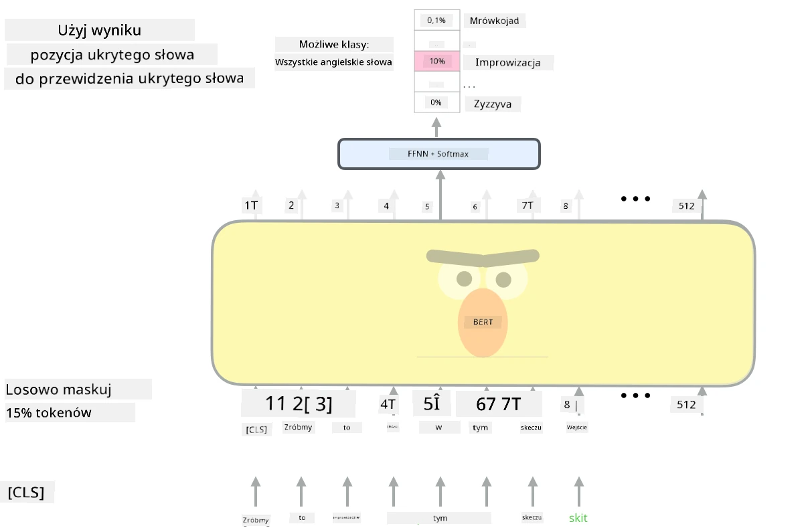

# Mechanizmy uwagi i modele Transformer

## [Quiz przed wykładem](https://ff-quizzes.netlify.app/en/ai/quiz/35)

Jednym z najważniejszych problemów w dziedzinie NLP jest **tłumaczenie maszynowe**, kluczowe zadanie, które stanowi podstawę narzędzi takich jak Google Translate. W tej sekcji skupimy się na tłumaczeniu maszynowym, a bardziej ogólnie na każdym zadaniu typu *sequence-to-sequence* (nazywanym również **transdukcją zdań**).

W przypadku RNN, zadania sequence-to-sequence są realizowane za pomocą dwóch sieci rekurencyjnych, gdzie jedna sieć, **enkoder**, przekształca sekwencję wejściową w stan ukryty, a druga sieć, **dekoder**, rozwija ten stan ukryty w przetłumaczony wynik. Istnieje kilka problemów związanych z tym podejściem:

* Końcowy stan sieci enkodera ma trudności z zapamiętaniem początku zdania, co prowadzi do niskiej jakości modelu dla długich zdań.
* Wszystkie słowa w sekwencji mają taki sam wpływ na wynik. W rzeczywistości jednak konkretne słowa w sekwencji wejściowej często mają większy wpływ na sekwencyjne wyniki niż inne.

**Mechanizmy uwagi** umożliwiają ważenie kontekstowego wpływu każdego wektora wejściowego na każdą prognozę wyjściową RNN. Implementuje się to poprzez tworzenie skrótów między stanami pośrednimi wejściowego RNN a wyjściowego RNN. W ten sposób, generując symbol wyjściowy yt, uwzględniamy wszystkie stany ukryte wejścia hi, z różnymi współczynnikami wagowymi &alpha;t,i.

> Model enkoder-dekoder z mechanizmem uwagi addytywnej w [Bahdanau et al., 2015](https://arxiv.org/pdf/1409.0473.pdf), cytowany z [tego wpisu na blogu](https://lilianweng.github.io/lil-log/2018/06/24/attention-attention.html)

Macierz uwagi {&alpha;i,j} reprezentuje stopień, w jakim określone słowa wejściowe wpływają na generowanie danego słowa w sekwencji wyjściowej. Poniżej znajduje się przykład takiej macierzy:

> Rysunek z [Bahdanau et al., 2015](https://arxiv.org/pdf/1409.0473.pdf) (Fig.3)

Mechanizmy uwagi są odpowiedzialne za dużą część obecnego lub bliskiego obecnemu stanu sztuki w NLP. Dodanie uwagi znacznie zwiększa jednak liczbę parametrów modelu, co prowadzi do problemów ze skalowaniem RNN. Kluczowym ograniczeniem skalowania RNN jest to, że rekurencyjny charakter modeli utrudnia grupowanie i równoległe trenowanie. W RNN każdy element sekwencji musi być przetwarzany w kolejności sekwencyjnej, co oznacza, że nie można go łatwo zrównoleglić.

> Rysunek z [Bloga Google](https://research.googleblog.com/2016/09/a-neural-network-for-machine.html)

Zastosowanie mechanizmów uwagi w połączeniu z tym ograniczeniem doprowadziło do powstania obecnych modeli Transformer, takich jak BERT czy Open-GPT3, które znamy i używamy dzisiaj.

## Modele Transformer

Jednym z głównych pomysłów stojących za modelami Transformer jest unikanie sekwencyjnego charakteru RNN i stworzenie modelu, który można zrównoleglić podczas treningu. Osiąga się to poprzez wdrożenie dwóch pomysłów:

* kodowanie pozycji
* użycie mechanizmu samo-uwagi do wychwytywania wzorców zamiast RNN (lub CNN) (dlatego artykuł wprowadzający modele Transformer nosi tytuł *[Attention is all you need](https://arxiv.org/abs/1706.03762)*)

### Kodowanie/Osadzanie Pozycji

Pomysł kodowania pozycji jest następujący:  
1. W przypadku RNN względna pozycja tokenów jest reprezentowana przez liczbę kroków, więc nie musi być jawnie reprezentowana.  
2. Jednak po przejściu na mechanizm uwagi musimy znać względne pozycje tokenów w sekwencji.  
3. Aby uzyskać kodowanie pozycji, uzupełniamy naszą sekwencję tokenów o sekwencję pozycji tokenów w sekwencji (np. sekwencję liczb 0,1, ...).  
4. Następnie mieszamy pozycję tokenu z wektorem osadzania tokenu. Aby przekształcić pozycję (liczbę całkowitą) w wektor, możemy użyć różnych podejść:

* Osadzanie uczone, podobne do osadzania tokenów. To podejście rozważamy tutaj. Nakładamy warstwy osadzania zarówno na tokeny, jak i ich pozycje, uzyskując wektory osadzania o tych samych wymiarach, które następnie dodajemy do siebie.
* Funkcja kodowania pozycji stałej, jak zaproponowano w oryginalnym artykule.

> Obraz autorstwa autora

Wynik, który uzyskujemy dzięki osadzaniu pozycji, osadza zarówno oryginalny token, jak i jego pozycję w sekwencji.

### Mechanizm Samo-Uwagi z Wieloma Głowami

Następnie musimy wychwycić pewne wzorce w naszej sekwencji. Aby to zrobić, modele Transformer używają mechanizmu **samo-uwagi**, który w zasadzie jest uwagą zastosowaną do tej samej sekwencji jako wejście i wyjście. Zastosowanie samo-uwagi pozwala nam uwzględnić **kontekst** w zdaniu i zobaczyć, które słowa są ze sobą powiązane. Na przykład pozwala nam zobaczyć, które słowa są odniesieniami do innych, takich jak *to*, oraz uwzględnić kontekst:

> Obraz z [Bloga Google](https://research.googleblog.com/2017/08/transformer-novel-neural-network.html)

W modelach Transformer używamy **uwagi z wieloma głowami**, aby dać sieci możliwość wychwytywania różnych typów zależności, np. relacji między słowami długoterminowych vs. krótkoterminowych, współodniesień vs. czegoś innego itd.

[Notebook TensorFlow](TransformersTF.ipynb) zawiera więcej szczegółów na temat implementacji warstw Transformer.

### Uwagi Enkoder-Dekoder

W modelach Transformer uwaga jest używana w dwóch miejscach:

* Do wychwytywania wzorców w tekście wejściowym za pomocą samo-uwagi
* Do tłumaczenia sekwencji - jest to warstwa uwagi między enkoderem a dekoderem.

Uwagi enkoder-dekoder są bardzo podobne do mechanizmu uwagi używanego w RNN, jak opisano na początku tej sekcji. Ten animowany diagram wyjaśnia rolę uwagi enkoder-dekoder.

Ponieważ każda pozycja wejściowa jest mapowana niezależnie na każdą pozycję wyjściową, modele Transformer mogą być lepiej zrównoleglone niż RNN, co umożliwia tworzenie znacznie większych i bardziej ekspresyjnych modeli językowych. Każda głowa uwagi może być używana do nauki różnych relacji między słowami, co poprawia zadania przetwarzania języka naturalnego.

## BERT

**BERT** (Bidirectional Encoder Representations from Transformers) to bardzo duża wielowarstwowa sieć Transformer z 12 warstwami dla *BERT-base* i 24 dla *BERT-large*. Model jest najpierw wstępnie trenowany na dużym korpusie danych tekstowych (Wikipedia + książki) za pomocą treningu niesuperwizowanego (przewidywanie zamaskowanych słów w zdaniu). Podczas wstępnego treningu model przyswaja znaczące poziomy zrozumienia języka, które można następnie wykorzystać z innymi zestawami danych za pomocą dostrajania. Ten proces nazywa się **transfer learning**.

> Źródło obrazu [tutaj](http://jalammar.github.io/illustrated-bert/)

## ✍️ Ćwiczenia: Transformers

Kontynuuj naukę w poniższych notebookach:

* [Transformers w PyTorch](TransformersPyTorch.ipynb)
* [Transformers w TensorFlow](TransformersTF.ipynb)

## Podsumowanie

W tej lekcji dowiedziałeś się o modelach Transformer i mechanizmach uwagi, które są niezbędnymi narzędziami w zestawie narzędzi NLP. Istnieje wiele wariacji architektur Transformer, w tym BERT, DistilBERT, BigBird, OpenGPT3 i inne, które można dostrajać. Pakiet [HuggingFace](https://github.com/huggingface/) zapewnia repozytorium do trenowania wielu z tych architektur zarówno w PyTorch, jak i TensorFlow.

## 🚀 Wyzwanie

## [Quiz po wykładzie](https://ff-quizzes.netlify.app/en/ai/quiz/36)

## Przegląd i samodzielna nauka

* [Wpis na blogu](https://mchromiak.github.io/articles/2017/Sep/12/Transformer-Attention-is-all-you-need/), wyjaśniający klasyczny artykuł [Attention is all you need](https://arxiv.org/abs/1706.03762) o modelach Transformer.
* [Seria wpisów na blogu](https://towardsdatascience.com/transformers-explained-visually-part-1-overview-of-functionality-95a6dd460452) o modelach Transformer, wyjaśniająca szczegóły architektury.

## [Zadanie](assignment.md)

---

