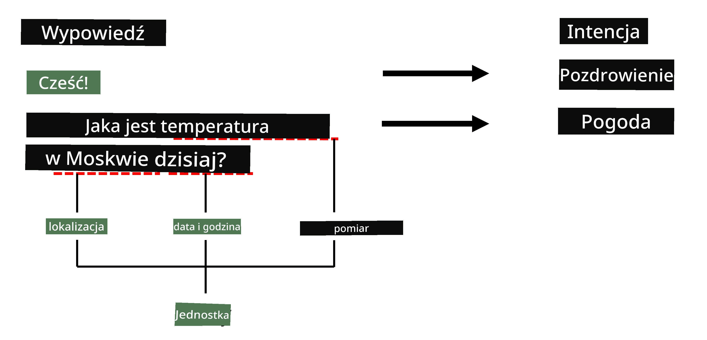

# Rozpoznawanie nazwanych jednostek

Do tej pory skupialiśmy się głównie na jednym zadaniu NLP - klasyfikacji. Jednak istnieją również inne zadania NLP, które można realizować za pomocą sieci neuronowych. Jednym z takich zadań jest **[Rozpoznawanie nazwanych jednostek](https://wikipedia.org/wiki/Named-entity_recognition)** (NER), które polega na identyfikowaniu konkretnych jednostek w tekście, takich jak miejsca, imiona i nazwiska, przedziały czasowe, wzory chemiczne i inne.

## [Quiz przed wykładem](https://ff-quizzes.netlify.app/en/ai/quiz/37)

## Przykład użycia NER

Załóżmy, że chcesz stworzyć chatbot oparty na języku naturalnym, podobny do Amazon Alexa czy Google Assistant. Inteligentne chatboty działają w ten sposób, że *rozumieją*, czego użytkownik chce, poprzez klasyfikację tekstu w zdaniu wejściowym. Wynikiem tej klasyfikacji jest tak zwany **intencja**, która określa, co chatbot powinien zrobić.

> Obraz autorstwa autora

Jednak użytkownik może podać pewne parametry jako część wypowiedzi. Na przykład, pytając o pogodę, może określić lokalizację lub datę. Bot powinien być w stanie zrozumieć te jednostki i odpowiednio wypełnić pola parametrów przed wykonaniem akcji. Właśnie tutaj wkracza NER.

> ✅ Innym przykładem może być [analiza naukowych artykułów medycznych](https://soshnikov.com/science/analyzing-medical-papers-with-azure-and-text-analytics-for-health/). Jednym z głównych celów jest wyszukiwanie konkretnych terminów medycznych, takich jak choroby i substancje medyczne. Podczas gdy niewielką liczbę chorób można prawdopodobnie wyodrębnić za pomocą wyszukiwania podciągów, bardziej złożone jednostki, takie jak związki chemiczne i nazwy leków, wymagają bardziej zaawansowanego podejścia.

## NER jako klasyfikacja tokenów

Modele NER są w istocie **modelami klasyfikacji tokenów**, ponieważ dla każdego z tokenów wejściowych musimy zdecydować, czy należy do jednostki, czy nie, a jeśli tak - do której klasy jednostki.

Rozważmy następujący tytuł artykułu:

**Niedomykalność zastawki trójdzielnej** i **węglan litu** **toksyczność** u noworodka.

Jednostki tutaj to:

* Niedomykalność zastawki trójdzielnej to choroba (`DIS`)
* Węglan litu to substancja chemiczna (`CHEM`)
* Toksyczność to również choroba (`DIS`)

Zauważ, że jedna jednostka może obejmować kilka tokenów. I, jak w tym przypadku, musimy rozróżnić dwie kolejne jednostki. Dlatego często używa się dwóch klas dla każdej jednostki - jednej określającej pierwszy token jednostki (często używa się prefiksu `B-`, od **b**eginning - początek), a drugiej - kontynuację jednostki (`I-`, od **i**nner token - wewnętrzny token). Używamy również `O` jako klasy reprezentującej wszystkie **o**ther tokens - inne tokeny. Takie tagowanie tokenów nazywa się [tagowaniem BIO](https://en.wikipedia.org/wiki/Inside%E2%80%93outside%E2%80%93beginning_(tagging)) (lub IOB). Po oznaczeniu nasz tytuł będzie wyglądał tak:

Token | Tag
------|-----
Niedomykalność | B-DIS
zastawki | I-DIS
trójdzielnej | I-DIS
i | O
węglan | B-CHEM
litu | I-CHEM
toksyczność | B-DIS
u | O
noworodka | O
. | O

Ponieważ musimy zbudować jednoznaczną korespondencję między tokenami a klasami, możemy wytrenować odpowiedni model sieci neuronowej **wielu-do-wielu** z tego obrazu:

> *Obraz z [tego wpisu na blogu](http://karpathy.github.io/2015/05/21/rnn-effectiveness/) autorstwa [Andreja Karpathy'ego](http://karpathy.github.io/). Modele klasyfikacji tokenów NER odpowiadają architekturze sieci po prawej stronie tego obrazu.*

## Trenowanie modeli NER

Ponieważ model NER jest w istocie modelem klasyfikacji tokenów, możemy użyć RNN, które już znamy, do tego zadania. W tym przypadku każdy blok sieci rekurencyjnej zwróci identyfikator tokenu. Poniższy przykładowy notebook pokazuje, jak wytrenować LSTM do klasyfikacji tokenów.

## ✍️ Przykładowe notebooki: NER

Kontynuuj naukę w poniższym notebooku:

* [NER z TensorFlow](NER-TF.ipynb)

## Podsumowanie

Model NER to **model klasyfikacji tokenów**, co oznacza, że może być używany do klasyfikacji tokenów. Jest to bardzo powszechne zadanie w NLP, pomagające rozpoznawać konkretne jednostki w tekście, w tym miejsca, imiona, daty i inne.

## 🚀 Wyzwanie

Wykonaj zadanie podlinkowane poniżej, aby wytrenować model rozpoznawania nazwanych jednostek dla terminów medycznych, a następnie wypróbuj go na innym zbiorze danych.

## [Quiz po wykładzie](https://ff-quizzes.netlify.app/en/ai/quiz/38)

## Przegląd i samodzielna nauka

Przeczytaj wpis na blogu [The Unreasonable Effectiveness of Recurrent Neural Networks](http://karpathy.github.io/2015/05/21/rnn-effectiveness/) i zapoznaj się z sekcją Dalsza lektura w tym artykule, aby pogłębić swoją wiedzę.

## [Zadanie](lab/README.md)

W zadaniu do tej lekcji będziesz musiał wytrenować model rozpoznawania jednostek medycznych. Możesz zacząć od trenowania modelu LSTM, jak opisano w tej lekcji, a następnie przejść do użycia modelu transformera BERT. Przeczytaj [instrukcje](lab/README.md), aby uzyskać wszystkie szczegóły.

---

