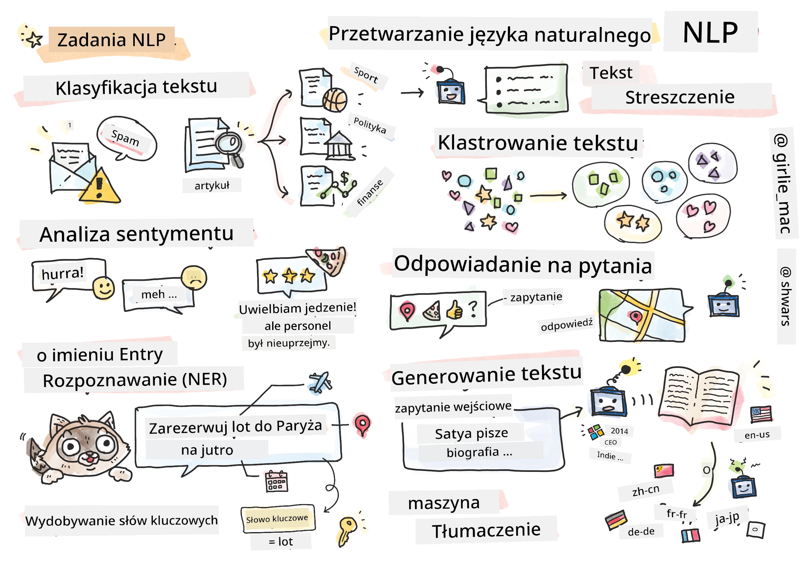

# Przetwarzanie Języka Naturalnego



W tej sekcji skupimy się na wykorzystaniu sieci neuronowych do obsługi zadań związanych z **Przetwarzaniem Języka Naturalnego (NLP)**. Istnieje wiele problemów NLP, które chcemy, aby komputery potrafiły rozwiązywać:

* **Klasyfikacja tekstu** to typowy problem klasyfikacji dotyczący sekwencji tekstowych. Przykłady to klasyfikowanie wiadomości e-mail jako spam vs. nie-spam lub kategoryzowanie artykułów jako sport, biznes, polityka itd. Również podczas tworzenia chatbotów często musimy zrozumieć, co użytkownik chciał powiedzieć – w tym przypadku mamy do czynienia z **klasyfikacją intencji**. Często w klasyfikacji intencji musimy radzić sobie z wieloma kategoriami.
* **Analiza sentymentu** to typowy problem regresji, gdzie musimy przypisać liczbę (sentyment) odpowiadającą temu, jak pozytywne/negatywne jest znaczenie zdania. Bardziej zaawansowaną wersją analizy sentymentu jest **analiza sentymentu oparta na aspektach** (ABSA), gdzie sentyment przypisujemy nie całemu zdaniu, a różnym jego częściom (aspektom), np. *W tej restauracji podobała mi się kuchnia, ale atmosfera była okropna*.
* **Rozpoznawanie nazwanych jednostek** (NER) odnosi się do problemu wydobywania określonych jednostek z tekstu. Na przykład, musimy zrozumieć, że w zdaniu *Muszę jutro lecieć do Paryża* słowo *jutro* odnosi się do DATY, a *Paryż* to LOKALIZACJA.  
* **Ekstrakcja słów kluczowych** jest podobna do NER, ale musimy automatycznie wydobyć słowa ważne dla znaczenia zdania, bez wcześniejszego trenowania dla konkretnych typów jednostek.
* **Grupowanie tekstu** może być użyteczne, gdy chcemy pogrupować podobne zdania, na przykład podobne zapytania w rozmowach wsparcia technicznego.
* **Odpowiadanie na pytania** odnosi się do zdolności modelu do udzielenia odpowiedzi na konkretne pytanie. Model otrzymuje na wejściu fragment tekstu i pytanie, a następnie powinien wskazać miejsce w tekście, gdzie zawarta jest odpowiedź (lub czasem wygenerować tekst odpowiedzi).
* **Generowanie tekstu** to zdolność modelu do generowania nowego tekstu. Można to traktować jako zadanie klasyfikacji, które przewiduje kolejną literę/słowo na podstawie *podpowiedzi tekstowej*. Zaawansowane modele generowania tekstu, takie jak GPT-3, potrafią rozwiązywać inne zadania NLP, takie jak klasyfikacja, wykorzystując technikę zwaną [programowaniem podpowiedzi](https://towardsdatascience.com/software-3-0-how-prompting-will-change-the-rules-of-the-game-a982fbfe1e0) lub [inżynierią podpowiedzi](https://medium.com/swlh/openai-gpt-3-and-prompt-engineering-dcdc2c5fcd29)
* **Streszczanie tekstu** to technika, gdy chcemy, aby komputer "przeczytał" długi tekst i podsumował go w kilku zdaniach.
* **Tłumaczenie maszynowe** można postrzegać jako połączenie rozumienia tekstu w jednym języku i generowania tekstu w innym.

Początkowo większość zadań NLP rozwiązywano za pomocą tradycyjnych metod, takich jak gramatyki. Na przykład w tłumaczeniu maszynowym parsery były używane do przekształcenia zdania początkowego w drzewo składniowe, następnie wydobywane były wyższe poziomy struktur semantycznych reprezentujących znaczenie zdania, a na podstawie tego znaczenia i gramatyki języka docelowego generowano wynik. Obecnie wiele zadań NLP jest skuteczniej rozwiązywanych za pomocą sieci neuronowych.

> Wiele klasycznych metod NLP jest zaimplementowanych w bibliotece Pythona [Natural Language Processing Toolkit (NLTK)](https://www.nltk.org). Dostępna jest świetna [książka NLTK](https://www.nltk.org/book/), która opisuje, jak różne zadania NLP można rozwiązać przy użyciu NLTK.

W naszym kursie skupimy się głównie na wykorzystaniu sieci neuronowych w NLP i będziemy korzystać z NLTK tam, gdzie to będzie potrzebne.

Już nauczyliśmy się wykorzystywać sieci neuronowe do pracy z danymi tabelarycznymi oraz z obrazami. Główna różnica między tymi typami danych a tekstem polega na tym, że tekst jest sekwencją o zmiennej długości, podczas gdy rozmiar wejścia w przypadku obrazów jest znany z góry. Sieci splotowe mogą wydobywać wzorce z danych wejściowych, jednak wzorce w tekście są bardziej złożone. Na przykład negacja może być oddzielona od podmiotu przez dowolną liczbę wyrazów (np. *Nie lubię pomarańczy* vs. *Nie lubię tych dużych, kolorowych, smacznych pomarańczy*), a mimo to powinno to być interpretowane jako jeden wzorzec. Aby poradzić sobie z językiem, musimy wprowadzić nowe typy sieci neuronowych, takie jak *sieci rekurencyjne* i *transformery*.

## Instalacja bibliotek

Jeśli korzystasz z lokalnej instalacji Pythona do realizacji tego kursu, może być konieczne zainstalowanie wszystkich wymaganych bibliotek do NLP za pomocą następujących poleceń:

**Dla PyTorch**
```bash
pip install -r requirements-pytorch.txt
```
**Dla TensorFlow**
```bash
pip install -r requirements-tf.txt
```

> Możesz wypróbować NLP z TensorFlow na [Microsoft Learn](https://docs.microsoft.com/learn/modules/intro-natural-language-processing-tensorflow/?WT.mc_id=academic-77998-cacaste)

## Ostrzeżenie dotyczące GPU

W tej sekcji w niektórych przykładach będziemy trenować całkiem duże modele.
* **Używaj komputera z GPU**: Zaleca się uruchamiać notatniki na komputerach z GPU, aby skrócić czas oczekiwania podczas pracy z dużymi modelami.
* **Ograniczenia pamięci GPU**: Praca na GPU może prowadzić do sytuacji, w których zabraknie pamięci GPU, zwłaszcza podczas trenowania dużych modeli.
* **Zużycie pamięci GPU**: Ilość pamięci GPU zużywanej podczas treningu zależy od różnych czynników, w tym od rozmiaru minibatcha.
* **Minimalizuj rozmiar minibatcha**: Jeśli napotkasz problemy z pamięcią GPU, rozważ zmniejszenie rozmiaru minibatcha w swoim kodzie jako potencjalne rozwiązanie.
* **Zwalnianie pamięci GPU w TensorFlow**: Starsze wersje TensorFlow mogą nie zwalniać poprawnie pamięci GPU podczas trenowania wielu modeli w jednym kernelu Pythona. Aby efektywnie zarządzać użyciem pamięci GPU, możesz skonfigurować TensorFlow tak, aby alokował pamięć GPU tylko wtedy, gdy jest to potrzebne.
* **Włączenie kodu**: Aby ustawić TensorFlow tak, by dynamicznie zwiększał przydział pamięci GPU, dodaj następujący kod do swoich notatników:

```python
physical_devices = tf.config.list_physical_devices('GPU') 
if len(physical_devices)>0:
    tf.config.experimental.set_memory_growth(physical_devices[0], True) 
```

Jeśli chcesz nauczyć się NLP z klasycznej perspektywy ML, odwiedź [tę serię lekcji](https://github.com/microsoft/ML-For-Beginners/tree/main/6-NLP)

## W tej sekcji
W tej sekcji nauczymy się o:

* [Reprezentowaniu tekstu jako tensory](13-TextRep/README.md)
* [Osadzaniu słów (Word Embeddings)](14-Embeddings/README.md)
* [Modelowaniu języka](15-LanguageModeling/README.md)
* [Rekurencyjnych sieciach neuronowych](16-RNN/README.md)
* [Sieciach generatywnych](17-GenerativeNetworks/README.md)
* [Transformerach](18-Transformers/README.md)

---

<!-- CO-OP TRANSLATOR DISCLAIMER START -->
**Zastrzeżenie**:
Niniejszy dokument został przetłumaczony za pomocą usługi tłumaczenia AI [Co-op Translator](https://github.com/Azure/co-op-translator). Choć dążymy do dokładności, prosimy pamiętać, że automatyczne tłumaczenia mogą zawierać błędy lub niedokładności. Oryginalny dokument w jego języku źródłowym należy uznawać za autorytatywne źródło. W przypadku informacji krytycznych zalecane jest skorzystanie z profesjonalnego tłumaczenia wykonanego przez człowieka. Nie ponosimy odpowiedzialności za jakiekolwiek nieporozumienia lub błędne interpretacje wynikające z użycia tego tłumaczenia.
<!-- CO-OP TRANSLATOR DISCLAIMER END -->