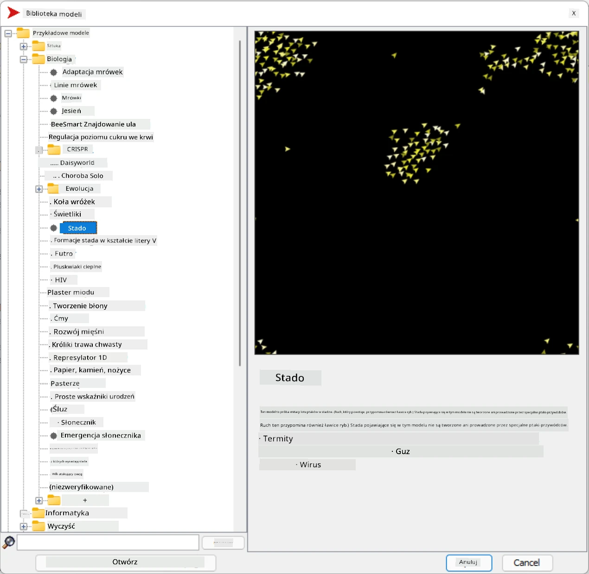
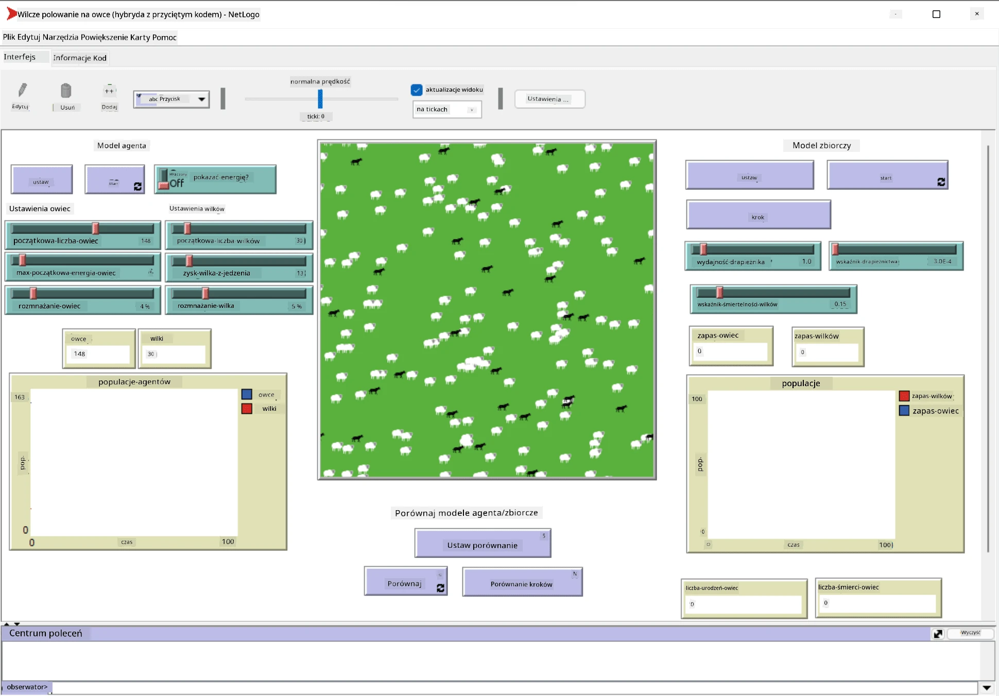

# Systemy Wieloagentowe

Jednym z możliwych sposobów osiągnięcia inteligencji jest tak zwane podejście **emergentne** (lub **synergetyczne**), które opiera się na fakcie, że połączone zachowanie wielu stosunkowo prostych agentów może prowadzić do bardziej złożonego (lub inteligentnego) zachowania całego systemu. Teoretycznie opiera się to na zasadach [Inteligencji Kolektywnej](https://en.wikipedia.org/wiki/Collective_intelligence), [Emergentyzmu](https://en.wikipedia.org/wiki/Global_brain) i [Ewolucyjnej Cybernetyki](https://en.wikipedia.org/wiki/Global_brain), które zakładają, że systemy wyższego poziomu zyskują pewną wartość dodaną, gdy są odpowiednio połączone z systemami niższego poziomu (tak zwana *zasada przejścia metasystemowego*).

## [Quiz przed wykładem](https://ff-quizzes.netlify.app/en/ai/quiz/45)

Kierunek **Systemów Wieloagentowych** pojawił się w AI w latach 90. XX wieku jako odpowiedź na rozwój Internetu i systemów rozproszonych. Jednym z klasycznych podręczników AI, [Artificial Intelligence: A Modern Approach](https://en.wikipedia.org/wiki/Artificial_Intelligence:_A_Modern_Approach), skupia się na klasycznym podejściu AI z perspektywy systemów wieloagentowych.

Centralnym pojęciem w podejściu wieloagentowym jest **Agent** - jednostka, która żyje w pewnym **środowisku**, które może postrzegać i na które może wpływać. Jest to bardzo szeroka definicja, a agenci mogą być klasyfikowani na wiele różnych sposobów:

* Ze względu na zdolność do rozumowania:
   - **Reaktywne** agenty zazwyczaj mają prosty typ zachowania oparty na zasadzie żądanie-odpowiedź
   - **Deliberatywne** agenty wykorzystują pewien rodzaj logicznego rozumowania i/lub zdolności planowania
* Ze względu na miejsce wykonywania kodu agenta:
   - **Statyczne** agenty działają na dedykowanym węźle sieci
   - **Mobilne** agenty mogą przenosić swój kod między węzłami sieci
* Ze względu na zachowanie:
   - **Pasywne agenty** nie mają określonych celów. Mogą reagować na bodźce zewnętrzne, ale nie inicjują działań samodzielnie.
   - **Aktywne agenty** mają cele, które realizują
   - **Kognitywne agenty** angażują się w złożone planowanie i rozumowanie

Systemy wieloagentowe są obecnie wykorzystywane w wielu aplikacjach:

* W grach, wiele postaci niezależnych wykorzystuje pewien rodzaj AI i może być uznawanych za inteligentne agenty
* W produkcji wideo, renderowanie złożonych scen 3D z tłumami jest zazwyczaj realizowane za pomocą symulacji wieloagentowej
* W modelowaniu systemów, podejście wieloagentowe jest używane do symulacji zachowania złożonego modelu. Na przykład podejście wieloagentowe zostało z powodzeniem wykorzystane do przewidywania rozprzestrzeniania się choroby COVID-19 na całym świecie. Podobne podejście można zastosować do modelowania ruchu w mieście i sprawdzenia, jak reaguje na zmiany w zasadach ruchu drogowego.
* W złożonych systemach automatyzacji, każde urządzenie może działać jako niezależny agent, co sprawia, że cały system jest mniej monolityczny i bardziej odporny.

Nie będziemy poświęcać dużo czasu na głębokie zagłębianie się w systemy wieloagentowe, ale rozważymy jeden przykład **Modelowania Wieloagentowego**.

## NetLogo

[NetLogo](https://ccl.northwestern.edu/netlogo/) to środowisko modelowania wieloagentowego oparte na zmodyfikowanej wersji języka programowania [Logo](https://en.wikipedia.org/wiki/Logo_(programming_language)). Ten język został opracowany do nauczania dzieci podstaw programowania i pozwala kontrolować agenta zwanego **żółwiem**, który może się poruszać, pozostawiając za sobą ślad. Dzięki temu można tworzyć złożone figury geometryczne, co jest bardzo wizualnym sposobem na zrozumienie zachowania agenta.

W NetLogo możemy stworzyć wiele żółwi za pomocą polecenia `create-turtles`. Następnie możemy polecić wszystkim żółwiom wykonanie pewnych działań (w poniższym przykładzie - przesunięcie się o 10 punktów do przodu):

```
create-turtles 10
ask turtles [
  forward 10
]
```

Oczywiście, nie jest interesujące, gdy wszystkie żółwie robią to samo, więc możemy `ask` grupy żółwi, np. tych, które znajdują się w pobliżu określonego punktu. Możemy również tworzyć żółwie różnych *ras* za pomocą polecenia `breed [cats cat]`. Tutaj `cat` to nazwa rasy, a musimy określić zarówno formę pojedynczą, jak i mnogą, ponieważ różne polecenia używają różnych form dla przejrzystości.

> ✅ Nie będziemy uczyć się języka NetLogo - jeśli jesteś zainteresowany, możesz odwiedzić świetny zasób [Beginner's Interactive NetLogo Dictionary](https://ccl.northwestern.edu/netlogo/bind/).

Możesz [pobrać](https://ccl.northwestern.edu/netlogo/download.shtml) i zainstalować NetLogo, aby spróbować.

### Biblioteka Modeli

Wspaniałą rzeczą w NetLogo jest to, że zawiera bibliotekę działających modeli, które możesz wypróbować. Przejdź do **File &rightarrow; Models Library**, gdzie znajdziesz wiele kategorii modeli do wyboru.



> Zrzut ekranu biblioteki modeli autorstwa Dmitry Soshnikov

Możesz otworzyć jeden z modeli, na przykład **Biology &rightarrow; Flocking**.

### Główne zasady

Po otwarciu modelu zostaniesz przeniesiony na główny ekran NetLogo. Oto przykładowy model opisujący populację wilków i owiec, biorąc pod uwagę ograniczone zasoby (trawę).



> Zrzut ekranu autorstwa Dmitry Soshnikov

Na tym ekranie możesz zobaczyć:

* Sekcję **Interface**, która zawiera:
  - Główne pole, na którym żyją wszyscy agenci
  - Różne kontrolki: przyciski, suwaki itp.
  - Wykresy, które można wykorzystać do wyświetlania parametrów symulacji
* Zakładkę **Code**, która zawiera edytor, w którym można pisać programy w NetLogo

W większości przypadków interfejs będzie miał przycisk **Setup**, który inicjalizuje stan symulacji, oraz przycisk **Go**, który rozpoczyna wykonanie. Są one obsługiwane przez odpowiednie procedury w kodzie, które wyglądają tak:

```
to go [
...
]
```

Świat NetLogo składa się z następujących obiektów:

* **Agenci** (żółwie), którzy mogą poruszać się po polu i wykonywać różne działania. Możesz wydawać polecenia agentom za pomocą składni `ask turtles [...]`, a kod w nawiasach jest wykonywany przez wszystkich agentów w *trybie żółwia*.
* **Łaty** to kwadratowe obszary pola, na których żyją agenci. Możesz odwoływać się do wszystkich agentów na tej samej łacie lub zmieniać kolory łaty i inne właściwości. Możesz również `ask patches`, aby coś zrobiły.
* **Obserwator** to unikalny agent, który kontroluje świat. Wszystkie procedury obsługiwane przez przyciski są wykonywane w *trybie obserwatora*.

> ✅ Piękno środowiska wieloagentowego polega na tym, że kod uruchamiany w trybie żółwia lub w trybie łaty jest wykonywany jednocześnie przez wszystkich agentów równolegle. Dzięki temu, pisząc niewielką ilość kodu i programując zachowanie pojedynczego agenta, można stworzyć złożone zachowanie całego systemu symulacji.

### Flocking

Jako przykład zachowania wieloagentowego rozważmy **[Flocking](https://en.wikipedia.org/wiki/Flocking_(behavior))**. Flocking to złożony wzorzec bardzo podobny do tego, jak stada ptaków latają. Obserwując ich lot, można pomyśleć, że podążają za jakimś zbiorowym algorytmem lub że posiadają pewną formę *inteligencji kolektywnej*. Jednak to złożone zachowanie pojawia się, gdy każdy indywidualny agent (w tym przypadku *ptak*) obserwuje tylko innych agentów w niewielkiej odległości od siebie i przestrzega trzech prostych zasad:

* **Wyrównanie** - kieruje się w stronę średniego kierunku sąsiednich agentów
* **Spójność** - stara się kierować w stronę średniej pozycji sąsiadów (*przyciąganie na dużą odległość*)
* **Separacja** - gdy zbliża się zbyt blisko do innych ptaków, stara się oddalić (*odpychanie na krótką odległość*)

Możesz uruchomić przykład flockingu i obserwować zachowanie. Możesz również dostosować parametry, takie jak *stopień separacji* czy *zakres widzenia*, który definiuje, jak daleko każdy ptak może widzieć. Zauważ, że jeśli zmniejszysz zakres widzenia do 0, wszystkie ptaki stają się "ślepe" i flocking się zatrzymuje. Jeśli zmniejszysz separację do 0, wszystkie ptaki zbierają się w prostą linię.

> ✅ Przełącz się na zakładkę **Code** i zobacz, gdzie trzy zasady flockingu (wyrównanie, spójność i separacja) są zaimplementowane w kodzie. Zwróć uwagę, jak odwołujemy się tylko do tych agentów, którzy są w zasięgu wzroku.

### Inne modele do zobaczenia

Istnieje kilka innych interesujących modeli, które możesz wypróbować:

* **Art &rightarrow; Fireworks** pokazuje, jak fajerwerki mogą być uznawane za zbiorowe zachowanie indywidualnych strumieni ognia
* **Social Science &rightarrow; Traffic Basic** i **Social Science &rightarrow; Traffic Grid** pokazują model ruchu miejskiego w 1D i 2D z lub bez sygnalizacji świetlnej. Każdy samochód w symulacji przestrzega następujących zasad:
   - Jeśli przestrzeń przed nim jest pusta - przyspiesz (do określonej maksymalnej prędkości)
   - Jeśli widzi przeszkodę przed sobą - hamuj (i możesz dostosować, jak daleko kierowca może widzieć)
* **Social Science &rightarrow; Party** pokazuje, jak ludzie grupują się podczas przyjęcia koktajlowego. Możesz znaleźć kombinację parametrów, które prowadzą do najszybszego wzrostu szczęścia grupy.

Jak widać z tych przykładów, symulacje wieloagentowe mogą być bardzo użytecznym sposobem na zrozumienie zachowania złożonego systemu składającego się z jednostek przestrzegających tych samych lub podobnych zasad. Mogą być również używane do kontrolowania wirtualnych agentów, takich jak [NPC](https://en.wikipedia.org/wiki/NPC) w grach komputerowych lub agentów w animowanych światach 3D.

## Agenci Deliberatywni

Opisani powyżej agenci są bardzo prostymi jednostkami, reagującymi na zmiany w środowisku za pomocą pewnego rodzaju algorytmu. Są to **agenci reaktywni**. Jednak czasami agenci mogą rozumować i planować swoje działania, w takim przypadku nazywani są **deliberatywnymi**.

Typowym przykładem może być osobisty agent, który otrzymuje instrukcję od człowieka, aby zarezerwować wycieczkę wakacyjną. Załóżmy, że istnieje wiele agentów żyjących w Internecie, którzy mogą mu pomóc. Powinien wtedy skontaktować się z innymi agentami, aby sprawdzić, jakie loty są dostępne, jakie są ceny hoteli na różne daty i spróbować wynegocjować najlepszą cenę. Gdy plan wakacji zostanie ukończony i potwierdzony przez właściciela, może przystąpić do rezerwacji.

Aby to zrobić, agenci muszą **komunikować się**. Do skutecznej komunikacji potrzebują:

* Pewnych **standardowych języków do wymiany wiedzy**, takich jak [Knowledge Interchange Format](https://en.wikipedia.org/wiki/Knowledge_Interchange_Format) (KIF) i [Knowledge Query and Manipulation Language](https://en.wikipedia.org/wiki/Knowledge_Query_and_Manipulation_Language) (KQML). Języki te są projektowane na podstawie [Teorii Aktów Mowy](https://en.wikipedia.org/wiki/Speech_act).
* Języki te powinny również zawierać pewne **protokoły negocjacyjne**, oparte na różnych **typach aukcji**.
* **Wspólnej ontologii**, aby odwoływać się do tych samych pojęć, znając ich semantykę
* Sposobu na **odkrycie**, co różni agenci mogą zrobić, również opartego na pewnego rodzaju ontologii

Agenci deliberatywni są znacznie bardziej skomplikowani niż reaktywni, ponieważ nie tylko reagują na zmiany w środowisku, ale także powinni być w stanie *inicjować* działania. Jedną z proponowanych architektur dla agentów deliberatywnych jest tak zwany agent Wiara-Pragnienie-Intencja (BDI):

* **Wiara** tworzy zbiór wiedzy o środowisku agenta. Może być strukturyzowana jako baza wiedzy lub zbiór reguł, które agent może zastosować do konkretnej sytuacji w środowisku.
* **Pragnienia** definiują, co agent chce osiągnąć, czyli jego cele. Na przykład celem osobistego asystenta powyżej jest zarezerwowanie wycieczki, a celem agenta hotelowego jest maksymalizacja zysku.
* **Intencje** to konkretne działania, które agent planuje podjąć, aby osiągnąć swoje cele. Działania zazwyczaj zmieniają środowisko i powodują komunikację z innymi agentami.

Istnieją platformy dostępne do budowy systemów wieloagentowych, takie jak [JADE](https://jade.tilab.com/). [Ten artykuł](https://arxiv.org/ftp/arxiv/papers/2007/2007.08961.pdf) zawiera przegląd platform wieloagentowych, wraz z krótką historią systemów wieloagentowych i ich różnymi scenariuszami użycia.

## Podsumowanie

Systemy wieloagentowe mogą przybierać bardzo różne formy i być wykorzystywane w wielu różnych aplikacjach. 
Wszystkie skupiają się na prostszym zachowaniu pojedynczego agenta, a bardziej złożone zachowanie całego systemu osiągają dzięki **efektowi synergii**.

## 🚀 Wyzwanie

Przenieś tę lekcję do rzeczywistości i spróbuj zaprojektować system wieloagentowy, który może rozwiązać problem. Co na przykład musiałby zrobić system wieloagentowy, aby zoptymalizować trasę szkolnego autobusu? Jak mógłby działać w piekarni?

## [Quiz po wykładzie](https://ff-quizzes.netlify.app/en/ai/quiz/46)

## Przegląd i samodzielna nauka

Przeanalizuj zastosowanie tego typu systemów w przemyśle. Wybierz dziedzinę, taką jak produkcja lub przemysł gier wideo, i odkryj, jak systemy wieloagentowe mogą być wykorzystywane do rozwiązywania unikalnych problemów.

## [Zadanie NetLogo](assignment.md)

---

