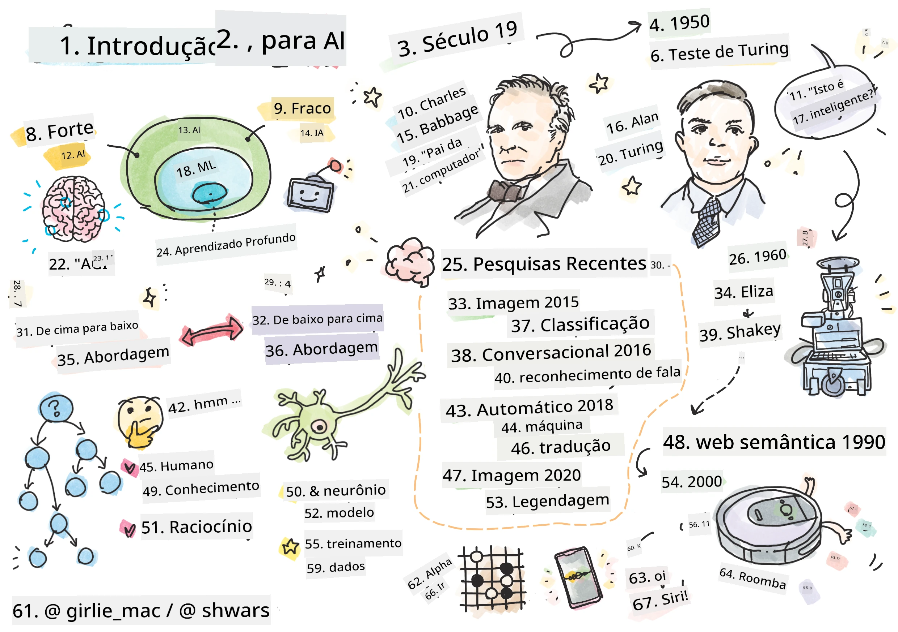

# Introdução à IA

> Sketchnote por [Tomomi Imura](https://twitter.com/girlie_mac)

## [Quiz pré-aula](https://ff-quizzes.netlify.app/en/ai/quiz/1)

**Inteligência Artificial** é uma disciplina científica empolgante que estuda como podemos fazer os computadores exibirem comportamentos inteligentes, ou seja, realizarem coisas que os seres humanos fazem bem.

Originalmente, os computadores foram inventados por [Charles Babbage](https://en.wikipedia.org/wiki/Charles_Babbage) para operar com números seguindo um procedimento bem definido - um algoritmo. Os computadores modernos, embora significativamente mais avançados que o modelo original proposto no século XIX, ainda seguem a mesma ideia de cálculos controlados. Assim, é possível programar um computador para fazer algo se soubermos a sequência exata de passos necessários para alcançar o objetivo.

> Foto por [Vickie Soshnikova](http://twitter.com/vickievalerie)

> ✅ Definir a idade de uma pessoa a partir de sua fotografia é uma tarefa que não pode ser explicitamente programada, porque não sabemos como chegamos a um número em nossa cabeça ao fazer isso.

---

Existem algumas tarefas, no entanto, que não sabemos resolver explicitamente. Considere determinar a idade de uma pessoa a partir de sua fotografia. De alguma forma, aprendemos a fazer isso porque vimos muitos exemplos de pessoas de diferentes idades, mas não conseguimos explicar explicitamente como fazemos isso, nem podemos programar o computador para fazê-lo. Este é exatamente o tipo de tarefa que interessa à **Inteligência Artificial** (IA).

✅ Pense em algumas tarefas que você poderia delegar a um computador e que se beneficiariam da IA. Considere os campos de finanças, medicina e artes - como esses campos estão se beneficiando hoje da IA?

## IA Fraca vs. IA Forte

IA Fraca | IA Forte
---------------------------------------|-------------------------------------
IA Fraca refere-se a sistemas de IA projetados e treinados para uma tarefa específica ou um conjunto restrito de tarefas.|IA Forte, ou Inteligência Artificial Geral (AGI), refere-se a sistemas de IA com inteligência e compreensão em nível humano.
Esses sistemas de IA não são geralmente inteligentes; eles se destacam em realizar uma tarefa predefinida, mas carecem de verdadeira compreensão ou consciência.|Esses sistemas de IA têm a capacidade de realizar qualquer tarefa intelectual que um ser humano pode fazer, adaptar-se a diferentes domínios e possuir uma forma de consciência ou autoconsciência.
Exemplos de IA fraca incluem assistentes virtuais como Siri ou Alexa, algoritmos de recomendação usados por serviços de streaming e chatbots projetados para tarefas específicas de atendimento ao cliente.|Alcançar a IA Forte é um objetivo de longo prazo da pesquisa em IA e exigiria o desenvolvimento de sistemas de IA que possam raciocinar, aprender, compreender e se adaptar a uma ampla gama de tarefas e contextos.
IA Fraca é altamente especializada e não possui habilidades cognitivas semelhantes às humanas ou capacidades gerais de resolução de problemas além de seu domínio restrito.|IA Forte é atualmente um conceito teórico, e nenhum sistema de IA atingiu esse nível de inteligência geral.

Para mais informações, consulte **[Inteligência Artificial Geral](https://en.wikipedia.org/wiki/Artificial_general_intelligence)** (AGI).

## A Definição de Inteligência e o Teste de Turing

Um dos problemas ao lidar com o termo **[Inteligência](https://en.wikipedia.org/wiki/Intelligence)** é que não há uma definição clara para esse termo. Pode-se argumentar que inteligência está conectada ao **pensamento abstrato** ou à **autoconsciência**, mas não conseguimos defini-la adequadamente.

> [Foto](https://unsplash.com/photos/75715CVEJhI) por [Amber Kipp](https://unsplash.com/@sadmax) do Unsplash

Para ver a ambiguidade do termo *inteligência*, tente responder à pergunta: "Um gato é inteligente?". Diferentes pessoas tendem a dar respostas diferentes a essa pergunta, já que não há um teste universalmente aceito para provar se a afirmação é verdadeira ou não. E se você acha que há - tente aplicar um teste de QI ao seu gato...

✅ Pense por um minuto sobre como você define inteligência. Um corvo que consegue resolver um labirinto para alcançar comida é inteligente? Uma criança é inteligente?

---

Ao falar sobre AGI, precisamos ter alguma forma de dizer se criamos um sistema verdadeiramente inteligente. [Alan Turing](https://en.wikipedia.org/wiki/Alan_Turing) propôs uma maneira chamada **[Teste de Turing](https://en.wikipedia.org/wiki/Turing_test)**, que também funciona como uma definição de inteligência. O teste compara um sistema a algo inerentemente inteligente - um ser humano real, e como qualquer comparação automática pode ser burlada por um programa de computador, usamos um interrogador humano. Assim, se um ser humano não conseguir distinguir entre uma pessoa real e um sistema de computador em um diálogo baseado em texto - o sistema é considerado inteligente.

> Um chatbot chamado [Eugene Goostman](https://en.wikipedia.org/wiki/Eugene_Goostman), desenvolvido em São Petersburgo, chegou perto de passar no Teste de Turing em 2014 usando um truque de personalidade inteligente. Ele anunciou desde o início que era um garoto ucraniano de 13 anos, o que explicaria a falta de conhecimento e algumas discrepâncias no texto. O bot convenceu 30% dos juízes de que era humano após um diálogo de 5 minutos, uma métrica que Turing acreditava que uma máquina seria capaz de alcançar até 2000. No entanto, deve-se entender que isso não indica que criamos um sistema inteligente ou que um sistema de computador enganou o interrogador humano - o sistema não enganou os humanos, mas sim os criadores do bot!

✅ Você já foi enganado por um chatbot pensando que estava conversando com um humano? Como ele te convenceu?

## Diferentes Abordagens para IA

Se quisermos que um computador se comporte como um humano, precisamos de alguma forma modelar dentro do computador nossa maneira de pensar. Consequentemente, precisamos tentar entender o que torna um ser humano inteligente.

> Para ser capaz de programar inteligência em uma máquina, precisamos entender como nossos próprios processos de tomada de decisão funcionam. Se você fizer um pouco de autoanálise, perceberá que há alguns processos que acontecem subconscientemente – por exemplo, conseguimos distinguir um gato de um cachorro sem pensar sobre isso - enquanto outros envolvem raciocínio.

Existem duas abordagens possíveis para esse problema:

Abordagem de Cima para Baixo (Raciocínio Simbólico) | Abordagem de Baixo para Cima (Redes Neurais)
---------------------------------------|-------------------------------------
Uma abordagem de cima para baixo modela a maneira como uma pessoa raciocina para resolver um problema. Envolve extrair **conhecimento** de um ser humano e representá-lo em uma forma legível por computador. Também precisamos desenvolver uma maneira de modelar o **raciocínio** dentro de um computador. | Uma abordagem de baixo para cima modela a estrutura do cérebro humano, consistindo em um grande número de unidades simples chamadas **neurônios**. Cada neurônio age como uma média ponderada de suas entradas, e podemos treinar uma rede de neurônios para resolver problemas úteis fornecendo **dados de treinamento**.

Existem também outras abordagens possíveis para inteligência:

* Uma abordagem **Emergente**, **Sinergética** ou **multiagente** baseia-se no fato de que comportamentos inteligentes complexos podem ser obtidos pela interação de um grande número de agentes simples. De acordo com a [cibernética evolutiva](https://en.wikipedia.org/wiki/Global_brain#Evolutionary_cybernetics), a inteligência pode *emergir* de comportamentos mais simples e reativos no processo de *transição de metasistema*.

* Uma abordagem **Evolutiva**, ou **algoritmo genético**, é um processo de otimização baseado nos princípios da evolução.

Consideraremos essas abordagens mais tarde no curso, mas agora focaremos em duas direções principais: de cima para baixo e de baixo para cima.

### A Abordagem de Cima para Baixo

Na abordagem **de cima para baixo**, tentamos modelar nosso raciocínio. Como podemos acompanhar nossos pensamentos ao raciocinar, podemos tentar formalizar esse processo e programá-lo dentro do computador. Isso é chamado de **raciocínio simbólico**.

As pessoas tendem a ter algumas regras em sua mente que orientam seus processos de tomada de decisão. Por exemplo, quando um médico está diagnosticando um paciente, ele ou ela pode perceber que a pessoa tem febre e, portanto, pode haver alguma inflamação ocorrendo no corpo. Aplicando um grande conjunto de regras a um problema específico, o médico pode ser capaz de chegar ao diagnóstico final.

Essa abordagem depende muito da **representação de conhecimento** e do **raciocínio**. Extrair conhecimento de um especialista humano pode ser a parte mais difícil, porque um médico, em muitos casos, não saberia exatamente por que está chegando a um diagnóstico específico. Às vezes, a solução simplesmente surge em sua mente sem pensar explicitamente. Algumas tarefas, como determinar a idade de uma pessoa a partir de uma fotografia, não podem ser reduzidas à manipulação de conhecimento.

### Abordagem de Baixo para Cima

Alternativamente, podemos tentar modelar os elementos mais simples dentro de nosso cérebro – um neurônio. Podemos construir uma **rede neural artificial** dentro de um computador e, em seguida, tentar ensiná-la a resolver problemas fornecendo exemplos. Esse processo é semelhante ao modo como um recém-nascido aprende sobre seu ambiente ao fazer observações.

✅ Pesquise um pouco sobre como os bebês aprendem. Quais são os elementos básicos do cérebro de um bebê?

> | E o ML?         |      |
> |--------------|-----------|
> | Parte da Inteligência Artificial que se baseia no aprendizado do computador para resolver um problema com base em alguns dados é chamada de **Machine Learning**. Não consideraremos o aprendizado de máquina clássico neste curso - recomendamos o currículo separado [Machine Learning para Iniciantes](http://aka.ms/ml-beginners). |       |

## Um Breve Histórico da IA

A Inteligência Artificial começou como um campo no meio do século XX. Inicialmente, o raciocínio simbólico era a abordagem predominante, e isso levou a uma série de sucessos importantes, como sistemas especialistas – programas de computador capazes de atuar como especialistas em alguns domínios de problemas limitados. No entanto, logo ficou claro que essa abordagem não escala bem. Extrair o conhecimento de um especialista, representá-lo em um computador e manter essa base de conhecimento precisa acaba sendo uma tarefa muito complexa e cara demais para ser prática em muitos casos. Isso levou ao chamado [Inverno da IA](https://en.wikipedia.org/wiki/AI_winter) na década de 1970.

> Imagem por [Dmitry Soshnikov](http://soshnikov.com)

Com o passar do tempo, os recursos computacionais se tornaram mais baratos e mais dados ficaram disponíveis, então as abordagens de redes neurais começaram a demonstrar grande desempenho ao competir com seres humanos em muitas áreas, como visão computacional ou compreensão de fala. Na última década, o termo Inteligência Artificial tem sido usado principalmente como sinônimo de Redes Neurais, porque a maioria dos sucessos da IA que ouvimos falar são baseados nelas.

Podemos observar como as abordagens mudaram, por exemplo, na criação de um programa de computador para jogar xadrez:

* Os primeiros programas de xadrez eram baseados em busca – um programa tentava explicitamente estimar os possíveis movimentos de um oponente para um determinado número de próximos movimentos e selecionava um movimento ideal com base na posição ideal que poderia ser alcançada em alguns movimentos. Isso levou ao desenvolvimento do chamado algoritmo de busca [alpha-beta pruning](https://en.wikipedia.org/wiki/Alpha%E2%80%93beta_pruning).
* Estratégias de busca funcionam bem no final do jogo, onde o espaço de busca é limitado por um pequeno número de movimentos possíveis. No entanto, no início do jogo, o espaço de busca é enorme, e o algoritmo pode ser melhorado aprendendo com partidas existentes entre jogadores humanos. Experimentos subsequentes empregaram o chamado [raciocínio baseado em casos](https://en.wikipedia.org/wiki/Case-based_reasoning), onde o programa procurava casos na base de conhecimento muito semelhantes à posição atual no jogo.
* Programas modernos que vencem jogadores humanos são baseados em redes neurais e [aprendizado por reforço](https://en.wikipedia.org/wiki/Reinforcement_learning), onde os programas aprendem a jogar apenas jogando por muito tempo contra si mesmos e aprendendo com seus próprios erros – muito parecido com o que os seres humanos fazem ao aprender a jogar xadrez. No entanto, um programa de computador pode jogar muito mais partidas em muito menos tempo e, assim, aprender muito mais rápido.

✅ Pesquise um pouco sobre outros jogos que foram jogados por IA.

Da mesma forma, podemos ver como a abordagem para criar “programas que falam” (que podem passar no Teste de Turing) mudou:

* Programas iniciais desse tipo, como [Eliza](https://en.wikipedia.org/wiki/ELIZA), eram baseados em regras gramaticais muito simples e na reformulação da frase de entrada em uma pergunta.
* Assistentes modernos, como Cortana, Siri ou Google Assistant, são todos sistemas híbridos que usam redes neurais para converter fala em texto e reconhecer nossa intenção, e então empregam algum raciocínio ou algoritmos explícitos para realizar as ações necessárias.
* No futuro, podemos esperar um modelo completamente baseado em redes neurais para lidar com diálogos por conta própria. As recentes redes neurais da família GPT e [Turing-NLG](https://www.microsoft.com/research/blog/turing-nlg-a-17-billion-parameter-language-model-by-microsoft) mostram grande sucesso nisso.

> Imagem de Dmitry Soshnikov, [foto](https://unsplash.com/photos/r8LmVbUKgns) por [Marina Abrosimova](https://unsplash.com/@abrosimova_marina_foto), Unsplash

## Pesquisas Recentes em IA

O grande crescimento recente na pesquisa de redes neurais começou por volta de 2010, quando grandes conjuntos de dados públicos começaram a se tornar disponíveis. Uma enorme coleção de imagens chamada [ImageNet](https://en.wikipedia.org/wiki/ImageNet), que contém cerca de 14 milhões de imagens anotadas, deu origem ao [Desafio de Reconhecimento Visual em Grande Escala do ImageNet](https://image-net.org/challenges/LSVRC/).

> Imagem de [Dmitry Soshnikov](http://soshnikov.com)

Em 2012, [Redes Neurais Convolucionais](../4-ComputerVision/07-ConvNets/README.md) foram usadas pela primeira vez na classificação de imagens, o que levou a uma queda significativa nos erros de classificação (de quase 30% para 16,4%). Em 2015, a arquitetura ResNet da Microsoft Research [alcançou precisão em nível humano](https://doi.org/10.1109/ICCV.2015.123).

Desde então, as Redes Neurais demonstraram um comportamento muito bem-sucedido em muitas tarefas:

---

Ano | Paridade Humana alcançada
-----|--------
2015 | [Classificação de Imagens](https://doi.org/10.1109/ICCV.2015.123)
2016 | [Reconhecimento de Fala Conversacional](https://arxiv.org/abs/1610.05256)
2018 | [Tradução Automática de Máquinas](https://arxiv.org/abs/1803.05567) (Chinês para Inglês)
2020 | [Legenda de Imagens](https://arxiv.org/abs/2009.13682)

Nos últimos anos, testemunhamos grandes sucessos com modelos de linguagem de grande escala, como BERT e GPT-3. Isso aconteceu principalmente devido ao fato de haver uma grande quantidade de dados textuais gerais disponíveis, permitindo treinar modelos para capturar a estrutura e o significado dos textos, pré-treiná-los em coleções de textos gerais e, em seguida, especializar esses modelos para tarefas mais específicas. Vamos aprender mais sobre [Processamento de Linguagem Natural](../5-NLP/README.md) mais adiante neste curso.

## 🚀 Desafio

Faça uma pesquisa na internet para determinar onde, na sua opinião, a IA é mais eficazmente utilizada. É em um aplicativo de mapeamento, algum serviço de conversão de fala para texto ou em um videogame? Pesquise como o sistema foi construído.

## [Quiz pós-aula](https://ff-quizzes.netlify.app/en/ai/quiz/2)

## Revisão e Autoestudo

Revise a história da IA e do ML lendo [esta lição](https://github.com/microsoft/ML-For-Beginners/tree/main/1-Introduction/2-history-of-ML). Escolha um elemento do sketchnote no início dessa lição ou desta e pesquise mais a fundo para entender o contexto cultural que informa sua evolução.

**Tarefa**: [Game Jam](assignment.md)

---

<!-- CO-OP TRANSLATOR DISCLAIMER START -->
**Aviso Legal**:  
Este documento foi traduzido usando o serviço de tradução por IA [Co-op Translator](https://github.com/Azure/co-op-translator). Embora nos esforcemos para garantir a precisão, esteja ciente de que traduções automatizadas podem conter erros ou imprecisões. O documento original em seu idioma nativo deve ser considerado a fonte autoritativa. Para informações críticas, recomenda-se a tradução profissional humana. Não nos responsabilizamos por quaisquer mal-entendidos ou interpretações incorretas decorrentes do uso desta tradução.
<!-- CO-OP TRANSLATOR DISCLAIMER END -->