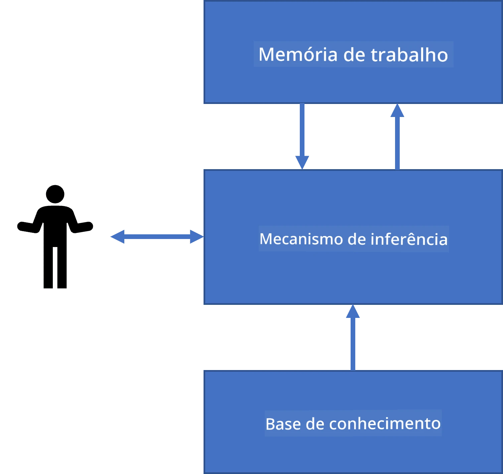
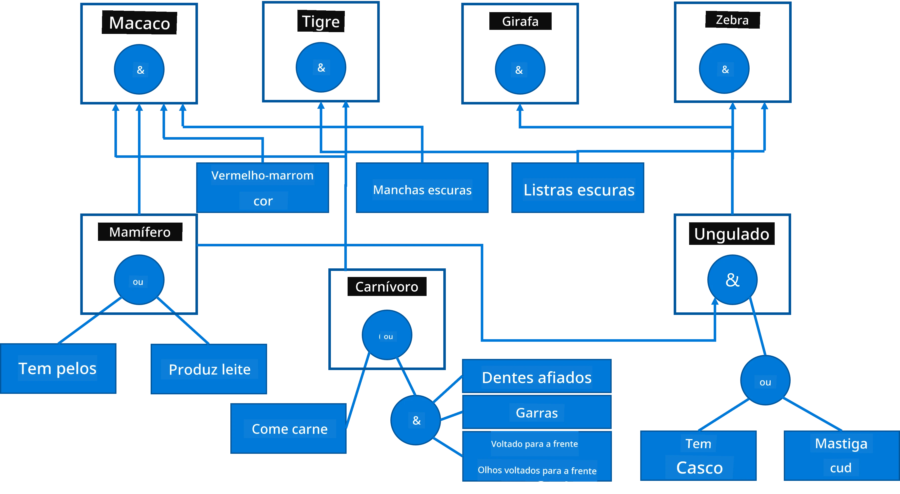
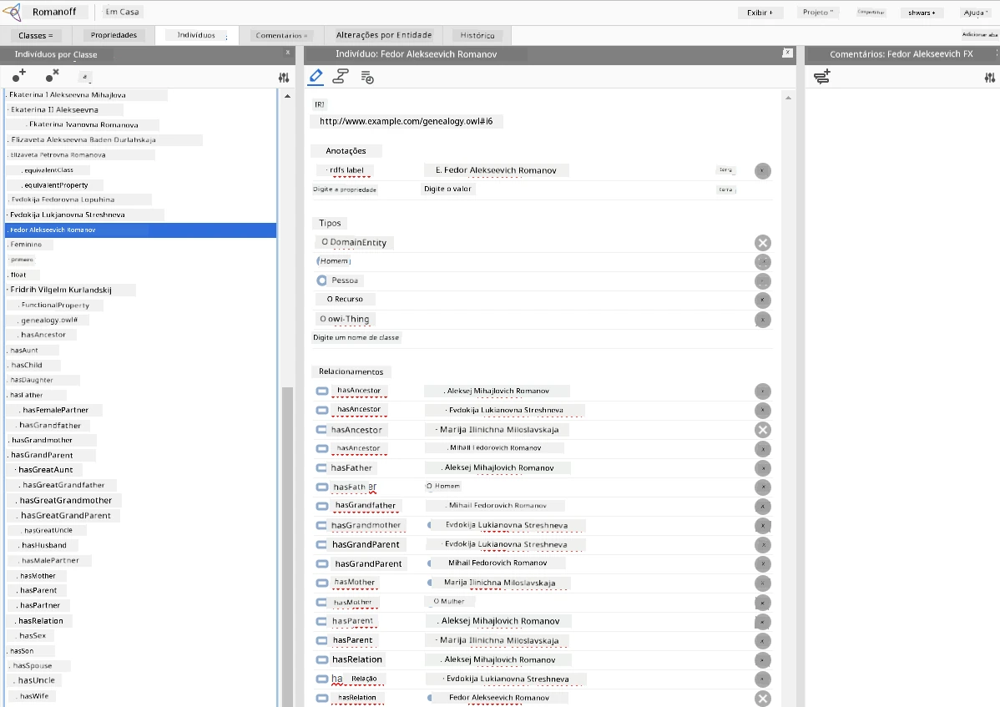

# Representação do Conhecimento e Sistemas Especialistas


> Sketchnote por [Tomomi Imura](https://twitter.com/girlie_mac)

A busca pela inteligência artificial é baseada na busca pelo conhecimento, para compreender o mundo de forma semelhante aos humanos. Mas como você pode fazer isso?

## [Quiz pré-aula](https://ff-quizzes.netlify.app/en/ai/quiz/3)

Nos primeiros dias da IA, a abordagem top-down para criar sistemas inteligentes (discutida na lição anterior) era popular. A ideia era extrair o conhecimento das pessoas para alguma forma legível por máquina e então usá-lo para resolver problemas automaticamente. Essa abordagem foi baseada em duas grandes ideias:

* Representação do Conhecimento
* Raciocínio

## Representação do Conhecimento

Um dos conceitos importantes na IA Simbólica é o **conhecimento**. É importante diferenciar conhecimento de *informação* ou *dados*. Por exemplo, pode-se dizer que livros contêm conhecimento, porque é possível estudar os livros e tornar-se um especialista. No entanto, o que os livros contêm é na verdade chamado de *dados*, e ao ler livros e integrar esses dados em nosso modelo do mundo, nós convertemos esses dados em conhecimento.

> ✅ **Conhecimento** é algo que está contido em nossa cabeça e representa nossa compreensão do mundo. É obtido por um processo ativo de **aprendizagem**, que integra pedaços de informação que recebemos em nosso modelo ativo do mundo.

Na maioria das vezes, não definimos conhecimento de forma estrita, mas o alinhamos com outros conceitos relacionados usando a [Pirâmide DIKW](https://en.wikipedia.org/wiki/DIKW_pyramid). Ela contém os seguintes conceitos:

* **Dados** são algo representado em mídia física, como texto escrito ou palavras faladas. Dados existem independentemente dos seres humanos e podem ser passados entre as pessoas.
* **Informação** é como interpretamos dados em nossa mente. Por exemplo, quando ouvimos a palavra *computador*, temos alguma compreensão do que é.
* **Conhecimento** é a informação integrada em nosso modelo do mundo. Por exemplo, uma vez que aprendemos o que é um computador, começamos a ter algumas ideias sobre como ele funciona, quanto custa e para que pode ser usado. Essa rede de conceitos inter-relacionados forma nosso conhecimento.
* **Sabedoria** é ainda um nível a mais da nossa compreensão do mundo, e representa *meta-conhecimento*, por exemplo, alguma noção sobre como e quando o conhecimento deve ser usado.


*Imagem [da Wikipedia](https://commons.wikimedia.org/w/index.php?curid=37705247), Por Longlivetheux - Trabalho próprio, CC BY-SA 4.0*

Assim, o problema da **representação do conhecimento** é encontrar algum meio eficaz para representar conhecimento dentro de um computador na forma de dados, para torná-lo automaticamente utilizável. Isso pode ser visto como um espectro:


> Imagem por [Dmitry Soshnikov](http://soshnikov.com)

* À esquerda, há tipos muito simples de representação do conhecimento que podem ser efetivamente usados por computadores. O mais simples é o algorítmico, quando o conhecimento é representado por um programa de computador. Isso, no entanto, não é a melhor forma de representar o conhecimento, porque não é flexível. O conhecimento dentro da nossa cabeça muitas vezes não é algorítmico.
* À direita, há representações como o texto natural. É a mais poderosa, mas não pode ser usada para raciocínio automático.

> ✅ Pense por um minuto sobre como você representa conhecimento em sua cabeça e o converte em anotações. Existe algum formato particular que funcione bem para você ajudar na retenção?

## Classificando Representações de Conhecimento de Computadores

Podemos classificar diferentes métodos de representação do conhecimento em computadores nas seguintes categorias:

* **Representações em rede** baseiam-se no fato de que temos uma rede de conceitos inter-relacionados dentro da nossa cabeça. Podemos tentar reproduzir as mesmas redes como um grafo dentro do computador - uma chamada **rede semântica**.

1. **Triplas Objeto-Atributo-Valor** ou **pares atributo-valor**. Como um grafo pode ser representado em computador como uma lista de nós e arestas, podemos representar uma rede semântica por uma lista de triplas, contendo objetos, atributos e valores. Por exemplo, construímos as seguintes triplas sobre linguagens de programação:

Objeto | Atributo | Valor
-------|-----------|------
Python | é | Linguagem Não Tipada
Python | inventada-por | Guido van Rossum
Python | sintaxe-de-bloco | indentação
Linguagem Não Tipada | não tem | definições de tipos

> ✅ Pense como triplas podem ser usadas para representar outros tipos de conhecimento.

2. **Representações hierárquicas** enfatizam o fato de que muitas vezes criamos uma hierarquia de objetos em nossa mente. Por exemplo, sabemos que o canário é um pássaro, e todos os pássaros têm asas. Também temos alguma noção de qual é a cor usual de um canário, e qual é sua velocidade de voo.

   - **Representação em frames** baseia-se em representar cada objeto ou classe de objetos como um **frame** que contém **slots**. Slots têm valores padrão possíveis, restrições de valor ou procedimentos armazenados que podem ser chamados para obter o valor de um slot. Todos os frames formam uma hierarquia semelhante a uma hierarquia de objetos em linguagens de programação orientadas a objetos.
   - **Cenários** são um tipo especial de frame que representam situações complexas que podem se desenrolar no tempo.

**Python**

Slot | Valor | Valor padrão | Intervalo |
-----|-------|---------------|----------|
Nome | Python | | |
É-Um | Linguagem Não Tipada | | |
Caso de Variável | | CamelCase | |
Comprimento do Programa | | | 5-5000 linhas |
Sintaxe de Bloco | Indentação | | |

3. **Representações procedurais** baseiam-se em representar o conhecimento por uma lista de ações que podem ser executadas quando uma certa condição ocorre.
   - Regras de produção são declarações do tipo se-então que nos permitem tirar conclusões. Por exemplo, um médico pode ter uma regra dizendo que **SE** um paciente tem febre alta **OU** nível alto de proteína C-reativa no exame de sangue **ENTÃO** ele tem uma inflamação. Uma vez que encontramos uma das condições, podemos concluir que há inflamação e usar isso em raciocínios posteriores.
   - Algoritmos podem ser considerados outra forma de representação procedural, embora quase nunca sejam usados diretamente em sistemas baseados em conhecimento.

4. **Lógica** foi originalmente proposta por Aristóteles como uma forma de representar conhecimento universal humano.
   - A Lógica de Predicados, como teoria matemática, é rica demais para ser computável, portanto algum subconjunto dela é normalmente usado, como cláusulas de Horn usadas em Prolog.
   - Lógica Descritiva é uma família de sistemas lógicos usados para representar e raciocinar sobre hierarquias de objetos e representações distribuídas de conhecimento, como a *web semântica*.

## Sistemas Especialistas

Um dos primeiros sucessos da IA simbólica foram os chamados **sistemas especialistas** - sistemas computacionais desenhados para atuar como um especialista em algum domínio de problema limitado. Eles foram baseados em uma **base de conhecimento** extraída de um ou mais especialistas humanos, e continham um **motor de inferência** que realizava algum raciocínio sobre ela.

 | 
---------------------------------------------|------------------------------------------------
Estrutura simplificada do sistema neural humano | Arquitetura de um sistema baseado em conhecimento

Sistemas especialistas são construídos como o sistema de raciocínio humano, que contém **memória de curto prazo** e **memória de longo prazo**. De maneira semelhante, em sistemas baseados em conhecimento distinguimos os seguintes componentes:

* **Memória do problema**: contém o conhecimento sobre o problema que está sendo atualmente resolvido, ou seja, a temperatura ou pressão arterial de um paciente, se ele tem inflamação ou não, etc. Esse conhecimento também é chamado de **conhecimento estático**, porque contém um instantâneo do que sabemos atualmente sobre o problema - o chamado *estado do problema*.
* **Base de conhecimento**: representa o conhecimento de longo prazo sobre um domínio de problema. É extraída manualmente de especialistas humanos, e não muda de consulta para consulta. Como permite navegar de um estado do problema para outro, também é chamada de **conhecimento dinâmico**.
* **Motor de inferência**: orquestra o processo todo de busca no espaço de estados do problema, fazendo perguntas ao usuário quando necessário. Também é responsável por encontrar as regras certas a serem aplicadas para cada estado.

Como exemplo, vamos considerar o seguinte sistema especialista para determinar um animal com base em suas características físicas:



> Imagem por [Dmitry Soshnikov](http://soshnikov.com)

Esse diagrama é chamado de **árvore AND-OR**, e é uma representação gráfica de um conjunto de regras de produção. Desenhar uma árvore é útil no início da extração de conhecimento do especialista. Para representar o conhecimento dentro do computador, é mais conveniente usar regras:

```
IF the animal eats meat
OR (animal has sharp teeth
    AND animal has claws
    AND animal has forward-looking eyes
) 
THEN the animal is a carnivore
```

Você pode notar que cada condição no lado esquerdo da regra e a ação são essencialmente triplas objeto-atributo-valor (OAV). A **memória de trabalho** contém o conjunto de triplas OAV que correspondem ao problema atualmente sendo resolvido. Um **motor de regras** procura as regras cujas condições são satisfeitas e as aplica, adicionando outra tripla à memória de trabalho.

> ✅ Escreva sua própria árvore AND-OR sobre um tema que você goste!

### Inferência Direta vs. Inferência Reversa

O processo descrito acima é chamado de **inferência direta**. Ele começa com alguns dados iniciais sobre o problema disponíveis na memória de trabalho, e então executa o seguinte ciclo de raciocínio:

1. Se o atributo alvo está presente na memória de trabalho - pare e dê o resultado
2. Procure todas as regras cuja condição está atualmente satisfeita - obtenha o **conjunto de conflito** de regras
3. Realize a **resolução de conflitos** - selecione uma regra que será executada nesta etapa. Podem existir diferentes estratégias de resolução de conflito:
   - Selecionar a primeira regra aplicável na base de conhecimento
   - Selecionar uma regra aleatória
   - Selecionar uma regra *mais específica*, ou seja, aquela que satisfaz o maior número de condições no "lado esquerdo" (LHS)
4. Aplique a regra selecionada e insira novo conhecimento no estado do problema
5. Repita a partir do passo 1.

Contudo, em alguns casos podemos querer começar com nenhum conhecimento sobre o problema, e fazer perguntas que nos ajudarão a chegar à conclusão. Por exemplo, quando fazemos diagnóstico médico, geralmente não realizamos todos os exames médicos antecipadamente antes de começar a diagnosticar o paciente. Preferimos realizar exames quando uma decisão precisa ser tomada.

Esse processo pode ser modelado usando **inferência reversa**. Ela é guiada pelo **objetivo** - o valor do atributo que estamos buscando:

1. Selecione todas as regras que podem nos dar o valor de um objetivo (ou seja, com o objetivo no Lado Direito ("right-hand-side")) - um conjunto de conflito
1. Se não houver regras para esse atributo, ou houver uma regra dizendo que devemos perguntar o valor ao usuário - pergunte, caso contrário:
1. Use a estratégia de resolução de conflitos para selecionar uma regra que usaremos como *hipótese* - tentaremos prová-la
1. Repita recorrentemente o processo para todos os atributos no LHS da regra, tentando prová-los como objetivos
1. Se em algum ponto o processo falhar - use outra regra no passo 3.

> ✅ Em quais situações a inferência direta é mais apropriada? E a inferência reversa?

### Implementando Sistemas Especialistas

Sistemas especialistas podem ser implementados usando diferentes ferramentas:

* Programando-os diretamente em alguma linguagem de programação de alto nível. Isso não é a melhor ideia, porque a principal vantagem de um sistema baseado em conhecimento é que o conhecimento está separado da inferência, e potencialmente um especialista no domínio do problema deve ser capaz de escrever regras sem entender os detalhes do processo de inferência
* Usando **shell para sistemas especialistas**, ou seja, um sistema especificamente desenhado para ser povoado com conhecimento usando alguma linguagem de representação de conhecimento.

## ✍️ Exercício: Inferência de Animais

Veja [Animals.ipynb](https://github.com/microsoft/AI-For-Beginners/blob/main/lessons/2-Symbolic/Animals.ipynb) para um exemplo de implementação de sistema especialista com inferência direta e reversa.

> **Nota**: Este exemplo é relativamente simples, e apenas dá a ideia de como um sistema especialista se parece. Quando você começar a criar tal sistema, só notará algum comportamento *inteligente* nele quando alcançar certo número de regras, em torno de 200+. Em algum ponto, as regras se tornam complexas demais para manter todas na mente, e neste ponto você pode começar a se perguntar porque um sistema toma determinadas decisões. No entanto, a característica importante dos sistemas baseados em conhecimento é que você sempre pode *explicar* exatamente como qualquer decisão foi tomada.

## Ontologias e a Web Semântica

No final do século 20 houve uma iniciativa para usar representação do conhecimento para anotar recursos da Internet, para que fosse possível encontrar recursos que corresponderiam a consultas muito específicas. Esse movimento foi chamado de **Web Semântica**, e se apoiou em vários conceitos:

- Uma representação especial do conhecimento baseada em **[lógicas descritivas](https://en.wikipedia.org/wiki/Description_logic)** (DL). É similar à representação em frames, porque constrói uma hierarquia de objetos com propriedades, mas tem semântica lógica formal e inferência. Existe uma família inteira de DLs que equilibram entre expressividade e complexidade algorítmica da inferência.
- Representação distribuída do conhecimento, onde todos os conceitos são representados por um identificador global URI, tornando possível criar hierarquias de conhecimento que abrangem a internet.
- Uma família de linguagens baseadas em XML para descrição de conhecimento: RDF (Resource Description Framework), RDFS (RDF Schema), OWL (Ontology Web Language).

Um conceito central na Web Semântica é o conceito de **Ontologia**. Refere-se a uma especificação explícita de um domínio do problema usando alguma representação formal de conhecimento. A ontologia mais simples pode ser apenas uma hierarquia de objetos em um domínio do problema, mas ontologias mais complexas incluirão regras que podem ser usadas para inferência.

Na web semântica, todas as representações são baseadas em tripletas. Cada objeto e cada relação são identificados unicamente pela URI. Por exemplo, se quisermos afirmar o fato de que este Currículo de IA foi desenvolvido por Dmitry Soshnikov em 1º de janeiro de 2022 - aqui estão as tripletas que podemos usar:


```
http://github.com/microsoft/ai-for-beginners http://www.example.com/terms/creation-date “Jan 1, 2022”
http://github.com/microsoft/ai-for-beginners http://purl.org/dc/elements/1.1/creator http://soshnikov.com
```

> ✅ Aqui `http://www.example.com/terms/creation-date` e `http://purl.org/dc/elements/1.1/creator` são algumas URIs bem conhecidas e universalmente aceitas para expressar os conceitos de *criador* e *data de criação*.

Em um caso mais complexo, se quisermos definir uma lista de criadores, podemos usar algumas estruturas de dados definidas em RDF.


> Diagramas acima por [Dmitry Soshnikov](http://soshnikov.com)

O progresso na construção da Web Semântica foi de certa forma desacelerado pelo sucesso dos motores de busca e técnicas de processamento de linguagem natural, que permitem extrair dados estruturados do texto. Contudo, em algumas áreas ainda há esforços significativos para manter ontologias e bases de conhecimento. Alguns projetos que merecem destaque:

* [WikiData](https://wikidata.org/) é uma coleção de bases de conhecimento legíveis por máquina associadas à Wikipedia. A maior parte dos dados é extraída dos *InfoBoxes* da Wikipedia, pedaços de conteúdo estruturado dentro das páginas da Wikipedia. Você pode [consultar](https://query.wikidata.org/) o wikidata em SPARQL, uma linguagem especial de consulta para a Web Semântica. Aqui está uma consulta de exemplo que mostra as cores de olhos mais populares entre humanos:

```sparql
#defaultView:BubbleChart
SELECT ?eyeColorLabel (COUNT(?human) AS ?count)
WHERE
{
  ?human wdt:P31 wd:Q5.       # human instance-of homo sapiens
  ?human wdt:P1340 ?eyeColor. # human eye-color ?eyeColor
  SERVICE wikibase:label { bd:serviceParam wikibase:language "en". }
}
GROUP BY ?eyeColorLabel
```

* [DBpedia](https://www.dbpedia.org/) é outro esforço similar ao WikiData.

> ✅ Se você quiser experimentar criar suas próprias ontologias, ou abrir as existentes, existe um ótimo editor visual de ontologias chamado [Protégé](https://protege.stanford.edu/). Faça o download ou use online.



*Editor Web Protégé aberto com a ontologia da Família Romanov. Captura de tela por Dmitry Soshnikov*

## ✍️ Exercício: Uma Ontologia de Família

Veja [FamilyOntology.ipynb](https://github.com/Ezana135/AI-For-Beginners/blob/main/lessons/2-Symbolic/FamilyOntology.ipynb) para um exemplo do uso de técnicas da Web Semântica para raciocinar sobre relacionamentos familiares. Iremos pegar uma árvore genealógica representada no formato comum GEDCOM e uma ontologia de relacionamentos familiares e construir um grafo de todos os relacionamentos familiares para um conjunto dado de indivíduos.

## Microsoft Concept Graph

Na maioria dos casos, ontologias são cuidadosamente criadas manualmente. Entretanto, também é possível **extrair** ontologias de dados não estruturados, por exemplo, de textos em linguagem natural.

Uma dessas tentativas foi feita pela Microsoft Research e resultou no [Microsoft Concept Graph](https://blogs.microsoft.com/ai/microsoft-researchers-release-graph-that-helps-machines-conceptualize/?WT.mc_id=academic-77998-cacaste).

É uma grande coleção de entidades agrupadas usando relacionamento de herança `é-um`. Isso permite responder perguntas como "O que é a Microsoft?" - a resposta seria algo como "uma empresa com probabilidade 0,87, e uma marca com probabilidade 0,75".

O Grafo está disponível tanto como REST API, quanto como um grande arquivo de texto para download que lista todos os pares de entidades.

## ✍️ Exercício: Um Grafo de Conceitos

Experimente o notebook [MSConceptGraph.ipynb](https://github.com/microsoft/AI-For-Beginners/blob/main/lessons/2-Symbolic/MSConceptGraph.ipynb) para ver como podemos usar o Microsoft Concept Graph para agrupar artigos de notícias em várias categorias.

## Conclusão

Hoje em dia, IA é frequentemente considerada sinônimo de *Aprendizado de Máquina* ou *Redes Neurais*. Contudo, um ser humano também exibe raciocínio explícito, algo que atualmente não é tratado pelas redes neurais. Em projetos do mundo real, o raciocínio explícito ainda é usado para realizar tarefas que requerem explicações ou a capacidade de modificar o comportamento do sistema de forma controlada.

## 🚀 Desafio

No notebook Ontologia de Família associado a esta lição, há a oportunidade de experimentar outras relações familiares. Tente descobrir novas conexões entre pessoas na árvore genealógica.

## [Quiz pós-aula](https://ff-quizzes.netlify.app/en/ai/quiz/4)

## Revisão & Autoestudo

Faça uma pesquisa na internet para descobrir áreas onde humanos tentaram quantificar e codificar conhecimento. Veja a Taxonomia de Bloom, e volte na história para aprender como os humanos tentaram entender seu mundo. Explore o trabalho de Lineu para criar uma taxonomia de organismos, e observe como Dmitri Mendeleev criou uma forma para os elementos químicos serem descritos e agrupados. Quais outros exemplos interessantes você pode encontrar?

**Tarefa**: [Construa uma Ontologia](assignment.md)

---

<!-- CO-OP TRANSLATOR DISCLAIMER START -->
**Aviso Legal**:  
Este documento foi traduzido usando o serviço de tradução por IA [Co-op Translator](https://github.com/Azure/co-op-translator). Embora nos esforcemos para alcançar a precisão, esteja ciente de que traduções automáticas podem conter erros ou imprecisões. O documento original em seu idioma nativo deve ser considerado a fonte autorizada. Para informações críticas, recomenda-se tradução profissional humana. Não nos responsabilizamos por quaisquer mal-entendidos ou interpretações incorretas decorrentes do uso desta tradução.
<!-- CO-OP TRANSLATOR DISCLAIMER END -->