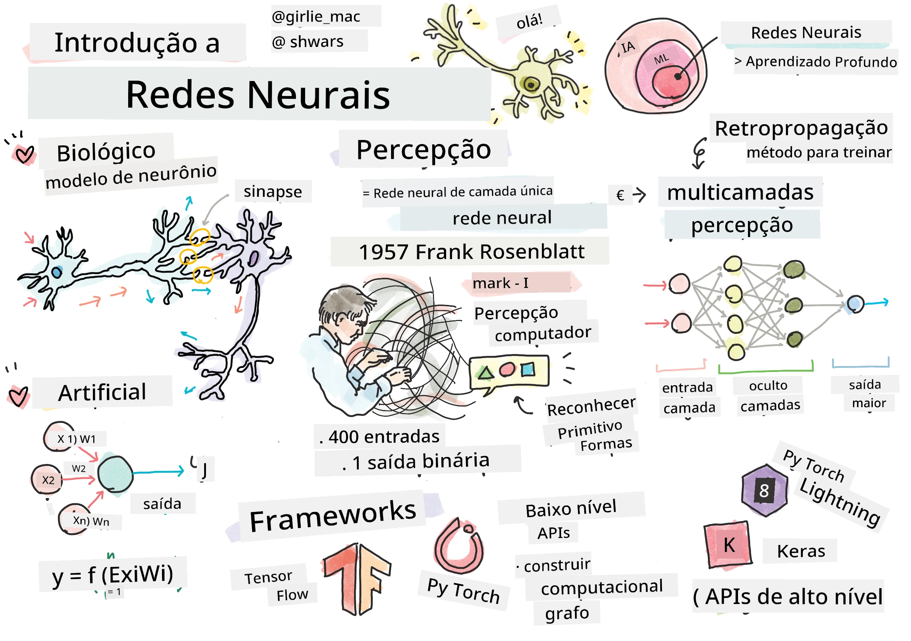
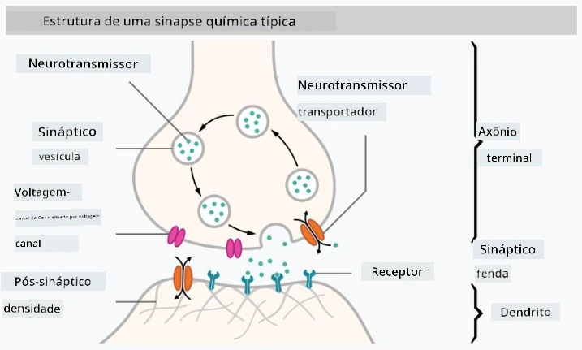

# Introdução às Redes Neurais

Como discutimos na introdução, uma das formas de alcançar inteligência é treinar um **modelo computacional** ou um **cérebro artificial**. Desde meados do século XX, pesquisadores experimentaram diferentes modelos matemáticos, até que, nos últimos anos, essa abordagem se mostrou extremamente bem-sucedida. Esses modelos matemáticos do cérebro são chamados de **redes neurais**.

> Às vezes, redes neurais são chamadas de *Redes Neurais Artificiais*, ou ANNs, para indicar que estamos falando de modelos, e não de redes reais de neurônios.

## Aprendizado de Máquina

Redes Neurais fazem parte de uma disciplina maior chamada **Aprendizado de Máquina**, cujo objetivo é usar dados para treinar modelos computacionais capazes de resolver problemas. O Aprendizado de Máquina constitui uma grande parte da Inteligência Artificial, porém, não abordamos o aprendizado de máquina clássico neste currículo.

> Visite nosso currículo separado **[Aprendizado de Máquina para Iniciantes](http://github.com/microsoft/ml-for-beginners)** para aprender mais sobre Aprendizado de Máquina clássico.

No Aprendizado de Máquina, assumimos que temos algum conjunto de dados de exemplos **X** e valores de saída correspondentes **Y**. Os exemplos geralmente são vetores N-dimensionais que consistem em **características**, e as saídas são chamadas de **rótulos**.

Consideraremos os dois problemas mais comuns de aprendizado de máquina:

* **Classificação**, onde precisamos classificar um objeto de entrada em duas ou mais classes.
* **Regressão**, onde precisamos prever um número numérico para cada uma das amostras de entrada.

> Ao representar entradas e saídas como tensores, o conjunto de dados de entrada é uma matriz de tamanho M&times;N, onde M é o número de amostras e N é o número de características. Os rótulos de saída Y são o vetor de tamanho M.

Neste currículo, focaremos apenas em modelos de redes neurais.

## Um Modelo de Neurônio

Na biologia, sabemos que nosso cérebro é composto por células neurais (neurônios), cada uma delas tendo múltiplas "entradas" (dendritos) e uma única "saída" (axônio). Tanto os dendritos quanto os axônios podem conduzir sinais elétricos, e as conexões entre eles — conhecidas como sinapses — podem apresentar diferentes graus de condutividade, que são regulados por neurotransmissores.

 | 
----|----
Neurônio Real *([Imagem](https://en.wikipedia.org/wiki/Synapse#/media/File:SynapseSchematic_lines.svg) da Wikipedia)* | Neurônio Artificial *(Imagem do Autor)*

Assim, o modelo matemático mais simples de um neurônio contém várias entradas X1, ..., XN e uma saída Y, e uma série de pesos W1, ..., WN. A saída é calculada como:

onde f é alguma **função de ativação** não linear.

> Os primeiros modelos de neurônio foram descritos no artigo clássico [A logical calculus of the ideas immanent in nervous activity](https://www.cs.cmu.edu/~./epxing/Class/10715/reading/McCulloch.and.Pitts.pdf) por Warren McCullock e Walter Pitts em 1943. Donald Hebb, em seu livro "[The Organization of Behavior: A Neuropsychological Theory](https://books.google.com/books?id=VNetYrB8EBoC)", propôs uma forma de treinar essas redes.

## Nesta Seção

Nesta seção, aprenderemos sobre:
* [Perceptron](03-Perceptron/README.md), um dos primeiros modelos de redes neurais para classificação de duas classes
* [Redes multicamadas](04-OwnFramework/README.md) com um notebook associado [como construir nosso próprio framework](04-OwnFramework/OwnFramework.ipynb)
* [Frameworks de Redes Neurais](05-Frameworks/README.md), com estes notebooks: [PyTorch](05-Frameworks/IntroPyTorch.ipynb) e [Keras/Tensorflow](05-Frameworks/IntroKerasTF.ipynb)
* [Overfitting](../../../../lessons/3-NeuralNetworks/05-Frameworks)

---

**Aviso Legal**:  
Este documento foi traduzido utilizando o serviço de tradução por IA [Co-op Translator](https://github.com/Azure/co-op-translator). Embora nos esforcemos para garantir a precisão, esteja ciente de que traduções automáticas podem conter erros ou imprecisões. O documento original em seu idioma nativo deve ser considerado a fonte oficial. Para informações críticas, recomenda-se a tradução profissional realizada por humanos. Não nos responsabilizamos por quaisquer mal-entendidos ou interpretações equivocadas decorrentes do uso desta tradução.