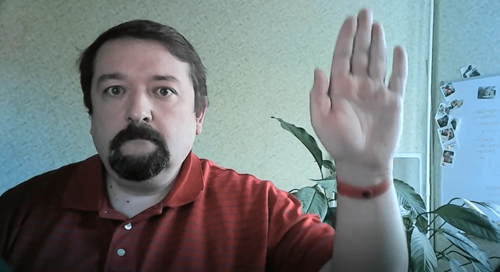

# Introdução à Visão Computacional

[Visão Computacional](https://wikipedia.org/wiki/Computer_vision) é uma disciplina cujo objetivo é permitir que computadores compreendam imagens digitais em um nível avançado. Essa é uma definição bastante ampla, pois *compreender* pode significar muitas coisas diferentes, incluindo encontrar um objeto em uma imagem (**detecção de objetos**), entender o que está acontecendo (**detecção de eventos**), descrever uma imagem em texto ou reconstruir uma cena em 3D. Existem também tarefas específicas relacionadas a imagens humanas: estimativa de idade e emoções, detecção e identificação de rostos, e estimativa de pose em 3D, para citar algumas.

## [Quiz pré-aula](https://ff-quizzes.netlify.app/en/ai/quiz/11)

Uma das tarefas mais simples da visão computacional é a **classificação de imagens**.

A visão computacional é frequentemente considerada um ramo da IA. Atualmente, a maioria das tarefas de visão computacional é resolvida usando redes neurais. Vamos aprender mais sobre o tipo especial de redes neurais usadas para visão computacional, as [redes neurais convolucionais](../07-ConvNets/README.md), ao longo desta seção.

No entanto, antes de passar a imagem para uma rede neural, em muitos casos faz sentido usar algumas técnicas algorítmicas para melhorar a imagem.

Existem várias bibliotecas Python disponíveis para processamento de imagens:

* **[imageio](https://imageio.readthedocs.io/en/stable/)** pode ser usada para ler/escrever diferentes formatos de imagem. Também suporta ffmpeg, uma ferramenta útil para converter quadros de vídeo em imagens.
* **[Pillow](https://pillow.readthedocs.io/en/stable/index.html)** (também conhecida como PIL) é um pouco mais poderosa e também suporta algumas manipulações de imagem, como morphing, ajustes de paleta e mais.
* **[OpenCV](https://opencv.org/)** é uma poderosa biblioteca de processamento de imagens escrita em C++, que se tornou o padrão *de facto* para processamento de imagens. Possui uma interface conveniente em Python.
* **[dlib](http://dlib.net/)** é uma biblioteca em C++ que implementa muitos algoritmos de aprendizado de máquina, incluindo alguns algoritmos de visão computacional. Também possui uma interface em Python e pode ser usada para tarefas desafiadoras, como detecção de rostos e pontos faciais.

## OpenCV

[OpenCV](https://opencv.org/) é considerado o padrão *de facto* para processamento de imagens. Ele contém muitos algoritmos úteis, implementados em C++. Você também pode chamar o OpenCV a partir do Python.

Um bom lugar para aprender OpenCV é [este curso Learn OpenCV](https://learnopencv.com/getting-started-with-opencv/). Em nosso currículo, nosso objetivo não é aprender OpenCV, mas mostrar alguns exemplos de quando ele pode ser usado e como.

### Carregando Imagens

Imagens em Python podem ser convenientemente representadas por arrays NumPy. Por exemplo, imagens em escala de cinza com tamanho de 320x200 pixels seriam armazenadas em um array 200x320, e imagens coloridas da mesma dimensão teriam forma 200x320x3 (para 3 canais de cor). Para carregar uma imagem, você pode usar o seguinte código:

```python
import cv2
import matplotlib.pyplot as plt

im = cv2.imread('image.jpeg')
plt.imshow(im)
```

Tradicionalmente, o OpenCV usa codificação BGR (Azul-Verde-Vermelho) para imagens coloridas, enquanto o restante das ferramentas Python usa o mais tradicional RGB (Vermelho-Verde-Azul). Para que a imagem fique correta, você precisa convertê-la para o espaço de cores RGB, seja trocando as dimensões no array NumPy ou chamando uma função do OpenCV:

```python
im = cv2.cvtColor(im,cv2.COLOR_BGR2RGB)
```

A mesma função `cvtColor` pode ser usada para realizar outras transformações de espaço de cores, como converter uma imagem para escala de cinza ou para o espaço de cores HSV (Matiz-Saturação-Valor).

Você também pode usar o OpenCV para carregar quadros de vídeo, um por um - um exemplo é dado no exercício [OpenCV Notebook](OpenCV.ipynb).

### Processamento de Imagens

Antes de alimentar uma imagem para uma rede neural, você pode querer aplicar várias etapas de pré-processamento. O OpenCV pode fazer muitas coisas, incluindo:

* **Redimensionar** a imagem usando `im = cv2.resize(im, (320,200),interpolation=cv2.INTER_LANCZOS)`
* **Desfocar** a imagem usando `im = cv2.medianBlur(im,3)` ou `im = cv2.GaussianBlur(im, (3,3), 0)`
* Alterar o **brilho e contraste** da imagem pode ser feito por manipulações de arrays NumPy, conforme descrito [nesta nota do Stackoverflow](https://stackoverflow.com/questions/39308030/how-do-i-increase-the-contrast-of-an-image-in-python-opencv).
* Usar [limiarização](https://docs.opencv.org/4.x/d7/d4d/tutorial_py_thresholding.html) chamando as funções `cv2.threshold`/`cv2.adaptiveThreshold`, que muitas vezes é preferível a ajustar brilho ou contraste.
* Aplicar diferentes [transformações](https://docs.opencv.org/4.5.5/da/d6e/tutorial_py_geometric_transformations.html) à imagem:
    - **[Transformações Afins](https://docs.opencv.org/4.5.5/d4/d61/tutorial_warp_affine.html)** podem ser úteis se você precisar combinar rotação, redimensionamento e distorção na imagem e souber a localização de origem e destino de três pontos na imagem. Transformações afins mantêm linhas paralelas paralelas.
    - **[Transformações de Perspectiva](https://medium.com/analytics-vidhya/opencv-perspective-transformation-9edffefb2143)** podem ser úteis quando você conhece as posições de origem e destino de 4 pontos na imagem. Por exemplo, se você tirar uma foto de um documento retangular com uma câmera de smartphone de algum ângulo e quiser criar uma imagem retangular do próprio documento.
* Entender o movimento dentro da imagem usando **[fluxo óptico](https://docs.opencv.org/4.5.5/d4/dee/tutorial_optical_flow.html)**.

## Exemplos de Uso da Visão Computacional

Em nosso [OpenCV Notebook](OpenCV.ipynb), damos alguns exemplos de quando a visão computacional pode ser usada para realizar tarefas específicas:

* **Pré-processamento de uma fotografia de um livro em Braille**. Focamos em como podemos usar limiarização, detecção de características, transformação de perspectiva e manipulações NumPy para separar símbolos individuais em Braille para posterior classificação por uma rede neural.

 |  | 
----|-----|-----

> Imagem de [OpenCV.ipynb](OpenCV.ipynb)

* **Detectando movimento em vídeo usando diferença de quadros**. Se a câmera estiver fixa, os quadros do feed da câmera devem ser bastante semelhantes entre si. Como os quadros são representados como arrays, apenas subtraindo esses arrays de dois quadros subsequentes obteremos a diferença de pixels, que deve ser baixa para quadros estáticos e se tornar maior quando houver movimento substancial na imagem.


> Imagem de [OpenCV.ipynb](OpenCV.ipynb)

* **Detectando movimento usando Fluxo Óptico**. [Fluxo óptico](https://docs.opencv.org/3.4/d4/dee/tutorial_optical_flow.html) nos permite entender como os pixels individuais nos quadros de vídeo se movem. Existem dois tipos de fluxo óptico:

   - **Fluxo Óptico Denso** calcula o campo vetorial que mostra para cada pixel onde ele está se movendo.
   - **Fluxo Óptico Esparso** é baseado em pegar algumas características distintivas na imagem (por exemplo, bordas) e construir sua trajetória de quadro a quadro.


> Imagem de [OpenCV.ipynb](OpenCV.ipynb)

## ✍️ Notebooks de Exemplo: OpenCV [experimente o OpenCV em Ação](OpenCV.ipynb)

Vamos fazer alguns experimentos com OpenCV explorando o [OpenCV Notebook](OpenCV.ipynb)

## Conclusão

Às vezes, tarefas relativamente complexas, como detecção de movimento ou detecção de pontas dos dedos, podem ser resolvidas puramente por visão computacional. Assim, é muito útil conhecer as técnicas básicas de visão computacional e o que bibliotecas como OpenCV podem fazer.

## 🚀 Desafio

Assista a [este vídeo](https://docs.microsoft.com/shows/ai-show/ai-show--2021-opencv-ai-competition--grand-prize-winners--cortic-tigers--episode-32?WT.mc_id=academic-77998-cacaste) do AI Show para aprender sobre o projeto Cortic Tigers e como eles construíram uma solução baseada em blocos para democratizar tarefas de visão computacional via um robô. Pesquise outros projetos como este que ajudam novos aprendizes a ingressar na área.

## [Quiz pós-aula](https://ff-quizzes.netlify.app/en/ai/quiz/12)

## Revisão e Autoestudo

Leia mais sobre fluxo óptico [neste ótimo tutorial](https://learnopencv.com/optical-flow-in-opencv/).

## [Tarefa](lab/README.md)

Neste laboratório, você gravará um vídeo com gestos simples, e seu objetivo será extrair movimentos para cima/baixo/esquerda/direita usando fluxo óptico.



---

