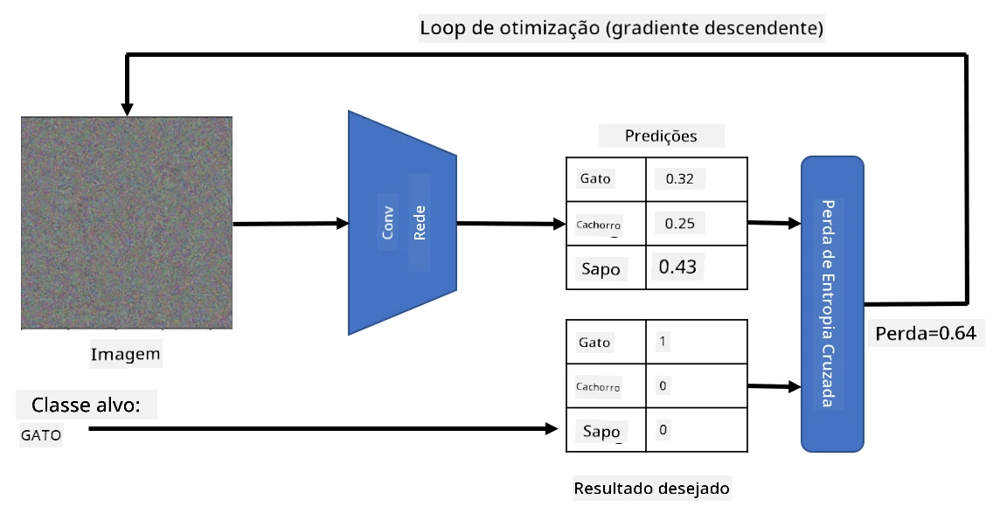

# Redes Pré-treinadas e Aprendizado por Transferência

Treinar CNNs pode levar muito tempo e exigir uma grande quantidade de dados. No entanto, grande parte do tempo é gasto aprendendo os melhores filtros de baixo nível que uma rede pode usar para extrair padrões de imagens. Surge uma pergunta natural: podemos usar uma rede neural treinada em um conjunto de dados e adaptá-la para classificar imagens diferentes sem precisar de um processo completo de treinamento?

## [Quiz pré-aula](https://ff-quizzes.netlify.app/en/ai/quiz/15)

Essa abordagem é chamada de **aprendizado por transferência**, porque transferimos algum conhecimento de um modelo de rede neural para outro. No aprendizado por transferência, normalmente começamos com um modelo pré-treinado, que foi treinado em um grande conjunto de dados de imagens, como o **ImageNet**. Esses modelos já conseguem extrair diferentes características de imagens genéricas, e, em muitos casos, apenas construir um classificador em cima dessas características extraídas pode gerar bons resultados.

> ✅ Aprendizado por Transferência é um termo que você encontra em outros campos acadêmicos, como Educação. Ele se refere ao processo de levar conhecimento de um domínio e aplicá-lo em outro.

## Modelos Pré-treinados como Extratores de Características

As redes convolucionais que discutimos na seção anterior contêm várias camadas, cada uma delas destinada a extrair características da imagem, começando por combinações de pixels de baixo nível (como linhas horizontais/verticais ou traços), até combinações de características de nível mais alto, correspondendo a coisas como o olho de uma chama. Se treinarmos uma CNN em um conjunto de dados suficientemente grande de imagens genéricas e diversas, a rede deve aprender a extrair essas características comuns.

Tanto o Keras quanto o PyTorch possuem funções para carregar facilmente pesos de redes neurais pré-treinadas para algumas arquiteturas comuns, a maioria das quais foi treinada em imagens do ImageNet. As mais utilizadas estão descritas na página [Arquiteturas de CNN](../07-ConvNets/CNN_Architectures.md) da lição anterior. Em particular, você pode considerar usar uma das seguintes:

* **VGG-16/VGG-19**, que são modelos relativamente simples, mas ainda oferecem boa precisão. Usar o VGG como uma primeira tentativa é uma boa escolha para ver como o aprendizado por transferência está funcionando.
* **ResNet** é uma família de modelos proposta pela Microsoft Research em 2015. Eles possuem mais camadas e, portanto, exigem mais recursos.
* **MobileNet** é uma família de modelos com tamanho reduzido, adequada para dispositivos móveis. Use-os se você tiver poucos recursos e puder sacrificar um pouco de precisão.

Aqui estão características extraídas de uma imagem de um gato pela rede VGG-16:

## Conjunto de Dados de Gatos vs. Cachorros

Neste exemplo, usaremos um conjunto de dados de [Gatos e Cachorros](https://www.microsoft.com/download/details.aspx?id=54765&WT.mc_id=academic-77998-cacaste), que é muito próximo de um cenário real de classificação de imagens.

## ✍️ Exercício: Aprendizado por Transferência

Vamos ver o aprendizado por transferência em ação nos notebooks correspondentes:

* [Transfer Learning - PyTorch](TransferLearningPyTorch.ipynb)
* [Transfer Learning - TensorFlow](TransferLearningTF.ipynb)

## Visualizando o Gato Adversarial

Uma rede neural pré-treinada contém diferentes padrões em seu *cérebro*, incluindo noções de **gato ideal** (assim como cachorro ideal, zebra ideal, etc.). Seria interessante de alguma forma **visualizar essa imagem**. No entanto, isso não é simples, porque os padrões estão espalhados por todos os pesos da rede e organizados em uma estrutura hierárquica.

Uma abordagem que podemos adotar é começar com uma imagem aleatória e, em seguida, tentar usar a técnica de **otimização por descida de gradiente** para ajustar essa imagem de forma que a rede comece a pensar que é um gato.

No entanto, se fizermos isso, receberemos algo muito semelhante a um ruído aleatório. Isso ocorre porque *existem muitas maneiras de fazer a rede pensar que a imagem de entrada é um gato*, incluindo algumas que não fazem sentido visualmente. Embora essas imagens contenham muitos padrões típicos de um gato, não há nada que as restrinja a serem visualmente distintas.

Para melhorar o resultado, podemos adicionar outro termo à função de perda, chamado de **perda de variação**. É uma métrica que mostra quão semelhantes são os pixels vizinhos da imagem. Minimizar a perda de variação torna a imagem mais suave e elimina o ruído, revelando padrões mais visualmente atraentes. Aqui está um exemplo de tais imagens "ideais", classificadas como gato e zebra com alta probabilidade:

 | 
-----|-----
 *Gato Ideal* | *Zebra Ideal*

Uma abordagem semelhante pode ser usada para realizar os chamados **ataques adversariais** em uma rede neural. Suponha que queremos enganar uma rede neural e fazer um cachorro parecer um gato. Se pegarmos a imagem de um cachorro, que é reconhecida pela rede como um cachorro, podemos ajustá-la um pouco usando otimização por descida de gradiente até que a rede comece a classificá-la como um gato:

 | 
-----|-----
*Imagem original de um cachorro* | *Imagem de um cachorro classificada como gato*

Veja o código para reproduzir os resultados acima no seguinte notebook:

* [Ideal e Adversarial Cat - TensorFlow](AdversarialCat_TF.ipynb)

## Conclusão

Usando aprendizado por transferência, você pode montar rapidamente um classificador para uma tarefa de classificação de objetos personalizada e alcançar alta precisão. Você pode perceber que tarefas mais complexas que estamos resolvendo agora exigem maior poder computacional e não podem ser facilmente resolvidas no CPU. Na próxima unidade, tentaremos usar uma implementação mais leve para treinar o mesmo modelo usando menos recursos computacionais, o que resulta em uma precisão apenas ligeiramente menor.

## 🚀 Desafio

Nos notebooks que acompanham, há notas no final sobre como o aprendizado por transferência funciona melhor com dados de treinamento um pouco semelhantes (um novo tipo de animal, talvez). Faça algumas experimentações com tipos completamente novos de imagens para ver como seus modelos de aprendizado por transferência se saem.

## [Quiz pós-aula](https://ff-quizzes.netlify.app/en/ai/quiz/16)

## Revisão e Autoestudo

Leia o arquivo [TrainingTricks.md](TrainingTricks.md) para aprofundar seu conhecimento sobre outras formas de treinar seus modelos.

## [Tarefa](lab/README.md)

Neste laboratório, usaremos o conjunto de dados real [Oxford-IIIT](https://www.robots.ox.ac.uk/~vgg/data/pets/) de animais de estimação, com 35 raças de gatos e cachorros, e construiremos um classificador de aprendizado por transferência.

---

