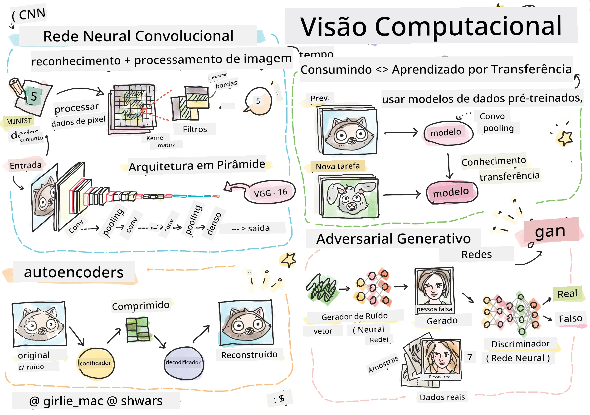

# Visão Computacional

Nesta seção, vamos aprender sobre:

* [Introdução à Visão Computacional e OpenCV](06-IntroCV/README.md)
* [Redes Neurais Convolucionais](07-ConvNets/README.md)
* [Redes Pré-treinadas e Aprendizado por Transferência](08-TransferLearning/README.md) 
* [Autoencoders](09-Autoencoders/README.md)
* [Redes Adversárias Generativas](10-GANs/README.md)
* [Detecção de Objetos](11-ObjectDetection/README.md)
* [Segmentação Semântica](12-Segmentation/README.md)

**Aviso Legal**:  
Este documento foi traduzido utilizando o serviço de tradução por IA [Co-op Translator](https://github.com/Azure/co-op-translator). Embora nos esforcemos para garantir a precisão, esteja ciente de que traduções automatizadas podem conter erros ou imprecisões. O documento original em seu idioma nativo deve ser considerado a fonte autoritativa. Para informações críticas, recomenda-se a tradução profissional realizada por humanos. Não nos responsabilizamos por quaisquer mal-entendidos ou interpretações equivocadas decorrentes do uso desta tradução.