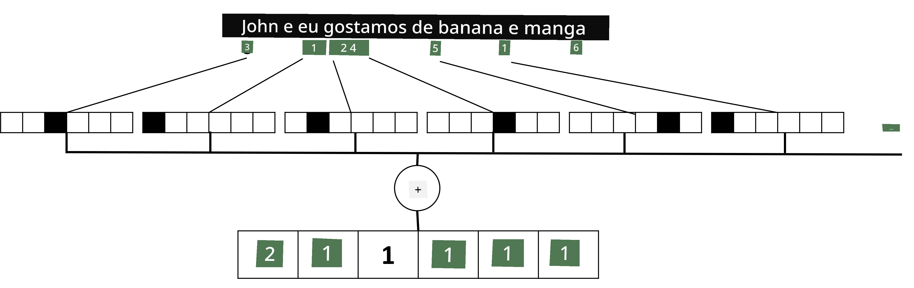

# Representando Texto como Tensores

## [Quiz pré-aula](https://ff-quizzes.netlify.app/en/ai/quiz/25)

## Classificação de Texto

Na primeira parte desta seção, vamos focar na tarefa de **classificação de texto**. Utilizaremos o [AG News](https://www.kaggle.com/amananandrai/ag-news-classification-dataset), um conjunto de dados que contém artigos de notícias como o seguinte:

* Categoria: Ciência/Tecnologia
* Título: Empresa de Ky. Ganha Subsídio para Estudar Peptídeos (AP)
* Corpo: AP - Uma empresa fundada por um pesquisador de química da Universidade de Louisville ganhou um subsídio para desenvolver...

Nosso objetivo será classificar o item de notícia em uma das categorias com base no texto.

## Representando texto

Se quisermos resolver tarefas de Processamento de Linguagem Natural (PLN) com redes neurais, precisamos de uma maneira de representar texto como tensores. Os computadores já representam caracteres textuais como números que mapeiam para fontes na sua tela usando codificações como ASCII ou UTF-8.

> [Fonte da imagem](https://www.seobility.net/en/wiki/ASCII)

Como humanos, entendemos o que cada letra **representa** e como todos os caracteres se juntam para formar as palavras de uma frase. No entanto, os computadores, por si só, não têm esse entendimento, e a rede neural precisa aprender o significado durante o treinamento.

Portanto, podemos usar diferentes abordagens ao representar texto:

* **Representação a nível de caractere**, onde representamos o texto tratando cada caractere como um número. Dado que temos *C* caracteres diferentes em nosso corpus de texto, a palavra *Hello* seria representada por um tensor 5x*C*. Cada letra corresponderia a uma coluna do tensor em codificação one-hot.
* **Representação a nível de palavra**, na qual criamos um **vocabulário** de todas as palavras em nosso texto e, em seguida, representamos as palavras usando codificação one-hot. Essa abordagem é um pouco melhor, porque cada letra, por si só, não tem muito significado, e, ao usar conceitos semânticos de nível mais alto - palavras - simplificamos a tarefa para a rede neural. No entanto, dado o tamanho do dicionário, precisamos lidar com tensores esparsos de alta dimensão.

Independentemente da representação, primeiro precisamos converter o texto em uma sequência de **tokens**, sendo um token um caractere, uma palavra ou, às vezes, até parte de uma palavra. Depois, convertemos o token em um número, geralmente usando um **vocabulário**, e esse número pode ser alimentado em uma rede neural usando codificação one-hot.

## N-Gramas

Na linguagem natural, o significado preciso das palavras só pode ser determinado no contexto. Por exemplo, os significados de *rede neural* e *rede de pesca* são completamente diferentes. Uma das maneiras de levar isso em conta é construir nosso modelo com pares de palavras, considerando os pares de palavras como tokens separados no vocabulário. Dessa forma, a frase *Eu gosto de pescar* será representada pela seguinte sequência de tokens: *Eu gosto*, *gosto de*, *de pescar*. O problema com essa abordagem é que o tamanho do dicionário cresce significativamente, e combinações como *de pescar* e *de comprar* são representadas por tokens diferentes, que não compartilham nenhuma semelhança semântica, apesar do mesmo verbo.

Em alguns casos, podemos considerar o uso de tri-gramas -- combinações de três palavras -- também. Assim, essa abordagem é frequentemente chamada de **n-gramas**. Além disso, faz sentido usar n-gramas com representação a nível de caractere, caso em que os n-gramas corresponderão aproximadamente a diferentes sílabas.

## Bag-of-Words e TF/IDF

Ao resolver tarefas como classificação de texto, precisamos ser capazes de representar o texto por um vetor de tamanho fixo, que usaremos como entrada para o classificador denso final. Uma das maneiras mais simples de fazer isso é combinar todas as representações individuais de palavras, por exemplo, somando-as. Se somarmos as codificações one-hot de cada palavra, acabaremos com um vetor de frequências, mostrando quantas vezes cada palavra aparece no texto. Essa representação de texto é chamada de **bag-of-words** (BoW).

> Imagem do autor

Um BoW essencialmente representa quais palavras aparecem no texto e em quais quantidades, o que pode ser uma boa indicação do que o texto trata. Por exemplo, um artigo de notícias sobre política provavelmente conterá palavras como *presidente* e *país*, enquanto uma publicação científica terá algo como *colisor*, *descoberto*, etc. Assim, as frequências das palavras podem, em muitos casos, ser um bom indicador do conteúdo do texto.

O problema com BoW é que certas palavras comuns, como *e*, *é*, etc., aparecem na maioria dos textos e têm as maiores frequências, mascarando as palavras que são realmente importantes. Podemos reduzir a importância dessas palavras levando em conta a frequência com que elas ocorrem em toda a coleção de documentos. Essa é a ideia principal por trás da abordagem TF/IDF, que é abordada em mais detalhes nos notebooks anexados a esta lição.

No entanto, nenhuma dessas abordagens pode levar totalmente em conta a **semântica** do texto. Precisamos de modelos de redes neurais mais poderosos para fazer isso, o que discutiremos mais adiante nesta seção.

## ✍️ Exercícios: Representação de Texto

Continue seu aprendizado nos seguintes notebooks:

* [Representação de Texto com PyTorch](TextRepresentationPyTorch.ipynb)
* [Representação de Texto com TensorFlow](TextRepresentationTF.ipynb)

## Conclusão

Até agora, estudamos técnicas que podem adicionar peso de frequência a diferentes palavras. No entanto, elas não conseguem representar o significado ou a ordem. Como o famoso linguista J. R. Firth disse em 1935: "O significado completo de uma palavra é sempre contextual, e nenhum estudo de significado fora do contexto pode ser levado a sério." Aprenderemos mais adiante no curso como capturar informações contextuais do texto usando modelagem de linguagem.

## 🚀 Desafio

Experimente outros exercícios usando bag-of-words e diferentes modelos de dados. Você pode se inspirar nesta [competição no Kaggle](https://www.kaggle.com/competitions/word2vec-nlp-tutorial/overview/part-1-for-beginners-bag-of-words)

## [Quiz pós-aula](https://ff-quizzes.netlify.app/en/ai/quiz/26)

## Revisão & Autoestudo

Pratique suas habilidades com embeddings de texto e técnicas de bag-of-words no [Microsoft Learn](https://docs.microsoft.com/learn/modules/intro-natural-language-processing-pytorch/?WT.mc_id=academic-77998-cacaste)

## [Tarefa: Notebooks](assignment.md)

---

