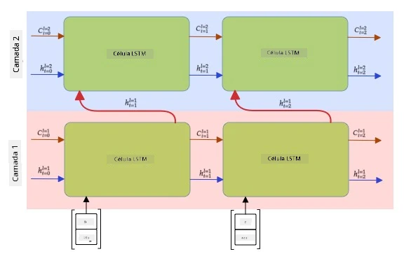

# Redes Neurais Recorrentes

## [Quiz pré-aula](https://ff-quizzes.netlify.app/en/ai/quiz/31)

Nas seções anteriores, utilizamos representações semânticas ricas de texto e um classificador linear simples sobre os embeddings. O que essa arquitetura faz é capturar o significado agregado das palavras em uma frase, mas ela não leva em conta a **ordem** das palavras, porque a operação de agregação sobre os embeddings remove essa informação do texto original. Como esses modelos não conseguem modelar a ordem das palavras, eles não podem resolver tarefas mais complexas ou ambíguas, como geração de texto ou resposta a perguntas.

Para capturar o significado de uma sequência de texto, precisamos usar outra arquitetura de rede neural, chamada de **rede neural recorrente**, ou RNN. Na RNN, passamos nossa frase pela rede um símbolo de cada vez, e a rede produz algum **estado**, que então passamos novamente para a rede junto com o próximo símbolo.

> Imagem do autor

Dada a sequência de entrada de tokens X0,...,Xn, a RNN cria uma sequência de blocos de rede neural e treina essa sequência de ponta a ponta usando retropropagação. Cada bloco de rede recebe um par (Xi,Si) como entrada e produz Si+1 como resultado. O estado final Sn ou (saída Yn) é enviado para um classificador linear para produzir o resultado. Todos os blocos da rede compartilham os mesmos pesos e são treinados de ponta a ponta em uma única passagem de retropropagação.

Como os vetores de estado S0,...,Sn são passados pela rede, ela consegue aprender as dependências sequenciais entre as palavras. Por exemplo, quando a palavra *não* aparece em algum lugar da sequência, a rede pode aprender a negar certos elementos dentro do vetor de estado, resultando em negação.

> ✅ Como os pesos de todos os blocos da RNN na imagem acima são compartilhados, a mesma imagem pode ser representada como um único bloco (à direita) com um loop de feedback recorrente, que passa o estado de saída da rede de volta para a entrada.

## Anatomia de uma Célula RNN

Vamos ver como uma célula RNN simples é organizada. Ela aceita o estado anterior Si-1 e o símbolo atual Xi como entradas, e precisa produzir o estado de saída Si (e, às vezes, também estamos interessados em alguma outra saída Yi, como no caso de redes generativas).

Uma célula RNN simples possui duas matrizes de peso internas: uma transforma um símbolo de entrada (vamos chamá-la de W) e outra transforma um estado de entrada (H). Nesse caso, a saída da rede é calculada como &sigma;(W&times;Xi+H&times;Si-1+b), onde &sigma; é a função de ativação e b é um viés adicional.

> Imagem do autor

Em muitos casos, os tokens de entrada passam por uma camada de embedding antes de entrar na RNN para reduzir a dimensionalidade. Nesse caso, se a dimensão dos vetores de entrada for *emb_size* e o vetor de estado for *hid_size*, o tamanho de W será *emb_size*&times;*hid_size*, e o tamanho de H será *hid_size*&times;*hid_size*.

## Long Short Term Memory (LSTM)

Um dos principais problemas das RNNs clássicas é o chamado problema de **gradientes que desaparecem**. Como as RNNs são treinadas de ponta a ponta em uma única passagem de retropropagação, elas têm dificuldade em propagar o erro para as primeiras camadas da rede, e assim a rede não consegue aprender relações entre tokens distantes. Uma das formas de evitar esse problema é introduzir **gerenciamento explícito de estado** usando os chamados **gates**. Existem duas arquiteturas bem conhecidas desse tipo: **Long Short Term Memory** (LSTM) e **Gated Relay Unit** (GRU).

> Fonte da imagem a ser definida

A rede LSTM é organizada de maneira semelhante à RNN, mas há dois estados que são passados de camada para camada: o estado real C e o vetor oculto H. Em cada unidade, o vetor oculto Hi é concatenado com a entrada Xi, e eles controlam o que acontece com o estado C por meio de **gates**. Cada gate é uma rede neural com ativação sigmoide (saída no intervalo [0,1]), que pode ser vista como uma máscara bit a bit quando multiplicada pelo vetor de estado. Existem os seguintes gates (da esquerda para a direita na imagem acima):

* O **gate de esquecimento** recebe um vetor oculto e determina quais componentes do vetor C precisamos esquecer e quais passar adiante.
* O **gate de entrada** extrai algumas informações dos vetores de entrada e ocultos e as insere no estado.
* O **gate de saída** transforma o estado por meio de uma camada linear com ativação *tanh*, e então seleciona alguns de seus componentes usando um vetor oculto Hi para produzir um novo estado Ci+1.

Os componentes do estado C podem ser vistos como algumas flags que podem ser ativadas ou desativadas. Por exemplo, quando encontramos o nome *Alice* na sequência, podemos assumir que se refere a um personagem feminino e ativar a flag no estado indicando que temos um substantivo feminino na frase. Quando encontramos posteriormente a frase *e Tom*, ativamos a flag indicando que temos um substantivo no plural. Assim, manipulando o estado, podemos supostamente acompanhar as propriedades gramaticais das partes da frase.

> ✅ Um excelente recurso para entender os detalhes internos do LSTM é este ótimo artigo [Understanding LSTM Networks](https://colah.github.io/posts/2015-08-Understanding-LSTMs/) de Christopher Olah.

## RNNs Bidirecionais e Multicamadas

Discutimos redes recorrentes que operam em uma direção, do início de uma sequência até o fim. Isso parece natural, pois se assemelha à forma como lemos e ouvimos fala. No entanto, como em muitos casos práticos temos acesso aleatório à sequência de entrada, pode fazer sentido executar o cálculo recorrente em ambas as direções. Essas redes são chamadas de **RNNs bidirecionais**. Ao lidar com redes bidirecionais, precisaríamos de dois vetores de estado oculto, um para cada direção.

Uma rede recorrente, seja unidirecional ou bidirecional, captura certos padrões dentro de uma sequência e pode armazená-los em um vetor de estado ou passá-los para a saída. Assim como nas redes convolucionais, podemos construir outra camada recorrente sobre a primeira para capturar padrões de nível superior e construir a partir dos padrões de baixo nível extraídos pela primeira camada. Isso nos leva à noção de uma **RNN multicamada**, que consiste em duas ou mais redes recorrentes, onde a saída da camada anterior é passada para a próxima camada como entrada.

*Imagem retirada [deste post maravilhoso](https://towardsdatascience.com/from-a-lstm-cell-to-a-multilayer-lstm-network-with-pytorch-2899eb5696f3) de Fernando López*

## ✍️ Exercícios: Embeddings

Continue seu aprendizado nos seguintes notebooks:

* [RNNs com PyTorch](RNNPyTorch.ipynb)
* [RNNs com TensorFlow](RNNTF.ipynb)

## Conclusão

Nesta unidade, vimos que as RNNs podem ser usadas para classificação de sequência, mas, na verdade, elas podem lidar com muitas outras tarefas, como geração de texto, tradução automática e mais. Consideraremos essas tarefas na próxima unidade.

## 🚀 Desafio

Leia alguns materiais sobre LSTMs e considere suas aplicações:

- [Grid Long Short-Term Memory](https://arxiv.org/pdf/1507.01526v1.pdf)
- [Show, Attend and Tell: Neural Image Caption
Generation with Visual Attention](https://arxiv.org/pdf/1502.03044v2.pdf)

## [Quiz pós-aula](https://ff-quizzes.netlify.app/en/ai/quiz/32)

## Revisão e Autoestudo

- [Understanding LSTM Networks](https://colah.github.io/posts/2015-08-Understanding-LSTMs/) de Christopher Olah.

## [Tarefa: Notebooks](assignment.md)

---

