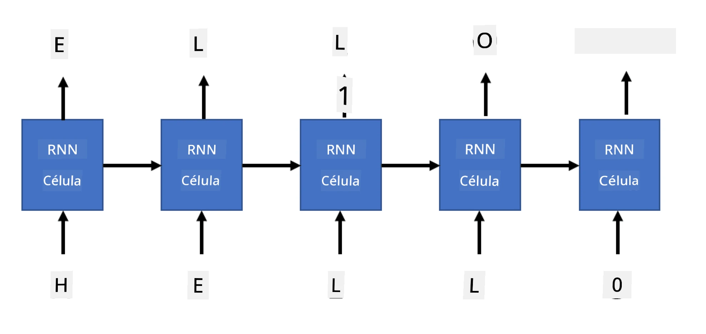

# Redes Generativas

## [Quiz pré-aula](https://ff-quizzes.netlify.app/en/ai/quiz/33)

Redes Neurais Recorrentes (RNNs) e suas variantes com células controladas, como Long Short Term Memory Cells (LSTMs) e Gated Recurrent Units (GRUs), fornecem um mecanismo para modelagem de linguagem, pois conseguem aprender a ordem das palavras e prever a próxima palavra em uma sequência. Isso nos permite usar RNNs para **tarefas generativas**, como geração de texto comum, tradução automática e até mesmo legendas para imagens.

> ✅ Pense em todas as vezes que você se beneficiou de tarefas generativas, como a conclusão de texto enquanto digita. Pesquise sobre seus aplicativos favoritos para descobrir se eles utilizam RNNs.

Na arquitetura de RNN que discutimos na unidade anterior, cada unidade RNN produzia o próximo estado oculto como saída. No entanto, também podemos adicionar outra saída a cada unidade recorrente, permitindo que ela produza uma **sequência** (que tem o mesmo comprimento da sequência original). Além disso, podemos usar unidades RNN que não aceitam uma entrada em cada etapa, mas apenas um vetor de estado inicial, e então produzem uma sequência de saídas.

Isso permite diferentes arquiteturas neurais, como mostrado na imagem abaixo:


> Imagem do post no blog [Unreasonable Effectiveness of Recurrent Neural Networks](http://karpathy.github.io/2015/05/21/rnn-effectiveness/) por [Andrej Karpaty](http://karpathy.github.io/)

* **Um-para-um** é uma rede neural tradicional com uma entrada e uma saída.
* **Um-para-muitos** é uma arquitetura generativa que aceita um valor de entrada e gera uma sequência de valores de saída. Por exemplo, se quisermos treinar uma rede de **legendas para imagens** que produza uma descrição textual de uma imagem, podemos usar uma imagem como entrada, passá-la por uma CNN para obter seu estado oculto e, em seguida, usar uma cadeia recorrente para gerar a legenda palavra por palavra.
* **Muitos-para-um** corresponde às arquiteturas RNN que descrevemos na unidade anterior, como classificação de texto.
* **Muitos-para-muitos**, ou **sequência-para-sequência**, corresponde a tarefas como **tradução automática**, onde temos uma primeira RNN que coleta todas as informações da sequência de entrada no estado oculto, e outra cadeia RNN que desenrola esse estado na sequência de saída.

Nesta unidade, focaremos em modelos generativos simples que nos ajudam a gerar texto. Para simplificar, usaremos tokenização em nível de caracteres.

Treinaremos esta RNN para gerar texto passo a passo. Em cada etapa, pegaremos uma sequência de caracteres de comprimento `nchars` e pediremos à rede que gere o próximo caractere de saída para cada caractere de entrada:



Ao gerar texto (durante a inferência), começamos com algum **prompt**, que é passado pelas células RNN para gerar seu estado intermediário, e então a geração começa a partir desse estado. Geramos um caractere por vez e passamos o estado e o caractere gerado para outra célula RNN para gerar o próximo, até que tenhamos gerado caracteres suficientes.


> Imagem do autor

## ✍️ Exercícios: Redes Generativas

Continue seu aprendizado nos seguintes notebooks:

* [Redes Generativas com PyTorch](GenerativePyTorch.ipynb)
* [Redes Generativas com TensorFlow](GenerativeTF.ipynb)

## Geração de texto suave e temperatura

A saída de cada célula RNN é uma distribuição de probabilidade de caracteres. Se sempre escolhermos o caractere com a maior probabilidade como o próximo caractere no texto gerado, o texto frequentemente pode se tornar "cíclico", repetindo as mesmas sequências de caracteres repetidamente, como neste exemplo:

```
today of the second the company and a second the company ...
```

No entanto, se olharmos para a distribuição de probabilidade do próximo caractere, pode ser que a diferença entre algumas das maiores probabilidades não seja tão grande, por exemplo, um caractere pode ter probabilidade 0,2 e outro 0,19, etc. Por exemplo, ao procurar o próximo caractere na sequência '*play*', o próximo caractere pode ser igualmente um espaço ou **e** (como na palavra *player*).

Isso nos leva à conclusão de que nem sempre é "justo" selecionar o caractere com maior probabilidade, pois escolher o segundo maior ainda pode levar a um texto significativo. É mais sábio **amostrar** caracteres da distribuição de probabilidade fornecida pela saída da rede. Podemos também usar um parâmetro, **temperatura**, que ajusta a distribuição de probabilidade, caso queiramos adicionar mais aleatoriedade ou torná-la mais íngreme, se quisermos nos ater mais aos caracteres de maior probabilidade.

Explore como essa geração de texto suave é implementada nos notebooks mencionados acima.

## Conclusão

Embora a geração de texto possa ser útil por si só, os maiores benefícios vêm da capacidade de gerar texto usando RNNs a partir de algum vetor de características inicial. Por exemplo, a geração de texto é usada como parte da tradução automática (sequência-para-sequência, neste caso o vetor de estado do *encoder* é usado para gerar ou *decodificar* a mensagem traduzida) ou para gerar descrições textuais de uma imagem (nesse caso, o vetor de características viria de um extrator CNN).

## 🚀 Desafio

Faça algumas lições no Microsoft Learn sobre este tópico:

* Geração de Texto com [PyTorch](https://docs.microsoft.com/learn/modules/intro-natural-language-processing-pytorch/6-generative-networks/?WT.mc_id=academic-77998-cacaste)/[TensorFlow](https://docs.microsoft.com/learn/modules/intro-natural-language-processing-tensorflow/5-generative-networks/?WT.mc_id=academic-77998-cacaste)

## [Quiz pós-aula](https://ff-quizzes.netlify.app/en/ai/quiz/34)

## Revisão e Autoestudo

Aqui estão alguns artigos para expandir seu conhecimento:

* Diferentes abordagens para geração de texto com Cadeia de Markov, LSTM e GPT-2: [post no blog](https://towardsdatascience.com/text-generation-gpt-2-lstm-markov-chain-9ea371820e1e)
* Exemplo de geração de texto na [documentação do Keras](https://keras.io/examples/generative/lstm_character_level_text_generation/)

## [Tarefa](lab/README.md)

Vimos como gerar texto caractere por caractere. No laboratório, você explorará a geração de texto em nível de palavras.

---

