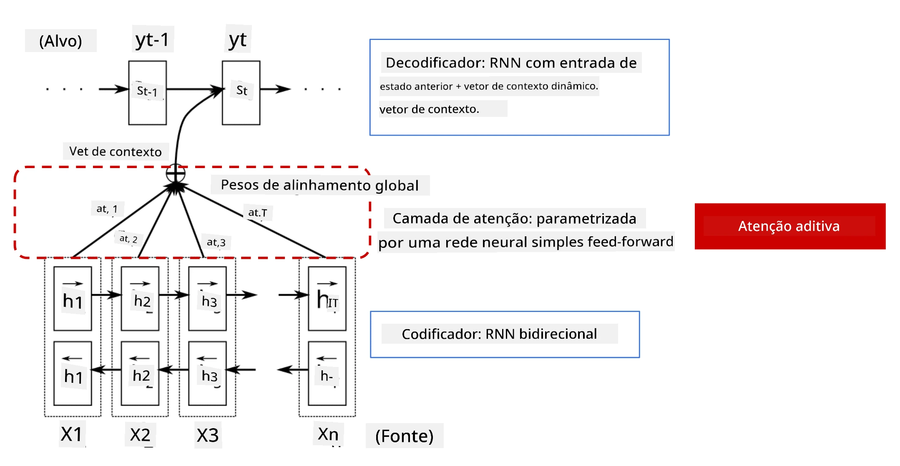
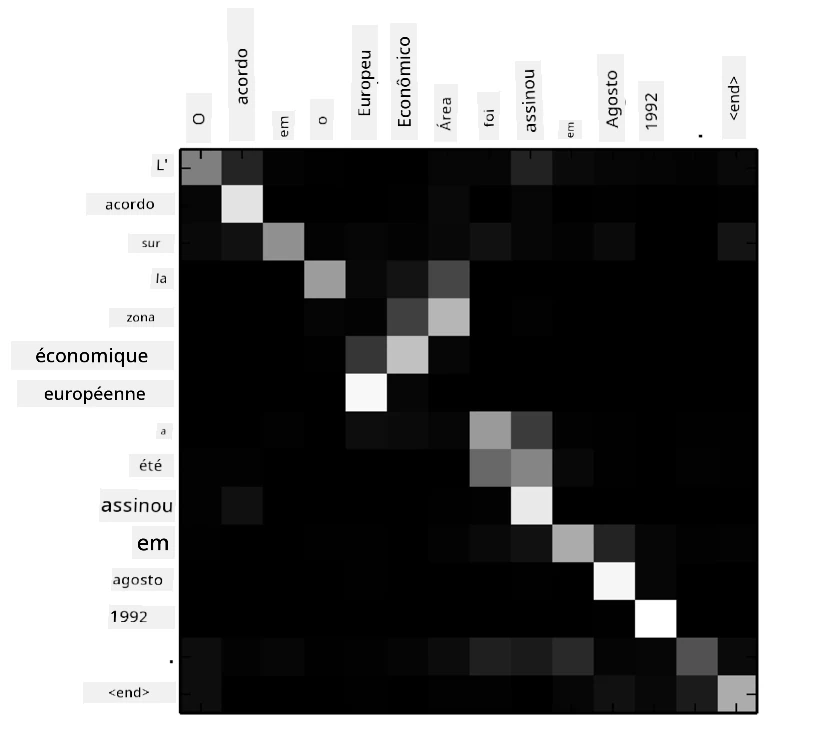
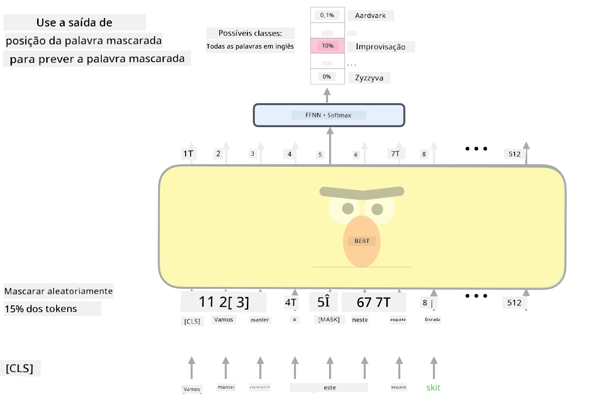

# Mecanismos de Atenção e Transformers

## [Quiz pré-aula](https://ff-quizzes.netlify.app/en/ai/quiz/35)

Um dos problemas mais importantes no domínio de PLN (Processamento de Linguagem Natural) é a **tradução automática**, uma tarefa essencial que sustenta ferramentas como o Google Tradutor. Nesta seção, vamos nos concentrar na tradução automática ou, mais geralmente, em qualquer tarefa de *sequência para sequência* (também chamada de **transdução de sentenças**).

Com RNNs, a tarefa de sequência para sequência é implementada por duas redes recorrentes, onde uma rede, o **codificador**, comprime uma sequência de entrada em um estado oculto, enquanto outra rede, o **decodificador**, expande esse estado oculto em um resultado traduzido. Existem alguns problemas com essa abordagem:

* O estado final da rede codificadora tem dificuldade em lembrar o início de uma sentença, o que causa baixa qualidade do modelo para sentenças longas.
* Todas as palavras em uma sequência têm o mesmo impacto no resultado. Na realidade, no entanto, palavras específicas na sequência de entrada frequentemente têm mais impacto nas saídas sequenciais do que outras.

Os **Mecanismos de Atenção** fornecem um meio de ponderar o impacto contextual de cada vetor de entrada em cada previsão de saída da RNN. Isso é implementado criando atalhos entre os estados intermediários da RNN de entrada e a RNN de saída. Dessa forma, ao gerar o símbolo de saída yt, levamos em conta todos os estados ocultos de entrada hi, com diferentes coeficientes de peso &alpha;t,i.

> O modelo codificador-decodificador com mecanismo de atenção aditiva em [Bahdanau et al., 2015](https://arxiv.org/pdf/1409.0473.pdf), citado deste [post no blog](https://lilianweng.github.io/lil-log/2018/06/24/attention-attention.html)

A matriz de atenção {&alpha;i,j} representaria o grau em que certas palavras de entrada influenciam a geração de uma palavra específica na sequência de saída. Abaixo está um exemplo de tal matriz:

> Figura de [Bahdanau et al., 2015](https://arxiv.org/pdf/1409.0473.pdf) (Fig.3)

Os mecanismos de atenção são responsáveis por grande parte do estado da arte atual ou próximo ao atual em PLN. No entanto, adicionar atenção aumenta significativamente o número de parâmetros do modelo, o que levou a problemas de escalabilidade com RNNs. Uma limitação chave na escalabilidade das RNNs é que a natureza recorrente dos modelos torna desafiador agrupar e paralelizar o treinamento. Em uma RNN, cada elemento de uma sequência precisa ser processado em ordem sequencial, o que significa que não pode ser facilmente paralelizado.

> Figura do [Blog do Google](https://research.googleblog.com/2016/09/a-neural-network-for-machine.html)

A adoção de mecanismos de atenção, combinada com essa limitação, levou à criação dos modelos Transformer, que hoje representam o estado da arte, como BERT e Open-GPT3.

## Modelos Transformer

Uma das principais ideias por trás dos transformers é evitar a natureza sequencial das RNNs e criar um modelo que seja paralelizável durante o treinamento. Isso é alcançado implementando duas ideias:

* codificação posicional
* uso do mecanismo de autoatenção para capturar padrões em vez de RNNs (ou CNNs) (é por isso que o artigo que introduz os transformers se chama *[Attention is all you need](https://arxiv.org/abs/1706.03762)*)

### Codificação/Embutimento Posicional

A ideia da codificação posicional é a seguinte:  
1. Ao usar RNNs, a posição relativa dos tokens é representada pelo número de passos, e, portanto, não precisa ser representada explicitamente.  
2. No entanto, ao mudarmos para atenção, precisamos saber as posições relativas dos tokens dentro de uma sequência.  
3. Para obter a codificação posicional, aumentamos nossa sequência de tokens com uma sequência de posições dos tokens na sequência (ou seja, uma sequência de números 0, 1, ...).  
4. Em seguida, misturamos a posição do token com um vetor de embutimento do token. Para transformar a posição (inteiro) em um vetor, podemos usar diferentes abordagens:

* Embutimento treinável, semelhante ao embutimento de tokens. Esta é a abordagem que consideramos aqui. Aplicamos camadas de embutimento tanto nos tokens quanto em suas posições, resultando em vetores de embutimento de mesmas dimensões, que então somamos.
* Função fixa de codificação posicional, como proposto no artigo original.

> Imagem do autor

O resultado que obtemos com o embutimento posicional incorpora tanto o token original quanto sua posição dentro de uma sequência.

### Autoatenção Multi-Cabeça

Em seguida, precisamos capturar alguns padrões dentro de nossa sequência. Para isso, os transformers usam um mecanismo de **autoatenção**, que é essencialmente atenção aplicada à mesma sequência como entrada e saída. Aplicar autoatenção nos permite levar em conta o **contexto** dentro da sentença e ver quais palavras estão inter-relacionadas. Por exemplo, isso nos permite identificar quais palavras são referidas por correferências, como *it* (ele/ela), e também considerar o contexto:

> Imagem do [Blog do Google](https://research.googleblog.com/2017/08/transformer-novel-neural-network.html)

Nos transformers, usamos **Atenção Multi-Cabeça** para dar à rede o poder de capturar vários tipos diferentes de dependências, como relações de palavras de longo prazo vs. curto prazo, correferência vs. outra coisa, etc.

O [Notebook do TensorFlow](TransformersTF.ipynb) contém mais detalhes sobre a implementação das camadas do transformer.

### Atenção Codificador-Decodificador

Nos transformers, a atenção é usada em dois lugares:

* Para capturar padrões dentro do texto de entrada usando autoatenção.
* Para realizar a tradução de sequência - é a camada de atenção entre o codificador e o decodificador.

A atenção codificador-decodificador é muito semelhante ao mecanismo de atenção usado em RNNs, como descrito no início desta seção. Este diagrama animado explica o papel da atenção codificador-decodificador.

Como cada posição de entrada é mapeada independentemente para cada posição de saída, os transformers podem paralelizar melhor do que as RNNs, o que permite modelos de linguagem muito maiores e mais expressivos. Cada cabeça de atenção pode ser usada para aprender diferentes relações entre palavras, o que melhora as tarefas de Processamento de Linguagem Natural.

## BERT

**BERT** (Bidirectional Encoder Representations from Transformers) é uma rede transformer muito grande com várias camadas: 12 camadas para o *BERT-base* e 24 para o *BERT-large*. O modelo é primeiro pré-treinado em um grande corpus de dados textuais (Wikipedia + livros) usando treinamento não supervisionado (prevendo palavras mascaradas em uma sentença). Durante o pré-treinamento, o modelo absorve níveis significativos de compreensão da linguagem, que podem ser aproveitados com outros conjuntos de dados usando ajuste fino. Esse processo é chamado de **aprendizado por transferência**.

> Imagem [fonte](http://jalammar.github.io/illustrated-bert/)

## ✍️ Exercícios: Transformers

Continue seu aprendizado nos seguintes notebooks:

* [Transformers em PyTorch](TransformersPyTorch.ipynb)
* [Transformers em TensorFlow](TransformersTF.ipynb)

## Conclusão

Nesta lição, você aprendeu sobre Transformers e Mecanismos de Atenção, ferramentas essenciais na caixa de ferramentas de PLN. Existem muitas variações de arquiteturas Transformer, incluindo BERT, DistilBERT, BigBird, OpenGPT3 e mais, que podem ser ajustadas. O pacote [HuggingFace](https://github.com/huggingface/) fornece um repositório para treinar muitas dessas arquiteturas com PyTorch e TensorFlow.

## 🚀 Desafio

## [Quiz pós-aula](https://ff-quizzes.netlify.app/en/ai/quiz/36)

## Revisão e Autoestudo

* [Post no blog](https://mchromiak.github.io/articles/2017/Sep/12/Transformer-Attention-is-all-you-need/), explicando o clássico artigo [Attention is all you need](https://arxiv.org/abs/1706.03762) sobre transformers.
* [Uma série de posts no blog](https://towardsdatascience.com/transformers-explained-visually-part-1-overview-of-functionality-95a6dd460452) sobre transformers, explicando a arquitetura em detalhes.

## [Tarefa](assignment.md)

---

