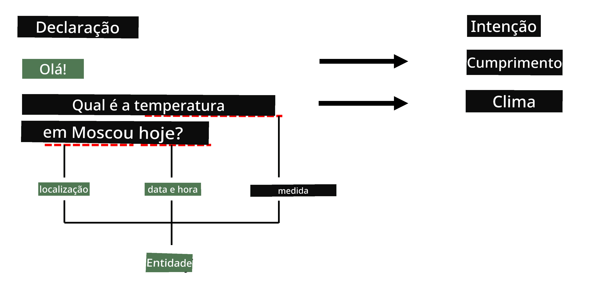
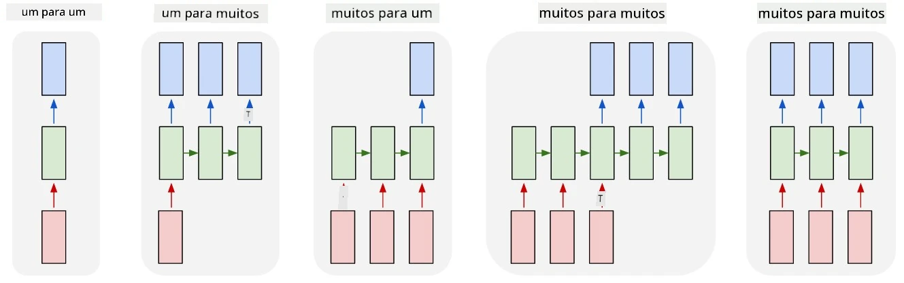

# Reconhecimento de Entidades Nomeadas

Até agora, temos nos concentrado principalmente em uma tarefa de PLN - classificação. No entanto, existem outras tarefas de PLN que podem ser realizadas com redes neurais. Uma dessas tarefas é o **[Reconhecimento de Entidades Nomeadas](https://wikipedia.org/wiki/Named-entity_recognition)** (NER), que trata de reconhecer entidades específicas dentro de um texto, como lugares, nomes de pessoas, intervalos de data e hora, fórmulas químicas e assim por diante.

## [Quiz pré-aula](https://ff-quizzes.netlify.app/en/ai/quiz/37)

## Exemplo de Uso do NER

Suponha que você queira desenvolver um chatbot de linguagem natural, semelhante ao Amazon Alexa ou Google Assistant. A forma como os chatbots inteligentes funcionam é *entendendo* o que o usuário deseja ao realizar a classificação de texto na frase de entrada. O resultado dessa classificação é o chamado **intent**, que determina o que o chatbot deve fazer.

> Imagem do autor

No entanto, o usuário pode fornecer alguns parâmetros como parte da frase. Por exemplo, ao perguntar sobre o clima, ele pode especificar um local ou uma data. Um bot deve ser capaz de entender essas entidades e preencher os parâmetros adequadamente antes de realizar a ação. É exatamente aqui que o NER entra em ação.

> ✅ Outro exemplo seria [analisar artigos científicos médicos](https://soshnikov.com/science/analyzing-medical-papers-with-azure-and-text-analytics-for-health/). Um dos principais aspectos que precisamos buscar são termos médicos específicos, como doenças e substâncias medicinais. Enquanto um pequeno número de doenças pode ser extraído usando busca por substrings, entidades mais complexas, como compostos químicos e nomes de medicamentos, exigem uma abordagem mais sofisticada.

## NER como Classificação de Tokens

Os modelos de NER são essencialmente **modelos de classificação de tokens**, porque para cada um dos tokens de entrada precisamos decidir se ele pertence a uma entidade ou não, e, se pertence, a qual classe de entidade.

Considere o seguinte título de artigo:

**Regurgitação da válvula tricúspide** e **carbonato de lítio** **toxicidade** em um recém-nascido.

As entidades aqui são:

* Regurgitação da válvula tricúspide é uma doença (`DIS`)
* Carbonato de lítio é uma substância química (`CHEM`)
* Toxicidade também é uma doença (`DIS`)

Observe que uma entidade pode abranger vários tokens. E, como neste caso, precisamos distinguir entre duas entidades consecutivas. Assim, é comum usar duas classes para cada entidade - uma especificando o primeiro token da entidade (frequentemente o prefixo `B-` é usado, para **b**eginning/início), e outra - a continuação de uma entidade (`I-`, para **i**nner token/token interno). Também usamos `O` como uma classe para representar todos os **o**utros tokens. Essa marcação de tokens é chamada de [marcação BIO](https://en.wikipedia.org/wiki/Inside%E2%80%93outside%E2%80%93beginning_(tagging)) (ou IOB). Quando marcada, nosso título ficará assim:

Token | Tag
------|-----
Tricuspid | B-DIS
valve | I-DIS
regurgitation | I-DIS
and | O
lithium | B-CHEM
carbonate | I-CHEM
toxicity | B-DIS
in | O
a | O
newborn | O
infant | O
. | O

Como precisamos construir uma correspondência um-para-um entre tokens e classes, podemos treinar um modelo neural **muitos-para-muitos** da seguinte forma:

> *Imagem do [post no blog](http://karpathy.github.io/2015/05/21/rnn-effectiveness/) de [Andrej Karpathy](http://karpathy.github.io/). Os modelos de classificação de tokens NER correspondem à arquitetura de rede mais à direita nesta imagem.*

## Treinando Modelos de NER

Como um modelo de NER é essencialmente um modelo de classificação de tokens, podemos usar RNNs, com os quais já estamos familiarizados, para essa tarefa. Nesse caso, cada bloco da rede recorrente retornará o ID do token. O notebook de exemplo a seguir mostra como treinar um LSTM para classificação de tokens.

## ✍️ Notebooks de Exemplo: NER

Continue seu aprendizado no seguinte notebook:

* [NER com TensorFlow](NER-TF.ipynb)

## Conclusão

Um modelo de NER é um **modelo de classificação de tokens**, o que significa que ele pode ser usado para realizar classificação de tokens. Essa é uma tarefa muito comum em PLN, ajudando a reconhecer entidades específicas dentro de textos, incluindo lugares, nomes, datas e mais.

## 🚀 Desafio

Complete a tarefa vinculada abaixo para treinar um modelo de reconhecimento de entidades nomeadas para termos médicos e, em seguida, experimente em um conjunto de dados diferente.

## [Quiz pós-aula](https://ff-quizzes.netlify.app/en/ai/quiz/38)

## Revisão & Autoestudo

Leia o blog [The Unreasonable Effectiveness of Recurrent Neural Networks](http://karpathy.github.io/2015/05/21/rnn-effectiveness/) e siga a seção de Leitura Adicional nesse artigo para aprofundar seu conhecimento.

## [Tarefa](lab/README.md)

Na tarefa desta lição, você terá que treinar um modelo de reconhecimento de entidades médicas. Você pode começar treinando um modelo LSTM conforme descrito nesta lição e, em seguida, avançar para usar o modelo transformer BERT. Leia [as instruções](lab/README.md) para obter todos os detalhes.

---

