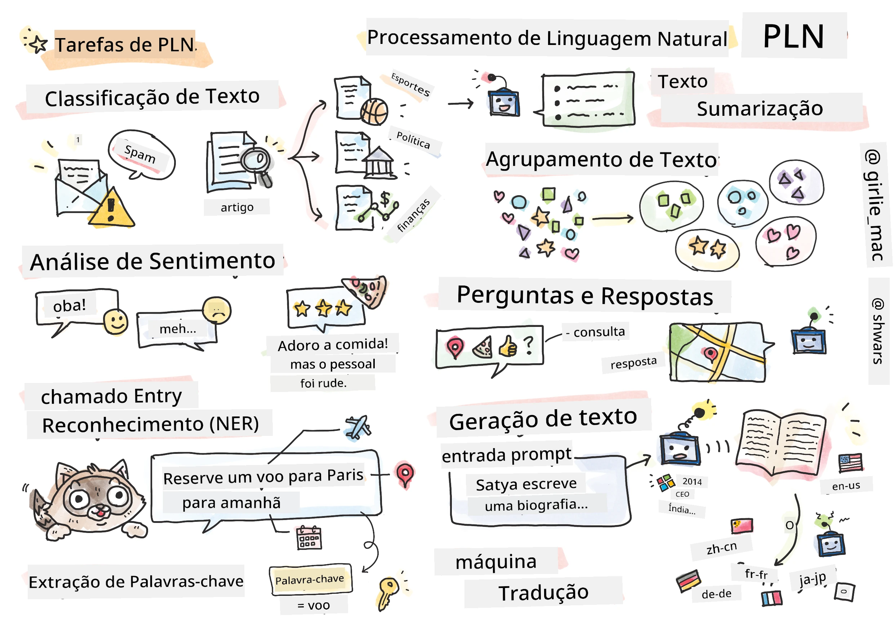

# Processamento de Linguagem Natural



Nesta seção, iremos focar no uso de Redes Neurais para lidar com tarefas relacionadas a **Processamento de Linguagem Natural (PLN)**. Existem muitos problemas de PLN que queremos que os computadores consigam resolver:

* **Classificação de texto** é um problema típico de classificação relacionado a sequências de texto. Exemplos incluem classificar mensagens de e-mail como spam vs. não-spam, ou categorizar artigos como esporte, negócios, política, etc. Além disso, ao desenvolver chatbots, frequentemente precisamos entender o que o usuário quis dizer – nesse caso, estamos lidando com **classificação de intenção**. Muitas vezes, na classificação de intenção, precisamos lidar com muitas categorias.
* **Análise de sentimento** é um problema típico de regressão, onde precisamos atribuir um número (um sentimento) correspondente a quão positivo/negativo é o significado de uma frase. Uma versão mais avançada da análise de sentimento é a **análise de sentimento baseada em aspectos** (ABSA), onde atribuímos sentimento não à frase inteira, mas a diferentes partes dela (aspectos), por exemplo, *Neste restaurante, gostei da culinária, mas a atmosfera estava horrível*.
* **Reconhecimento de Entidades Nomeadas** (NER) refere-se ao problema de extrair certas entidades de um texto. Por exemplo, pode ser necessário entender que na frase *Preciso voar para Paris amanhã* a palavra *amanhã* refere-se a DATA, e *Paris* é um LOCAL.  
* **Extração de palavras-chave** é semelhante ao NER, mas precisamos extrair automaticamente palavras importantes para o significado da frase, sem treinamento prévio para tipos específicos de entidades.
* **Agrupamento de texto** pode ser útil quando queremos agrupar frases similares, por exemplo, pedidos semelhantes em conversas de suporte técnico.
* **Resposta a perguntas** refere-se à capacidade de um modelo responder a uma pergunta específica. O modelo recebe um trecho de texto e uma pergunta como entradas, e precisa indicar onde no texto a resposta está contida (ou, às vezes, gerar o texto da resposta).
* **Geração de texto** é a capacidade de um modelo criar novo texto. Pode ser considerado uma tarefa de classificação que prevê a próxima letra/palavra com base em algum *prompt de texto*. Modelos avançados de geração de texto, como o GPT-3, são capazes de resolver outras tarefas de PLN, como classificação, usando uma técnica chamada [programação de prompt](https://towardsdatascience.com/software-3-0-how-prompting-will-change-the-rules-of-the-game-a982fbfe1e0) ou [engenharia de prompt](https://medium.com/swlh/openai-gpt-3-and-prompt-engineering-dcdc2c5fcd29)
* **Resumir texto** é uma técnica para fazer um computador "ler" textos longos e resumi-los em poucas frases.
* **Tradução automática** pode ser vista como uma combinação de compreensão de texto em um idioma e geração de texto em outro idioma.

Inicialmente, a maioria das tarefas de PLN era resolvida usando métodos tradicionais, como gramáticas. Por exemplo, na tradução automática, analisadores sintáticos eram usados para transformar a frase inicial em uma árvore sintática, depois estruturas semânticas de nível mais alto eram extraídas para representar o significado da frase, e com base nesse significado e na gramática do idioma alvo, o resultado era gerado. Atualmente, muitas tarefas de PLN são resolvidas de forma mais eficaz usando redes neurais.

> Muitos métodos clássicos de PLN são implementados na biblioteca Python [Natural Language Processing Toolkit (NLTK)](https://www.nltk.org). Existe um ótimo [Livro NLTK](https://www.nltk.org/book/) disponível online que cobre como diferentes tarefas de PLN podem ser resolvidas usando o NLTK.

Em nosso curso, focaremos principalmente no uso de Redes Neurais para PLN, e usaremos o NLTK quando necessário.

Já aprendemos sobre uso de redes neurais para lidar com dados tabulares e imagens. A principal diferença entre esses tipos de dados e texto é que o texto é uma sequência de comprimento variável, enquanto o tamanho da entrada no caso de imagens é conhecido antecipadamente. Enquanto redes convolucionais podem extrair padrões dos dados de entrada, padrões em texto são mais complexos. Exemplo: podemos ter uma negação separada do sujeito por um número arbitrário de palavras (ex.: *Eu não gosto de laranjas*, vs. *Eu não gosto daquelas laranjas grandes, coloridas e saborosas*), e isso ainda deve ser interpretado como um padrão único. Assim, para lidar com linguagem precisamos introduzir novos tipos de redes neurais, como *redes recorrentes* e *transformers*.

## Instalar Bibliotecas

Se você estiver usando uma instalação local de Python para executar este curso, talvez precise instalar todas as bibliotecas necessárias para PLN usando os seguintes comandos:

**Para PyTorch**
```bash
pip install -r requirements-pytorch.txt
```
**Para TensorFlow**
```bash
pip install -r requirements-tf.txt
```

> Você pode experimentar PLN com TensorFlow no [Microsoft Learn](https://docs.microsoft.com/learn/modules/intro-natural-language-processing-tensorflow/?WT.mc_id=academic-77998-cacaste)

## Aviso sobre GPU

Nesta seção, em alguns exemplos, estaremos treinando modelos bastante grandes.
* **Use um Computador com GPU**: É recomendável executar seus notebooks em um computador com GPU para reduzir os tempos de espera ao trabalhar com modelos grandes.
* **Limitações de Memória da GPU**: Executar em GPU pode levar a situações em que a memória da GPU esgote, especialmente ao treinar modelos grandes.
* **Consumo de Memória da GPU**: A quantidade de memória da GPU consumida durante o treinamento depende de vários fatores, incluindo o tamanho do minibatch.
* **Minimize o Tamanho do Minibatch**: Se encontrar problemas de memória na GPU, considere reduzir o tamanho do minibatch no seu código como uma solução possível.
* **Liberação de Memória da GPU no TensorFlow**: Versões antigas do TensorFlow podem não liberar a memória da GPU corretamente ao treinar múltiplos modelos em um mesmo kernel Python. Para gerenciar o uso da memória da GPU de forma eficaz, você pode configurar o TensorFlow para alocar memória na GPU apenas conforme necessário.
* **Inclusão de Código**: Para configurar o TensorFlow para aumentar a alocação de memória da GPU somente quando necessário, inclua o código abaixo em seus notebooks:

```python
physical_devices = tf.config.list_physical_devices('GPU') 
if len(physical_devices)>0:
    tf.config.experimental.set_memory_growth(physical_devices[0], True) 
```

Se você tem interesse em aprender sobre PLN a partir de uma perspectiva clássica de ML, visite [este conjunto de lições](https://github.com/microsoft/ML-For-Beginners/tree/main/6-NLP)

## Nesta Seção
Nesta seção vamos aprender sobre:

* [Representando texto como tensores](13-TextRep/README.md)
* [Word Embeddings](14-Embeddings/README.md)
* [Modelagem de Linguagem](15-LanguageModeling/README.md)
* [Redes Neurais Recorrentes](16-RNN/README.md)
* [Redes Generativas](17-GenerativeNetworks/README.md)
* [Transformers](18-Transformers/README.md)

---

<!-- CO-OP TRANSLATOR DISCLAIMER START -->
**Aviso Legal**:
Este documento foi traduzido usando o serviço de tradução por IA [Co-op Translator](https://github.com/Azure/co-op-translator). Embora nos esforcemos pela precisão, por favor, esteja ciente de que traduções automatizadas podem conter erros ou imprecisões. O documento original em seu idioma nativo deve ser considerado a fonte autorizada. Para informações críticas, recomenda-se tradução profissional humana. Não nos responsabilizamos por quaisquer mal-entendidos ou interpretações incorretas decorrentes do uso desta tradução.
<!-- CO-OP TRANSLATOR DISCLAIMER END -->