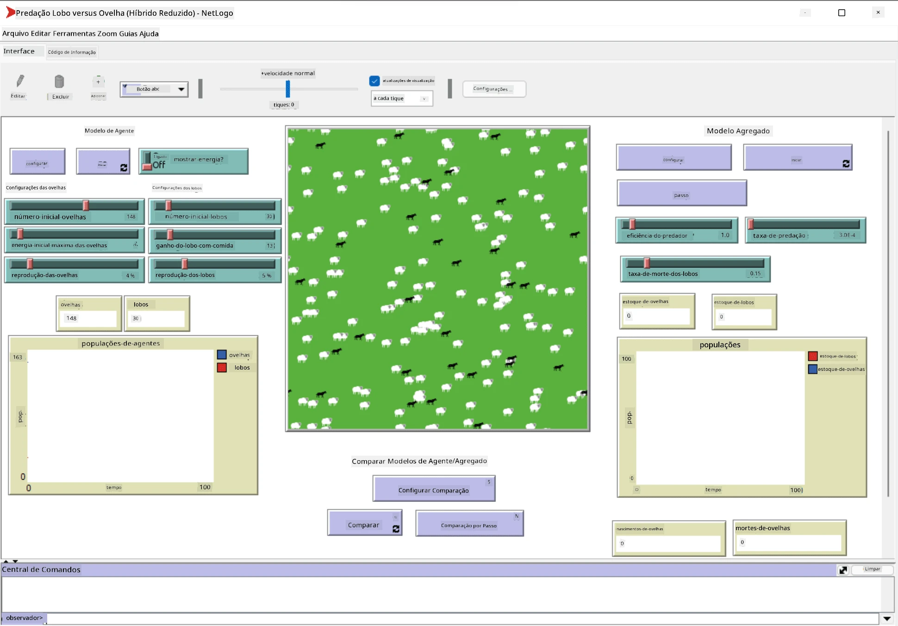

# Sistemas Multiagentes

Uma das formas possíveis de alcançar inteligência é a chamada abordagem **emergente** (ou **sinergética**), que se baseia no fato de que o comportamento combinado de muitos agentes relativamente simples pode resultar em um comportamento geral mais complexo (ou inteligente) do sistema como um todo. Teoricamente, isso se baseia nos princípios de [Inteligência Coletiva](https://en.wikipedia.org/wiki/Collective_intelligence), [Emergentismo](https://en.wikipedia.org/wiki/Global_brain) e [Cibernética Evolutiva](https://en.wikipedia.org/wiki/Global_brain), que afirmam que sistemas de nível superior ganham algum tipo de valor agregado quando são devidamente combinados a partir de sistemas de nível inferior (o chamado *princípio da transição de metasistema*).

## [Quiz pré-aula](https://ff-quizzes.netlify.app/en/ai/quiz/45)

A direção dos **Sistemas Multiagentes** surgiu na IA na década de 1990 como uma resposta ao crescimento da Internet e dos sistemas distribuídos. Um dos livros clássicos de IA, [Artificial Intelligence: A Modern Approach](https://en.wikipedia.org/wiki/Artificial_Intelligence:_A_Modern_Approach), foca na visão da IA clássica do ponto de vista dos sistemas multiagentes.

Central para a abordagem multiagente é a noção de **Agente** - uma entidade que vive em algum **ambiente**, que pode perceber e agir sobre ele. Esta é uma definição muito ampla, e pode haver muitos tipos e classificações diferentes de agentes:

* Pela sua capacidade de raciocinar:
   - Agentes **reativos** geralmente têm um comportamento simples de solicitação-resposta
   - Agentes **deliberativos** empregam algum tipo de raciocínio lógico e/ou capacidades de planejamento
* Pelo local onde o agente executa seu código:
   - Agentes **estáticos** trabalham em um nó de rede dedicado
   - Agentes **móveis** podem mover seu código entre nós de rede
* Pelo seu comportamento:
   - Agentes **passivos** não têm objetivos específicos. Esses agentes podem reagir a estímulos externos, mas não iniciam ações por conta própria.
   - Agentes **ativos** têm alguns objetivos que perseguem
   - Agentes **cognitivos** envolvem planejamento e raciocínio complexos

Os sistemas multiagentes são atualmente usados em várias aplicações:

* Em jogos, muitos personagens não jogáveis empregam algum tipo de IA e podem ser considerados agentes inteligentes
* Na produção de vídeos, renderizar cenas 3D complexas que envolvem multidões geralmente é feito usando simulação multiagente
* Na modelagem de sistemas, a abordagem multiagente é usada para simular o comportamento de um modelo complexo. Por exemplo, a abordagem multiagente foi usada com sucesso para prever a disseminação da COVID-19 em todo o mundo. Abordagens semelhantes podem ser usadas para modelar o tráfego em uma cidade e ver como ele reage a mudanças nas regras de trânsito.
* Em sistemas de automação complexos, cada dispositivo pode atuar como um agente independente, tornando o sistema como um todo menos monolítico e mais robusto.

Não vamos gastar muito tempo nos aprofundando em sistemas multiagentes, mas vamos considerar um exemplo de **Modelagem Multiagente**.

## NetLogo

[NetLogo](https://ccl.northwestern.edu/netlogo/) é um ambiente de modelagem multiagente baseado em uma versão modificada da linguagem de programação [Logo](https://en.wikipedia.org/wiki/Logo_(programming_language)). Essa linguagem foi desenvolvida para ensinar conceitos de programação a crianças e permite controlar um agente chamado **tartaruga**, que pode se mover deixando um rastro. Isso permite criar figuras geométricas complexas, sendo uma forma muito visual de entender o comportamento de um agente.

No NetLogo, podemos criar muitas tartarugas usando o comando `create-turtles`. Podemos então comandar todas as tartarugas para realizar algumas ações (no exemplo abaixo - mover 10 pontos para frente):

```
create-turtles 10
ask turtles [
  forward 10
]
```

Claro, não é interessante quando todas as tartarugas fazem a mesma coisa, então podemos `ask` grupos de tartarugas, por exemplo, aquelas que estão nas proximidades de um determinado ponto. Também podemos criar tartarugas de diferentes *raças* usando o comando `breed [cats cat]`. Aqui `cat` é o nome de uma raça, e precisamos especificar tanto a palavra no singular quanto no plural, porque diferentes comandos usam formas diferentes para maior clareza.

> ✅ Não entraremos no aprendizado da linguagem NetLogo em si - você pode visitar o excelente recurso [Beginner's Interactive NetLogo Dictionary](https://ccl.northwestern.edu/netlogo/bind/) se estiver interessado em aprender mais.

Você pode [baixar](https://ccl.northwestern.edu/netlogo/download.shtml) e instalar o NetLogo para experimentá-lo.

### Biblioteca de Modelos

Uma grande vantagem do NetLogo é que ele contém uma biblioteca de modelos funcionais que você pode experimentar. Vá para **File &rightarrow; Models Library**, e você terá muitas categorias de modelos para escolher.


> Uma captura de tela da biblioteca de modelos por Dmitry Soshnikov

Você pode abrir um dos modelos, por exemplo **Biology &rightarrow; Flocking**.

### Princípios Básicos

Após abrir o modelo, você será levado à tela principal do NetLogo. Aqui está um modelo de exemplo que descreve a população de lobos e ovelhas, considerando recursos finitos (grama).



> Captura de tela por Dmitry Soshnikov

Nesta tela, você pode ver:

* A seção **Interface**, que contém:
  - O campo principal, onde todos os agentes vivem
  - Diferentes controles: botões, sliders, etc.
  - Gráficos que você pode usar para exibir parâmetros da simulação
* A aba **Code**, que contém o editor onde você pode digitar o programa NetLogo

Na maioria dos casos, a interface terá um botão **Setup**, que inicializa o estado da simulação, e um botão **Go**, que inicia a execução. Esses são manipulados por handlers correspondentes no código que se parecem com isto:

```
to go [
...
]
```

O mundo do NetLogo consiste nos seguintes objetos:

* **Agentes** (tartarugas) que podem se mover pelo campo e fazer algo. Você comanda os agentes usando a sintaxe `ask turtles [...]`, e o código entre colchetes é executado por todos os agentes no *modo tartaruga*.
* **Patches** são áreas quadradas do campo onde os agentes vivem. Você pode se referir a todos os agentes no mesmo patch ou pode alterar as cores do patch e algumas outras propriedades. Você também pode `ask patches` para fazer algo.
* **Observer** é um agente único que controla o mundo. Todos os handlers de botões são executados no *modo observador*.

> ✅ A beleza de um ambiente multiagente é que o código que roda no modo tartaruga ou no modo patch é executado ao mesmo tempo por todos os agentes em paralelo. Assim, ao escrever um pouco de código e programar o comportamento de um agente individual, você pode criar um comportamento complexo do sistema de simulação como um todo.

### Flocking

Como exemplo de comportamento multiagente, vamos considerar o **[Flocking](https://en.wikipedia.org/wiki/Flocking_(behavior))**. Flocking é um padrão complexo muito semelhante ao modo como bandos de pássaros voam. Observando-os voar, você pode pensar que eles seguem algum tipo de algoritmo coletivo ou que possuem alguma forma de *inteligência coletiva*. No entanto, esse comportamento complexo surge quando cada agente individual (neste caso, um *pássaro*) apenas observa alguns outros agentes em uma curta distância e segue três regras simples:

* **Alinhamento** - direciona-se para a direção média dos agentes vizinhos
* **Coesão** - tenta direcionar-se para a posição média dos vizinhos (*atração de longo alcance*)
* **Separação** - ao se aproximar muito de outros pássaros, tenta se afastar (*repulsão de curto alcance*)

Você pode executar o exemplo de flocking e observar o comportamento. Também pode ajustar parâmetros, como o *grau de separação* ou o *alcance de visão*, que define quão longe cada pássaro pode enxergar. Note que, se você diminuir o alcance de visão para 0, todos os pássaros ficam cegos e o flocking para. Se você diminuir a separação para 0, todos os pássaros se agrupam em uma linha reta.

> ✅ Mude para a aba **Code** e veja onde as três regras de flocking (alinhamento, coesão e separação) são implementadas no código. Note como nos referimos apenas aos agentes que estão à vista.

### Outros Modelos para Ver

Há alguns modelos interessantes que você pode experimentar:

* **Art &rightarrow; Fireworks** mostra como um fogo de artifício pode ser considerado um comportamento coletivo de fluxos individuais de fogo
* **Social Science &rightarrow; Traffic Basic** e **Social Science &rightarrow; Traffic Grid** mostram o modelo de tráfego urbano em uma grade 1D e 2D com ou sem semáforos. Cada carro na simulação segue as seguintes regras:
   - Se o espaço à frente estiver vazio - acelere (até uma certa velocidade máxima)
   - Se vir um obstáculo à frente - freie (e você pode ajustar o quão longe o motorista pode enxergar)
* **Social Science &rightarrow; Party** mostra como as pessoas se agrupam durante uma festa de coquetel. Você pode encontrar a combinação de parâmetros que leva ao aumento mais rápido da felicidade do grupo.

Como você pode ver nesses exemplos, simulações multiagentes podem ser uma forma bastante útil de entender o comportamento de um sistema complexo composto por indivíduos que seguem a mesma lógica ou lógica semelhante. Também pode ser usado para controlar agentes virtuais, como [NPCs](https://en.wikipedia.org/wiki/NPC) em jogos de computador ou agentes em mundos animados em 3D.

## Agentes Deliberativos

Os agentes descritos acima são muito simples, reagindo às mudanças no ambiente usando algum tipo de algoritmo. Como tal, eles são **agentes reativos**. No entanto, às vezes os agentes podem raciocinar e planejar suas ações, caso em que são chamados de **deliberativos**.

Um exemplo típico seria um agente pessoal que recebe uma instrução de um humano para reservar um pacote de férias. Suponha que existam muitos agentes que vivem na internet e podem ajudá-lo. Ele deve então entrar em contato com outros agentes para ver quais voos estão disponíveis, quais são os preços dos hotéis para diferentes datas e tentar negociar o melhor preço. Quando o plano de férias estiver completo e confirmado pelo proprietário, ele pode prosseguir com a reserva.

Para fazer isso, os agentes precisam **comunicar-se**. Para uma comunicação bem-sucedida, eles precisam:

* De algumas **linguagens padrão para troca de conhecimento**, como [Knowledge Interchange Format](https://en.wikipedia.org/wiki/Knowledge_Interchange_Format) (KIF) e [Knowledge Query and Manipulation Language](https://en.wikipedia.org/wiki/Knowledge_Query_and_Manipulation_Language) (KQML). Essas linguagens são projetadas com base na [Teoria dos Atos de Fala](https://en.wikipedia.org/wiki/Speech_act).
* Essas linguagens também devem incluir alguns **protocolos de negociação**, baseados em diferentes **tipos de leilão**.
* Uma **ontologia comum** para usar, de modo que se refiram aos mesmos conceitos conhecendo sua semântica
* Uma maneira de **descobrir** o que diferentes agentes podem fazer, também baseada em algum tipo de ontologia

Agentes deliberativos são muito mais complexos do que reativos, porque não apenas reagem às mudanças no ambiente, mas também devem ser capazes de *iniciar* ações. Uma das arquiteturas propostas para agentes deliberativos é o chamado agente de Crença-Desejo-Intenção (BDI):

* **Crenças** formam um conjunto de conhecimento sobre o ambiente do agente. Pode ser estruturado como uma base de conhecimento ou conjunto de regras que um agente pode aplicar a uma situação específica no ambiente.
* **Desejos** definem o que um agente quer fazer, ou seja, seus objetivos. Por exemplo, o objetivo do agente assistente pessoal acima é reservar um pacote de férias, e o objetivo de um agente de hotel é maximizar o lucro.
* **Intenções** são ações específicas que um agente planeja para alcançar seus objetivos. As ações geralmente mudam o ambiente e causam comunicação com outros agentes.

Existem algumas plataformas disponíveis para construir sistemas multiagentes, como [JADE](https://jade.tilab.com/). [Este artigo](https://arxiv.org/ftp/arxiv/papers/2007/2007.08961.pdf) contém uma revisão das plataformas multiagentes, juntamente com um breve histórico dos sistemas multiagentes e seus diferentes cenários de uso.

## Conclusão

Sistemas Multiagentes podem assumir formas muito diferentes e ser usados em muitas aplicações diferentes. 
Eles tendem a focar no comportamento mais simples de um agente individual e alcançar um comportamento mais complexo do sistema geral devido ao **efeito sinergético**.

## 🚀 Desafio

Leve esta lição para o mundo real e tente conceituar um sistema multiagente que possa resolver um problema. O que, por exemplo, um sistema multiagente precisaria fazer para otimizar a rota de um ônibus escolar? Como ele poderia funcionar em uma padaria?

## [Quiz pós-aula](https://ff-quizzes.netlify.app/en/ai/quiz/46)

## Revisão e Autoestudo

Revise o uso desse tipo de sistema na indústria. Escolha um domínio, como manufatura ou a indústria de videogames, e descubra como sistemas multiagentes podem ser usados para resolver problemas únicos.

## [Tarefa NetLogo](assignment.md)

---

