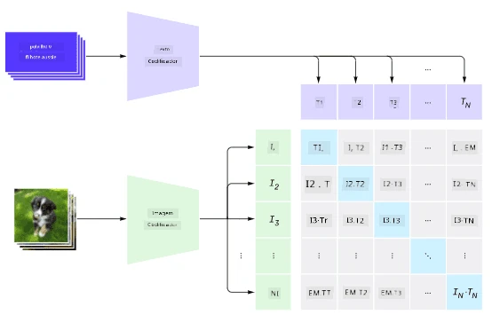

# Redes Multi-Modais

Após o sucesso dos modelos transformers na resolução de tarefas de PLN, as mesmas ou similares arquiteturas foram aplicadas a tarefas de visão computacional. Há um interesse crescente em construir modelos que *combinem* capacidades de visão e linguagem natural. Uma dessas tentativas foi realizada pela OpenAI, chamada CLIP e DALL.E.

## Treinamento Contrastivo de Imagens (CLIP)

A ideia principal do CLIP é ser capaz de comparar descrições textuais com uma imagem e determinar o quão bem a imagem corresponde à descrição.

> *Imagem retirada [deste post no blog](https://openai.com/blog/clip/)*

O modelo é treinado com imagens obtidas da Internet e suas legendas. Para cada lote, pegamos N pares de (imagem, texto) e os convertemos em representações vetoriais I e T. Essas representações são então comparadas entre si. A função de perda é definida para maximizar a similaridade cosseno entre os vetores correspondentes a um par (por exemplo, I e T) e minimizar a similaridade cosseno entre todos os outros pares. É por isso que essa abordagem é chamada de **contrastiva**.

A biblioteca/modelo CLIP está disponível no [GitHub da OpenAI](https://github.com/openai/CLIP). A abordagem é descrita [neste post no blog](https://openai.com/blog/clip/) e em mais detalhes [neste artigo](https://arxiv.org/pdf/2103.00020.pdf).

Uma vez que este modelo é pré-treinado, podemos fornecer a ele um lote de imagens e um lote de descrições textuais, e ele retornará um tensor com probabilidades. O CLIP pode ser usado para várias tarefas:

**Classificação de Imagens**

Suponha que precisamos classificar imagens entre, por exemplo, gatos, cachorros e humanos. Nesse caso, podemos fornecer ao modelo uma imagem e uma série de descrições textuais: "*uma foto de um gato*", "*uma foto de um cachorro*", "*uma foto de um humano*". No vetor resultante de 3 probabilidades, basta selecionar o índice com o maior valor.

> *Imagem retirada [deste post no blog](https://openai.com/blog/clip/)*

**Busca de Imagens Baseada em Texto**

Também podemos fazer o oposto. Se tivermos uma coleção de imagens, podemos passar essa coleção para o modelo, juntamente com uma descrição textual, e ele nos dará a imagem mais semelhante à descrição fornecida.

## ✍️ Exemplo: [Usando CLIP para Classificação de Imagens e Busca de Imagens](../../../../../lessons/X-Extras/X1-MultiModal/Clip.ipynb)

Abra o notebook [Clip.ipynb](../../../../../lessons/X-Extras/X1-MultiModal/Clip.ipynb) para ver o CLIP em ação.

## Geração de Imagens com VQGAN+CLIP

O CLIP também pode ser usado para **geração de imagens** a partir de uma descrição textual. Para isso, precisamos de um **modelo gerador** que seja capaz de gerar imagens com base em algum vetor de entrada. Um desses modelos é chamado [VQGAN](https://compvis.github.io/taming-transformers/) (Vector-Quantized GAN).

As principais ideias do VQGAN que o diferenciam de um [GAN](../../4-ComputerVision/10-GANs/README.md) tradicional são as seguintes:
* Uso de uma arquitetura transformer autorregressiva para gerar uma sequência de partes visuais ricas em contexto que compõem a imagem. Essas partes visuais, por sua vez, são aprendidas por uma [CNN](../../4-ComputerVision/07-ConvNets/README.md).
* Uso de um discriminador de sub-imagens que detecta se partes da imagem são "reais" ou "falsas" (diferente da abordagem "tudo ou nada" nos GANs tradicionais).

Saiba mais sobre o VQGAN no site [Taming Transformers](https://compvis.github.io/taming-transformers/).

Uma das diferenças importantes entre o VQGAN e um GAN tradicional é que o último pode produzir uma imagem decente a partir de qualquer vetor de entrada, enquanto o VQGAN provavelmente produzirá uma imagem incoerente. Assim, precisamos orientar ainda mais o processo de criação da imagem, e isso pode ser feito usando o CLIP.

Para gerar uma imagem correspondente a uma descrição textual, começamos com algum vetor de codificação aleatório que é passado pelo VQGAN para produzir uma imagem. Em seguida, o CLIP é usado para produzir uma função de perda que mostra o quão bem a imagem corresponde à descrição textual. O objetivo, então, é minimizar essa perda, usando retropropagação para ajustar os parâmetros do vetor de entrada.

Uma ótima biblioteca que implementa o VQGAN+CLIP é o [Pixray](http://github.com/pixray/pixray).

 |   | 
----|----|----
Imagem gerada a partir da descrição *um retrato em aquarela de um jovem professor de literatura com um livro* | Imagem gerada a partir da descrição *um retrato a óleo de uma jovem professora de ciência da computação com um computador* | Imagem gerada a partir da descrição *um retrato a óleo de um velho professor de matemática em frente a um quadro-negro*

> Imagens da coleção **Artificial Teachers** por [Dmitry Soshnikov](http://soshnikov.com)

## DALL-E
### [DALL-E 1](https://openai.com/research/dall-e)
O DALL-E é uma versão do GPT-3 treinada para gerar imagens a partir de descrições textuais. Ele foi treinado com 12 bilhões de parâmetros.

Diferentemente do CLIP, o DALL-E recebe tanto texto quanto imagem como um único fluxo de tokens para ambos. Assim, a partir de múltiplas descrições, é possível gerar imagens baseadas no texto.

### [DALL-E 2](https://openai.com/dall-e-2)
A principal diferença entre o DALL-E 1 e o 2 é que o último gera imagens e artes mais realistas.

Exemplos de imagens geradas com o DALL-E:
 |   | 
----|----|----
Imagem gerada a partir da descrição *um retrato em aquarela de um jovem professor de literatura com um livro* | Imagem gerada a partir da descrição *um retrato a óleo de uma jovem professora de ciência da computação com um computador* | Imagem gerada a partir da descrição *um retrato a óleo de um velho professor de matemática em frente a um quadro-negro*

## Referências

* Artigo do VQGAN: [Taming Transformers for High-Resolution Image Synthesis](https://compvis.github.io/taming-transformers/paper/paper.pdf)
* Artigo do CLIP: [Learning Transferable Visual Models From Natural Language Supervision](https://arxiv.org/pdf/2103.00020.pdf)

**Aviso Legal**:  
Este documento foi traduzido utilizando o serviço de tradução por IA [Co-op Translator](https://github.com/Azure/co-op-translator). Embora nos esforcemos para garantir a precisão, esteja ciente de que traduções automatizadas podem conter erros ou imprecisões. O documento original em seu idioma nativo deve ser considerado a fonte autoritária. Para informações críticas, recomenda-se a tradução profissional realizada por humanos. Não nos responsabilizamos por quaisquer mal-entendidos ou interpretações equivocadas decorrentes do uso desta tradução.