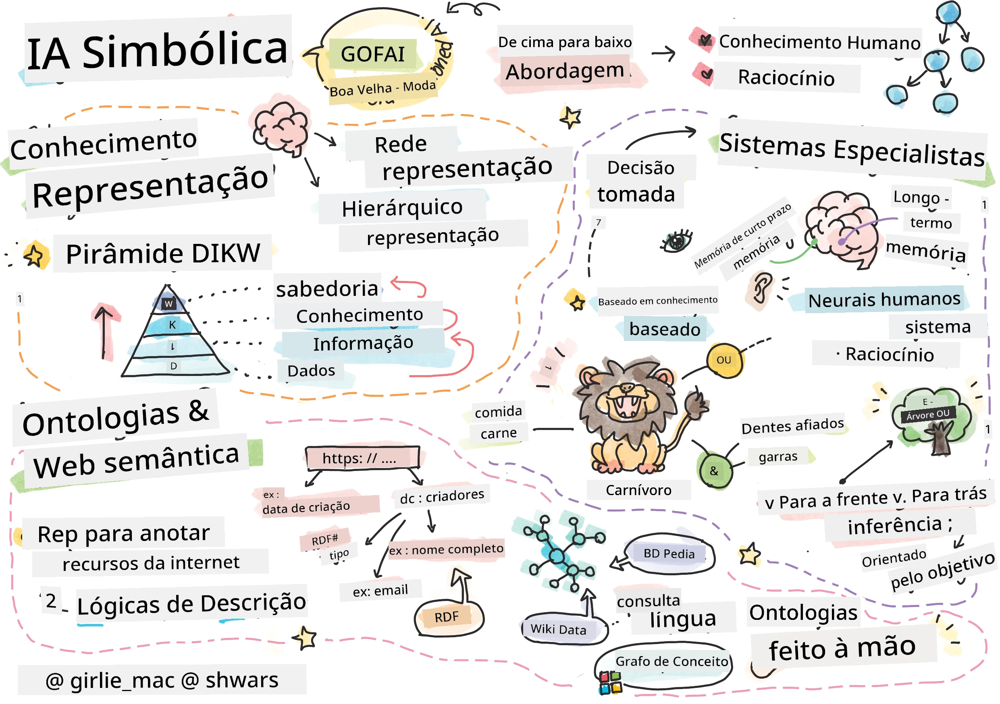
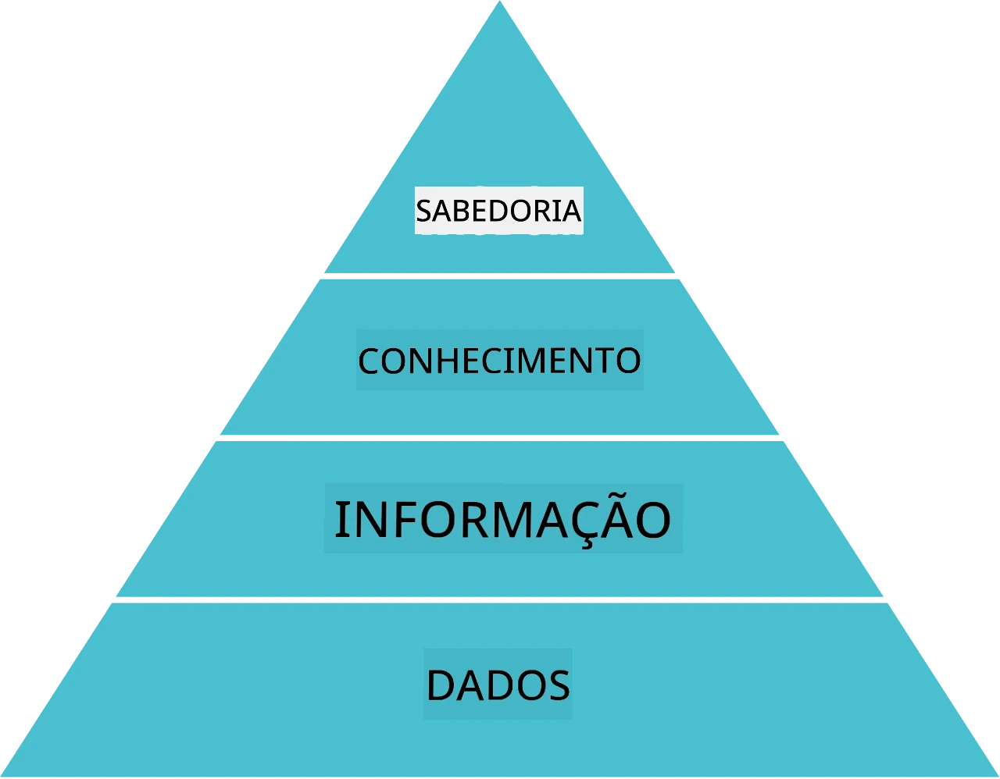
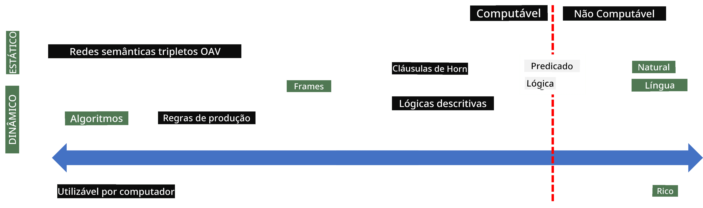
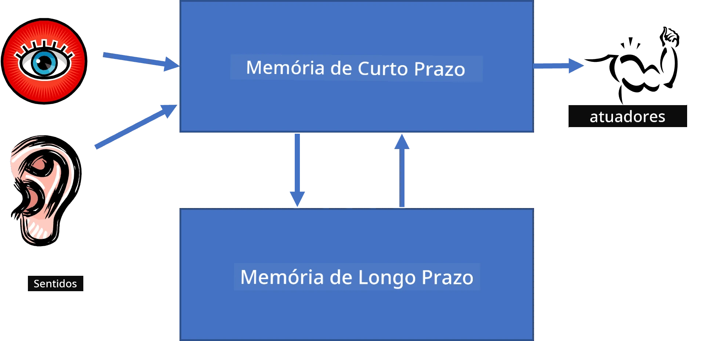
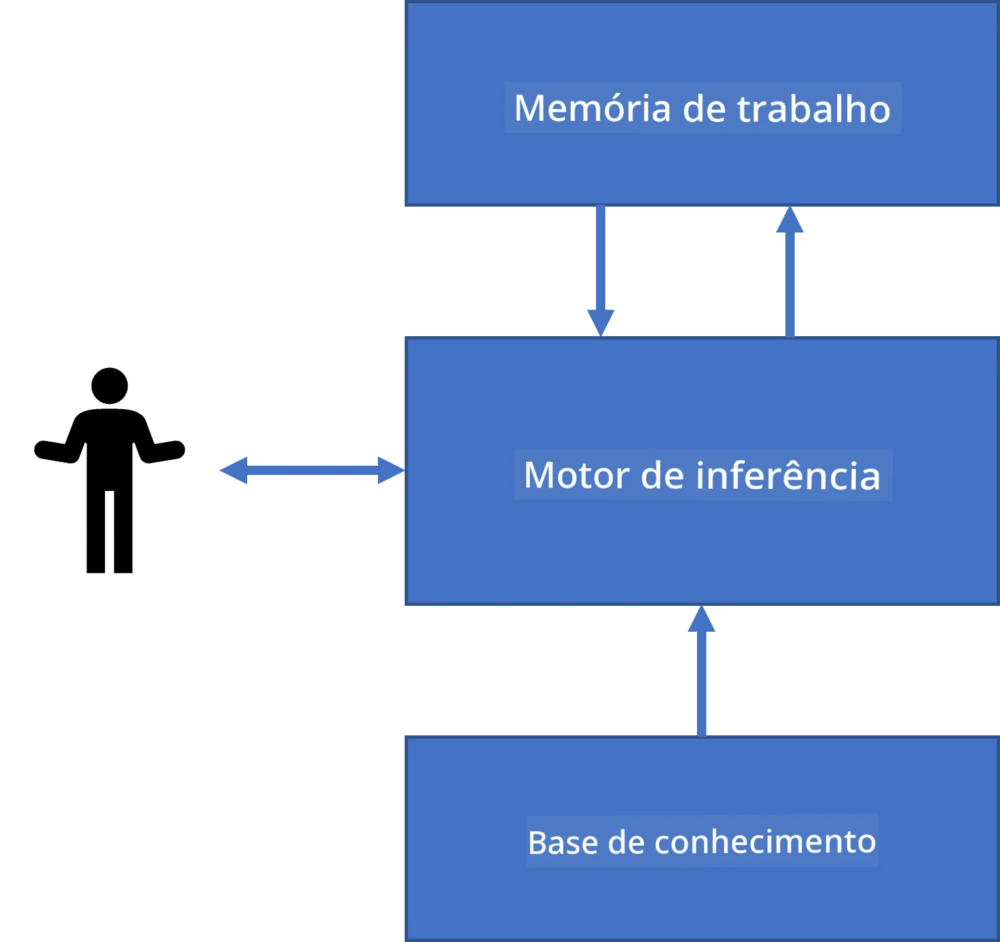
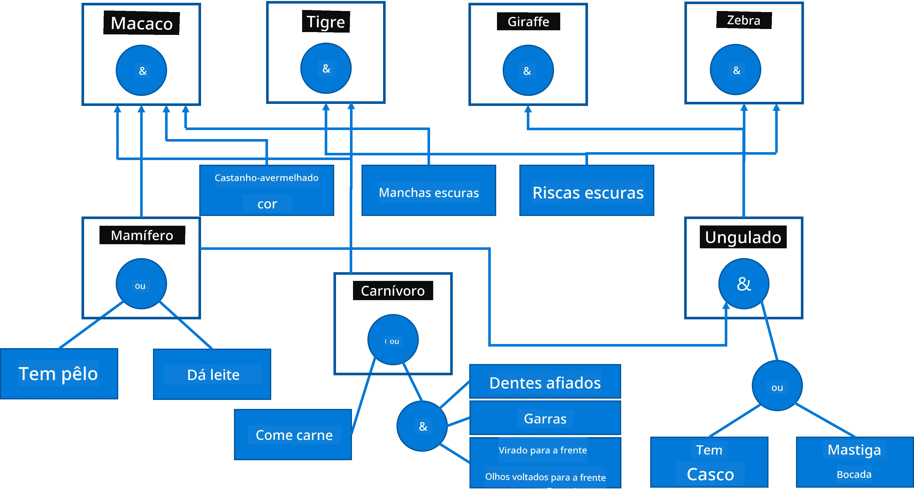
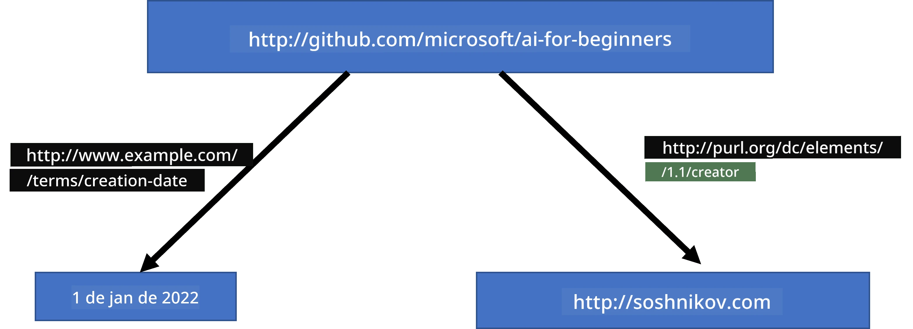
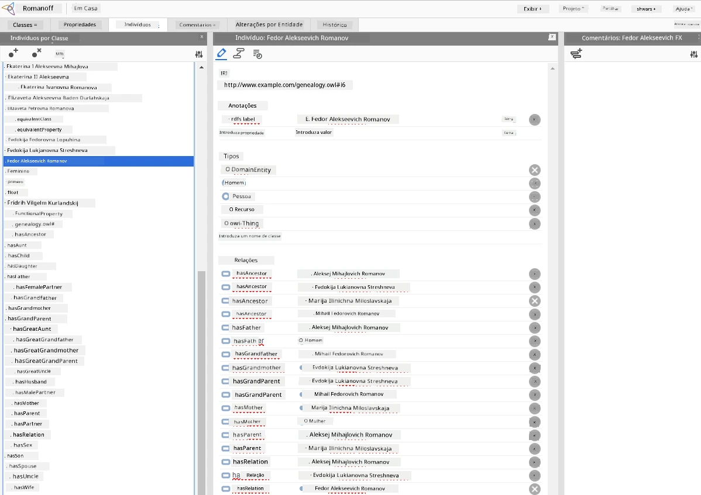

# Representação do Conhecimento e Sistemas Especialistas



> Sketchnote por [Tomomi Imura](https://twitter.com/girlie_mac)

A busca pela inteligência artificial baseia-se na procura por conhecimento, para compreender o mundo de forma semelhante aos humanos. Mas como é que se pode fazer isso?

## [Questionário pré-aula](https://ff-quizzes.netlify.app/en/ai/quiz/3)

Nos primeiros tempos da IA, a abordagem top-down para criar sistemas inteligentes (discutida na aula anterior) era popular. A ideia era extrair o conhecimento das pessoas para alguma forma legível por máquina, e depois usá-lo para resolver problemas automaticamente. Esta abordagem baseava-se em duas grandes ideias:

* Representação do Conhecimento
* Raciocínio

## Representação do Conhecimento

Um dos conceitos importantes na IA Simbólica é o **conhecimento**. É importante diferenciar conhecimento de *informação* ou *dados*. Por exemplo, pode-se dizer que os livros contêm conhecimento, porque se pode estudar livros e tornar-se perito. No entanto, o que os livros realmente contêm são chamados *dados*, e ao ler livros e integrar esses dados no nosso modelo do mundo, convertemos esses dados em conhecimento.

> ✅ **Conhecimento** é algo que está contido na nossa cabeça e representa a nossa compreensão do mundo. É obtido por um processo ativo de **aprendizagem**, que integra peças de informação que recebemos no nosso modelo ativo do mundo.

Na maior parte das vezes, não definimos conhecimento de forma rigorosa, mas alinhamos com outros conceitos relacionados usando a [Pirâmide DIKW](https://en.wikipedia.org/wiki/DIKW_pyramid). Esta contém os seguintes conceitos:

* **Dados** são algo representado em suporte físico, como texto escrito ou palavras faladas. Os dados existem independentemente dos seres humanos e podem ser passados entre pessoas.
* **Informação** é como interpretamos os dados na nossa mente. Por exemplo, quando ouvimos a palavra *computador*, temos alguma compreensão do que é.
* **Conhecimento** é a informação integrada no nosso modelo do mundo. Por exemplo, uma vez que aprendemos o que é um computador, começamos a ter algumas ideias sobre como funciona, quanto custa e para que pode ser usado. Esta rede de conceitos inter-relacionados forma o nosso conhecimento.
* **Sabedoria** é mais um nível da nossa compreensão do mundo, representando *meta-conhecimento*, por exemplo, alguma noção de como e quando o conhecimento deve ser utilizado.



*Imagem [da Wikipedia](https://commons.wikimedia.org/w/index.php?curid=37705247), por Longlivetheux - Trabalho próprio, CC BY-SA 4.0*

Assim, o problema da **representação do conhecimento** é encontrar uma forma eficaz de representar conhecimento dentro de um computador sob a forma de dados, para que possa ser utilizado automaticamente. Isto pode ser visto como um espectro:



> Imagem por [Dmitry Soshnikov](http://soshnikov.com)

* À esquerda, existem tipos muito simples de representações de conhecimento que podem ser eficazmente usados por computadores. A mais simples é a algorítmica, quando o conhecimento é representado por um programa de computador. No entanto, esta não é a melhor forma de representar conhecimento, porque não é flexível. O conhecimento dentro da nossa cabeça é frequentemente não algorítmico.
* À direita, existem representações como texto natural. É a mais poderosa, mas não pode ser usada para raciocínio automático.

> ✅ Pense por um minuto em como representa o conhecimento na sua cabeça e o converte em notas. Existe algum formato particular que funcione bem para ajudar na retenção?

## Classificação dos Métodos de Representação de Conhecimento em Computadores

Podemos classificar os diferentes métodos de representação de conhecimento computacional nas seguintes categorias:

* **Representações em rede** baseiam-se no facto de termos uma rede de conceitos inter-relacionados dentro da nossa cabeça. Podemos tentar reproduzir as mesmas redes como um grafo dentro de um computador – a chamada **rede semântica**.

1. **Triplos Objeto-Atributo-Valor** ou **pares atributo-valor**. Como um grafo pode ser representado dentro de um computador como uma lista de nós e ligações, podemos representar uma rede semântica por uma lista de triplos, contendo objetos, atributos e valores. Por exemplo, criamos os seguintes triplos sobre linguagens de programação:

Objeto | Atributo | Valor
-------|----------|-------
Python | é | Linguagem Não Tipada
Python | inventado-por | Guido van Rossum
Python | sintaxe-bloco | indentação
Linguagem Não Tipada | não tem | definições de tipo

> ✅ Pense como os triplos podem ser usados para representar outros tipos de conhecimento.

2. **Representações hierárquicas** enfatizam o facto de criarmos frequentemente uma hierarquia de objetos dentro da nossa cabeça. Por exemplo, sabemos que canário é um pássaro, e que todos os pássaros têm asas. Também temos alguma ideia da cor que um canário normalmente tem e da sua velocidade de voo.

   - **Representação por quadros** baseia-se em representar cada objeto ou classe de objetos como um **quadro** que contém **espaços (slots)**. Os espaços têm valores padrão possíveis, restrições de valor ou procedimentos armazenados que podem ser chamados para obter o valor de um espaço. Todos os quadros formam uma hierarquia semelhante a uma hierarquia de objetos em linguagens de programação orientadas a objetos.
   - **Cenários** são um tipo especial de quadros que representam situações complexas que podem desenvolver-se no tempo.

**Python**

Espaço | Valor | Valor padrão | Intervalo |
-------|-------|--------------|-----------|
Nome | Python | | |
É-Um | Linguagem Não Tipada | | |
Caso Variável | | CamelCase | |
Comprimento do Programa | | | 5-5000 linhas |
Sintaxe de Bloco | Indentação | | |

3. **Representações procedurais** são baseadas em representar conhecimento por uma lista de ações que podem ser executadas quando uma certa condição ocorre.
   - Regras de produção são sentenças do tipo se-então que permitem tirar conclusões. Por exemplo, um médico pode ter uma regra que diz que **SE** um paciente tem febre alta **OU** nível elevado de proteína C-reativa no exame sanguíneo **ENTÃO** ele tem uma inflamação. Uma vez que surge uma das condições, podemos concluir a inflamação, e depois usar isso em raciocínios posteriores.
   - Algoritmos podem ser considerados outra forma de representação procedural, embora quase nunca sejam usados diretamente em sistemas baseados em conhecimento.

4. **Lógica** foi originalmente proposta por Aristóteles como uma forma de representar o conhecimento universal humano.
   - A Lógica de Predicados como teoria matemática é demasiado rica para ser computável, portanto usa-se normalmente algum subconjunto dela, como as cláusulas de Horn usadas em Prolog.
   - A Lógica Descritiva é uma família de sistemas lógicos usados para representar e raciocinar sobre hierarquias de objetos em representações de conhecimento distribuído, como a *web semântica*.

## Sistemas Especialistas

Um dos primeiros sucessos da IA simbólica foram os chamados **sistemas especialistas** – sistemas computacionais desenhados para agir como um especialista num domínio de problema limitado. Eram baseados numa **base de conhecimento** extraída de um ou mais especialistas humanos, e continham um **mecanismo de inferência** que realizava algum raciocínio sobre ela.

 | 
---------------------------------------------|-----------------------------------------------
Estrutura simplificada do sistema neural humano | Arquitetura de um sistema baseado em conhecimento

Os sistemas especialistas são construídos como o sistema de raciocínio humano, que contém **memória de curto prazo** e **memória de longo prazo**. Igualmente, em sistemas baseados em conhecimento distinguimos os seguintes componentes:

* **Memória do problema**: contém o conhecimento sobre o problema que está a ser atualmente resolvido, isto é, a temperatura ou pressão arterial de um paciente, se tem inflamação ou não, etc. Este conhecimento é também chamado **conhecimento estático**, porque contém uma fotografia do que sabemos atualmente sobre o problema – o chamado *estado do problema*.
* **Base de conhecimento**: representa o conhecimento de longo prazo sobre um domínio de problema. É extraída manualmente de especialistas humanos e não muda de consulta para consulta. Porque permite navegar de um estado do problema para outro, também é chamada **conhecimento dinâmico**.
* **Mecanismo de inferência**: orquestra todo o processo de busca no espaço de estados do problema, fazendo perguntas ao utilizador quando necessário. É também responsável por encontrar as regras certas a aplicar em cada estado.

Como exemplo, vamos considerar o seguinte sistema especialista para determinar um animal baseado nas suas características físicas:



> Imagem por [Dmitry Soshnikov](http://soshnikov.com)

Este diagrama é chamado de **árvore AND-OR**, e é uma representação gráfica de um conjunto de regras de produção. Desenhar uma árvore é útil no início da extração do conhecimento do especialista. Para representar o conhecimento dentro do computador, é mais conveniente usar regras:

```
IF the animal eats meat
OR (animal has sharp teeth
    AND animal has claws
    AND animal has forward-looking eyes
) 
THEN the animal is a carnivore
```

Pode notar que cada condição no lado esquerdo da regra e a ação são essencialmente triplos objeto-atributo-valor (OAV). A **memória de trabalho** contém o conjunto de triplos OAV que correspondem ao problema atualmente a resolver. Um **motor de regras** procura regras cuja condição seja satisfeita e aplica-as, adicionando outro triplo à memória de trabalho.

> ✅ Escreva a sua própria árvore AND-OR sobre um tema do seu interesse!

### Inferência Direta vs. Inferência Retroativa

O processo descrito acima chama-se **inferência direta**. Começa com alguns dados iniciais sobre o problema disponíveis na memória de trabalho e depois executa o seguinte ciclo de raciocínio:

1. Se o atributo alvo está presente na memória de trabalho – parar e fornecer o resultado
2. Procurar todas as regras cuja condição está atualmente satisfeita – obter o **conjunto de conflito** das regras.
3. Realizar a **resolução de conflito** – selecionar uma regra que será executada neste passo. Podem existir diferentes estratégias de resolução de conflito:
   - Selecionar a primeira regra aplicável na base de conhecimento
   - Selecionar uma regra aleatória
   - Selecionar uma regra *mais específica*, ou seja, aquela que satisfaz mais condições no "lado esquerdo" (LHS)
4. Aplicar a regra selecionada e inserir uma nova peça de conhecimento no estado do problema
5. Repetir desde o passo 1.

No entanto, em alguns casos talvez queiramos começar com conhecimento vazio sobre o problema, e fazer perguntas que nos ajudem a chegar à conclusão. Por exemplo, na realização de um diagnóstico médico, normalmente não fazemos todos os exames médicos antecipadamente antes de começar a diagnosticar o paciente. Preferimos realizar exames quando é necessário tomar uma decisão.

Este processo pode ser modelado usando **inferência retroativa**. É conduzido pelo **objetivo** – o valor do atributo que estamos a tentar encontrar:

1. Selecionar todas as regras que possam dar-nos o valor do objetivo (ou seja, com o objetivo no lado direito (RHS)) – um conjunto de conflito
1. Se não houver regras para este atributo, ou houver uma regra que diga que devemos perguntar o valor ao utilizador – perguntar, caso contrário:
1. Usar a estratégia de resolução de conflito para selecionar uma regra que vamos usar como *hipótese* – vamos tentar prová-la
1. Repetir recursivamente o processo para todos os atributos no LHS da regra, tentando prová-los como objetivos
1. Se em algum momento o processo falhar – usar outra regra no passo 3.

> ✅ Em que situações a inferência direta é mais apropriada? E a inferência retroativa?

### Implementação de Sistemas Especialistas

Sistemas especialistas podem ser implementados usando diferentes ferramentas:

* Programando-os diretamente numa linguagem de programação de alto nível. Esta não é a melhor ideia, porque a principal vantagem de um sistema baseado em conhecimento é que o conhecimento está separado da inferência, e potencialmente um especialista do domínio do problema deve poder escrever regras sem entender os detalhes do processo de inferência
* Usando **shells de sistemas especialistas**, ou seja, sistemas especificamente desenhados para serem populados com conhecimento usando alguma linguagem de representação do conhecimento.

## ✍️ Exercício: Inferência de Animais

Veja [Animals.ipynb](https://github.com/microsoft/AI-For-Beginners/blob/main/lessons/2-Symbolic/Animals.ipynb) para um exemplo da implementação de um sistema especialista com inferência direta e retroativa.

> **Nota**: Este exemplo é bastante simples e apenas dá uma ideia de como é um sistema especialista. Depois de começar a criar um sistema assim, só notará algum comportamento *inteligente* quando atingir um certo número de regras, cerca de 200+. Em algum ponto, as regras tornam-se demasiado complexas para manter todas em mente, e nesse ponto pode começar a perguntar-se porque é que um sistema toma certas decisões. Contudo, a característica importante dos sistemas baseados em conhecimento é que pode sempre *explicar* exatamente como qualquer decisão foi tomada.

## Ontologias e a Web Semântica

No final do século XX houve uma iniciativa para usar a representação de conhecimento para anotar recursos na Internet, de forma a ser possível encontrar recursos que correspondam a pesquisas muito específicas. Esta iniciativa foi chamada **Web Semântica**, e baseava-se em vários conceitos:

- Uma representação especial do conhecimento baseada em **[lógicas descritivas](https://en.wikipedia.org/wiki/Description_logic)** (DL). É semelhante à representação de conhecimento por quadros, porque constrói uma hierarquia de objetos com propriedades, mas tem semântica formal lógica e inferência. Existe uma família inteira de DLs que equilibram a expressividade e a complexidade algorítmica da inferência.
- Representação de conhecimento distribuído, onde todos os conceitos são representados por um identificador global URI, tornando possível criar hierarquias de conhecimento que abrangem a internet.
- Uma família de linguagens baseadas em XML para descrição de conhecimento: RDF (Resource Description Framework), RDFS (RDF Schema), OWL (Ontology Web Language).

Um conceito central na Web Semântica é o conceito de **Ontologia**. Refere-se à especificação explícita de um domínio de problema usando alguma representação formal de conhecimento. A ontologia mais simples pode ser apenas uma hierarquia de objetos em um domínio de problema, mas ontologias mais complexas incluirão regras que podem ser usadas para inferência.

Na web semântica, todas as representações são baseadas em triplets. Cada objeto e cada relação são identificados unicamente pelo URI. Por exemplo, se quisermos declarar o facto de que este Currículo de IA foi desenvolvido por Dmitry Soshnikov em 1 de Janeiro de 2022 - aqui estão os triplets que podemos usar:



```
http://github.com/microsoft/ai-for-beginners http://www.example.com/terms/creation-date “Jan 1, 2022”
http://github.com/microsoft/ai-for-beginners http://purl.org/dc/elements/1.1/creator http://soshnikov.com
```

> ✅ Aqui `http://www.example.com/terms/creation-date` e `http://purl.org/dc/elements/1.1/creator` são alguns URIs bem conhecidos e universalmente aceites para expressar os conceitos de *criador* e *data de criação*.

Num caso mais complexo, se quisermos definir uma lista de criadores, podemos usar algumas estruturas de dados definidas em RDF.


> Diagramas acima por [Dmitry Soshnikov](http://soshnikov.com)

O progresso na construção da Web Semântica foi de algum modo travado pelo sucesso dos motores de busca e das técnicas de processamento de linguagem natural, que permitem extrair dados estruturados a partir de texto. No entanto, em algumas áreas ainda existem esforços significativos para manter ontologias e bases de conhecimento. Alguns projetos dignos de nota:

* [WikiData](https://wikidata.org/) é uma coleção de bases de conhecimento legíveis por máquina associadas à Wikipédia. A maior parte dos dados é extraída das *InfoBoxes* da Wikipédia, que são pedaços de conteúdo estruturado dentro das páginas da Wikipédia. Pode [consultar](https://query.wikidata.org/) o wikidata em SPARQL, uma linguagem de consulta especial para a Web Semântica. Aqui está uma consulta de exemplo que mostra as cores de olhos mais populares entre humanos:

```sparql
#defaultView:BubbleChart
SELECT ?eyeColorLabel (COUNT(?human) AS ?count)
WHERE
{
  ?human wdt:P31 wd:Q5.       # human instance-of homo sapiens
  ?human wdt:P1340 ?eyeColor. # human eye-color ?eyeColor
  SERVICE wikibase:label { bd:serviceParam wikibase:language "en". }
}
GROUP BY ?eyeColorLabel
```

* [DBpedia](https://www.dbpedia.org/) é outro esforço semelhante ao WikiData.

> ✅ Se quiser experimentar criar as suas próprias ontologias, ou abrir ontologias existentes, existe um excelente editor visual de ontologias chamado [Protégé](https://protege.stanford.edu/). Faça o download ou use online.



*Editor Web Protégé aberto com a ontologia da Família Romanov. Captura de ecrã por Dmitry Soshnikov*

## ✍️ Exercício: Uma Ontologia de Família


Consulte [FamilyOntology.ipynb](https://github.com/Ezana135/AI-For-Beginners/blob/main/lessons/2-Symbolic/FamilyOntology.ipynb) para um exemplo de uso de técnicas da Web Semântica para raciocinar sobre relações familiares. Vamos pegar numa árvore genealógica representada no formato comum GEDCOM e numa ontologia de relações familiares e construir um grafo de todas as relações familiares para um dado conjunto de indivíduos.

## Microsoft Concept Graph

Na maioria dos casos, as ontologias são cuidadosamente criadas manualmente. No entanto, é também possível **extrair** ontologias de dados não estruturados, por exemplo, de textos em linguagem natural.

Uma dessas tentativas foi feita pela Microsoft Research, e resultou no [Microsoft Concept Graph](https://blogs.microsoft.com/ai/microsoft-researchers-release-graph-that-helps-machines-conceptualize/?WT.mc_id=academic-77998-cacaste).

É uma grande coleção de entidades agrupadas usando a relação de herança `is-a`. Permite responder a perguntas como "O que é a Microsoft?" – a resposta sendo algo como "uma empresa com probabilidade 0.87, e uma marca com probabilidade 0.75".

O Grafo está disponível como REST API, ou como um grande ficheiro de texto descarregável que lista todos os pares de entidades.

## ✍️ Exercício: Um Grafo de Conceitos

Experimente o caderno [MSConceptGraph.ipynb](https://github.com/microsoft/AI-For-Beginners/blob/main/lessons/2-Symbolic/MSConceptGraph.ipynb) para ver como podemos usar o Microsoft Concept Graph para agrupar artigos de notícias em várias categorias.

## Conclusão

Hoje em dia, a IA é frequentemente considerada sinónimo de *Aprendizagem Automática* ou *Redes Neuronais*. No entanto, um ser humano também exibe raciocínio explícito, que é algo que atualmente não é tratado pelas redes neuronais. Em projetos do mundo real, o raciocínio explícito é ainda utilizado para realizar tarefas que requerem explicações, ou a capacidade de modificar o comportamento do sistema de forma controlada.

## 🚀 Desafio

No caderno Ontologia de Família associado a esta lição, há oportunidade de experimentar outras relações familiares. Tente descobrir novas ligações entre pessoas na árvore genealógica.

## [Quiz pós-lectura](https://ff-quizzes.netlify.app/en/ai/quiz/4)

## Revisão & Autoestudo

Faça algumas pesquisas na internet para descobrir áreas onde os humanos tentaram quantificar e codificar conhecimento. Consulte a Taxonomia de Bloom, e volte na história para aprender como os humanos tentaram compreender o seu mundo. Explore o trabalho de Linnaeus para criar uma taxonomia de organismos, e observe a forma como Dmitri Mendeleev criou um modo de descrever e agrupar os elementos químicos. Que outros exemplos interessantes pode encontrar?

**Trabalho**: [Construir uma Ontologia](assignment.md)

---

<!-- CO-OP TRANSLATOR DISCLAIMER START -->
**Aviso Legal**:
Este documento foi traduzido utilizando o serviço de tradução por IA [Co-op Translator](https://github.com/Azure/co-op-translator). Embora nos empenhemos na precisão, por favor tenha em conta que traduções automatizadas podem conter erros ou imprecisões. O documento original na sua língua nativa deve ser considerado a fonte autorizada. Para informações críticas, recomenda-se a tradução profissional feita por humanos. Não nos responsabilizamos por quaisquer mal-entendidos ou interpretações erradas decorrentes da utilização desta tradução.
<!-- CO-OP TRANSLATOR DISCLAIMER END -->