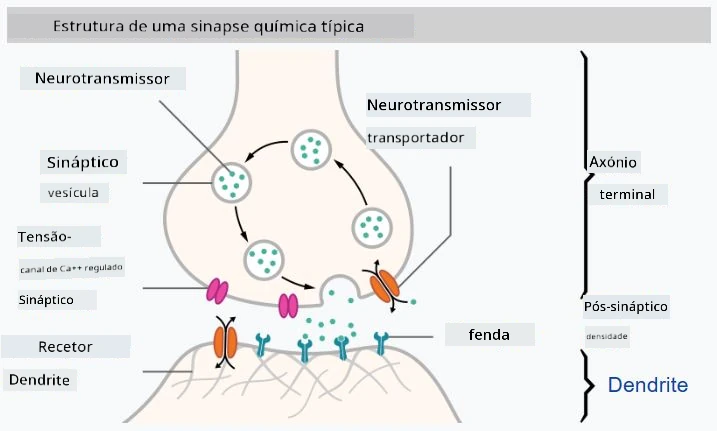

# Introdução às Redes Neuronais

Como discutimos na introdução, uma das formas de alcançar inteligência é treinar um **modelo computacional** ou um **cérebro artificial**. Desde meados do século XX, os investigadores experimentaram diferentes modelos matemáticos, até que, nos últimos anos, esta abordagem provou ser extremamente bem-sucedida. Esses modelos matemáticos do cérebro são chamados de **redes neuronais**.

> Às vezes, as redes neuronais são chamadas de *Redes Neuronais Artificiais* (Artificial Neural Networks, ANNs), para indicar que estamos a falar de modelos, e não de redes reais de neurónios.

## Aprendizagem Automática

As Redes Neuronais fazem parte de uma disciplina mais ampla chamada **Aprendizagem Automática** (Machine Learning), cujo objetivo é usar dados para treinar modelos computacionais capazes de resolver problemas. A Aprendizagem Automática constitui uma grande parte da Inteligência Artificial; no entanto, não abordamos a aprendizagem automática clássica neste currículo.

> Visite o nosso currículo separado **[Aprendizagem Automática para Iniciantes](http://github.com/microsoft/ml-for-beginners)** para aprender mais sobre a Aprendizagem Automática clássica.

Na Aprendizagem Automática, assumimos que temos um conjunto de dados de exemplos **X** e os valores de saída correspondentes **Y**. Os exemplos são frequentemente vetores N-dimensionais que consistem em **características**, e as saídas são chamadas de **rótulos**.

Consideraremos os dois problemas mais comuns da aprendizagem automática:

* **Classificação**, onde precisamos classificar um objeto de entrada em duas ou mais classes.
* **Regressão**, onde precisamos prever um valor numérico para cada uma das amostras de entrada.

> Ao representar entradas e saídas como tensores, o conjunto de dados de entrada é uma matriz de tamanho M&times;N, onde M é o número de amostras e N é o número de características. Os rótulos de saída **Y** são um vetor de tamanho M.

Neste currículo, focar-nos-emos apenas em modelos de redes neuronais.

## Um Modelo de Neurónio

Na biologia, sabemos que o nosso cérebro é composto por células neuronais (neurónios), cada uma delas com múltiplas "entradas" (dendritos) e uma única "saída" (axónio). Tanto os dendritos como os axónios podem conduzir sinais elétricos, e as conexões entre eles — conhecidas como sinapses — podem apresentar diferentes graus de condutividade, que são regulados por neurotransmissores.

 | 
----|----
Neurónio Real *([Imagem](https://en.wikipedia.org/wiki/Synapse#/media/File:SynapseSchematic_lines.svg) da Wikipédia)* | Neurónio Artificial *(Imagem do Autor)*

Assim, o modelo matemático mais simples de um neurónio contém várias entradas X1, ..., XN e uma saída Y, e uma série de pesos W1, ..., WN. A saída é calculada como:

onde **f** é uma **função de ativação** não linear.

> Os primeiros modelos de neurónio foram descritos no artigo clássico [A logical calculus of the ideas immanent in nervous activity](https://www.cs.cmu.edu/~./epxing/Class/10715/reading/McCulloch.and.Pitts.pdf) por Warren McCullock e Walter Pitts em 1943. Donald Hebb, no seu livro "[The Organization of Behavior: A Neuropsychological Theory](https://books.google.com/books?id=VNetYrB8EBoC)", propôs uma forma de treinar essas redes.

## Nesta Secção

Nesta secção, aprenderemos sobre:
* [Perceptron](03-Perceptron/README.md), um dos primeiros modelos de redes neuronais para classificação binária
* [Redes com múltiplas camadas](04-OwnFramework/README.md) com um notebook associado [como construir o nosso próprio framework](04-OwnFramework/OwnFramework.ipynb)
* [Frameworks de Redes Neuronais](05-Frameworks/README.md), com estes notebooks: [PyTorch](05-Frameworks/IntroPyTorch.ipynb) e [Keras/Tensorflow](05-Frameworks/IntroKerasTF.ipynb)
* [Overfitting](../../../../lessons/3-NeuralNetworks/05-Frameworks)

---

**Aviso**:  
Este documento foi traduzido utilizando o serviço de tradução por IA [Co-op Translator](https://github.com/Azure/co-op-translator). Embora nos esforcemos pela precisão, é importante notar que traduções automáticas podem conter erros ou imprecisões. O documento original na sua língua nativa deve ser considerado a fonte autoritária. Para informações críticas, recomenda-se a tradução profissional realizada por humanos. Não nos responsabilizamos por quaisquer mal-entendidos ou interpretações incorretas decorrentes da utilização desta tradução.