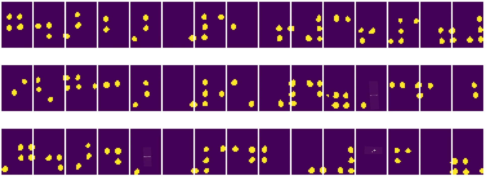

# Introdução à Visão Computacional

[Visão Computacional](https://wikipedia.org/wiki/Computer_vision) é uma disciplina cujo objetivo é permitir que os computadores obtenham uma compreensão de alto nível de imagens digitais. Esta é uma definição bastante ampla, pois *compreensão* pode significar muitas coisas diferentes, incluindo encontrar um objeto numa imagem (**detecção de objetos**), entender o que está a acontecer (**detecção de eventos**), descrever uma imagem em texto ou reconstruir uma cena em 3D. Existem também tarefas específicas relacionadas a imagens humanas: estimativa de idade e emoções, deteção e identificação de rostos, e estimativa de pose em 3D, entre outras.

## [Questionário pré-aula](https://ff-quizzes.netlify.app/en/ai/quiz/11)

Uma das tarefas mais simples da visão computacional é a **classificação de imagens**.

A visão computacional é frequentemente considerada um ramo da IA. Atualmente, a maioria das tarefas de visão computacional é resolvida utilizando redes neuronais. Vamos aprender mais sobre o tipo especial de redes neuronais usadas para visão computacional, [redes neuronais convolucionais](../07-ConvNets/README.md), ao longo desta secção.

No entanto, antes de passar a imagem para uma rede neuronal, em muitos casos faz sentido usar algumas técnicas algorítmicas para melhorar a imagem.

Existem várias bibliotecas Python disponíveis para processamento de imagens:

* **[imageio](https://imageio.readthedocs.io/en/stable/)** pode ser usada para ler/escrever diferentes formatos de imagem. Também suporta ffmpeg, uma ferramenta útil para converter frames de vídeo em imagens.
* **[Pillow](https://pillow.readthedocs.io/en/stable/index.html)** (também conhecida como PIL) é um pouco mais poderosa e também suporta manipulação de imagens, como morphing, ajustes de paleta e mais.
* **[OpenCV](https://opencv.org/)** é uma biblioteca de processamento de imagens poderosa escrita em C++, que se tornou o padrão *de facto* para processamento de imagens. Possui uma interface conveniente em Python.
* **[dlib](http://dlib.net/)** é uma biblioteca C++ que implementa muitos algoritmos de aprendizagem automática, incluindo alguns algoritmos de Visão Computacional. Também possui uma interface em Python e pode ser usada para tarefas desafiadoras, como deteção de rostos e pontos de referência faciais.

## OpenCV

[OpenCV](https://opencv.org/) é considerado o padrão *de facto* para processamento de imagens. Contém muitos algoritmos úteis, implementados em C++. Pode-se usar o OpenCV a partir de Python também.

Um bom lugar para aprender OpenCV é [este curso Learn OpenCV](https://learnopencv.com/getting-started-with-opencv/). No nosso currículo, o objetivo não é aprender OpenCV, mas mostrar alguns exemplos de quando ele pode ser usado e como.

### Carregar Imagens

Imagens em Python podem ser convenientemente representadas por arrays NumPy. Por exemplo, imagens em escala de cinza com tamanho de 320x200 pixels seriam armazenadas num array 200x320, e imagens coloridas da mesma dimensão teriam a forma 200x320x3 (para 3 canais de cor). Para carregar uma imagem, pode usar o seguinte código:

```python
import cv2
import matplotlib.pyplot as plt

im = cv2.imread('image.jpeg')
plt.imshow(im)
```

Tradicionalmente, o OpenCV usa codificação BGR (Azul-Verde-Vermelho) para imagens coloridas, enquanto o restante das ferramentas Python usa a mais tradicional RGB (Vermelho-Verde-Azul). Para que a imagem seja exibida corretamente, é necessário convertê-la para o espaço de cores RGB, seja trocando as dimensões no array NumPy ou chamando uma função do OpenCV:

```python
im = cv2.cvtColor(im,cv2.COLOR_BGR2RGB)
```

A mesma função `cvtColor` pode ser usada para realizar outras transformações de espaço de cores, como converter uma imagem para escala de cinza ou para o espaço de cores HSV (Matiz-Saturação-Valor).

Também pode usar o OpenCV para carregar frames de vídeo um a um - um exemplo é dado no exercício [OpenCV Notebook](OpenCV.ipynb).

### Processamento de Imagens

Antes de alimentar uma imagem numa rede neuronal, pode querer aplicar vários passos de pré-processamento. O OpenCV pode fazer muitas coisas, incluindo:

* **Redimensionar** a imagem usando `im = cv2.resize(im, (320,200),interpolation=cv2.INTER_LANCZOS)`
* **Desfocar** a imagem usando `im = cv2.medianBlur(im,3)` ou `im = cv2.GaussianBlur(im, (3,3), 0)`
* Alterar o **brilho e contraste** da imagem pode ser feito através de manipulações de arrays NumPy, conforme descrito [nesta nota do Stackoverflow](https://stackoverflow.com/questions/39308030/how-do-i-increase-the-contrast-of-an-image-in-python-opencv).
* Usar [thresholding](https://docs.opencv.org/4.x/d7/d4d/tutorial_py_thresholding.html) chamando as funções `cv2.threshold`/`cv2.adaptiveThreshold`, que muitas vezes é preferível a ajustar brilho ou contraste.
* Aplicar diferentes [transformações](https://docs.opencv.org/4.5.5/da/d6e/tutorial_py_geometric_transformations.html) à imagem:
    - **[Transformações Afins](https://docs.opencv.org/4.5.5/d4/d61/tutorial_warp_affine.html)** podem ser úteis se precisar combinar rotação, redimensionamento e inclinação na imagem e souber a localização de origem e destino de três pontos na imagem. Transformações afins mantêm linhas paralelas paralelas.
    - **[Transformações de Perspetiva](https://medium.com/analytics-vidhya/opencv-perspective-transformation-9edffefb2143)** podem ser úteis quando se conhece as posições de origem e destino de 4 pontos na imagem. Por exemplo, se tirar uma foto de um documento retangular com uma câmara de smartphone de algum ângulo e quiser criar uma imagem retangular do próprio documento.
* Compreender o movimento dentro da imagem usando **[fluxo ótico](https://docs.opencv.org/4.5.5/d4/dee/tutorial_optical_flow.html)**.

## Exemplos de uso da Visão Computacional

No nosso [OpenCV Notebook](OpenCV.ipynb), damos alguns exemplos de quando a visão computacional pode ser usada para realizar tarefas específicas:

* **Pré-processamento de uma fotografia de um livro em Braille**. Focamos em como podemos usar thresholding, deteção de características, transformação de perspetiva e manipulações NumPy para separar símbolos individuais em Braille para posterior classificação por uma rede neuronal.

 |  | 
----|-----|-----

> Imagem de [OpenCV.ipynb](OpenCV.ipynb)

* **Deteção de movimento em vídeo usando diferença de frames**. Se a câmara estiver fixa, os frames do feed da câmara devem ser bastante semelhantes entre si. Como os frames são representados como arrays, apenas subtraindo esses arrays de dois frames subsequentes obteremos a diferença de pixels, que deve ser baixa para frames estáticos e tornar-se maior quando houver movimento substancial na imagem.


> Imagem de [OpenCV.ipynb](OpenCV.ipynb)

* **Deteção de movimento usando Fluxo Ótico**. [Fluxo ótico](https://docs.opencv.org/3.4/d4/dee/tutorial_optical_flow.html) permite entender como os pixels individuais nos frames de vídeo se movem. Existem dois tipos de fluxo ótico:

   - **Fluxo Ótico Denso** calcula o campo vetorial que mostra para cada pixel onde ele está a mover-se.
   - **Fluxo Ótico Esparso** baseia-se em tomar algumas características distintivas na imagem (por exemplo, bordas) e construir a sua trajetória de frame para frame.


> Imagem de [OpenCV.ipynb](OpenCV.ipynb)

## ✍️ Notebooks de Exemplo: OpenCV [experimente OpenCV em ação](OpenCV.ipynb)

Vamos fazer algumas experiências com OpenCV explorando [OpenCV Notebook](OpenCV.ipynb)

## Conclusão

Por vezes, tarefas relativamente complexas, como deteção de movimento ou deteção de ponta dos dedos, podem ser resolvidas puramente por visão computacional. Assim, é muito útil conhecer as técnicas básicas de visão computacional e o que bibliotecas como OpenCV podem fazer.

## 🚀 Desafio

Assista a [este vídeo](https://docs.microsoft.com/shows/ai-show/ai-show--2021-opencv-ai-competition--grand-prize-winners--cortic-tigers--episode-32?WT.mc_id=academic-77998-cacaste) do AI Show para aprender sobre o projeto Cortic Tigers e como eles construíram uma solução baseada em blocos para democratizar tarefas de visão computacional através de um robô. Faça uma pesquisa sobre outros projetos como este que ajudam novos aprendizes a entrar no campo.

## [Questionário pós-aula](https://ff-quizzes.netlify.app/en/ai/quiz/12)

## Revisão & Autoestudo

Leia mais sobre fluxo ótico [neste excelente tutorial](https://learnopencv.com/optical-flow-in-opencv/).

## [Tarefa](lab/README.md)

Neste laboratório, irá gravar um vídeo com gestos simples, e o seu objetivo será extrair movimentos para cima/baixo/esquerda/direita usando fluxo ótico.


---

