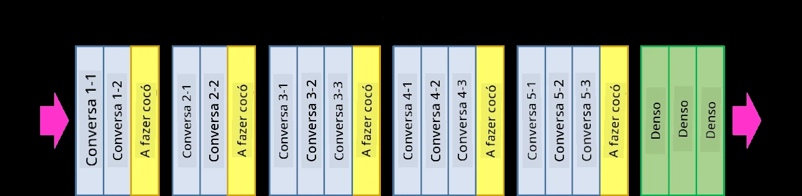

# Redes Neuronais Convolucionais

Já vimos anteriormente que as redes neuronais são bastante eficazes a lidar com imagens, e até mesmo um perceptron de uma camada consegue reconhecer dígitos manuscritos do conjunto de dados MNIST com uma precisão razoável. No entanto, o conjunto de dados MNIST é muito especial, pois todos os dígitos estão centrados na imagem, o que torna a tarefa mais simples.

## [Questionário pré-aula](https://ff-quizzes.netlify.app/en/ai/quiz/13)

Na vida real, queremos ser capazes de reconhecer objetos numa imagem independentemente da sua localização exata. A visão computacional é diferente da classificação genérica, porque, ao tentar encontrar um determinado objeto na imagem, estamos a analisar a imagem em busca de **padrões** específicos e das suas combinações. Por exemplo, ao procurar um gato, podemos começar por procurar linhas horizontais, que podem formar os bigodes, e depois uma certa combinação de bigodes pode indicar que se trata de uma imagem de um gato. A posição relativa e a presença de certos padrões são importantes, e não a sua posição exata na imagem.

Para extrair padrões, utilizaremos o conceito de **filtros convolucionais**. Como sabe, uma imagem é representada por uma matriz 2D ou um tensor 3D com profundidade de cor. Aplicar um filtro significa que utilizamos uma matriz relativamente pequena chamada **kernel do filtro**, e para cada pixel na imagem original calculamos a média ponderada com os pontos vizinhos. Podemos imaginar isto como uma pequena janela que desliza sobre toda a imagem, e que calcula a média de todos os pixels de acordo com os pesos na matriz kernel do filtro.

 | 
----|----

> Imagem por Dmitry Soshnikov

Por exemplo, se aplicarmos filtros de borda vertical e horizontal de 3x3 aos dígitos do MNIST, podemos obter realces (por exemplo, valores altos) onde existem bordas verticais e horizontais na imagem original. Assim, esses dois filtros podem ser usados para "procurar" bordas. Da mesma forma, podemos projetar diferentes filtros para procurar outros padrões de baixo nível:

> Imagem do [Leung-Malik Filter Bank](https://www.robots.ox.ac.uk/~vgg/research/texclass/filters.html)

No entanto, embora possamos projetar os filtros manualmente para extrair alguns padrões, também podemos projetar a rede de forma a que ela aprenda os padrões automaticamente. Esta é uma das principais ideias por trás das CNN.

## Ideias principais das CNN

O funcionamento das CNN baseia-se nas seguintes ideias importantes:

* Os filtros convolucionais podem extrair padrões
* Podemos projetar a rede de forma a que os filtros sejam treinados automaticamente
* Podemos usar a mesma abordagem para encontrar padrões em características de alto nível, não apenas na imagem original. Assim, a extração de características pelas CNN funciona numa hierarquia de características, começando por combinações de pixels de baixo nível até combinações de partes da imagem de nível mais alto.

> Imagem de [um artigo de Hislop-Lynch](https://www.semanticscholar.org/paper/Computer-vision-based-pedestrian-trajectory-Hislop-Lynch/26e6f74853fc9bbb7487b06dc2cf095d36c9021d), baseado na [sua pesquisa](https://dl.acm.org/doi/abs/10.1145/1553374.1553453)

## ✍️ Exercícios: Redes Neuronais Convolucionais

Vamos continuar a explorar como funcionam as redes neuronais convolucionais e como podemos obter filtros treináveis, trabalhando nos notebooks correspondentes:

* [Redes Neuronais Convolucionais - PyTorch](ConvNetsPyTorch.ipynb)
* [Redes Neuronais Convolucionais - TensorFlow](ConvNetsTF.ipynb)

## Arquitetura em Pirâmide

A maioria das CNN utilizadas para processamento de imagens segue uma arquitetura chamada de pirâmide. A primeira camada convolucional aplicada às imagens originais geralmente tem um número relativamente baixo de filtros (8-16), que correspondem a diferentes combinações de pixels, como linhas horizontais/verticais ou traços. No nível seguinte, reduzimos a dimensão espacial da rede e aumentamos o número de filtros, o que corresponde a mais combinações possíveis de características simples. Com cada camada, à medida que avançamos para o classificador final, as dimensões espaciais da imagem diminuem e o número de filtros aumenta.

Como exemplo, vejamos a arquitetura da VGG-16, uma rede que alcançou 92,7% de precisão na classificação top-5 do ImageNet em 2014:

> Imagem de [Researchgate](https://www.researchgate.net/figure/Vgg16-model-structure-To-get-the-VGG-NIN-model-we-replace-the-2-nd-4-th-6-th-7-th_fig2_335194493)

## Arquiteturas de CNN mais conhecidas

[Continue o seu estudo sobre as arquiteturas de CNN mais conhecidas](CNN_Architectures.md)

---

