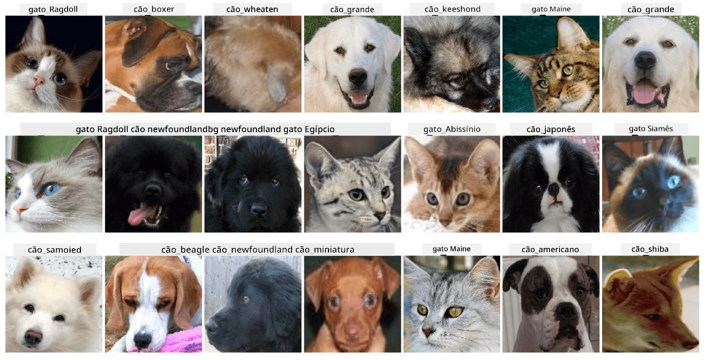

# Classificação de Rostos de Animais de Estimação

Trabalho de laboratório do [Currículo de IA para Iniciantes](https://github.com/microsoft/ai-for-beginners).

## Tarefa

Imagine que precisa desenvolver uma aplicação para um berçário de animais de estimação para catalogar todos os animais. Uma das grandes funcionalidades de tal aplicação seria identificar automaticamente a raça a partir de uma fotografia. Isto pode ser feito com sucesso utilizando redes neuronais.

Precisa treinar uma rede neuronal convolucional para classificar diferentes raças de gatos e cães utilizando o dataset **Pet Faces**.

## O Dataset

Vamos utilizar o [Oxford-IIIT Pet Dataset](https://www.robots.ox.ac.uk/~vgg/data/pets/), que contém imagens de 37 raças diferentes de cães e gatos.



Para descarregar o dataset, utilize este trecho de código:

```python
!wget https://thor.robots.ox.ac.uk/~vgg/data/pets/images.tar.gz
!tar xfz images.tar.gz
!rm images.tar.gz
```

**Nota:** As imagens do Oxford-IIIT Pet Dataset estão organizadas por nome de ficheiro (por exemplo, `Abyssinian_1.jpg`, `Bengal_2.jpg`). O notebook inclui código para organizar estas imagens em subdiretórios específicos de cada raça para facilitar a classificação.

## Notebook Inicial

Comece o laboratório abrindo [PetFaces.ipynb](PetFaces.ipynb)

## Conclusão

Conseguiu resolver um problema relativamente complexo de classificação de imagens do zero! Havia bastantes classes, e ainda assim conseguiu obter uma precisão razoável! Também faz sentido medir a precisão top-k, porque é fácil confundir algumas classes que não são claramente diferentes, mesmo para seres humanos.

---

**Aviso**:  
Este documento foi traduzido utilizando o serviço de tradução por IA [Co-op Translator](https://github.com/Azure/co-op-translator). Embora nos esforcemos para garantir a precisão, esteja ciente de que traduções automáticas podem conter erros ou imprecisões. O documento original na sua língua nativa deve ser considerado a fonte autoritária. Para informações críticas, recomenda-se uma tradução profissional realizada por humanos. Não nos responsabilizamos por quaisquer mal-entendidos ou interpretações incorretas decorrentes do uso desta tradução.