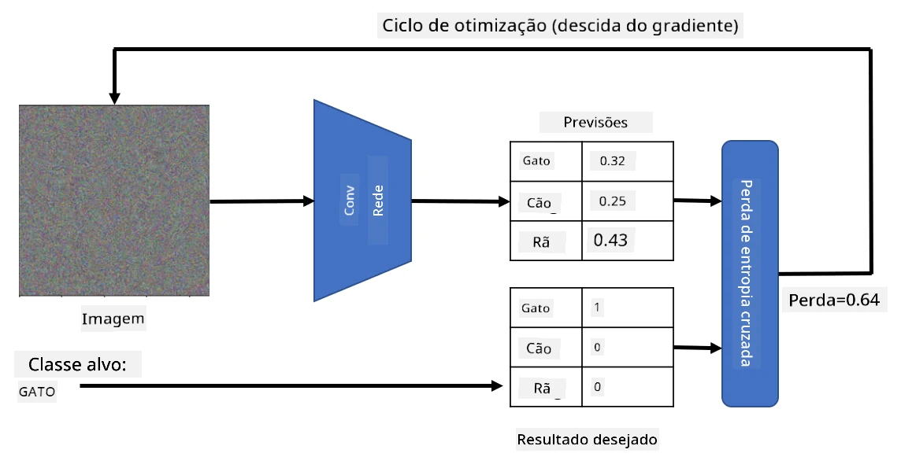

# Redes Pré-treinadas e Aprendizagem por Transferência

Treinar CNNs pode levar muito tempo e requer uma grande quantidade de dados. No entanto, grande parte do tempo é gasto aprendendo os melhores filtros de baixo nível que uma rede pode usar para extrair padrões de imagens. Surge então uma questão natural: podemos usar uma rede neural treinada num conjunto de dados e adaptá-la para classificar imagens diferentes sem precisar de um processo completo de treino?

## [Questionário pré-aula](https://ff-quizzes.netlify.app/en/ai/quiz/15)

Esta abordagem é chamada de **aprendizagem por transferência**, porque transferimos algum conhecimento de um modelo de rede neural para outro. Na aprendizagem por transferência, normalmente começamos com um modelo pré-treinado, que foi treinado num grande conjunto de dados de imagens, como o **ImageNet**. Esses modelos já conseguem extrair diferentes características de imagens genéricas, e em muitos casos, apenas construir um classificador em cima dessas características extraídas pode gerar bons resultados.

> ✅ Aprendizagem por Transferência é um termo que também aparece em outros campos académicos, como a Educação. Refere-se ao processo de aplicar conhecimentos de um domínio a outro.

## Modelos Pré-treinados como Extratores de Características

As redes convolucionais que discutimos na seção anterior contêm várias camadas, cada uma destinada a extrair características da imagem, começando por combinações de pixels de baixo nível (como linhas horizontais/verticais ou traços), até combinações de características de nível superior, correspondendo a coisas como o olho de uma chama. Se treinarmos uma CNN num conjunto de dados suficientemente grande e diversificado, a rede deve aprender a extrair essas características comuns.

Tanto o Keras como o PyTorch possuem funções para carregar facilmente pesos de redes neurais pré-treinadas para algumas arquiteturas comuns, a maioria das quais foi treinada com imagens do ImageNet. As mais utilizadas estão descritas na página [Arquiteturas de CNN](../07-ConvNets/CNN_Architectures.md) da lição anterior. Em particular, pode considerar usar uma das seguintes:

* **VGG-16/VGG-19**, que são modelos relativamente simples e ainda assim oferecem boa precisão. Usar o VGG como primeira tentativa é uma boa escolha para ver como a aprendizagem por transferência funciona.
* **ResNet**, uma família de modelos proposta pela Microsoft Research em 2015. Estes têm mais camadas e, portanto, requerem mais recursos.
* **MobileNet**, uma família de modelos com tamanho reduzido, adequada para dispositivos móveis. Use-os se tiver poucos recursos e puder sacrificar um pouco de precisão.

Aqui estão características extraídas de uma imagem de um gato pela rede VGG-16:

## Conjunto de Dados de Gatos vs. Cães

Neste exemplo, usaremos um conjunto de dados de [Gatos e Cães](https://www.microsoft.com/download/details.aspx?id=54765&WT.mc_id=academic-77998-cacaste), que é muito próximo de um cenário real de classificação de imagens.

## ✍️ Exercício: Aprendizagem por Transferência

Vamos ver a aprendizagem por transferência em ação nos notebooks correspondentes:

* [Aprendizagem por Transferência - PyTorch](TransferLearningPyTorch.ipynb)
* [Aprendizagem por Transferência - TensorFlow](TransferLearningTF.ipynb)

## Visualizando o Gato Adversarial

Uma rede neural pré-treinada contém diferentes padrões no seu *cérebro*, incluindo noções de **gato ideal** (bem como cão ideal, zebra ideal, etc.). Seria interessante **visualizar esta imagem**. No entanto, isso não é simples, porque os padrões estão espalhados pelos pesos da rede e organizados numa estrutura hierárquica.

Uma abordagem que podemos adotar é começar com uma imagem aleatória e tentar usar a técnica de **otimização por descida de gradiente** para ajustar essa imagem de forma que a rede comece a pensar que é um gato.

No entanto, se fizermos isso, obteremos algo muito semelhante a um ruído aleatório. Isso acontece porque *existem muitas maneiras de fazer a rede pensar que a imagem de entrada é um gato*, incluindo algumas que não fazem sentido visualmente. Embora essas imagens contenham muitos padrões típicos de um gato, não há nada que as obrigue a serem visualmente distintas.

Para melhorar o resultado, podemos adicionar outro termo à função de perda, chamado **perda de variação**. É uma métrica que mostra quão semelhantes são os pixels vizinhos da imagem. Minimizar a perda de variação torna a imagem mais suave e elimina o ruído, revelando padrões mais visualmente apelativos. Aqui está um exemplo de imagens "ideais", classificadas como gato e zebra com alta probabilidade:

 | 
-----|-----
 *Gato Ideal* | *Zebra Ideal*

Uma abordagem semelhante pode ser usada para realizar os chamados **ataques adversariais** numa rede neural. Suponha que queremos enganar uma rede neural e fazer com que um cão pareça um gato. Se pegarmos na imagem de um cão, que é reconhecida pela rede como um cão, podemos ajustá-la ligeiramente usando otimização por descida de gradiente até que a rede comece a classificá-la como um gato:

 | 
-----|-----
*Imagem original de um cão* | *Imagem de um cão classificada como gato*

Veja o código para reproduzir os resultados acima no seguinte notebook:

* [Gato Ideal e Adversarial - TensorFlow](AdversarialCat_TF.ipynb)

## Conclusão

Usando a aprendizagem por transferência, é possível montar rapidamente um classificador para uma tarefa de classificação de objetos personalizada e alcançar alta precisão. Pode perceber que tarefas mais complexas que estamos a resolver agora requerem maior poder computacional e não podem ser facilmente resolvidas no CPU. Na próxima unidade, tentaremos usar uma implementação mais leve para treinar o mesmo modelo usando menos recursos computacionais, o que resulta numa ligeira redução de precisão.

## 🚀 Desafio

Nos notebooks que acompanham, há notas no final sobre como o conhecimento transferido funciona melhor com dados de treino algo semelhantes (um novo tipo de animal, talvez). Experimente com tipos de imagens completamente novos para ver como os seus modelos de conhecimento transferido se comportam.

## [Questionário pós-aula](https://ff-quizzes.netlify.app/en/ai/quiz/16)

## Revisão e Autoestudo

Leia o documento [TrainingTricks.md](TrainingTricks.md) para aprofundar o seu conhecimento sobre outras formas de treinar os seus modelos.

## [Tarefa](lab/README.md)

Neste laboratório, usaremos o conjunto de dados real [Oxford-IIIT](https://www.robots.ox.ac.uk/~vgg/data/pets/) de animais de estimação, com 35 raças de gatos e cães, e construiremos um classificador de aprendizagem por transferência.

---

