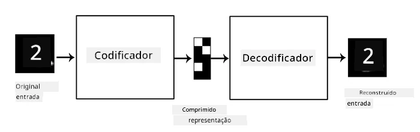

# Autoencoders

Ao treinar redes neuronais convolucionais (CNNs), um dos problemas é que precisamos de muitos dados etiquetados. No caso da classificação de imagens, é necessário separar as imagens em diferentes classes, o que exige esforço manual.

## [Questionário pré-aula](https://ff-quizzes.netlify.app/en/ai/quiz/17)

No entanto, podemos querer usar dados brutos (não etiquetados) para treinar extratores de características de CNN, o que é chamado de **aprendizagem auto-supervisionada**. Em vez de etiquetas, utilizamos as imagens de treino como entrada e saída da rede. A ideia principal de um **autoencoder** é que teremos uma **rede codificadora** que converte a imagem de entrada num **espaço latente** (normalmente é apenas um vetor de tamanho reduzido), e uma **rede descodificadora**, cujo objetivo será reconstruir a imagem original.

> ✅ Um [autoencoder](https://wikipedia.org/wiki/Autoencoder) é "um tipo de rede neuronal artificial usada para aprender codificações eficientes de dados não etiquetados."

Como estamos a treinar um autoencoder para capturar o máximo de informação possível da imagem original para uma reconstrução precisa, a rede tenta encontrar a melhor **representação** das imagens de entrada para captar o seu significado.

> Imagem retirada do [blog da Keras](https://blog.keras.io/building-autoencoders-in-keras.html)

## Cenários para usar Autoencoders

Embora a reconstrução de imagens originais possa não parecer útil por si só, existem alguns cenários em que os autoencoders são especialmente úteis:

* **Redução da dimensão de imagens para visualização** ou **treino de representações de imagens**. Normalmente, os autoencoders produzem melhores resultados do que a PCA, porque consideram a natureza espacial das imagens e as características hierárquicas.
* **Remoção de ruído**, ou seja, eliminar o ruído da imagem. Como o ruído contém muita informação inútil, o autoencoder não consegue encaixar tudo no espaço latente relativamente pequeno, capturando apenas a parte importante da imagem. Ao treinar removedores de ruído, começamos com imagens originais e usamos imagens com ruído artificialmente adicionado como entrada para o autoencoder.
* **Super-resolução**, ou seja, aumentar a resolução da imagem. Começamos com imagens de alta resolução e usamos imagens de resolução mais baixa como entrada para o autoencoder.
* **Modelos generativos**. Depois de treinar o autoencoder, a parte descodificadora pode ser usada para criar novos objetos a partir de vetores latentes aleatórios.

## Autoencoders Variacionais (VAE)

Os autoencoders tradicionais reduzem a dimensão dos dados de entrada de alguma forma, identificando as características importantes das imagens de entrada. No entanto, os vetores latentes muitas vezes não fazem muito sentido. Por outras palavras, usando o conjunto de dados MNIST como exemplo, identificar quais dígitos correspondem a diferentes vetores latentes não é uma tarefa fácil, porque vetores latentes próximos não correspondem necessariamente aos mesmos dígitos.

Por outro lado, para treinar modelos *generativos*, é melhor ter algum entendimento do espaço latente. Esta ideia leva-nos ao **autoencoder variacional** (VAE).

O VAE é um autoencoder que aprende a prever a *distribuição estatística* dos parâmetros latentes, chamada de **distribuição latente**. Por exemplo, podemos querer que os vetores latentes sejam distribuídos normalmente com uma média zmean e um desvio padrão zsigma (tanto a média quanto o desvio padrão são vetores de alguma dimensionalidade d). O codificador no VAE aprende a prever esses parâmetros, e o descodificador utiliza um vetor aleatório dessa distribuição para reconstruir o objeto.

Resumindo:

 * A partir do vetor de entrada, prevemos `z_mean` e `z_log_sigma` (em vez de prever o desvio padrão diretamente, prevemos o seu logaritmo)
 * Amostramos um vetor `sample` da distribuição N(zmean,exp(zlog\_sigma))
 * O descodificador tenta reconstruir a imagem original usando `sample` como vetor de entrada

 

> Imagem retirada deste [artigo](https://ijdykeman.github.io/ml/2016/12/21/cvae.html) por Isaak Dykeman

Os autoencoders variacionais utilizam uma função de perda complexa composta por duas partes:

* **Perda de reconstrução**, que é a função de perda que indica quão próxima a imagem reconstruída está do alvo (pode ser o Erro Quadrático Médio, ou MSE). É a mesma função de perda usada em autoencoders normais.
* **Perda KL**, que garante que as distribuições das variáveis latentes permaneçam próximas da distribuição normal. Baseia-se no conceito de [divergência de Kullback-Leibler](https://www.countbayesie.com/blog/2017/5/9/kullback-leibler-divergence-explained) - uma métrica para estimar a semelhança entre duas distribuições estatísticas.

Uma vantagem importante dos VAEs é que permitem gerar novas imagens de forma relativamente fácil, porque sabemos de qual distribuição amostrar os vetores latentes. Por exemplo, se treinarmos um VAE com um vetor latente 2D no MNIST, podemos variar os componentes do vetor latente para obter diferentes dígitos:

> Imagem por [Dmitry Soshnikov](http://soshnikov.com)

Observe como as imagens se fundem umas nas outras, à medida que começamos a obter vetores latentes de diferentes partes do espaço de parâmetros latentes. Também podemos visualizar este espaço em 2D:

 

> Imagem por [Dmitry Soshnikov](http://soshnikov.com)

## ✍️ Exercícios: Autoencoders

Saiba mais sobre autoencoders nestes notebooks correspondentes:

* [Autoencoders em TensorFlow](AutoencodersTF.ipynb)
* [Autoencoders em PyTorch](AutoEncodersPyTorch.ipynb)

## Propriedades dos Autoencoders

* **Específicos aos Dados** - funcionam bem apenas com o tipo de imagens em que foram treinados. Por exemplo, se treinarmos uma rede de super-resolução em flores, ela não funcionará bem em retratos. Isto acontece porque a rede pode produzir imagens de maior resolução ao extrair detalhes finos das características aprendidas no conjunto de dados de treino.
* **Com perdas** - a imagem reconstruída não é exatamente igual à imagem original. A natureza da perda é definida pela *função de perda* usada durante o treino.
* Funciona com **dados não etiquetados**

## [Questionário pós-aula](https://ff-quizzes.netlify.app/en/ai/quiz/18)

## Conclusão

Nesta lição, aprendeste sobre os vários tipos de autoencoders disponíveis para o cientista de IA. Aprendeste como construí-los e como usá-los para reconstruir imagens. Também aprendeste sobre o VAE e como usá-lo para gerar novas imagens.

## 🚀 Desafio

Nesta lição, aprendeste sobre o uso de autoencoders para imagens. Mas eles também podem ser usados para música! Explora o projeto [MusicVAE](https://magenta.tensorflow.org/music-vae) do Magenta, que utiliza autoencoders para aprender a reconstruir música. Faz algumas [experiências](https://colab.research.google.com/github/magenta/magenta-demos/blob/master/colab-notebooks/Multitrack_MusicVAE.ipynb) com esta biblioteca para ver o que consegues criar.

## [Questionário pós-aula](https://ff-quizzes.netlify.app/en/ai/quiz/16)

## Revisão e Autoestudo

Para referência, lê mais sobre autoencoders nestes recursos:

* [Construindo Autoencoders em Keras](https://blog.keras.io/building-autoencoders-in-keras.html)
* [Artigo no NeuroHive](https://neurohive.io/ru/osnovy-data-science/variacionnyj-avtojenkoder-vae/)
* [Autoencoders Variacionais Explicados](https://kvfrans.com/variational-autoencoders-explained/)
* [Autoencoders Variacionais Condicionais](https://ijdykeman.github.io/ml/2016/12/21/cvae.html)

## Tarefa

No final deste [notebook usando TensorFlow](AutoencodersTF.ipynb), encontrarás uma 'tarefa' - usa-a como tua tarefa.

---

