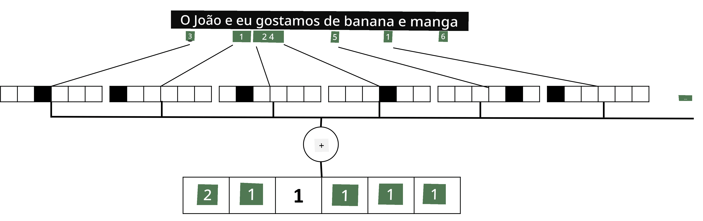

# Representar Texto como Tensores

## [Questionário pré-aula](https://ff-quizzes.netlify.app/en/ai/quiz/25)

## Classificação de Texto

Ao longo da primeira parte desta secção, vamos focar-nos na tarefa de **classificação de texto**. Utilizaremos o Dataset [AG News](https://www.kaggle.com/amananandrai/ag-news-classification-dataset), que contém artigos de notícias como o seguinte:

* Categoria: Ciência/Tecnologia
* Título: Empresa de Ky. Ganha Subsídio para Estudar Peptídeos (AP)
* Corpo: AP - Uma empresa fundada por um investigador de química da Universidade de Louisville ganhou um subsídio para desenvolver...

O nosso objetivo será classificar o artigo de notícias numa das categorias com base no texto.

## Representar texto

Se quisermos resolver tarefas de Processamento de Linguagem Natural (NLP) com redes neuronais, precisamos de uma forma de representar texto como tensores. Os computadores já representam caracteres textuais como números que mapeiam para fontes no ecrã utilizando codificações como ASCII ou UTF-8.

> [Fonte da imagem](https://www.seobility.net/en/wiki/ASCII)

Como humanos, entendemos o que cada letra **representa** e como todos os caracteres se juntam para formar as palavras de uma frase. No entanto, os computadores, por si só, não têm essa compreensão, e a rede neuronal tem de aprender o significado durante o treino.

Portanto, podemos usar diferentes abordagens para representar texto:

* **Representação ao nível de caracteres**, onde representamos o texto tratando cada caractere como um número. Dado que temos *C* caracteres diferentes no nosso corpus de texto, a palavra *Hello* seria representada por um tensor de 5x*C*. Cada letra corresponderia a uma coluna do tensor em codificação one-hot.
* **Representação ao nível de palavras**, na qual criamos um **vocabulário** de todas as palavras no nosso texto e, em seguida, representamos as palavras usando codificação one-hot. Esta abordagem é de certa forma melhor, porque cada letra, por si só, não tem muito significado, e assim, ao usar conceitos semânticos de nível superior - palavras - simplificamos a tarefa para a rede neuronal. No entanto, dado o tamanho do dicionário, precisamos lidar com tensores esparsos de alta dimensão.

Independentemente da representação, primeiro precisamos converter o texto numa sequência de **tokens**, sendo um token um caractere, uma palavra ou, por vezes, até parte de uma palavra. Depois, convertemos o token num número, normalmente usando um **vocabulário**, e este número pode ser alimentado numa rede neuronal usando codificação one-hot.

## N-Gramas

Na linguagem natural, o significado preciso das palavras só pode ser determinado no contexto. Por exemplo, os significados de *rede neural* e *rede de pesca* são completamente diferentes. Uma das formas de levar isso em conta é construir o nosso modelo com pares de palavras, considerando os pares de palavras como tokens separados no vocabulário. Desta forma, a frase *Eu gosto de ir pescar* será representada pela seguinte sequência de tokens: *Eu gosto*, *gosto de*, *de ir*, *ir pescar*. O problema com esta abordagem é que o tamanho do dicionário cresce significativamente, e combinações como *ir pescar* e *ir às compras* são apresentadas por tokens diferentes, que não partilham qualquer semelhança semântica, apesar do mesmo verbo.

Em alguns casos, podemos considerar usar tri-gramas -- combinações de três palavras -- também. Assim, esta abordagem é frequentemente chamada de **n-gramas**. Além disso, faz sentido usar n-gramas com representação ao nível de caracteres, caso em que os n-gramas corresponderão aproximadamente a diferentes sílabas.

## Bag-of-Words e TF/IDF

Ao resolver tarefas como classificação de texto, precisamos de ser capazes de representar o texto por um vetor de tamanho fixo, que usaremos como entrada para o classificador denso final. Uma das formas mais simples de fazer isso é combinar todas as representações individuais das palavras, por exemplo, somando-as. Se somarmos as codificações one-hot de cada palavra, acabaremos com um vetor de frequências, mostrando quantas vezes cada palavra aparece no texto. Tal representação de texto é chamada de **bag of words** (BoW).

> Imagem do autor

Um BoW essencialmente representa quais palavras aparecem no texto e em que quantidades, o que pode ser uma boa indicação do tema do texto. Por exemplo, um artigo de notícias sobre política provavelmente contém palavras como *presidente* e *país*, enquanto uma publicação científica teria algo como *colisor*, *descoberto*, etc. Assim, as frequências das palavras podem, em muitos casos, ser um bom indicador do conteúdo do texto.

O problema com BoW é que certas palavras comuns, como *e*, *é*, etc., aparecem na maioria dos textos e têm as maiores frequências, ocultando as palavras que são realmente importantes. Podemos reduzir a importância dessas palavras levando em conta a frequência com que ocorrem em toda a coleção de documentos. Esta é a ideia principal por trás da abordagem TF/IDF, que é abordada em mais detalhe nos notebooks anexados a esta lição.

No entanto, nenhuma dessas abordagens consegue levar totalmente em conta a **semântica** do texto. Precisamos de modelos de redes neuronais mais poderosos para fazer isso, o que discutiremos mais tarde nesta secção.

## ✍️ Exercícios: Representação de Texto

Continue a sua aprendizagem nos seguintes notebooks:

* [Representação de Texto com PyTorch](TextRepresentationPyTorch.ipynb)
* [Representação de Texto com TensorFlow](TextRepresentationTF.ipynb)

## Conclusão

Até agora, estudámos técnicas que podem adicionar peso de frequência a diferentes palavras. No entanto, elas não conseguem representar o significado ou a ordem. Como o famoso linguista J. R. Firth disse em 1935, "O significado completo de uma palavra é sempre contextual, e nenhum estudo de significado fora do contexto pode ser levado a sério." Aprenderemos mais tarde no curso como capturar informações contextuais do texto usando modelagem de linguagem.

## 🚀 Desafio

Experimente outros exercícios usando bag-of-words e diferentes modelos de dados. Pode inspirar-se nesta [competição no Kaggle](https://www.kaggle.com/competitions/word2vec-nlp-tutorial/overview/part-1-for-beginners-bag-of-words)

## [Questionário pós-aula](https://ff-quizzes.netlify.app/en/ai/quiz/26)

## Revisão & Autoestudo

Pratique as suas competências com técnicas de embeddings de texto e bag-of-words em [Microsoft Learn](https://docs.microsoft.com/learn/modules/intro-natural-language-processing-pytorch/?WT.mc_id=academic-77998-cacaste)

## [Tarefa: Notebooks](assignment.md)

---

