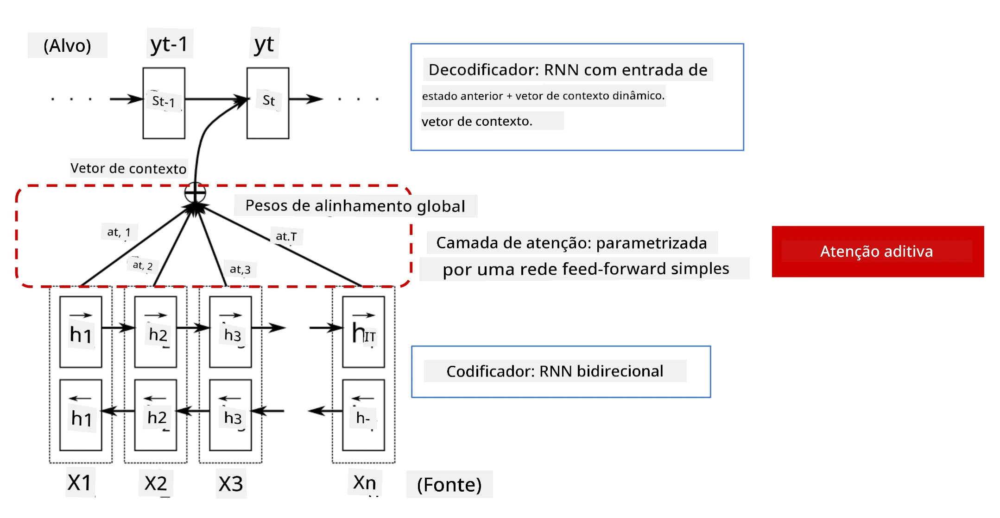
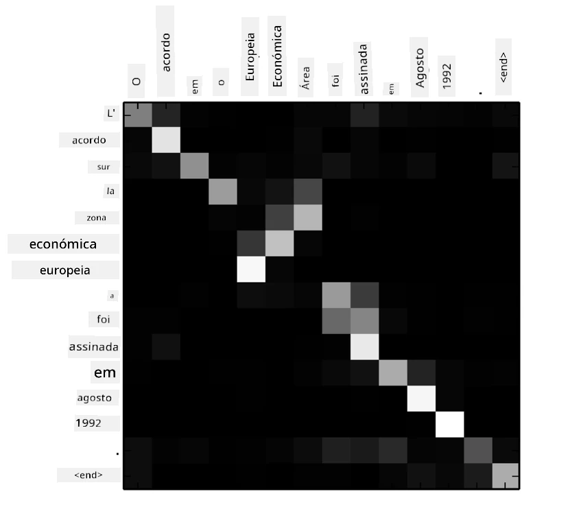
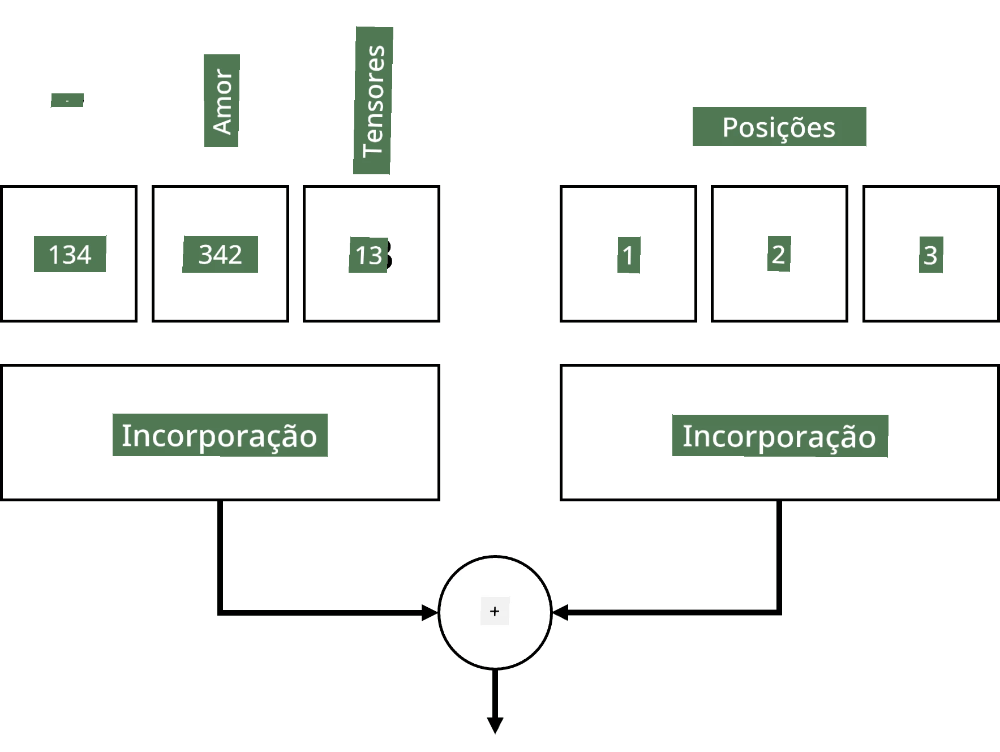
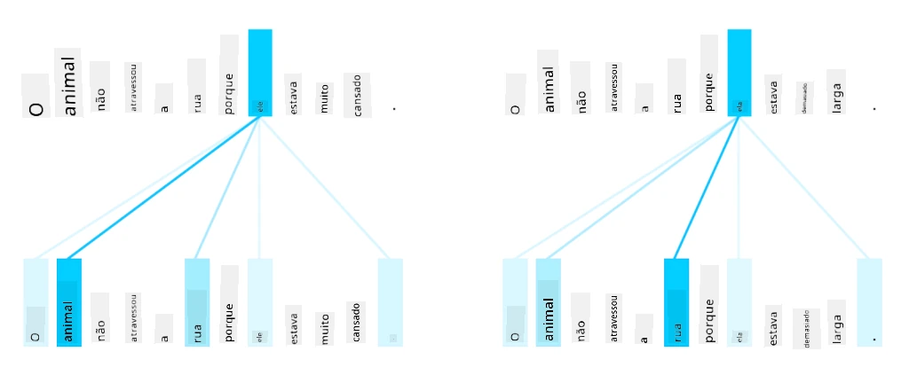
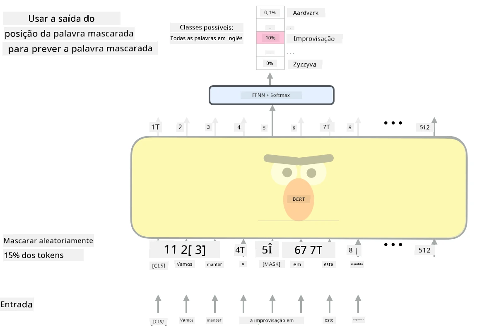

# Mecanismos de Atenção e Transformers

## [Questionário pré-aula](https://ff-quizzes.netlify.app/en/ai/quiz/35)

Um dos problemas mais importantes no domínio de NLP é a **tradução automática**, uma tarefa essencial que sustenta ferramentas como o Google Translate. Nesta seção, vamos focar na tradução automática ou, de forma mais geral, em qualquer tarefa de *sequência para sequência* (também chamada de **transdução de frases**).

Com RNNs, a tarefa de sequência para sequência é implementada por duas redes recorrentes, onde uma rede, o **codificador**, condensa uma sequência de entrada num estado oculto, enquanto outra rede, o **descodificador**, expande este estado oculto num resultado traduzido. Existem alguns problemas com esta abordagem:

* O estado final da rede codificadora tem dificuldade em lembrar-se do início de uma frase, causando uma qualidade inferior do modelo para frases longas.
* Todas as palavras numa sequência têm o mesmo impacto no resultado. Na realidade, no entanto, palavras específicas na sequência de entrada frequentemente têm mais impacto nos resultados sequenciais do que outras.

Os **Mecanismos de Atenção** fornecem um meio de ponderar o impacto contextual de cada vetor de entrada em cada previsão de saída da RNN. Isto é implementado criando atalhos entre estados intermediários da RNN de entrada e a RNN de saída. Desta forma, ao gerar o símbolo de saída yt, consideramos todos os estados ocultos de entrada hi, com diferentes coeficientes de peso &alpha;t,i.

> O modelo codificador-descodificador com mecanismo de atenção aditiva em [Bahdanau et al., 2015](https://arxiv.org/pdf/1409.0473.pdf), citado deste [post de blog](https://lilianweng.github.io/lil-log/2018/06/24/attention-attention.html)

A matriz de atenção {&alpha;i,j} representaria o grau em que certas palavras de entrada influenciam a geração de uma determinada palavra na sequência de saída. Abaixo está um exemplo de tal matriz:

> Figura de [Bahdanau et al., 2015](https://arxiv.org/pdf/1409.0473.pdf) (Fig.3)

Os mecanismos de atenção são responsáveis por grande parte do estado da arte atual ou próximo ao estado da arte em NLP. No entanto, adicionar atenção aumenta significativamente o número de parâmetros do modelo, o que levou a problemas de escalabilidade com RNNs. Uma restrição chave na escalabilidade das RNNs é que a natureza recorrente dos modelos torna desafiador agrupar e paralelizar o treino. Numa RNN, cada elemento de uma sequência precisa ser processado em ordem sequencial, o que significa que não pode ser facilmente paralelizado.

> Figura do [Blog do Google](https://research.googleblog.com/2016/09/a-neural-network-for-machine.html)

A adoção de mecanismos de atenção combinada com esta restrição levou à criação dos modelos Transformer, agora estado da arte, que conhecemos e usamos hoje, como BERT e Open-GPT3.

## Modelos Transformer

Uma das principais ideias por trás dos transformers é evitar a natureza sequencial das RNNs e criar um modelo que seja paralelizável durante o treino. Isto é alcançado implementando duas ideias:

* codificação posicional
* uso de mecanismo de auto-atenção para capturar padrões em vez de RNNs (ou CNNs) (é por isso que o artigo que introduz os transformers se chama *[Attention is all you need](https://arxiv.org/abs/1706.03762)*)

### Codificação/Embeddings Posicionais

A ideia da codificação posicional é a seguinte. 
1. Ao usar RNNs, a posição relativa dos tokens é representada pelo número de passos e, portanto, não precisa ser explicitamente representada. 
2. No entanto, ao mudar para atenção, precisamos saber as posições relativas dos tokens dentro de uma sequência. 
3. Para obter codificação posicional, aumentamos a nossa sequência de tokens com uma sequência de posições dos tokens na sequência (ou seja, uma sequência de números 0,1, ...).
4. Depois misturamos a posição do token com um vetor de embedding do token. Para transformar a posição (inteiro) num vetor, podemos usar diferentes abordagens:

* Embedding treinável, semelhante ao embedding de tokens. Esta é a abordagem que consideramos aqui. Aplicamos camadas de embedding tanto nos tokens quanto nas suas posições, resultando em vetores de embedding com as mesmas dimensões, que depois somamos.
* Função de codificação posicional fixa, como proposto no artigo original.

> Imagem do autor

O resultado que obtemos com o embedding posicional incorpora tanto o token original quanto a sua posição dentro de uma sequência.

### Auto-Atenção Multi-Head

A seguir, precisamos capturar alguns padrões dentro da nossa sequência. Para isso, os transformers usam um mecanismo de **auto-atenção**, que é essencialmente atenção aplicada à mesma sequência como entrada e saída. Aplicar auto-atenção permite-nos levar em conta o **contexto** dentro da frase e ver quais palavras estão inter-relacionadas. Por exemplo, permite-nos ver quais palavras são referidas por correferências, como *it*, e também considerar o contexto:

> Imagem do [Blog do Google](https://research.googleblog.com/2017/08/transformer-novel-neural-network.html)

Nos transformers, usamos **Atenção Multi-Head** para dar à rede o poder de capturar vários tipos diferentes de dependências, como relações de palavras de longo prazo vs. curto prazo, correferência vs. algo diferente, etc.

[Notebook TensorFlow](TransformersTF.ipynb) contém mais detalhes sobre a implementação de camadas de transformer.

### Atenção Codificador-Descodificador

Nos transformers, a atenção é usada em dois lugares:

* Para capturar padrões dentro do texto de entrada usando auto-atenção
* Para realizar tradução de sequência - é a camada de atenção entre codificador e descodificador.

A atenção codificador-descodificador é muito semelhante ao mecanismo de atenção usado em RNNs, conforme descrito no início desta seção. Este diagrama animado explica o papel da atenção codificador-descodificador.

Como cada posição de entrada é mapeada independentemente para cada posição de saída, os transformers podem paralelizar melhor do que as RNNs, o que permite modelos de linguagem muito maiores e mais expressivos. Cada cabeça de atenção pode ser usada para aprender diferentes relações entre palavras, melhorando tarefas de Processamento de Linguagem Natural.

## BERT

**BERT** (Bidirectional Encoder Representations from Transformers) é uma rede transformer muito grande com várias camadas: 12 camadas para o *BERT-base* e 24 para o *BERT-large*. O modelo é primeiro pré-treinado num grande corpus de dados de texto (WikiPedia + livros) usando treino não supervisionado (prevendo palavras mascaradas numa frase). Durante o pré-treino, o modelo absorve níveis significativos de compreensão da linguagem, que podem ser aproveitados com outros conjuntos de dados usando ajuste fino. Este processo é chamado de **aprendizagem por transferência**.

> Imagem [fonte](http://jalammar.github.io/illustrated-bert/)

## ✍️ Exercícios: Transformers

Continue a sua aprendizagem nos seguintes notebooks:

* [Transformers em PyTorch](TransformersPyTorch.ipynb)
* [Transformers em TensorFlow](TransformersTF.ipynb)

## Conclusão

Nesta lição, aprendeu sobre Transformers e Mecanismos de Atenção, ferramentas essenciais na caixa de ferramentas de NLP. Existem muitas variações de arquiteturas Transformer, incluindo BERT, DistilBERT, BigBird, OpenGPT3 e mais, que podem ser ajustadas. O pacote [HuggingFace](https://github.com/huggingface/) fornece um repositório para treinar muitas destas arquiteturas com PyTorch e TensorFlow.

## 🚀 Desafio

## [Questionário pós-aula](https://ff-quizzes.netlify.app/en/ai/quiz/36)

## Revisão e Autoestudo

* [Post de blog](https://mchromiak.github.io/articles/2017/Sep/12/Transformer-Attention-is-all-you-need/), explicando o clássico artigo [Attention is all you need](https://arxiv.org/abs/1706.03762) sobre transformers.
* [Uma série de posts de blog](https://towardsdatascience.com/transformers-explained-visually-part-1-overview-of-functionality-95a6dd460452) sobre transformers, explicando a arquitetura em detalhe.

## [Tarefa](assignment.md)

---

