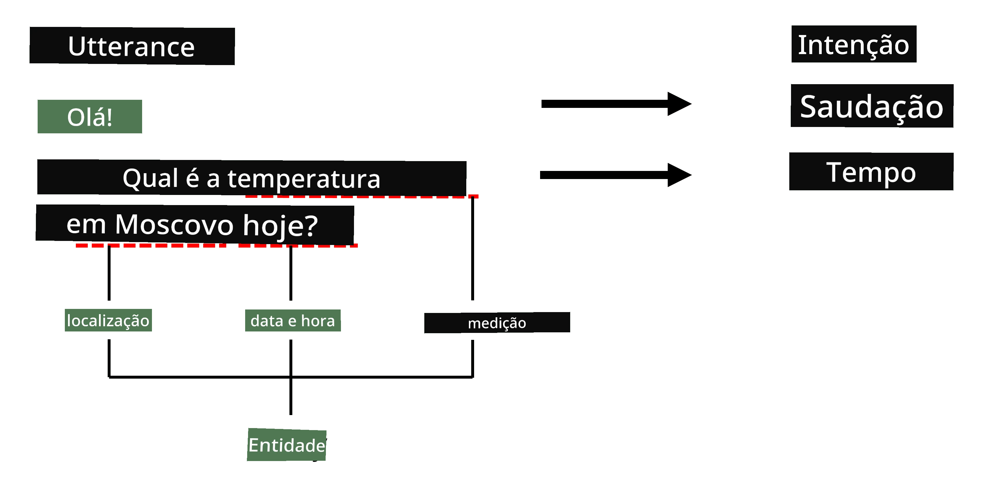

# Reconhecimento de Entidades Nomeadas

Até agora, temos concentrado principalmente numa tarefa de PNL - classificação. No entanto, existem outras tarefas de PNL que podem ser realizadas com redes neuronais. Uma dessas tarefas é o **[Reconhecimento de Entidades Nomeadas](https://wikipedia.org/wiki/Named-entity_recognition)** (NER), que trata de reconhecer entidades específicas dentro de um texto, como lugares, nomes de pessoas, intervalos de data e hora, fórmulas químicas, entre outros.

## [Questionário pré-aula](https://ff-quizzes.netlify.app/en/ai/quiz/37)

## Exemplo de Utilização do NER

Suponha que deseja desenvolver um chatbot de linguagem natural, semelhante ao Amazon Alexa ou Google Assistant. A forma como os chatbots inteligentes funcionam é *entender* o que o utilizador quer, classificando a frase de entrada. O resultado dessa classificação é o chamado **intento**, que determina o que o chatbot deve fazer.

> Imagem do autor

No entanto, o utilizador pode fornecer alguns parâmetros como parte da frase. Por exemplo, ao perguntar sobre o tempo, pode especificar uma localização ou uma data. Um bot deve ser capaz de entender essas entidades e preencher os parâmetros adequadamente antes de executar a ação. É exatamente aqui que o NER entra em ação.

> ✅ Outro exemplo seria [analisar artigos científicos médicos](https://soshnikov.com/science/analyzing-medical-papers-with-azure-and-text-analytics-for-health/). Um dos principais aspetos a procurar são termos médicos específicos, como doenças e substâncias médicas. Enquanto um pequeno número de doenças pode ser extraído através de pesquisa por subcadeias, entidades mais complexas, como compostos químicos e nomes de medicamentos, requerem uma abordagem mais sofisticada.

## NER como Classificação de Tokens

Os modelos de NER são essencialmente **modelos de classificação de tokens**, porque para cada token de entrada precisamos decidir se pertence a uma entidade ou não, e, caso pertença, a qual classe de entidade.

Considere o seguinte título de artigo:

**Regurgitação da válvula tricúspide** e **carbonato de lítio** **toxicidade** em um recém-nascido.

As entidades aqui são:

* Regurgitação da válvula tricúspide é uma doença (`DIS`)
* Carbonato de lítio é uma substância química (`CHEM`)
* Toxicidade também é uma doença (`DIS`)

Note que uma entidade pode abranger vários tokens. E, como neste caso, precisamos distinguir entre duas entidades consecutivas. Assim, é comum usar duas classes para cada entidade - uma especificando o primeiro token da entidade (frequentemente o prefixo `B-` é usado, para **b**eginning), e outra para a continuação da entidade (`I-`, para **i**nner token). Usamos também `O` como classe para representar todos os **o**utros tokens. Essa marcação de tokens é chamada de [marcação BIO](https://en.wikipedia.org/wiki/Inside%E2%80%93outside%E2%80%93beginning_(tagging)) (ou IOB). Quando marcada, o nosso título ficará assim:

Token | Tag
------|-----
Tricuspid | B-DIS
valve | I-DIS
regurgitation | I-DIS
and | O
lithium | B-CHEM
carbonate | I-CHEM
toxicity | B-DIS
in | O
a | O
newborn | O
infant | O
. | O

Como precisamos construir uma correspondência um-para-um entre tokens e classes, podemos treinar um modelo de rede neural **muitos-para-muitos** da seguinte forma:

> *Imagem retirada [deste artigo](http://karpathy.github.io/2015/05/21/rnn-effectiveness/) por [Andrej Karpathy](http://karpathy.github.io/). Os modelos de classificação de tokens NER correspondem à arquitetura de rede mais à direita nesta imagem.*

## Treinar Modelos de NER

Como um modelo de NER é essencialmente um modelo de classificação de tokens, podemos usar RNNs, com os quais já estamos familiarizados, para esta tarefa. Neste caso, cada bloco da rede recorrente retornará o ID do token. O seguinte notebook de exemplo mostra como treinar um LSTM para classificação de tokens.

## ✍️ Notebooks de Exemplo: NER

Continue a sua aprendizagem no seguinte notebook:

* [NER com TensorFlow](NER-TF.ipynb)

## Conclusão

Um modelo de NER é um **modelo de classificação de tokens**, o que significa que pode ser usado para realizar classificação de tokens. Esta é uma tarefa muito comum em PNL, ajudando a reconhecer entidades específicas dentro de um texto, incluindo lugares, nomes, datas e mais.

## 🚀 Desafio

Complete o exercício abaixo para treinar um modelo de reconhecimento de entidades nomeadas para termos médicos e, em seguida, experimente-o num conjunto de dados diferente.

## [Questionário pós-aula](https://ff-quizzes.netlify.app/en/ai/quiz/38)

## Revisão e Estudo Individual

Leia o artigo [The Unreasonable Effectiveness of Recurrent Neural Networks](http://karpathy.github.io/2015/05/21/rnn-effectiveness/) e siga a secção de Leitura Adicional nesse artigo para aprofundar o seu conhecimento.

## [Exercício](lab/README.md)

No exercício desta aula, terá de treinar um modelo de reconhecimento de entidades médicas. Pode começar por treinar um modelo LSTM, como descrito nesta aula, e depois avançar para usar o modelo transformer BERT. Leia [as instruções](lab/README.md) para obter todos os detalhes.

---

