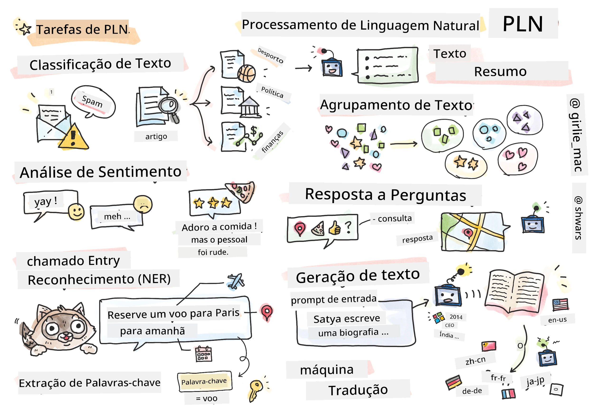

# Processamento de Linguagem Natural



Nesta secção, vamos focar-nos na utilização de Redes Neurais para tratar tarefas relacionadas com o **Processamento de Linguagem Natural (PLN)**. Existem muitos problemas de PLN que queremos que os computadores consigam resolver:

* **Classificação de texto** é um problema típico de classificação relativo a sequências de texto. Exemplos incluem classificar mensagens de e-mail como spam vs. não spam, ou categorizar artigos como desporto, negócios, política, etc. Também, ao desenvolver chat bots, muitas vezes precisamos de entender o que um utilizador quis dizer – neste caso estamos a lidar com **classificação de intenção**. Frequentemente, na classificação de intenção precisamos de lidar com muitas categorias.
* **Análise de sentimento** é um problema típico de regressão, onde precisamos de atribuir um número (um sentimento) correspondente a quão positivo/negativo é o significado de uma frase. Uma versão mais avançada da análise de sentimento é a **análise de sentimento baseada em aspetos** (ABSA), onde atribuimos sentimento não à frase toda, mas a diferentes partes dela (aspeto), por exemplo, *Neste restaurante, gostei da cozinha, mas a atmosfera era horrível*.
* **Reconhecimento de Entidades Nomeadas** (NER) refere-se ao problema de extrair certas entidades do texto. Por exemplo, podemos precisar de entender que na frase *Preciso de voar para Paris amanhã* a palavra *amanhã* refere-se a DATA, e *Paris* é uma LOCALIZAÇÃO.  
* **Extração de palavras-chave** é similar ao NER, mas precisamos de extrair automaticamente palavras importantes para o significado da frase, sem pré-treinamento para tipos de entidade específicos.
* **Agrupamento de texto** pode ser útil quando queremos agrupar frases similares, por exemplo, pedidos semelhantes em conversas de apoio técnico.
* **Resolução de perguntas** refere-se à capacidade de um modelo responder a uma pergunta específica. O modelo recebe como entrada um excerto de texto e uma pergunta, e precisa de indicar um local no texto onde a resposta à pergunta está contida (ou, por vezes, gerar o texto da resposta).
* **Geração de texto** é a capacidade de um modelo gerar novo texto. Pode ser considerado como uma tarefa de classificação que prevê a próxima letra/palavra com base num *texto inicial*. Modelos avançados de geração de texto, como o GPT-3, são capazes de resolver outras tarefas de PLN tais como classificação usando uma técnica chamada [programação de indicativos](https://towardsdatascience.com/software-3-0-how-prompting-will-change-the-rules-of-the-game-a982fbfe1e0) ou [engenharia de indicativos](https://medium.com/swlh/openai-gpt-3-and-prompt-engineering-dcdc2c5fcd29)
* **Sumarização de texto** é uma técnica quando queremos que um computador "leia" um texto longo e o resuma em poucas frases.
* **Tradução automática** pode ser vista como uma combinação de compreensão de texto numa língua e geração de texto noutra.

Inicialmente, a maioria das tarefas de PLN era resolvida usando métodos tradicionais como gramáticas. Por exemplo, na tradução automática eram usados analisadores para transformar a frase inicial numa árvore sintática, depois estruturas semânticas de nível superior eram extraídas para representar o significado da frase, e com base neste significado e na gramática da língua-alvo o resultado era gerado. Atualmente, muitas tarefas de PLN são resolvidas de forma mais eficaz usando redes neurais.

> Muitos métodos clássicos de PLN estão implementados na biblioteca Python [Natural Language Processing Toolkit (NLTK)](https://www.nltk.org). Existe um ótimo [Livro NLTK](https://www.nltk.org/book/) disponível online que aborda como diferentes tarefas de PLN podem ser resolvidas usando o NLTK.

No nosso curso, vamos focar-nos maioritariamente no uso de Redes Neurais para PLN, e usaremos o NLTK onde necessário.

Já aprendemos sobre o uso de redes neurais para lidar com dados tabulares e com imagens. A principal diferença entre esses tipos de dados e o texto é que o texto é uma sequência de comprimento variável, enquanto o tamanho da entrada no caso de imagens é conhecido de antemão. Enquanto redes convolucionais podem extrair padrões dos dados de entrada, os padrões no texto são mais complexos. Por exemplo, podemos ter uma negação separada do sujeito por muitas palavras arbitrárias (exemplo: *Eu não gosto de laranjas*, vs. *Eu não gosto daquelas laranjas grandes, coloridas e saborosas*), e isso ainda deve ser interpretado como um padrão único. Assim, para lidar com a linguagem precisamos de introduzir novos tipos de redes neurais, tais como *redes recorrentes* e *transformers*.

## Instalar Bibliotecas

Se estiver a usar uma instalação local de Python para executar este curso, poderá precisar de instalar todas as bibliotecas necessárias para PLN usando os seguintes comandos:

**Para PyTorch**
```bash
pip install -r requirements-pytorch.txt
```
**Para TensorFlow**
```bash
pip install -r requirements-tf.txt
```

> Pode experimentar PLN com TensorFlow em [Microsoft Learn](https://docs.microsoft.com/learn/modules/intro-natural-language-processing-tensorflow/?WT.mc_id=academic-77998-cacaste)

## Aviso sobre GPU

Nesta secção, em alguns exemplos, vamos treinar modelos bastante grandes.
* **Use um Computador com GPU Ativada**: É aconselhável executar os seus notebooks num computador com GPU ativada para reduzir os tempos de espera quando se trabalha com modelos grandes.
* **Limites de Memória da GPU**: Executar numa GPU pode levar a situações em que fica sem memória na GPU, especialmente ao treinar modelos grandes.
* **Consumo de Memória da GPU**: A quantidade de memória da GPU consumida durante o treino depende de vários fatores, incluindo o tamanho do minibatch.
* **Minimize o Tamanho do Minibatch**: Se encontrar problemas de memória na GPU, considere reduzir o tamanho do minibatch no seu código como solução potencial.
* **Libertação de Memória da GPU pelo TensorFlow**: Versões mais antigas do TensorFlow podem não libertar corretamente a memória da GPU ao treinar múltiplos modelos dentro de um kernel Python. Para gerir eficazmente o uso de memória da GPU, pode configurar o TensorFlow para alocar memória da GPU apenas conforme necessário.
* **Inclusão de Código**: Para configurar o TensorFlow para aumentar a alocação de memória da GPU apenas quando necessário, inclua o seguinte código nos seus notebooks:

```python
physical_devices = tf.config.list_physical_devices('GPU') 
if len(physical_devices)>0:
    tf.config.experimental.set_memory_growth(physical_devices[0], True) 
```

Se estiver interessado em aprender sobre PLN a partir de uma perspetiva clássica de ML, visite [esta coleção de lições](https://github.com/microsoft/ML-For-Beginners/tree/main/6-NLP)

## Nesta Secção
Nesta secção vamos aprender sobre:

* [Representar texto como tensores](13-TextRep/README.md)
* [Word Embeddings (Incorporação de Palavras)](14-Embeddings/README.md)
* [Modelação de Linguagem](15-LanguageModeling/README.md)
* [Redes Neurais Recorrentes](16-RNN/README.md)
* [Redes Generativas](17-GenerativeNetworks/README.md)
* [Transformers](18-Transformers/README.md)

---

<!-- CO-OP TRANSLATOR DISCLAIMER START -->
**Aviso Legal**:
Este documento foi traduzido utilizando o serviço de tradução automática [Co-op Translator](https://github.com/Azure/co-op-translator). Embora nos esforcemos pela precisão, esteja ciente de que traduções automáticas podem conter erros ou imprecisões. O documento original na sua língua nativa deve ser considerado a fonte autorizada. Para informações críticas, recomenda-se tradução profissional humana. Não nos responsabilizamos por quaisquer mal-entendidos ou interpretações incorretas resultantes da utilização desta tradução.
<!-- CO-OP TRANSLATOR DISCLAIMER END -->