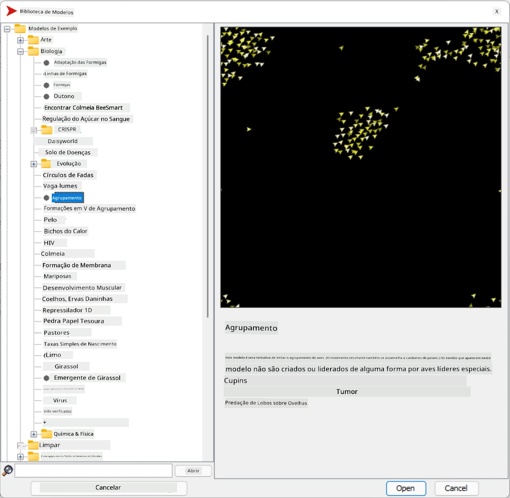
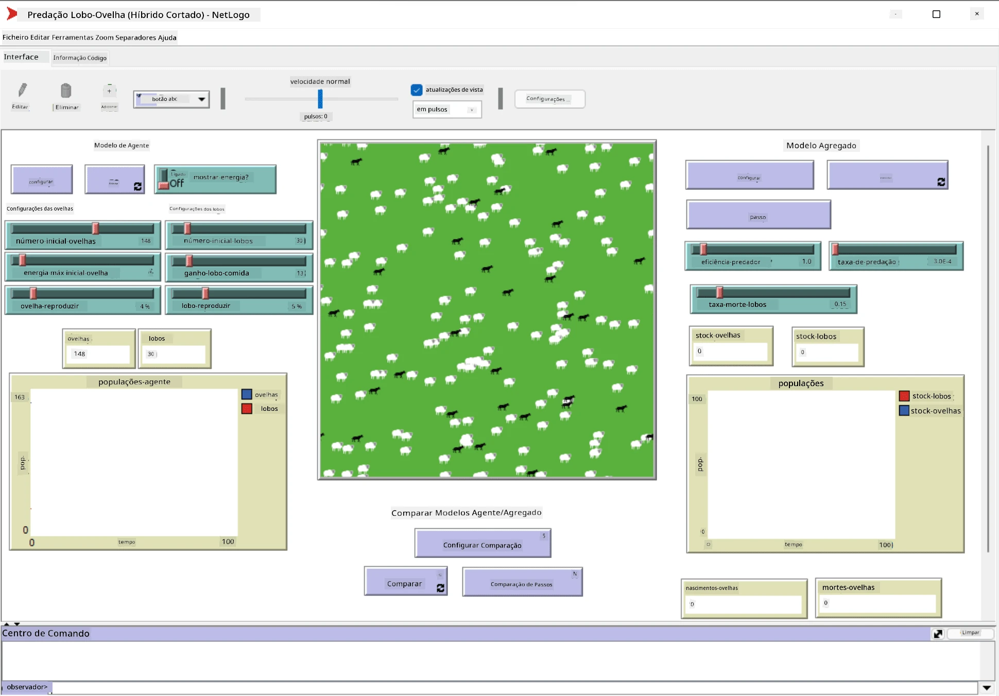

# Sistemas Multi-Agente

Uma das formas possíveis de alcançar inteligência é a abordagem chamada **emergente** (ou **sinergética**), que se baseia no facto de que o comportamento combinado de muitos agentes relativamente simples pode resultar num comportamento geral mais complexo (ou inteligente) do sistema como um todo. Teoricamente, isto baseia-se nos princípios de [Inteligência Coletiva](https://en.wikipedia.org/wiki/Collective_intelligence), [Emergentismo](https://en.wikipedia.org/wiki/Global_brain) e [Cibernética Evolutiva](https://en.wikipedia.org/wiki/Global_brain), que afirmam que sistemas de nível superior ganham algum tipo de valor acrescentado quando são devidamente combinados a partir de sistemas de nível inferior (o chamado *princípio da transição de metasistema*).

## [Questionário pré-aula](https://ff-quizzes.netlify.app/en/ai/quiz/45)

A direção dos **Sistemas Multi-Agente** surgiu na IA nos anos 1990 como uma resposta ao crescimento da Internet e dos sistemas distribuídos. Um dos livros clássicos de IA, [Artificial Intelligence: A Modern Approach](https://en.wikipedia.org/wiki/Artificial_Intelligence:_A_Modern_Approach), foca-se na visão da IA clássica do ponto de vista dos sistemas multi-agente.

Central ao enfoque multi-agente está a noção de **Agente** - uma entidade que vive num **ambiente**, que pode perceber e sobre o qual pode agir. Esta é uma definição muito ampla, e podem existir muitos tipos e classificações diferentes de agentes:

* Pela sua capacidade de raciocinar:
   - Agentes **reativos** geralmente têm um comportamento simples de pedido-resposta
   - Agentes **deliberativos** utilizam algum tipo de raciocínio lógico e/ou capacidades de planeamento
* Pelo local onde o agente executa o seu código:
   - Agentes **estáticos** trabalham num nó de rede dedicado
   - Agentes **móveis** podem mover o seu código entre nós de rede
* Pelo seu comportamento:
   - Agentes **passivos** não têm objetivos específicos. Estes agentes podem reagir a estímulos externos, mas não iniciam ações por si próprios.
   - Agentes **ativos** têm objetivos que perseguem
   - Agentes **cognitivos** envolvem planeamento e raciocínio complexos

Os sistemas multi-agente são atualmente utilizados em várias aplicações:

* Em jogos, muitos personagens não-jogadores utilizam algum tipo de IA e podem ser considerados agentes inteligentes
* Na produção de vídeo, a renderização de cenas 3D complexas que envolvem multidões é normalmente feita utilizando simulação multi-agente
* Na modelação de sistemas, a abordagem multi-agente é usada para simular o comportamento de um modelo complexo. Por exemplo, a abordagem multi-agente foi utilizada com sucesso para prever a propagação da COVID-19 em todo o mundo. Abordagens semelhantes podem ser usadas para modelar o tráfego numa cidade e ver como reage a alterações nas regras de trânsito.
* Em sistemas de automação complexos, cada dispositivo pode atuar como um agente independente, tornando o sistema menos monolítico e mais robusto.

Não vamos dedicar muito tempo a explorar profundamente os sistemas multi-agente, mas vamos considerar um exemplo de **Modelação Multi-Agente**.

## NetLogo

[NetLogo](https://ccl.northwestern.edu/netlogo/) é um ambiente de modelação multi-agente baseado numa versão modificada da linguagem de programação [Logo](https://en.wikipedia.org/wiki/Logo_(programming_language)). Esta linguagem foi desenvolvida para ensinar conceitos de programação a crianças e permite controlar um agente chamado **tartaruga**, que pode mover-se deixando um rastro atrás de si. Isto permite criar figuras geométricas complexas, sendo uma forma muito visual de compreender o comportamento de um agente.

No NetLogo, podemos criar muitas tartarugas utilizando o comando `create-turtles`. Podemos então comandar todas as tartarugas para realizarem algumas ações (no exemplo abaixo - mover 10 pontos para a frente):

```
create-turtles 10
ask turtles [
  forward 10
]
```

Claro que não é interessante quando todas as tartarugas fazem a mesma coisa, por isso podemos `ask` grupos de tartarugas, por exemplo, aquelas que estão nas proximidades de um determinado ponto. Também podemos criar tartarugas de diferentes *raças* utilizando o comando `breed [cats cat]`. Aqui `cat` é o nome de uma raça, e precisamos especificar tanto a palavra no singular como no plural, porque diferentes comandos utilizam formas diferentes para maior clareza.

> ✅ Não vamos aprender a linguagem NetLogo em si - pode visitar o excelente recurso [Beginner's Interactive NetLogo Dictionary](https://ccl.northwestern.edu/netlogo/bind/) se estiver interessado em aprender mais.

Pode [descarregar](https://ccl.northwestern.edu/netlogo/download.shtml) e instalar o NetLogo para experimentar.

### Biblioteca de Modelos

Uma das grandes vantagens do NetLogo é que contém uma biblioteca de modelos funcionais que pode experimentar. Vá a **File &rightarrow; Models Library**, e terá muitas categorias de modelos para escolher.



> Uma captura de ecrã da biblioteca de modelos por Dmitry Soshnikov

Pode abrir um dos modelos, por exemplo **Biology &rightarrow; Flocking**.

### Princípios Principais

Depois de abrir o modelo, será levado ao ecrã principal do NetLogo. Aqui está um modelo de exemplo que descreve a população de lobos e ovelhas, dado recursos finitos (relva).



> Captura de ecrã por Dmitry Soshnikov

Neste ecrã, pode ver:

* A secção **Interface**, que contém:
  - O campo principal, onde todos os agentes vivem
  - Diferentes controlos: botões, sliders, etc.
  - Gráficos que pode usar para exibir parâmetros da simulação
* O separador **Code**, que contém o editor onde pode escrever o programa NetLogo

Na maioria dos casos, a interface terá um botão **Setup**, que inicializa o estado da simulação, e um botão **Go**, que inicia a execução. Estes são tratados por manipuladores correspondentes no código que se parecem com isto:

```
to go [
...
]
```

O mundo do NetLogo consiste nos seguintes objetos:

* **Agentes** (tartarugas) que podem mover-se pelo campo e fazer algo. Comanda os agentes utilizando a sintaxe `ask turtles [...]`, e o código entre parênteses é executado por todos os agentes em *modo tartaruga*.
* **Patches** são áreas quadradas do campo onde os agentes vivem. Pode referir-se a todos os agentes no mesmo patch ou pode alterar as cores dos patches e algumas outras propriedades. Também pode `ask patches` para fazer algo.
* **Observer** é um agente único que controla o mundo. Todos os manipuladores de botões são executados em *modo observador*.

> ✅ A beleza de um ambiente multi-agente é que o código que corre em modo tartaruga ou em modo patch é executado ao mesmo tempo por todos os agentes em paralelo. Assim, ao escrever pouco código e programar o comportamento de um agente individual, pode criar um comportamento complexo do sistema de simulação como um todo.

### Flocking

Como exemplo de comportamento multi-agente, vamos considerar **[Flocking](https://en.wikipedia.org/wiki/Flocking_(behavior))**. Flocking é um padrão complexo muito semelhante ao modo como bandos de pássaros voam. Ao observá-los, pode pensar que seguem algum tipo de algoritmo coletivo ou que possuem alguma forma de *inteligência coletiva*. No entanto, este comportamento complexo surge quando cada agente individual (neste caso, um *pássaro*) apenas observa alguns outros agentes numa curta distância e segue três regras simples:

* **Alinhamento** - dirige-se para a direção média dos agentes vizinhos
* **Coesão** - tenta dirigir-se para a posição média dos vizinhos (*atração de longo alcance*)
* **Separação** - ao aproximar-se demasiado de outros pássaros, tenta afastar-se (*repulsão de curto alcance*)

Pode executar o exemplo de flocking e observar o comportamento. Também pode ajustar parâmetros, como o *grau de separação* ou o *alcance de visão*, que define até onde cada pássaro pode ver. Note que, se diminuir o alcance de visão para 0, todos os pássaros ficam cegos e o flocking para. Se diminuir a separação para 0, todos os pássaros juntam-se numa linha reta.

> ✅ Mude para o separador **Code** e veja onde as três regras de flocking (alinhamento, coesão e separação) estão implementadas no código. Note como nos referimos apenas aos agentes que estão à vista.

### Outros Modelos para Ver

Há mais alguns modelos interessantes que pode experimentar:

* **Art &rightarrow; Fireworks** mostra como um fogo de artifício pode ser considerado um comportamento coletivo de correntes individuais de fogo
* **Social Science &rightarrow; Traffic Basic** e **Social Science &rightarrow; Traffic Grid** mostram o modelo de tráfego urbano em 1D e numa grelha 2D com ou sem semáforos. Cada carro na simulação segue as seguintes regras:
   - Se o espaço à sua frente estiver vazio - acelera (até uma certa velocidade máxima)
   - Se vir um obstáculo à frente - trava (e pode ajustar até onde o condutor pode ver)
* **Social Science &rightarrow; Party** mostra como as pessoas se agrupam durante uma festa de cocktail. Pode encontrar a combinação de parâmetros que leva ao aumento mais rápido da felicidade do grupo.

Como pode ver nestes exemplos, as simulações multi-agente podem ser uma forma bastante útil de compreender o comportamento de um sistema complexo composto por indivíduos que seguem a mesma lógica ou lógica semelhante. Também pode ser usado para controlar agentes virtuais, como [NPCs](https://en.wikipedia.org/wiki/NPC) em jogos de computador ou agentes em mundos animados em 3D.

## Agentes Deliberativos

Os agentes descritos acima são muito simples, reagindo a mudanças no ambiente utilizando algum tipo de algoritmo. Como tal, são **agentes reativos**. No entanto, por vezes os agentes podem raciocinar e planear as suas ações, caso em que são chamados **deliberativos**.

Um exemplo típico seria um agente pessoal que recebe uma instrução de um humano para reservar uma viagem de férias. Suponha que existem muitos agentes que vivem na internet e que podem ajudá-lo. Deve então contactar outros agentes para ver quais voos estão disponíveis, quais são os preços dos hotéis para diferentes datas e tentar negociar o melhor preço. Quando o plano de férias estiver completo e confirmado pelo proprietário, pode proceder à reserva.

Para isso, os agentes precisam de **comunicar**. Para uma comunicação bem-sucedida, precisam de:

* Algumas **linguagens padrão para trocar conhecimento**, como [Knowledge Interchange Format](https://en.wikipedia.org/wiki/Knowledge_Interchange_Format) (KIF) e [Knowledge Query and Manipulation Language](https://en.wikipedia.org/wiki/Knowledge_Query_and_Manipulation_Language) (KQML). Estas linguagens são projetadas com base na [Teoria dos Atos de Fala](https://en.wikipedia.org/wiki/Speech_act).
* Estas linguagens devem também incluir alguns **protocolos para negociações**, baseados em diferentes **tipos de leilão**.
* Uma **ontologia comum** para usar, de modo que se refiram aos mesmos conceitos conhecendo os seus significados
* Uma forma de **descobrir** o que diferentes agentes podem fazer, também baseada em algum tipo de ontologia

Os agentes deliberativos são muito mais complexos do que os reativos, porque não apenas reagem a mudanças no ambiente, mas também devem ser capazes de *iniciar* ações. Uma das arquiteturas propostas para agentes deliberativos é o chamado agente de Crença-Desejo-Intenção (BDI):

* **Crenças** formam um conjunto de conhecimento sobre o ambiente do agente. Pode ser estruturado como uma base de conhecimento ou conjunto de regras que um agente pode aplicar a uma situação específica no ambiente.
* **Desejos** definem o que um agente quer fazer, ou seja, os seus objetivos. Por exemplo, o objetivo do agente assistente pessoal acima é reservar uma viagem, e o objetivo de um agente de hotel é maximizar o lucro.
* **Intenções** são ações específicas que um agente planeia para alcançar os seus objetivos. As ações normalmente mudam o ambiente e causam comunicação com outros agentes.

Existem algumas plataformas disponíveis para construir sistemas multi-agente, como [JADE](https://jade.tilab.com/). [Este artigo](https://arxiv.org/ftp/arxiv/papers/2007/2007.08961.pdf) contém uma revisão das plataformas multi-agente, juntamente com uma breve história dos sistemas multi-agente e os seus diferentes cenários de uso.

## Conclusão

Os sistemas multi-agente podem assumir formas muito diferentes e ser usados em muitas aplicações diferentes. 
Todos tendem a focar-se no comportamento mais simples de um agente individual e alcançar um comportamento mais complexo do sistema geral devido ao **efeito sinergético**.

## 🚀 Desafio

Leve esta lição para o mundo real e tente conceptualizar um sistema multi-agente que possa resolver um problema. O que, por exemplo, um sistema multi-agente precisaria fazer para otimizar uma rota de autocarro escolar? Como poderia funcionar numa padaria?

## [Questionário pós-aula](https://ff-quizzes.netlify.app/en/ai/quiz/46)

## Revisão e Autoestudo

Revise o uso deste tipo de sistema na indústria. Escolha um domínio, como a manufatura ou a indústria de videojogos, e descubra como os sistemas multi-agente podem ser usados para resolver problemas únicos.

## [Tarefa NetLogo](assignment.md)

---

