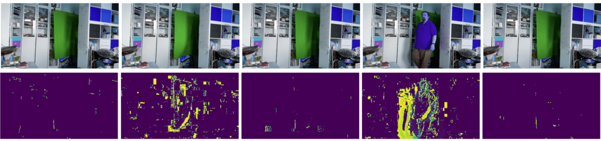

# Introdução à Visão Computacional

[A Visão Computacional](https://wikipedia.org/wiki/Computer_vision) é uma disciplina cujo objetivo é permitir que os computadores adquiram uma compreensão de alto nível de imagens digitais. Essa é uma definição bastante ampla, pois *compreensão* pode significar muitas coisas diferentes, incluindo encontrar um objeto em uma imagem (**detecção de objetos**), entender o que está acontecendo (**detecção de eventos**), descrever uma imagem em texto ou reconstruir uma cena em 3D. Também existem tarefas especiais relacionadas a imagens humanas: estimativa de idade e emoção, detecção e identificação de rostos, e estimativa de pose em 3D, para citar algumas.

## [Quiz pré-aula](https://red-field-0a6ddfd03.1.azurestaticapps.net/quiz/106)

Uma das tarefas mais simples da visão computacional é a **classificação de imagens**.

A visão computacional é frequentemente considerada uma ramificação da IA. Hoje em dia, a maioria das tarefas de visão computacional é resolvida usando redes neurais. Aprenderemos mais sobre o tipo especial de redes neurais usadas para visão computacional, [redes neurais convolucionais](../07-ConvNets/README.md), ao longo desta seção.

No entanto, antes de passar a imagem para uma rede neural, em muitos casos faz sentido usar algumas técnicas algorítmicas para melhorar a imagem.

Existem várias bibliotecas Python disponíveis para processamento de imagens:

* **[imageio](https://imageio.readthedocs.io/en/stable/)** pode ser usada para ler/escrever diferentes formatos de imagem. Também suporta ffmpeg, uma ferramenta útil para converter quadros de vídeo em imagens.
* **[Pillow](https://pillow.readthedocs.io/en/stable/index.html)** (também conhecido como PIL) é um pouco mais poderosa e também suporta algumas manipulações de imagem, como morphing, ajustes de paleta e mais.
* **[OpenCV](https://opencv.org/)** é uma poderosa biblioteca de processamento de imagens escrita em C++, que se tornou o padrão *de fato* para processamento de imagens. Ela possui uma interface conveniente para Python.
* **[dlib](http://dlib.net/)** é uma biblioteca C++ que implementa muitos algoritmos de aprendizado de máquina, incluindo alguns dos algoritmos de Visão Computacional. Também possui uma interface Python e pode ser usada para tarefas desafiadoras, como detecção de rostos e pontos de referência faciais.

## OpenCV

[OpenCV](https://opencv.org/) é considerado o padrão *de fato* para processamento de imagens. Ele contém muitos algoritmos úteis, implementados em C++. Você também pode chamar o OpenCV a partir do Python.

Um bom lugar para aprender OpenCV é [este curso Learn OpenCV](https://learnopencv.com/getting-started-with-opencv/). Em nosso currículo, nosso objetivo não é aprender OpenCV, mas mostrar alguns exemplos de quando ele pode ser usado e como.

### Carregando Imagens

Imagens em Python podem ser convenientemente representadas por arrays NumPy. Por exemplo, imagens em escala de cinza com tamanho de 320x200 pixels seriam armazenadas em um array de 200x320, e imagens coloridas da mesma dimensão teriam a forma de 200x320x3 (para 3 canais de cor). Para carregar uma imagem, você pode usar o seguinte código:

```python
import cv2
import matplotlib.pyplot as plt

im = cv2.imread('image.jpeg')
plt.imshow(im)
```

Tradicionalmente, o OpenCV usa a codificação BGR (Azul-Verde-Vermelho) para imagens coloridas, enquanto o restante das ferramentas Python usa o mais tradicional RGB (Vermelho-Verde-Azul). Para que a imagem pareça correta, você precisa convertê-la para o espaço de cores RGB, seja trocando dimensões no array NumPy, ou chamando uma função do OpenCV:

```python
im = cv2.cvtColor(im,cv2.COLOR_BGR2RGB)
```

As mesmas funções `cvtColor` function can be used to perform other color space transformations such as converting an image to grayscale or to the HSV (Hue-Saturation-Value) color space.

You can also use OpenCV to load video frame-by-frame - an example is given in the exercise [OpenCV Notebook](../../../../../lessons/4-ComputerVision/06-IntroCV/OpenCV.ipynb).

### Image Processing

Before feeding an image to a neural network, you may want to apply several pre-processing steps. OpenCV can do many things, including:

* **Resizing** the image using `im = cv2.resize(im, (320,200),interpolation=cv2.INTER_LANCZOS)`
* **Blurring** the image using `im = cv2.medianBlur(im,3)` or `im = cv2.GaussianBlur(im, (3,3), 0)`
* Changing the **brightness and contrast** of the image can be done by NumPy array manipulations, as described [in this Stackoverflow note](https://stackoverflow.com/questions/39308030/how-do-i-increase-the-contrast-of-an-image-in-python-opencv).
* Using [thresholding](https://docs.opencv.org/4.x/d7/d4d/tutorial_py_thresholding.html) by calling `cv2.threshold`/`cv2.adaptiveThreshold`, que muitas vezes são preferíveis ao ajuste de brilho ou contraste.
* Aplicando diferentes [transformações](https://docs.opencv.org/4.5.5/da/d6e/tutorial_py_geometric_transformations.html) à imagem:
    - **[Transformações afins](https://docs.opencv.org/4.5.5/d4/d61/tutorial_warp_affine.html)** podem ser úteis se você precisar combinar rotação, redimensionamento e distorção à imagem e souber a localização de origem e destino de três pontos na imagem. Transformações afins mantêm linhas paralelas paralelas.
    - **[Transformações de perspectiva](https://medium.com/analytics-vidhya/opencv-perspective-transformation-9edffefb2143)** podem ser úteis quando você conhece as posições de origem e destino de 4 pontos na imagem. Por exemplo, se você tirar uma foto de um documento retangular através da câmera de um smartphone de algum ângulo, e quiser fazer uma imagem retangular do próprio documento.
* Compreendendo o movimento dentro da imagem usando **[fluxo óptico](https://docs.opencv.org/4.5.5/d4/dee/tutorial_optical_flow.html)**.

## Exemplos de uso da Visão Computacional

Em nosso [Notebook OpenCV](../../../../../lessons/4-ComputerVision/06-IntroCV/OpenCV.ipynb), damos alguns exemplos de quando a visão computacional pode ser usada para realizar tarefas específicas:

* **Pré-processamento de uma fotografia de um livro em Braille**. Focamos em como podemos usar limiares, detecção de características, transformação de perspectiva e manipulações NumPy para separar símbolos individuais de Braille para posterior classificação por uma rede neural.

 |  | 
----|-----|-----

> Imagem do [OpenCV.ipynb](../../../../../lessons/4-ComputerVision/06-IntroCV/OpenCV.ipynb)

* **Detectando movimento em vídeo usando diferença de quadros**. Se a câmera estiver fixa, então os quadros do feed da câmera devem ser bastante semelhantes entre si. Como os quadros são representados como arrays, apenas subtraindo esses arrays de dois quadros subsequentes obteremos a diferença de pixels, que deve ser baixa para quadros estáticos e aumentar quando houver movimento substancial na imagem.



> Imagem do [OpenCV.ipynb](../../../../../lessons/4-ComputerVision/06-IntroCV/OpenCV.ipynb)

* **Detectando movimento usando Fluxo Óptico**. [O fluxo óptico](https://docs.opencv.org/3.4/d4/dee/tutorial_optical_flow.html) nos permite entender como pixels individuais nos quadros de vídeo se movem. Existem dois tipos de fluxo óptico:

   - **Fluxo Óptico Denso** calcula o campo de vetores que mostra para cada pixel para onde ele está se movendo.
   - **Fluxo Óptico Esparso** baseia-se na captura de algumas características distintivas na imagem (por exemplo, bordas) e construindo sua trajetória de quadro a quadro.


> Imagem do [OpenCV.ipynb](../../../../../lessons/4-ComputerVision/06-IntroCV/OpenCV.ipynb)

## ✍️ Notebooks de Exemplo: OpenCV [tente OpenCV em Ação](../../../../../lessons/4-ComputerVision/06-IntroCV/OpenCV.ipynb)

Vamos fazer alguns experimentos com OpenCV explorando o [Notebook OpenCV](../../../../../lessons/4-ComputerVision/06-IntroCV/OpenCV.ipynb).

## Conclusão

Às vezes, tarefas relativamente complexas, como detecção de movimento ou detecção de ponta dos dedos, podem ser resolvidas puramente por visão computacional. Assim, é muito útil conhecer as técnicas básicas de visão computacional e o que bibliotecas como OpenCV podem fazer.

## 🚀 Desafio

Assista [a este vídeo](https://docs.microsoft.com/shows/ai-show/ai-show--2021-opencv-ai-competition--grand-prize-winners--cortic-tigers--episode-32?WT.mc_id=academic-77998-cacaste) do AI Show para aprender sobre o projeto Cortic Tigers e como eles construíram uma solução baseada em blocos para democratizar tarefas de visão computacional por meio de um robô. Faça algumas pesquisas sobre outros projetos como esse que ajudam a integrar novos aprendizes no campo.

## [Quiz pós-aula](https://red-field-0a6ddfd03.1.azurestaticapps.net/quiz/206)

## Revisão & Autoestudo

Leia mais sobre fluxo óptico [neste ótimo tutorial](https://learnopencv.com/optical-flow-in-opencv/).

## [Tarefa](lab/README.md)

Neste laboratório, você fará um vídeo com gestos simples, e seu objetivo é extrair movimentos para cima/baixo/esquerda/direita usando fluxo óptico.


**Isenção de responsabilidade**:  
Este documento foi traduzido usando serviços de tradução automática baseados em IA. Embora nos esforcemos pela precisão, esteja ciente de que as traduções automatizadas podem conter erros ou imprecisões. O documento original em sua língua nativa deve ser considerado a fonte autoritativa. Para informações críticas, recomenda-se a tradução profissional por um humano. Não nos responsabilizamos por quaisquer mal-entendidos ou interpretações errôneas decorrentes do uso desta tradução.