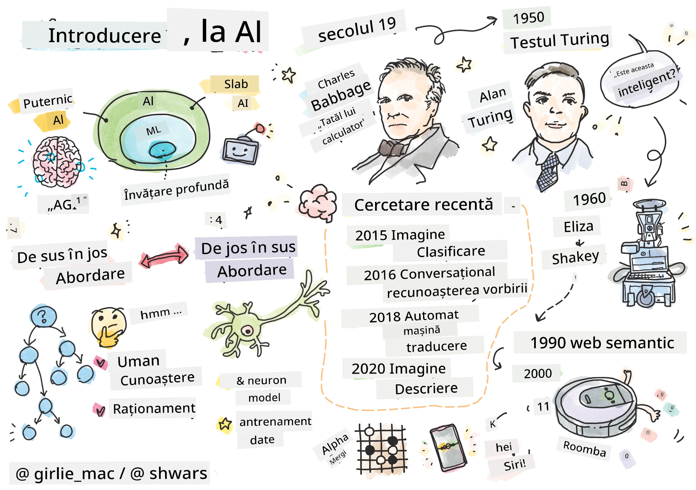
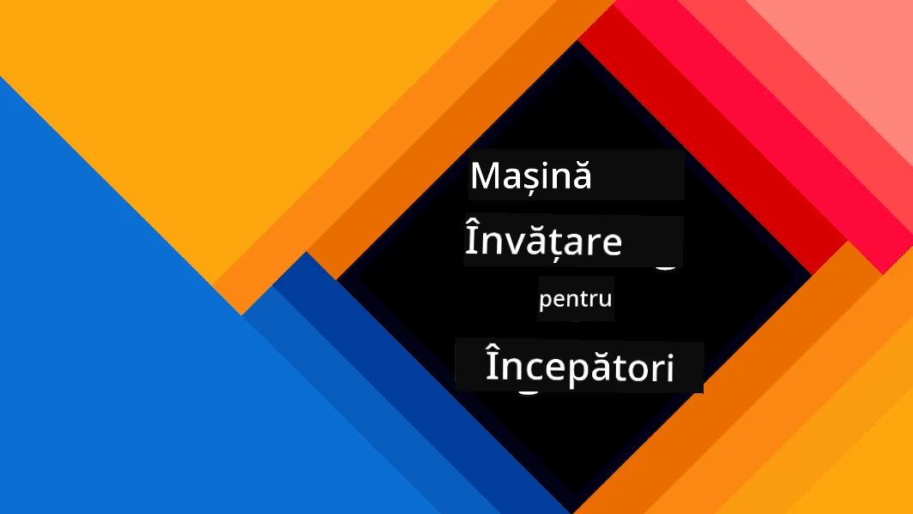
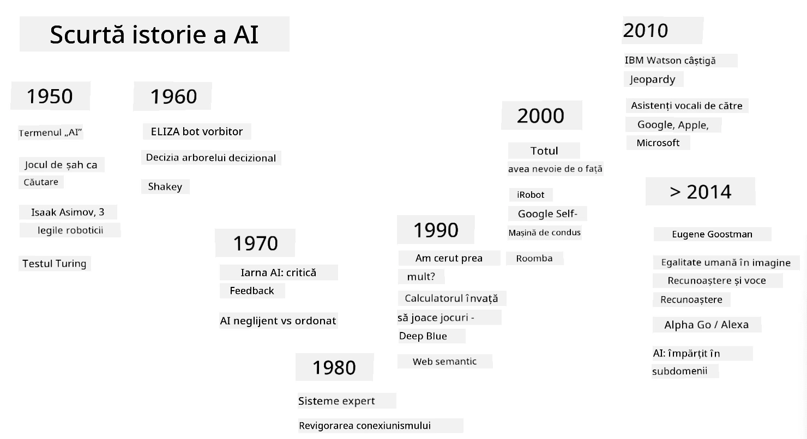
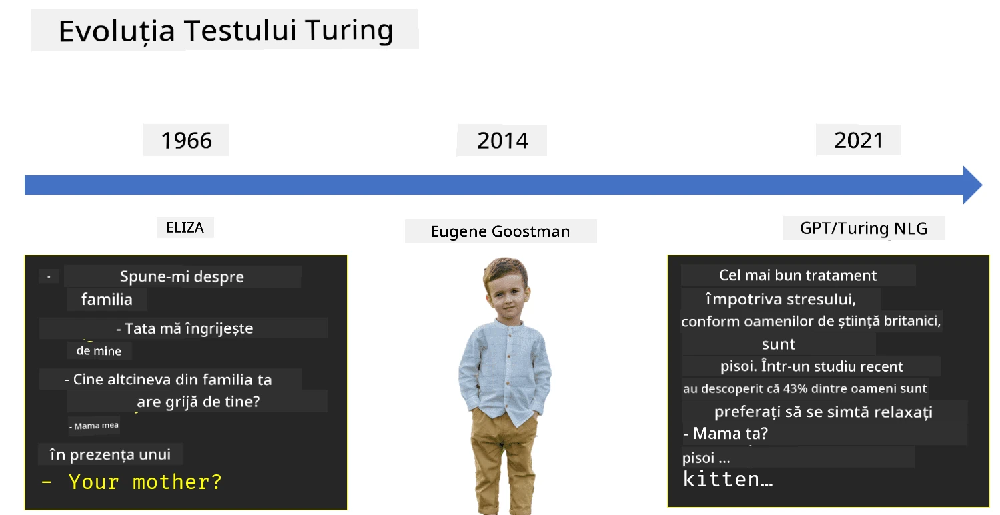

# Introducere în Inteligența Artificială

> Schiță de [Tomomi Imura](https://twitter.com/girlie_mac)

## [Chestionar înainte de curs](https://ff-quizzes.netlify.app/en/ai/quiz/1)

**Inteligența Artificială** este o disciplină științifică fascinantă care studiază cum putem face computerele să manifeste un comportament inteligent, de exemplu, să facă acele lucruri la care oamenii sunt buni.

Inițial, computerele au fost inventate de [Charles Babbage](https://en.wikipedia.org/wiki/Charles_Babbage) pentru a opera pe numere urmând o procedură bine definită - un algoritm. Computerele moderne, deși semnificativ mai avansate decât modelul original propus în secolul al XIX-lea, încă urmează aceeași idee de calcule controlate. Astfel, este posibil să programăm un computer să facă ceva dacă știm exact secvența de pași necesară pentru a atinge scopul.

> Fotografie de [Vickie Soshnikova](http://twitter.com/vickievalerie)

> ✅ Definirea vârstei unei persoane dintr-o fotografie este o sarcină care nu poate fi programată explicit, deoarece nu știm cum ajungem la un număr în mintea noastră atunci când facem acest lucru.

---

Există însă unele sarcini pentru care nu știm explicit cum să găsim o soluție. Luați în considerare determinarea vârstei unei persoane dintr-o fotografie. Cumva învățăm să facem acest lucru, deoarece am văzut multe exemple de oameni de vârste diferite, dar nu putem explica explicit cum facem acest lucru și nici nu putem programa computerul să o facă. Acesta este exact tipul de sarcină care interesează **Inteligența Artificială** (prescurtat AI).

✅ Gândiți-vă la câteva sarcini pe care le-ați putea delega unui computer care ar beneficia de AI. Luați în considerare domeniile finanțelor, medicinei și artelor - cum beneficiază aceste domenii astăzi de AI?

## AI Slabă vs. AI Puternică

AI Slabă | AI Puternică
---------------------------------------|-------------------------------------
AI slabă se referă la sisteme AI care sunt proiectate și antrenate pentru o sarcină specifică sau un set restrâns de sarcini. | AI puternică, sau Inteligența Artificială Generală (AGI), se referă la sisteme AI cu inteligență și înțelegere la nivel uman.
Aceste sisteme AI nu sunt în general inteligente; ele excelează în îndeplinirea unei sarcini predefinite, dar nu au o înțelegere reală sau conștiință. | Aceste sisteme AI au capacitatea de a îndeplini orice sarcină intelectuală pe care o poate face un om, de a se adapta la diferite domenii și de a poseda o formă de conștiință sau auto-conștientizare.
Exemple de AI slabă includ asistenți virtuali precum Siri sau Alexa, algoritmi de recomandare utilizați de serviciile de streaming și chatboți proiectați pentru sarcini specifice de asistență pentru clienți. | Obținerea AI puternice este un obiectiv pe termen lung al cercetării în AI și ar necesita dezvoltarea unor sisteme AI care pot raționa, învăța, înțelege și se pot adapta într-o gamă largă de sarcini și contexte.
AI slabă este extrem de specializată și nu posedă abilități cognitive asemănătoare celor umane sau capacități generale de rezolvare a problemelor dincolo de domeniul său restrâns. | AI puternică este în prezent un concept teoretic, iar niciun sistem AI nu a atins acest nivel de inteligență generală.

Pentru mai multe informații, consultați **[Inteligența Artificială Generală](https://en.wikipedia.org/wiki/Artificial_general_intelligence)** (AGI).

## Definiția Inteligenței și Testul Turing

Una dintre problemele legate de termenul **[Inteligență](https://en.wikipedia.org/wiki/Intelligence)** este că nu există o definiție clară a acestui termen. Se poate argumenta că inteligența este legată de **gândirea abstractă** sau de **auto-conștientizare**, dar nu o putem defini corect.

> [Fotografie](https://unsplash.com/photos/75715CVEJhI) de [Amber Kipp](https://unsplash.com/@sadmax) de pe Unsplash

Pentru a vedea ambiguitatea termenului *inteligență*, încercați să răspundeți la întrebarea: "Este o pisică inteligentă?". Diferite persoane tind să dea răspunsuri diferite la această întrebare, deoarece nu există un test universal acceptat pentru a dovedi dacă afirmația este adevărată sau nu. Și dacă credeți că există - încercați să supuneți pisica dumneavoastră unui test de IQ...

✅ Gândiți-vă un minut la cum definiți inteligența. Este o cioară care poate rezolva un labirint pentru a ajunge la mâncare inteligentă? Este un copil inteligent?

---

Când vorbim despre AGI, trebuie să avem o modalitate de a spune dacă am creat un sistem cu adevărat inteligent. [Alan Turing](https://en.wikipedia.org/wiki/Alan_Turing) a propus o metodă numită **[Testul Turing](https://en.wikipedia.org/wiki/Turing_test)**, care acționează și ca o definiție a inteligenței. Testul compară un sistem dat cu ceva inerent inteligent - un om real, și deoarece orice comparație automată poate fi evitată de un program de computer, folosim un interogator uman. Astfel, dacă o persoană nu poate distinge între o persoană reală și un sistem de computer într-un dialog bazat pe text - sistemul este considerat inteligent.

> Un chatbot numit [Eugene Goostman](https://en.wikipedia.org/wiki/Eugene_Goostman), dezvoltat în Sankt Petersburg, a fost aproape de a trece testul Turing în 2014 folosind un truc de personalitate ingenios. A anunțat de la început că este un băiat ucrainean de 13 ani, ceea ce ar explica lipsa de cunoștințe și unele discrepanțe în text. Botul a convins 30% dintre judecători că este uman după un dialog de 5 minute, o metrică pe care Turing credea că o mașină ar putea să o atingă până în anul 2000. Totuși, trebuie să înțelegem că acest lucru nu indică faptul că am creat un sistem inteligent sau că un sistem de computer a păcălit interogatorul uman - sistemul nu a păcălit oamenii, ci mai degrabă creatorii botului au făcut-o!

✅ Ați fost vreodată păcălit de un chatbot să credeți că vorbiți cu un om? Cum v-a convins?

## Diferite abordări ale AI

Dacă vrem ca un computer să se comporte ca un om, trebuie cumva să modelăm în interiorul unui computer modul nostru de gândire. În consecință, trebuie să încercăm să înțelegem ce face o ființă umană inteligentă.

> Pentru a putea programa inteligența într-o mașină, trebuie să înțelegem cum funcționează propriile noastre procese de luare a deciziilor. Dacă faceți puțină introspecție, veți realiza că există unele procese care se întâmplă subconștient – de exemplu, putem distinge o pisică de un câine fără să ne gândim la asta - în timp ce altele implică raționament.

Există două abordări posibile pentru această problemă:

Abordare de sus în jos (Raționament simbolic) | Abordare de jos în sus (Rețele neuronale)
---------------------------------------|-------------------------------------
O abordare de sus în jos modelează modul în care o persoană raționează pentru a rezolva o problemă. Implică extragerea **cunoștințelor** de la o ființă umană și reprezentarea lor într-o formă citibilă de computer. De asemenea, trebuie să dezvoltăm o modalitate de a modela **raționamentul** în interiorul unui computer. | O abordare de jos în sus modelează structura creierului uman, constând dintr-un număr mare de unități simple numite **neuroni**. Fiecare neuron acționează ca o medie ponderată a intrărilor sale, iar noi putem antrena o rețea de neuroni să rezolve probleme utile oferindu-i **date de antrenament**.

Există și alte abordări posibile ale inteligenței:

* O abordare **Emergentă**, **Sinergică** sau **multi-agent** se bazează pe faptul că un comportament inteligent complex poate fi obținut prin interacțiunea unui număr mare de agenți simpli. Conform [ciberneticii evoluționare](https://en.wikipedia.org/wiki/Global_brain#Evolutionary_cybernetics), inteligența poate *emerge* dintr-un comportament mai simplu, reactiv, în procesul de *tranziție metasistemică*.

* O abordare **Evoluționistă**, sau **algoritm genetic**, este un proces de optimizare bazat pe principiile evoluției.

Vom analiza aceste abordări mai târziu în curs, dar acum ne vom concentra pe două direcții principale: de sus în jos și de jos în sus.

### Abordarea de Sus în Jos

Într-o **abordare de sus în jos**, încercăm să modelăm raționamentul nostru. Deoarece putem urmări gândurile noastre atunci când raționăm, putem încerca să formalizăm acest proces și să-l programăm în interiorul computerului. Aceasta se numește **raționament simbolic**.

Oamenii tind să aibă unele reguli în mintea lor care le ghidează procesele de luare a deciziilor. De exemplu, atunci când un medic diagnostichează un pacient, el sau ea poate realiza că o persoană are febră și, astfel, ar putea exista o inflamație în corp. Aplicând un set mare de reguli la o problemă specifică, un medic poate ajunge la un diagnostic final.

Această abordare se bazează foarte mult pe **reprezentarea cunoștințelor** și **raționament**. Extragerea cunoștințelor de la un expert uman poate fi cea mai dificilă parte, deoarece un medic, în multe cazuri, nu ar ști exact de ce ajunge la un anumit diagnostic. Uneori soluția pur și simplu apare în mintea sa fără un gând explicit. Unele sarcini, cum ar fi determinarea vârstei unei persoane dintr-o fotografie, nu pot fi deloc reduse la manipularea cunoștințelor.

### Abordarea de Jos în Sus

Alternativ, putem încerca să modelăm cele mai simple elemente din creierul nostru – un neuron. Putem construi o așa-numită **rețea neuronală artificială** în interiorul unui computer și apoi să încercăm să o învățăm să rezolve probleme oferindu-i exemple. Acest proces este similar cu modul în care un copil nou-născut învață despre mediul său prin observații.

✅ Faceți puțină cercetare despre cum învață bebelușii. Care sunt elementele de bază ale creierului unui bebeluș?

> | Ce ziceți de ML?         |      |
> |--------------|-----------|
> | O parte a Inteligenței Artificiale care se bazează pe învățarea computerului să rezolve o problemă pe baza unor date se numește **Învățare Automată**. Nu vom analiza învățarea automată clasică în acest curs - vă recomandăm un curriculum separat [Machine Learning for Beginners](http://aka.ms/ml-beginners). |       |

## O Scurtă Istorie a AI

Inteligența Artificială a început ca un domeniu la mijlocul secolului XX. Inițial, raționamentul simbolic a fost o abordare predominantă și a condus la o serie de succese importante, cum ar fi sistemele expert – programe de computer care puteau acționa ca un expert în unele domenii limitate de probleme. Cu toate acestea, a devenit curând clar că o astfel de abordare nu se scalează bine. Extragerea cunoștințelor de la un expert, reprezentarea lor într-un computer și menținerea bazei de cunoștințe exacte s-a dovedit a fi o sarcină foarte complexă și prea costisitoare pentru a fi practică în multe cazuri. Acest lucru a dus la așa-numita [Iarnă AI](https://en.wikipedia.org/wiki/AI_winter) în anii 1970.

> Imagine de [Dmitry Soshnikov](http://soshnikov.com)

Pe măsură ce timpul a trecut, resursele de calcul au devenit mai ieftine și mai multe date au devenit disponibile, astfel încât abordările bazate pe rețele neuronale au început să demonstreze performanțe excelente în competiția cu oamenii în multe domenii, cum ar fi viziunea computerizată sau înțelegerea vorbirii. În ultimul deceniu, termenul Inteligență Artificială a fost folosit în mare parte ca sinonim pentru Rețele Neuronale, deoarece majoritatea succeselor AI despre care auzim se bazează pe acestea.

Putem observa cum s-au schimbat abordările, de exemplu, în crearea unui program de computer care joacă șah:

* Programele de șah timpurii se bazau pe căutare – un program încerca explicit să estimeze mișcările posibile ale unui adversar pentru un anumit număr de mișcări viitoare și selecta o mișcare optimă pe baza poziției optime care poate fi atinsă în câteva mișcări. Acest lucru a dus la dezvoltarea așa-numitului algoritm de căutare [alpha-beta pruning](https://en.wikipedia.org/wiki/Alpha%E2%80%93beta_pruning).
* Strategiile de căutare funcționează bine spre sfârșitul jocului, unde spațiul de căutare este limitat de un număr mic de mișcări posibile. Cu toate acestea, la începutul jocului, spațiul de căutare este uriaș, iar algoritmul poate fi îmbunătățit prin învățarea din meciurile existente între jucători umani. Experimentele ulterioare au utilizat așa-numitul [raționament bazat pe cazuri](https://en.wikipedia.org/wiki/Case-based_reasoning), unde programul căuta cazuri în baza de cunoștințe foarte similare cu poziția curentă din joc.
* Programele moderne care câștigă împotriva jucătorilor umani se bazează pe rețele neuronale și [învățare prin întărire](https://en.wikipedia.org/wiki/Reinforcement_learning), unde programele învață să joace exclusiv jucând mult timp împotriva lor însele și învățând din propriile greșeli – la fel cum fac oamenii când învață să joace șah. Totuși, un program de computer poate juca mult mai multe jocuri într-un timp mult mai scurt și, astfel, poate învăța mult mai repede.

✅ Faceți puțină cercetare despre alte jocuri care au fost jucate de AI.

În mod similar, putem vedea cum s-a schimbat abordarea în crearea „programelor vorbitoare” (care ar putea trece testul Turing):

* Programele timpurii de acest tip, cum ar fi [Eliza](https://en.wikipedia.org/wiki/ELIZA), se bazau pe reguli gramaticale foarte simple și reformularea propoziției de intrare într-o întrebare.
* Asistenții moderni, cum ar fi Cortana, Siri sau Google Assistant, sunt toate sisteme hibride care folosesc rețele neuronale pentru a converti vorbirea în text și a recunoaște intenția noastră, iar apoi utilizează un raționament sau algoritmi expliciți pentru a efectua acțiunile necesare.
* În viitor, ne putem aștepta la un model complet bazat pe rețele neuronale care să gestioneze dialogul de unul singur. Familiile recente de rețele neuronale GPT și [Turing-NLG](https://www.microsoft.com/research/blog/turing-nlg-a-17-billion-parameter-language-model-by-microsoft) arată un mare succes în acest sens.

> Imagine de Dmitry Soshnikov, [fotografie](https://unsplash.com/photos/r8LmVbUKgns) de [Marina Abrosimova](https://unsplash.com/@abrosimova_marina_foto), Unsplash

## Cercetări recente în domeniul AI

Creșterea semnificativă a cercetării în rețele neuronale a început în jurul anului 2010, când seturi de date publice mari au devenit disponibile. O colecție uriașă de imagini numită [ImageNet](https://en.wikipedia.org/wiki/ImageNet), care conține aproximativ 14 milioane de imagini adnotate, a dat naștere la [ImageNet Large Scale Visual Recognition Challenge](https://image-net.org/challenges/LSVRC/).

> Imagine de [Dmitry Soshnikov](http://soshnikov.com)

În 2012, [Rețelele Neuronale Convoluționale](../4-ComputerVision/07-ConvNets/README.md) au fost utilizate pentru prima dată în clasificarea imaginilor, ceea ce a dus la o scădere semnificativă a erorilor de clasificare (de la aproape 30% la 16,4%). În 2015, arhitectura ResNet de la Microsoft Research [a atins acuratețea la nivel uman](https://doi.org/10.1109/ICCV.2015.123).

De atunci, rețelele neuronale au demonstrat un comportament foarte eficient în multe sarcini:

---

An | Paritate umană atinsă
-----|--------
2015 | [Clasificarea imaginilor](https://doi.org/10.1109/ICCV.2015.123)
2016 | [Recunoașterea conversațională a vorbirii](https://arxiv.org/abs/1610.05256)
2018 | [Traducerea automată a textelor](https://arxiv.org/abs/1803.05567) (chineză-engleză)
2020 | [Generarea descrierilor pentru imagini](https://arxiv.org/abs/2009.13682)

În ultimii ani, am fost martori la succese uriașe cu modelele de limbaj de mari dimensiuni, cum ar fi BERT și GPT-3. Acest lucru s-a întâmplat în principal datorită faptului că există o cantitate mare de date text generale disponibile, care ne permit să antrenăm modele pentru a captura structura și sensul textelor, să le pre-antrenăm pe colecții generale de texte și apoi să specializăm aceste modele pentru sarcini mai specifice. Vom învăța mai multe despre [Procesarea Limbajului Natural](../5-NLP/README.md) mai târziu în acest curs.

## 🚀 Provocare

Fă un tur al internetului pentru a determina unde, în opinia ta, AI este utilizată cel mai eficient. Este într-o aplicație de hărți, un serviciu de conversie vorbire-text sau un joc video? Cercetează cum a fost construit sistemul.

## [Quiz post-lectură](https://ff-quizzes.netlify.app/en/ai/quiz/2)

## Recapitulare & Studiu individual

Recapitulează istoria AI și ML citind [această lecție](https://github.com/microsoft/ML-For-Beginners/tree/main/1-Introduction/2-history-of-ML). Alege un element din schița de la începutul acelei lecții sau din aceasta și cercetează-l mai în profunzime pentru a înțelege contextul cultural care a influențat evoluția sa.

**Temă**: [Game Jam](assignment.md)

---

<!-- CO-OP TRANSLATOR DISCLAIMER START -->
**Declinare de responsabilitate**:  
Acest document a fost tradus folosind serviciul de traducere AI [Co-op Translator](https://github.com/Azure/co-op-translator). Deși ne străduim să asigurăm acuratețea, vă rugăm să fiți conștienți că traducerile automate pot conține erori sau inexactități. Documentul original în limba sa natală ar trebui considerat sursa autoritară. Pentru informații critice, se recomandă traducerea profesională realizată de oameni. Nu ne asumăm responsabilitatea pentru neînțelegeri sau interpretări greșite care pot apărea din utilizarea acestei traduceri.
<!-- CO-OP TRANSLATOR DISCLAIMER END -->