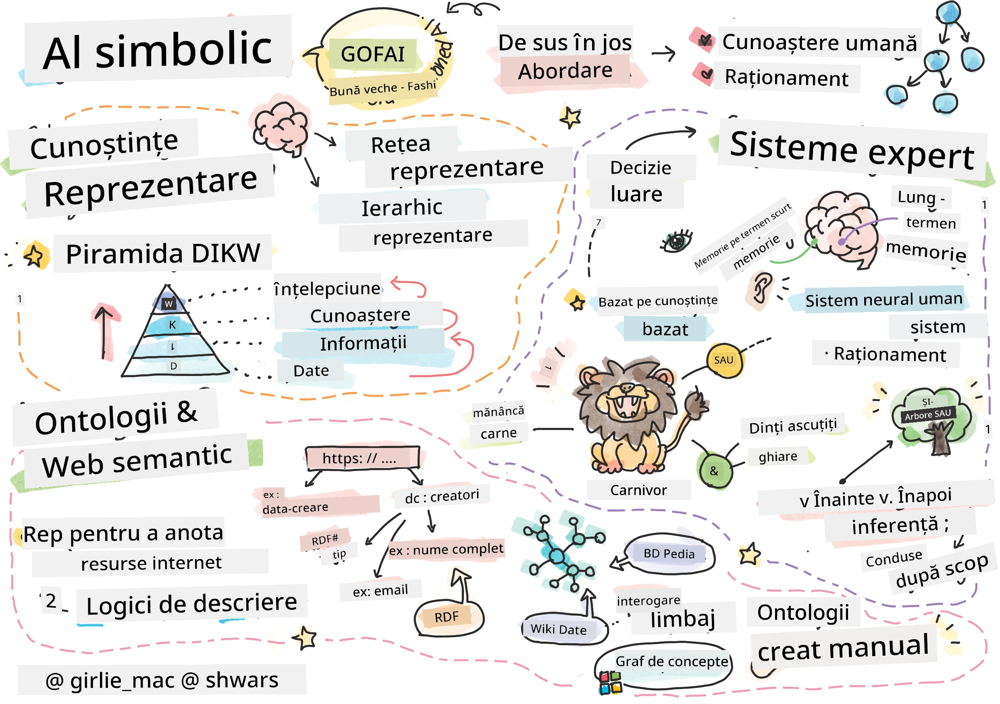
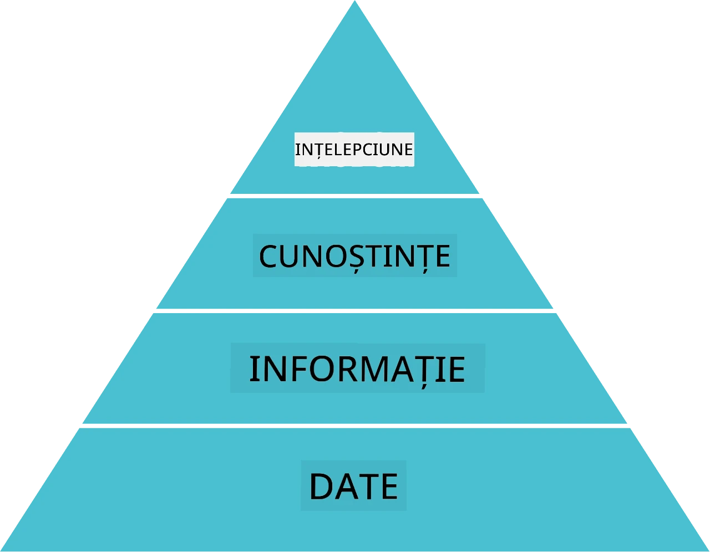
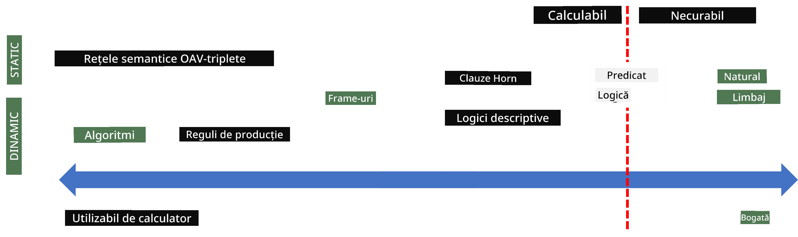
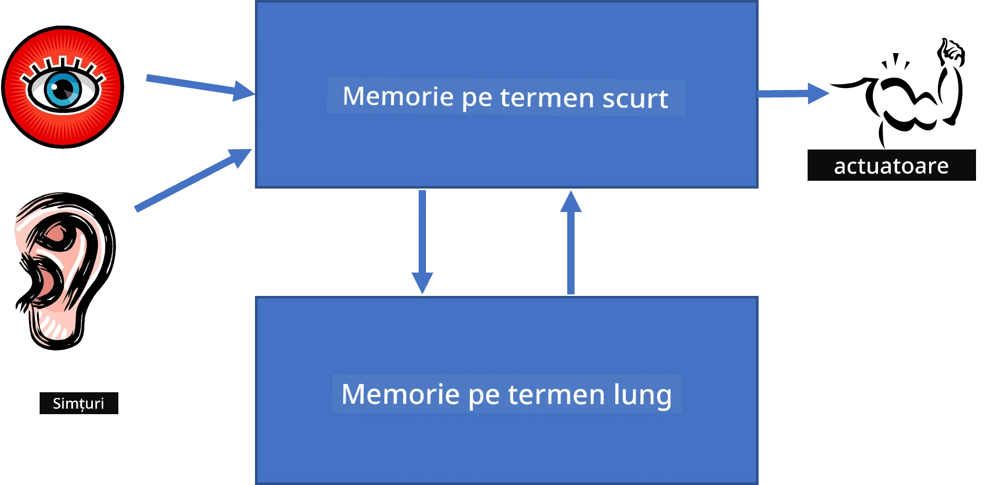
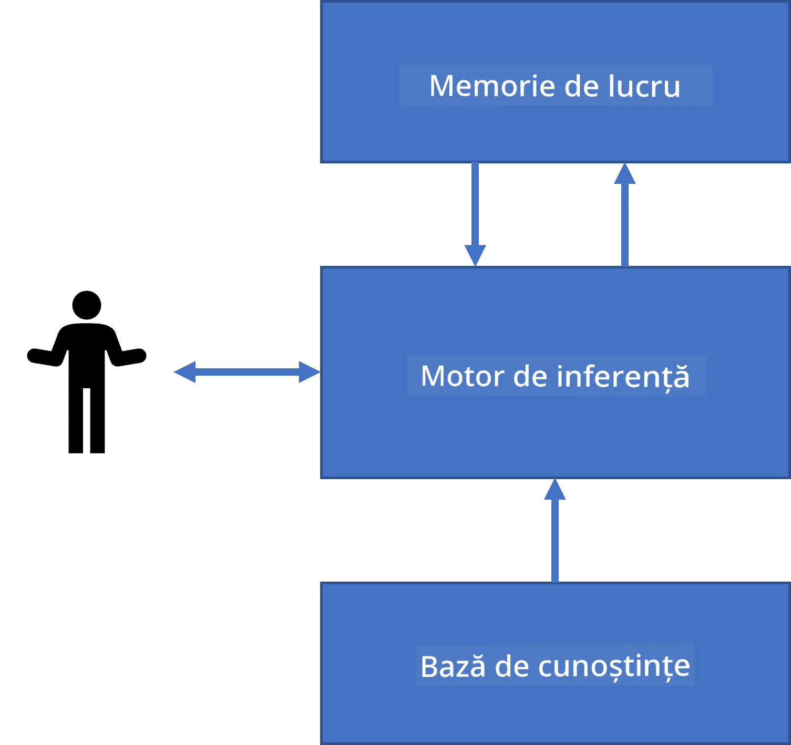
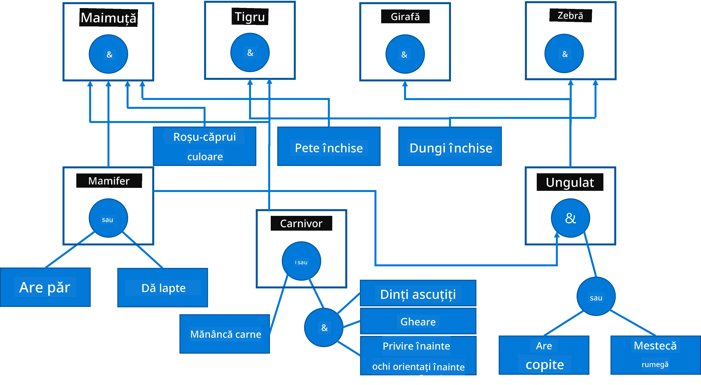
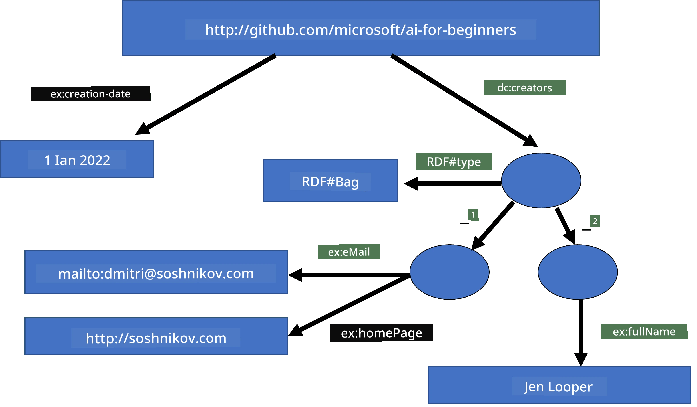
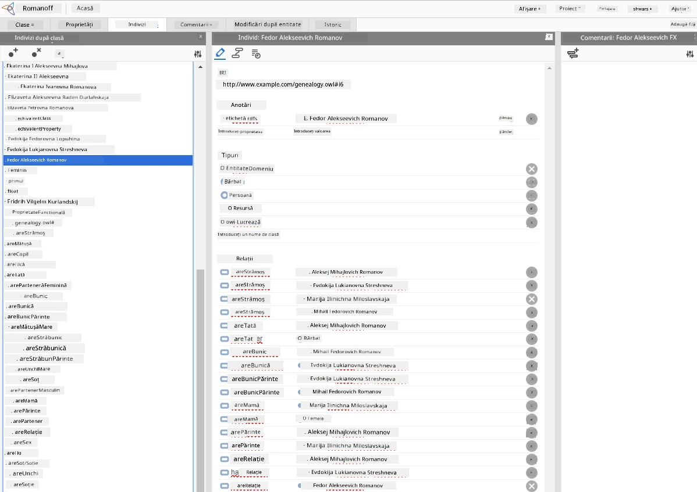

# Reprezentarea Cunoașterii și Sistemele Expert



> Schiță realizată de [Tomomi Imura](https://twitter.com/girlie_mac)

Căutarea inteligenței artificiale se bazează pe o căutare a cunoașterii, pentru a înțelege lumea în mod similar cu modul în care o fac oamenii. Dar cum poți face acest lucru?

## [Chestionar înaintea prelegerii](https://ff-quizzes.netlify.app/en/ai/quiz/3)

În primele zile ale IA, abordarea top-down pentru crearea sistemelor inteligente (discutată în lecția anterioară) era populară. Ideea era de a extrage cunoașterea de la oameni într-o formă lizibilă de către mașini, apoi de a o folosi pentru a rezolva automat probleme. Această abordare se baza pe două idei principale:

* Reprezentarea Cunoașterii
* Raționamentul

## Reprezentarea Cunoașterii

Unul dintre conceptele importante din AI simbolic este **cunoașterea**. Este important să diferențiem cunoașterea de *informație* sau *date*. De exemplu, se poate spune că cărțile conțin cunoaștere, pentru că le poți studia și deveni expert. Totuși, ceea ce conțin cărțile se numește de fapt *date*, iar prin citirea cărților și integrarea acestor date în modelul nostru al lumii, le transformăm în cunoaștere.

> ✅ **Cunoașterea** este ceva ce este conținut în mintea noastră și reprezintă înțelegerea noastră asupra lumii. Este obținută printr-un proces activ de **învățare**, care integrează bucăți de informație primite în modelul nostru activ al lumii.

De cele mai multe ori, nu definim strict cunoașterea, ci o aliniem cu alte concepte înrudite folosind [Pirâmida DIKW](https://en.wikipedia.org/wiki/DIKW_pyramid). Aceasta conține următoarele concepte:

* **Date** sunt ceva reprezentat în medii fizice, cum ar fi text scris sau cuvinte vorbite. Datele există independent de ființele umane și pot fi transmise între oameni.
* **Informație** este modul în care interpretăm datele în mintea noastră. De exemplu, când auzim cuvântul *computer*, avem o oarecare înțelegere despre ce este.
* **Cunoaștere** este informația integrată în modelul nostru al lumii. De exemplu, odată ce învățăm ce este un computer, începem să avem unele idei despre cum funcționează, cât costă și la ce poate fi folosit. Această rețea de concepte interconectate formează cunoașterea noastră.
* **Înțelepciune** este un nivel suplimentar al înțelegerii noastre asupra lumii, și reprezintă *meta-cunoaștere*, adică o noțiune despre cum și când trebuie folosită cunoașterea.



*Imagine [de pe Wikipedia](https://commons.wikimedia.org/w/index.php?curid=37705247), De Longlivetheux - Lucrare proprie, CC BY-SA 4.0*

Astfel, problema **reprezentării cunoașterii** este să găsim o modalitate eficace de a reprezenta cunoașterea în interiorul unui calculator sub formă de date, pentru a o face utilizabilă automat. Aceasta poate fi văzută ca un spectru:



> Imagine de [Dmitry Soshnikov](http://soshnikov.com)

* În stânga se află tipuri foarte simple de reprezentări ale cunoașterii care pot fi folosite eficient de computere. Cea mai simplă este cea algoritmică, când cunoașterea este reprezentată printr-un program de calculator. Totuși, aceasta nu este cea mai bună metodă pentru reprezentarea cunoașterii, deoarece nu este flexibilă. Cunoașterea din mintea noastră este adesea non-algoritmică.
* În dreapta sunt reprezentări precum textul natural. Este cea mai puternică, dar nu poate fi folosită pentru raționament automat.

> ✅ Gândește-te un moment cum reprezinți cunoașterea în mintea ta și o convertești în notițe. Există un format anume care funcționează bine pentru tine pentru a ajuta la reținere?

## Clasificarea Reprezentărilor Cunoașterii în Calculatoare

Putem clasifica diferitele metode de reprezentare a cunoașterii în calculator în următoarele categorii:

* **Reprezentări în rețea** se bazează pe faptul că avem o rețea de concepte interconectate în minte. Putem încerca să reproducem aceleași rețele ca un graf în interiorul unui calculator - un așa-numit **network semantic**.

1. **Triplete Obiect-Atribut-Valoare** sau **perechi atribut-valoare**. Deoarece un graf poate fi reprezentat în interiorul unui calculator ca o listă de noduri și muchii, putem reprezenta o rețea semantică printr-o listă de triplete, care conțin obiecte, atribute și valori. De exemplu, construim următoarele triplete despre limbaje de programare:

Obiect | Atribut | Valoare
-------|-----------|------
Python | este | Limbaj-Nespecificat
Python | inventat-de | Guido van Rossum
Python | sintaxă-bloc | indentare
Limbaj-Nespecificat | nu are | definiții de tip

> ✅ Gândește-te cum pot fi folosite tripletele pentru a reprezenta alte tipuri de cunoaștere.

2. **Reprezentări ierarhice** evidențiază faptul că deseori creăm o ierarhie de obiecte în mintea noastră. De exemplu, știm că canarul este o pasăre, iar toate păsările au aripi. Avem și o idee despre ce culoare are de obicei un canar și care este viteza sa de zbor.

   - **Reprezentarea pe cadre** se bazează pe reprezentarea fiecărui obiect sau clasă de obiecte ca un **cadru** care conține **sloturi**. Sloturile au valori implicite posibile, restricții de valori sau proceduri stocate care pot fi apelate pentru a obține valoarea unui slot. Toate cadrele formează o ierarhie similară cu ierarhia de obiecte din limbajele de programare orientate pe obiecte.
   - **Scenariile** sunt un tip special de cadre care reprezintă situații complexe ce se pot derula în timp.

**Python**

Slot | Valoare | Valoare implicită | Interval |
-----|---------|-------------------|----------|
Nume | Python | | |
Este-un | Limbaj-Nespecificat | | |
Caz Variabilă | | CamelCase | |
Lungime Program | | | 5-5000 linii |
Sintaxă-Bloc | Indentare | | |

3. **Reprezentări procedurale** se bazează pe reprezentarea cunoașterii printr-o listă de acțiuni ce pot fi executate când apare o anumită condiție.
   - Regulile de producție sunt afirmații dacă-atunci care ne permit să tragem concluzii. De exemplu, un doctor poate avea o regulă care spune că **DACĂ** un pacient are febră mare **SAU** nivel ridicat de proteina C-reactivă în testul de sânge **ATUNCI** are o inflamație. Odată ce întâlnim una dintre condiții, putem trage o concluzie despre inflamație și apoi o putem folosi în raționament ulterior.
   - Algoritmii pot fi considerați o altă formă de reprezentare procedurală, deși aproape niciodată nu sunt folosiți direct în sistemele bazate pe cunoaștere.

4. **Logica** a fost propusă inițial de Aristotel ca o metodă de a reprezenta cunoașterea universală umană.
   - Logica predicatelor, ca teorie matematică, este prea bogată pentru a fi calculabilă, prin urmare se folosește de obicei un subset al ei, cum ar fi clauzele Horn folosite în Prolog.
   - Logica descriptivă este o familie de sisteme logice folosite pentru a reprezenta și raționa despre ierarhii de obiecte și reprezentări distribuite ale cunoașterii cum ar fi *web-ul semantic*.

## Sisteme Expert

Unul dintre succesele timpurii ale AI simbolic au fost aşa-numitele **sisteme expert** - sisteme de calculator proiectate să acționeze ca experți într-un domeniu de problemă limitat. Acestea se bazau pe o **bază de cunoștințe** extrasă de la unul sau mai mulți experți umani și conțineau un **motor de inferență** care făcea raționamente pe baza acesteia.

 | 
---------------------------------------------|------------------------------------------------
Structură simplificată a unui sistem neural uman | Arhitectura unui sistem bazat pe cunoaștere

Sistemele expert sunt construite asemeni sistemului de raționament uman, care conține **memorie pe termen scurt** și **memorie pe termen lung**. În mod similar, în sistemele bazate pe cunoaștere distingem următoarele componente:

* **Memoria problemei**: conține cunoașterea legată de problema care este rezolvată în prezent, de exemplu temperatura sau tensiunea arterială a unui pacient, dacă are inflamație sau nu, etc. Această cunoaștere este numită și **cunoaștere statică**, deoarece conține un instantaneu a ceea ce știm momentan despre problemă - așa-numita *stare a problemei*.
* **Baza de cunoștințe**: reprezintă cunoașterea pe termen lung despre un domeniu de problemă. Este extrasă manual de la experți umani și nu se schimbă de la o consultație la alta. Pentru că ne permite să navigăm de la o stare a problemei la alta, este denumită și **cunoaștere dinamică**.
* **Motorul de inferență**: orchestrează întreg procesul de căutare în spațiul stărilor problemei, punând întrebări utilizatorului atunci când este necesar. Este responsabil și pentru găsirea regulilor potrivite pentru fiecare stare.

Ca exemplu, să considerăm următorul sistem expert pentru determinarea unui animal bazat pe caracteristicile sale fizice:



> Imagine de [Dmitry Soshnikov](http://soshnikov.com)

Acest diagram este numit **arbore AND-OR**, și este o reprezentare grafică a unui set de reguli de producție. Desenarea unui arbore este utilă la începutul extragerii cunoașterii de la expert. Pentru a reprezenta cunoașterea în interiorul calculatorului este mai convenabil să folosim reguli:

```
IF the animal eats meat
OR (animal has sharp teeth
    AND animal has claws
    AND animal has forward-looking eyes
) 
THEN the animal is a carnivore
```

Poți observa că fiecare condiție pe partea stângă a regulii și acțiunea sunt în esență triplete obiect-atribut-valoare (OAV). **Memoria de lucru** conține setul de triplete OAV care corespund problemei ce se rezolvă în prezent. Un **motor de reguli** caută reguli pentru care o condiție este satisfăcută și le aplică, adăugând un alt triplet în memoria de lucru.

> ✅ Scrie-ți propriul arbore AND-OR pe un subiect care îți place!

### Inferență înainte vs. inferență înapoi

Procesul descris mai sus se numește **inferență înainte**. Pornește de la unele date inițiale despre problema disponibile în memoria de lucru, apoi execută următorul ciclu de raționament:

1. Dacă atributul țintă este prezent în memoria de lucru - oprește și dă rezultatul
2. Caută toate regulile a căror condiție este în prezent satisfăcută - obține **setul de conflicte** al regulilor.
3. Efectuează **rezolvarea conflictelor** - selectează o regulă care va fi executată în acest pas. Există diferite strategii de rezolvare a conflictului:
   - Selectează prima regulă aplicabilă în baza de cunoștințe
   - Selectează o regulă aleatorie
   - Selectează o regulă *mai specifică*, adică care satisface cele mai multe condiții din partea stângă (LHS)
4. Aplică regula selectată și inserează o nouă bucată de cunoaștere în starea problemei
5. Repetă de la pasul 1.

Totuși, în unele cazuri poate dorim să începem cu cunoaștere vidă despre problemă și să punem întrebări care ne vor ajuta să ajungem la concluzie. De exemplu, când facem diagnostic medical, de obicei nu efectuăm toate analizele medicale dinainte înainte de a începe diagnosticarea pacientului. Mai degrabă vrem să efectuăm analizele când trebuie să luăm o decizie.

Acest proces poate fi modelat folosind **inferența înapoi**. Este condus de **obiectiv** - valoarea atributului pe care încercăm să o găsim:

1. Selectează toate regulile care ne pot oferi valoarea unui obiectiv (adică cu obiectivul pe partea dreaptă (RHS) a regulii) - un set de conflicte
1. Dacă nu există reguli pentru acest atribut sau există o regulă care spune că trebuie să cerem valoarea de la utilizator - întreabă valoarea, altfel:
1. Folosește strategia de rezolvare a conflictului pentru a selecta o regulă pe care o vom folosi ca *ipoteză* - o vom încerca să o demonstrăm
1. Repetă recurent procesul pentru toți atributele din partea stângă a regulii (LHS), încercând să le dovedim ca obiective
1. Dacă în orice moment procesul eșuează - folosește o altă regulă la pasul 3.

> ✅ În ce situații este inferența înainte mai potrivită? Dar inferența înapoi?

### Implementarea Sistemelor Expert

Sistemele expert pot fi implementate folosind diverse unelte:

* Programarea lor directă într-un limbaj de programare de nivel înalt. Nu este o idee prea bună, deoarece avantajul principal al unui sistem bazat pe cunoaștere este că cunoașterea este separată de inferență, iar potențial un expert în domeniu ar trebui să poată scrie reguli fără a înțelege detaliile procesului de inferență.
* Folosirea unui **shell pentru sistem expert**, adică un sistem special conceput pentru a fi populat cu cunoaștere folosind un limbaj de reprezentare a cunoașterii.

## ✍️ Exercițiu: Inferența animalelor

Vezi [Animals.ipynb](https://github.com/microsoft/AI-For-Beginners/blob/main/lessons/2-Symbolic/Animals.ipynb) pentru un exemplu de implementare a unui sistem expert cu inferență înainte și înapoi.

> **Notă**: Acest exemplu este destul de simplu și doar oferă ideea cum arată un sistem expert. Odată ce începi să creezi un astfel de sistem, vei observa *comportament inteligent* doar când ajungi la un anumit număr de reguli, în jur de 200+. La un moment dat, regulile devin prea complexe ca să le ții toate în minte, iar în acel punct te vei întreba de ce un sistem ia anumite decizii. Totuși, caracteristica importantă a sistemelor bazate pe cunoaștere este că poți întotdeauna să *explici* exact cum a fost luată oricare decizie.

## Ontologii și Web-ul Semantic

La sfârșitul secolului XX a existat o inițiativă de a folosi reprezentarea cunoașterii pentru a adnota resursele de pe Internet, astfel încât să fie posibilă găsirea de resurse care corespund unor căutări foarte specifice. Această mișcare a fost numită **Web Semantic**, și s-a bazat pe mai multe concepte:

- O reprezentare specială a cunoașterii bazată pe **[logici descriptive](https://en.wikipedia.org/wiki/Description_logic)** (DL). Este similară cu reprezentarea pe cadre, pentru că construiește o ierarhie de obiecte cu proprietăți, dar are semantică formală logică și inferență. Există o familie întreagă de DL-uri care echilibrează între expresivitate și complexitatea algoritmică a inferenței.
- Reprezentare distribuită a cunoașterii, unde toate conceptele sunt reprezentate printr-un identificator global URI, făcând posibilă crearea de ierarhii de cunoștințe care să acopere Internetul.
- O familie de limbaje bazate pe XML pentru descrierea cunoștințelor: RDF (Resource Description Framework), RDFS (RDF Schema), OWL (Ontology Web Language).

Un concept fundamental în Web-ul Semantic este conceptul de **Ontologie**. Se referă la o specificare explicită a unui domeniu de problemă folosind o reprezentare formală a cunoștințelor. Cea mai simplă ontologie poate fi doar o ierarhie de obiecte în domeniul problemei, dar ontologiile mai complexe vor include reguli care pot fi folosite pentru inferență.

În web-ul semantic, toate reprezentările se bazează pe triplete. Fiecare obiect și fiecare relație sunt identificate în mod unic prin URI. De exemplu, dacă vrem să afirmăm faptul că acest Curriculum AI a fost dezvoltat de Dmitry Soshnikov pe 1 ianuarie 2022 - iată tripletele pe care le putem folosi:


```
http://github.com/microsoft/ai-for-beginners http://www.example.com/terms/creation-date “Jan 1, 2022”
http://github.com/microsoft/ai-for-beginners http://purl.org/dc/elements/1.1/creator http://soshnikov.com
```

> ✅ Aici `http://www.example.com/terms/creation-date` și `http://purl.org/dc/elements/1.1/creator` sunt niște URI-uri bine cunoscute și universal acceptate pentru a exprima conceptele de *creator* și *data creației*.

Într-un caz mai complex, dacă dorim să definim o listă de creatori, putem folosi unele structuri de date definite în RDF.



> Diagramele de mai sus sunt realizate de [Dmitry Soshnikov](http://soshnikov.com)

Progresul construirii Web-ului Semantic a fost cumva încetinit de succesul motoarelor de căutare și al tehnicilor de procesare a limbajului natural, care permit extragerea datelor structurate din text. Totuși, în unele domenii există încă eforturi semnificative pentru întreținerea ontologiilor și bazelor de cunoștințe. Câteva proiecte demne de menționat:

* [WikiData](https://wikidata.org/) este o colecție de baze de cunoștințe machine-readable asociate cu Wikipedia. Majoritatea datelor sunt extrase din *InfoBox-urile* Wikipedia, bucăți de conținut structurat din paginile Wikipedia. Poți [interoga](https://query.wikidata.org/) Wikidata folosind SPARQL, un limbaj special de interogare pentru Web-ul Semantic. Iată o interogare exemplu care afișează cele mai populare culori ale ochilor printre oameni:

```sparql
#defaultView:BubbleChart
SELECT ?eyeColorLabel (COUNT(?human) AS ?count)
WHERE
{
  ?human wdt:P31 wd:Q5.       # human instance-of homo sapiens
  ?human wdt:P1340 ?eyeColor. # human eye-color ?eyeColor
  SERVICE wikibase:label { bd:serviceParam wikibase:language "en". }
}
GROUP BY ?eyeColorLabel
```

* [DBpedia](https://www.dbpedia.org/) este un alt efort similar cu WikiData.

> ✅ Dacă vrei să experimentezi construind propriile ontologii sau să deschizi ontologii existente, există un editor vizual excelent de ontologii numit [Protégé](https://protege.stanford.edu/). Descarcă-l sau folosește-l online.



*Editorul Web Protégé deschis cu ontologia Familiei Romanov. Captură de ecran de Dmitry Soshnikov*

## ✍️ Exercițiu: O Ontologie de Familie

Vezi [FamilyOntology.ipynb](https://github.com/Ezana135/AI-For-Beginners/blob/main/lessons/2-Symbolic/FamilyOntology.ipynb) pentru un exemplu de utilizare a tehnicilor Web Semantic pentru a raționa despre relațiile de familie. Vom lua un arbore genealogic reprezentat în formatul obișnuit GEDCOM și o ontologie a relațiilor de familie și vom construi un graf al tuturor relațiilor de familie pentru un set dat de indivizi.

## Microsoft Concept Graph

În cele mai multe cazuri, ontologiile sunt create cu grijă manual. Totuși, este posibil să **extragem** ontologii din date nestructurate, de exemplu, din texte în limbaj natural.

Un astfel de demers a fost făcut de Microsoft Research și a dus la [Microsoft Concept Graph](https://blogs.microsoft.com/ai/microsoft-researchers-release-graph-that-helps-machines-conceptualize/?WT.mc_id=academic-77998-cacaste).

Este o colecție vastă de entități grupate folosind relația de moștenire `is-a`. Permite răspunsuri la întrebări de genul "Ce este Microsoft?" - răspunsul fiind ceva de genul "o companie cu o probabilitate de 0.87, și un brand cu o probabilitate de 0.75".

Graficul este disponibil fie ca REST API, fie ca un fișier de text mare ce poate fi descărcat și care listează toate perechile de entități.

## ✍️ Exercițiu: Un Grafic de Concepte

Încearcă notebook-ul [MSConceptGraph.ipynb](https://github.com/microsoft/AI-For-Beginners/blob/main/lessons/2-Symbolic/MSConceptGraph.ipynb) pentru a vedea cum putem folosi Microsoft Concept Graph pentru a grupa articole de știri în mai multe categorii.

## Concluzie

În zilele noastre, AI este adesea considerată un sinonim pentru *Învățare Automată* sau *Rețele Neuronale*. Cu toate acestea, un om manifestă și raționament explicit, ceea ce în prezent nu este tratat de rețelele neuronale. În proiectele reale, raționamentul explicit este încă folosit pentru a realiza sarcini care necesită explicații sau pentru a putea modifica comportamentul sistemului într-un mod controlat.

## 🚀 Provocare

În notebook-ul Ontologia de Familie asociat acestei lecții există oportunitatea de a experimenta cu alte relații de familie. Încearcă să descoperi conexiuni noi între oamenii din arborele genealogic.

## [Quiz post-lectură](https://ff-quizzes.netlify.app/en/ai/quiz/4)

## Recapitulare și Auto-studiu

Caută pe internet pentru a descoperi domeniile în care oamenii au încercat să cuantifice și să codifice cunoștințele. Aruncă o privire asupra Taxonomiei lui Bloom și întoarce-te în istorie pentru a înțelege cum au încercat oamenii să-și dea seama de lumea lor. Explorează lucrările lui Linnaeus pentru crearea unei taxonomii a organismelor și observă modul în care Dmitri Mendeleev a creat o metodă pentru descrierea și gruparea elementelor chimice. Ce alte exemple interesante poți găsi?

**Tema**: [Construiește o Ontologie](assignment.md)

---

<!-- CO-OP TRANSLATOR DISCLAIMER START -->
**Declinare de responsabilitate**:  
Acest document a fost tradus folosind serviciul de traducere AI [Co-op Translator](https://github.com/Azure/co-op-translator). Deși ne străduim pentru acuratețe, vă rugăm să rețineți că traducerile automate pot conține erori sau inexactități. Documentul original, în limba sa nativă, trebuie considerat sursa autorizată. Pentru informații critice, se recomandă traducerea profesională realizată de traducători umani. Nu ne asumăm răspunderea pentru orice neînțelegeri sau interpretări greșite rezultate din utilizarea acestei traduceri.
<!-- CO-OP TRANSLATOR DISCLAIMER END -->