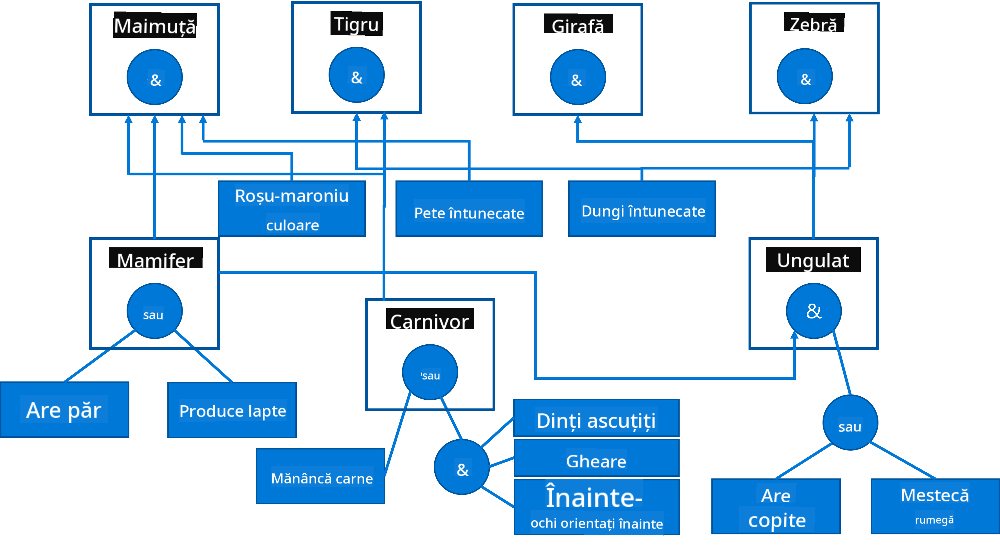

<!--
CO_OP_TRANSLATOR_METADATA:
{
  "original_hash": "7d097f7fda9166ead615e4c34552381b",
  "translation_date": "2025-09-23T14:18:06+00:00",
  "source_file": "lessons/2-Symbolic/README.md",
  "language_code": "ro"
}
-->
# Reprezentarea Cunoașterii și Sisteme Expert


> Sketchnote de [Tomomi Imura](https://twitter.com/girlie_mac)

Căutarea inteligenței artificiale se bazează pe dorința de a înțelege lumea, similar modului în care o fac oamenii. Dar cum putem realiza acest lucru?

## [Chestionar înainte de lecție](https://ff-quizzes.netlify.app/en/ai/quiz/3)

În primele zile ale AI, abordarea de sus în jos pentru crearea sistemelor inteligente (discutată în lecția anterioară) era populară. Ideea era să extragem cunoașterea de la oameni într-o formă care poate fi citită de mașini și apoi să o folosim pentru a rezolva automat probleme. Această abordare se baza pe două idei mari:

* Reprezentarea Cunoașterii
* Raționamentul

## Reprezentarea Cunoașterii

Unul dintre conceptele importante în AI simbolic este **cunoașterea**. Este esențial să diferențiem cunoașterea de *informație* sau *date*. De exemplu, putem spune că cărțile conțin cunoaștere, deoarece putem studia cărțile și deveni experți. Totuși, ceea ce conțin cărțile se numește de fapt *date*, iar prin citirea cărților și integrarea acestor date în modelul nostru al lumii, transformăm datele în cunoaștere.

> ✅ **Cunoașterea** este ceva ce se află în mintea noastră și reprezintă înțelegerea noastră asupra lumii. Este obținută printr-un proces activ de **învățare**, care integrează bucăți de informație pe care le primim în modelul nostru activ al lumii.

De cele mai multe ori, nu definim strict cunoașterea, ci o aliniem cu alte concepte conexe folosind [Piramida DIKW](https://en.wikipedia.org/wiki/DIKW_pyramid). Aceasta conține următoarele concepte:

* **Datele** sunt reprezentate pe suporturi fizice, cum ar fi textul scris sau cuvintele rostite. Datele există independent de ființele umane și pot fi transmise între oameni.
* **Informația** este modul în care interpretăm datele în mintea noastră. De exemplu, când auzim cuvântul *computer*, avem o anumită înțelegere despre ce este.
* **Cunoașterea** este informația integrată în modelul nostru al lumii. De exemplu, odată ce învățăm ce este un computer, începem să avem idei despre cum funcționează, cât costă și la ce poate fi folosit. Această rețea de concepte interconectate formează cunoașterea noastră.
* **Înțelepciunea** este un nivel superior al înțelegerii noastre asupra lumii și reprezintă *meta-cunoaștere*, adică o idee despre cum și când ar trebui folosită cunoașterea.


*Imagine [din Wikipedia](https://commons.wikimedia.org/w/index.php?curid=37705247), By Longlivetheux - Own work, CC BY-SA 4.0*

Astfel, problema **reprezentării cunoașterii** este de a găsi o modalitate eficientă de a reprezenta cunoașterea într-un computer sub formă de date, pentru a o face utilizabilă automat. Acest lucru poate fi văzut ca un spectru:


> Imagine de [Dmitry Soshnikov](http://soshnikov.com)

* În partea stângă, există tipuri foarte simple de reprezentări ale cunoașterii care pot fi utilizate eficient de computere. Cea mai simplă este cea algoritmică, când cunoașterea este reprezentată printr-un program de computer. Totuși, aceasta nu este cea mai bună modalitate de a reprezenta cunoașterea, deoarece nu este flexibilă. Cunoașterea din mintea noastră este adesea non-algoritmică.
* În partea dreaptă, există reprezentări precum textul natural. Este cea mai puternică, dar nu poate fi utilizată pentru raționament automat.

> ✅ Gândește-te un minut la modul în care reprezinți cunoașterea în mintea ta și o transformi în notițe. Există un format anume care funcționează bine pentru tine pentru a ajuta la reținere?

## Clasificarea Reprezentărilor Cunoașterii în Computere

Putem clasifica diferite metode de reprezentare a cunoașterii în computere în următoarele categorii:

* **Reprezentări de rețea** se bazează pe faptul că avem o rețea de concepte interconectate în mintea noastră. Putem încerca să reproducem aceleași rețele ca un grafic într-un computer - o așa-numită **rețea semantică**.

1. **Triplete Obiect-Caracteristică-Valoare** sau **perechi caracteristică-valoare**. Deoarece un grafic poate fi reprezentat într-un computer ca o listă de noduri și muchii, putem reprezenta o rețea semantică printr-o listă de triplete, conținând obiecte, caracteristici și valori. De exemplu, construim următoarele triplete despre limbajele de programare:

Obiect | Caracteristică | Valoare
-------|----------------|------
Python | este | Limbaj-Netipat
Python | inventat-de | Guido van Rossum
Python | sintaxă-bloc | indentare
Limbaj-Netipat | nu are | definiții de tip

> ✅ Gândește-te cum pot fi utilizate tripletele pentru a reprezenta alte tipuri de cunoaștere.

2. **Reprezentări ierarhice** subliniază faptul că adesea creăm o ierarhie de obiecte în mintea noastră. De exemplu, știm că canarul este o pasăre, iar toate păsările au aripi. De asemenea, avem o idee despre ce culoare are de obicei un canar și care este viteza lui de zbor.

   - **Reprezentarea prin cadre** se bazează pe reprezentarea fiecărui obiect sau clasă de obiecte ca un **cadru** care conține **sloturi**. Sloturile au valori implicite posibile, restricții de valoare sau proceduri stocate care pot fi apelate pentru a obține valoarea unui slot. Toate cadrele formează o ierarhie similară cu ierarhia de obiecte din limbajele de programare orientate pe obiecte.
   - **Scenariile** sunt un tip special de cadre care reprezintă situații complexe care se pot desfășura în timp.

**Python**

Slot | Valoare | Valoare implicită | Interval |
-----|--------|-------------------|----------|
Nume | Python | | |
Este-Un | Limbaj-Netipat | | |
Caz Variabilă | | CamelCase | |
Lungime Program | | | 5-5000 linii |
Sintaxă Bloc | Indentare | | |

3. **Reprezentări procedurale** se bazează pe reprezentarea cunoașterii printr-o listă de acțiuni care pot fi executate atunci când apare o anumită condiție.
   - Regulile de producție sunt declarații de tip dacă-atunci care ne permit să tragem concluzii. De exemplu, un medic poate avea o regulă care spune că **DACĂ** un pacient are febră mare **SAU** un nivel ridicat de proteină C-reactivă în testul de sânge **ATUNCI** are o inflamație. Odată ce întâlnim una dintre condiții, putem trage o concluzie despre inflamație și apoi o putem folosi în raționamente ulterioare.
   - Algoritmii pot fi considerați o altă formă de reprezentare procedurală, deși aproape niciodată nu sunt utilizați direct în sistemele bazate pe cunoaștere.

4. **Logica** a fost propusă inițial de Aristotel ca o modalitate de a reprezenta cunoașterea universală umană.
   - Logica predicatelor ca teorie matematică este prea bogată pentru a fi calculabilă, de aceea se folosește de obicei un subset al acesteia, cum ar fi clauzele Horn utilizate în Prolog.
   - Logica descriptivă este o familie de sisteme logice utilizate pentru a reprezenta și raționa despre ierarhiile de obiecte și reprezentările distribuite ale cunoașterii, cum ar fi *web-ul semantic*.

## Sisteme Expert

Unul dintre succesele timpurii ale AI simbolic au fost așa-numitele **sisteme expert** - sisteme de computer concepute să acționeze ca un expert într-un domeniu limitat de probleme. Acestea se bazau pe o **bază de cunoaștere** extrasă de la unul sau mai mulți experți umani și conțineau un **motor de inferență** care efectua raționamente pe baza acesteia.

 | 
---------------------------------------------|------------------------------------------------
Structura simplificată a sistemului neural uman | Arhitectura unui sistem bazat pe cunoaștere

Sistemele expert sunt construite similar cu sistemul de raționament uman, care conține **memorie pe termen scurt** și **memorie pe termen lung**. În mod similar, în sistemele bazate pe cunoaștere distingem următoarele componente:

* **Memoria problemei**: conține cunoașterea despre problema care este în prezent rezolvată, de exemplu temperatura sau tensiunea arterială a unui pacient, dacă are inflamație sau nu etc. Această cunoaștere este numită și **cunoaștere statică**, deoarece conține o imagine a ceea ce știm în prezent despre problemă - așa-numitul *stare a problemei*.
* **Baza de cunoaștere**: reprezintă cunoașterea pe termen lung despre un domeniu de probleme. Este extrasă manual de la experți umani și nu se schimbă de la o consultație la alta. Deoarece ne permite să navigăm de la o stare a problemei la alta, este numită și **cunoaștere dinamică**.
* **Motorul de inferență**: orchestrează întregul proces de căutare în spațiul stării problemei, punând întrebări utilizatorului atunci când este necesar. Este, de asemenea, responsabil pentru găsirea regulilor potrivite care trebuie aplicate fiecărei stări.

Ca exemplu, să luăm în considerare următorul sistem expert de determinare a unui animal pe baza caracteristicilor sale fizice:



> Imagine de [Dmitry Soshnikov](http://soshnikov.com)

Acest diagramă se numește **arbore AND-OR** și este o reprezentare grafică a unui set de reguli de producție. Desenarea unui arbore este utilă la începutul procesului de extragere a cunoașterii de la expert. Pentru a reprezenta cunoașterea în computer, este mai convenabil să folosim reguli:

```
IF the animal eats meat
OR (animal has sharp teeth
    AND animal has claws
    AND animal has forward-looking eyes
) 
THEN the animal is a carnivore
```

Poți observa că fiecare condiție din partea stângă a regulii și acțiunea sunt, în esență, triplete Obiect-Caracteristică-Valoare (OAV). **Memoria de lucru** conține setul de triplete OAV care corespund problemei care este în prezent rezolvată. Un **motor de reguli** caută reguli pentru care o condiție este satisfăcută și le aplică, adăugând un alt triplet în memoria de lucru.

> ✅ Scrie propriul tău arbore AND-OR pe un subiect care îți place!

### Inferență înainte vs. Inferență înapoi

Procesul descris mai sus se numește **inferență înainte**. Acesta începe cu unele date inițiale despre problemă disponibile în memoria de lucru și apoi execută următorul ciclu de raționament:

1. Dacă atributul țintă este prezent în memoria de lucru - oprește-te și oferă rezultatul
2. Caută toate regulile ale căror condiții sunt în prezent satisfăcute - obține **setul de conflict** de reguli.
3. Realizează **rezolvarea conflictului** - selectează o regulă care va fi executată în acest pas. Pot exista diferite strategii de rezolvare a conflictului:
   - Selectează prima regulă aplicabilă din baza de cunoaștere
   - Selectează o regulă aleatorie
   - Selectează o regulă *mai specifică*, adică cea care îndeplinește cele mai multe condiții în partea "stângă" (LHS)
4. Aplică regula selectată și inserează o nouă bucată de cunoaștere în starea problemei
5. Repetă de la pasul 1.

Totuși, în unele cazuri, s-ar putea să dorim să începem cu o cunoaștere goală despre problemă și să punem întrebări care ne vor ajuta să ajungem la concluzie. De exemplu, atunci când facem un diagnostic medical, de obicei nu realizăm toate analizele medicale în avans înainte de a începe diagnosticarea pacientului. Mai degrabă, dorim să realizăm analizele atunci când trebuie luată o decizie.

Acest proces poate fi modelat folosind **inferența înapoi**. Este condus de **scop** - valoarea atributului pe care încercăm să o găsim:

1. Selectează toate regulile care pot oferi valoarea unui scop (adică cu scopul în partea dreaptă ("right-hand-side")) - un set de conflict
1. Dacă nu există reguli pentru acest atribut sau există o regulă care spune că ar trebui să cerem valoarea de la utilizator - cere-o, altfel:
1. Folosește strategia de rezolvare a conflictului pentru a selecta o regulă pe care o vom folosi ca *ipoteză* - vom încerca să o demonstrăm
1. Recurent, repetă procesul pentru toate atributele din partea stângă a regulii, încercând să le demonstrezi ca scopuri
1. Dacă în orice moment procesul eșuează - folosește o altă regulă la pasul 3.

> ✅ În ce situații este mai potrivită inferența înainte? Dar inferența înapoi?

### Implementarea Sistemelor Expert

Sistemele expert pot fi implementate folosind diferite instrumente:

* Programarea lor directă într-un limbaj de programare de nivel înalt. Aceasta nu este cea mai bună idee, deoarece principalul avantaj al unui sistem bazat pe cunoaștere este că cunoașterea este separată de inferență, iar un expert în domeniul problemei ar trebui să poată scrie reguli fără a înțelege detaliile procesului de inferență.
* Utilizarea unui **shell pentru sisteme expert**, adică un sistem conceput special pentru a fi populat cu cunoaștere folosind un limbaj de reprezentare a cunoașterii.

## ✍️ Exercițiu: Inferența Animalelor

Vezi [Animals.ipynb](https://github.com/microsoft/AI-For-Beginners/blob/main/lessons/2-Symbolic/Animals.ipynb) pentru un exemplu de implementare a unui sistem expert de inferență înainte și înapoi.

> **Notă**: Acest exemplu este destul de simplu și oferă doar o idee despre cum arată un sistem expert. Odată ce începi să creezi un astfel de sistem, vei observa un comportament *inteligent* doar atunci când ajungi la un anumit număr de reguli, în jur de 200+. La un moment dat, regulile devin prea complexe pentru a le ține pe toate în minte, iar în acel moment s-ar putea să te întrebi de ce sistemul ia anumite decizii. Totuși, caracteristica importantă a sistemelor bazate pe cunoaștere este că poți întotdeauna *explica* exact cum a fost luată orice decizie.

## Ontologii și Web-ul Semantic

La sfârșitul secolului XX a existat o inițiativă de a folosi reprezentarea cunoașterii pentru a adnota resursele de pe Internet, astfel încât să fie posibil să găsim resurse care corespund unor interogări foarte specifice. Această mișcare a fost numită **Web Semantic** și s-a bazat pe mai multe concepte:

- O reprezentare specială a cunoașterii bazată pe **[logici descriptive](https://en.wikipedia.org/wiki/Description_logic)** (DL). Este similară cu reprezentarea cunoașterii prin cadre, deoarece construiește o ierarhie de obiecte cu proprietăți, dar are semantică logică formală și inferență. Există o întreagă familie de DL-uri care echilibrează între expresivitate și complexitatea algoritmică a inferenței.
- Reprezentarea distribuită a cunoașterii, unde toate conceptele sunt reprezentate printr-un identificator global URI, făcând posibilă crearea ierarhiilor de cunoaștere care se extind pe internet.
- O familie de limbaje bazate pe XML pentru descrierea cunoștințelor: RDF (Resource Description Framework), RDFS (RDF Schema), OWL (Ontology Web Language).

Un concept central în Web-ul Semantic este conceptul de **Ontologie**. Acesta se referă la o specificație explicită a unui domeniu de problemă utilizând o reprezentare formală a cunoștințelor. Cea mai simplă ontologie poate fi doar o ierarhie de obiecte dintr-un domeniu de problemă, dar ontologiile mai complexe vor include reguli care pot fi utilizate pentru inferență.

În Web-ul Semantic, toate reprezentările se bazează pe triplete. Fiecare obiect și fiecare relație sunt identificate în mod unic prin URI. De exemplu, dacă dorim să afirmăm faptul că acest Curriculum AI a fost dezvoltat de Dmitry Soshnikov pe 1 ianuarie 2022 - iată tripletele pe care le putem folosi:


```
http://github.com/microsoft/ai-for-beginners http://www.example.com/terms/creation-date “Jan 13, 2007”
http://github.com/microsoft/ai-for-beginners http://purl.org/dc/elements/1.1/creator http://soshnikov.com
```

> ✅ Aici `http://www.example.com/terms/creation-date` și `http://purl.org/dc/elements/1.1/creator` sunt câteva URI bine cunoscute și universal acceptate pentru a exprima conceptele de *creator* și *data creării*.

Într-un caz mai complex, dacă dorim să definim o listă de creatori, putem folosi unele structuri de date definite în RDF.


> Diagramele de mai sus de [Dmitry Soshnikov](http://soshnikov.com)

Progresul construirii Web-ului Semantic a fost într-o oarecare măsură încetinit de succesul motoarelor de căutare și al tehnicilor de procesare a limbajului natural, care permit extragerea datelor structurate din text. Cu toate acestea, în unele domenii există încă eforturi semnificative pentru a menține ontologii și baze de cunoștințe. Câteva proiecte notabile:

* [WikiData](https://wikidata.org/) este o colecție de baze de cunoștințe lizibile de mașini asociate cu Wikipedia. Majoritatea datelor sunt extrase din *InfoBox-uri* Wikipedia, bucăți de conținut structurat din paginile Wikipedia. Puteți [interoga](https://query.wikidata.org/) WikiData în SPARQL, un limbaj special de interogare pentru Web-ul Semantic. Iată un exemplu de interogare care afișează cele mai populare culori ale ochilor la oameni:

```sparql
#defaultView:BubbleChart
SELECT ?eyeColorLabel (COUNT(?human) AS ?count)
WHERE
{
  ?human wdt:P31 wd:Q5.       # human instance-of homo sapiens
  ?human wdt:P1340 ?eyeColor. # human eye-color ?eyeColor
  SERVICE wikibase:label { bd:serviceParam wikibase:language "en". }
}
GROUP BY ?eyeColorLabel
```

* [DBpedia](https://www.dbpedia.org/) este un alt efort similar cu WikiData.

> ✅ Dacă doriți să experimentați cu construirea propriilor ontologii sau deschiderea unora existente, există un editor vizual excelent de ontologii numit [Protégé](https://protege.stanford.edu/). Descărcați-l sau folosiți-l online.


*Editorul Web Protégé deschis cu ontologia Familiei Romanov. Captură de ecran de Dmitry Soshnikov*

## ✍️ Exercițiu: O Ontologie de Familie

Consultați [FamilyOntology.ipynb](https://github.com/Ezana135/AI-For-Beginners/blob/main/lessons/2-Symbolic/FamilyOntology.ipynb) pentru un exemplu de utilizare a tehnicilor Web-ului Semantic pentru a raționa despre relațiile de familie. Vom lua un arbore genealogic reprezentat în formatul comun GEDCOM și o ontologie a relațiilor de familie și vom construi un grafic al tuturor relațiilor de familie pentru un set dat de indivizi.

## Microsoft Concept Graph

În cele mai multe cazuri, ontologiile sunt create cu atenție manual. Cu toate acestea, este posibil și să **extragem** ontologii din date nestructurate, de exemplu, din texte în limbaj natural.

O astfel de încercare a fost realizată de Microsoft Research și a dus la [Microsoft Concept Graph](https://blogs.microsoft.com/ai/microsoft-researchers-release-graph-that-helps-machines-conceptualize/?WT.mc_id=academic-77998-cacaste).

Este o colecție mare de entități grupate împreună folosind relația de moștenire `is-a`. Permite răspunsuri la întrebări precum "Ce este Microsoft?" - răspunsul fiind ceva de genul "o companie cu probabilitatea 0.87 și un brand cu probabilitatea 0.75".

Graficul este disponibil fie ca REST API, fie ca un fișier text mare descărcabil care listează toate perechile de entități.

## ✍️ Exercițiu: Un Grafic de Concepte

Încercați notebook-ul [MSConceptGraph.ipynb](https://github.com/microsoft/AI-For-Beginners/blob/main/lessons/2-Symbolic/MSConceptGraph.ipynb) pentru a vedea cum putem folosi Microsoft Concept Graph pentru a grupa articole de știri în mai multe categorii.

## Concluzie

În zilele noastre, AI este adesea considerată sinonimă cu *Machine Learning* sau *Rețele Neuronale*. Cu toate acestea, o ființă umană manifestă și raționament explicit, ceva ce rețelele neuronale nu gestionează în prezent. În proiectele din lumea reală, raționamentul explicit este încă utilizat pentru a îndeplini sarcini care necesită explicații sau capacitatea de a modifica comportamentul sistemului într-un mod controlat.

## 🚀 Provocare

În notebook-ul Family Ontology asociat acestei lecții, există oportunitatea de a experimenta cu alte relații de familie. Încercați să descoperiți noi conexiuni între persoanele din arborele genealogic.

## [Quiz post-lectură](https://ff-quizzes.netlify.app/en/ai/quiz/4)

## Recapitulare & Studiu Individual

Faceți cercetări pe internet pentru a descoperi domenii în care oamenii au încercat să cuantifice și să codifice cunoștințele. Aruncați o privire asupra Taxonomiei lui Bloom și mergeți înapoi în istorie pentru a învăța cum oamenii au încercat să înțeleagă lumea lor. Explorați munca lui Linnaeus pentru a crea o taxonomie a organismelor și observați modul în care Dmitri Mendeleev a creat o modalitate de descriere și grupare a elementelor chimice. Ce alte exemple interesante puteți găsi?

**Temă**: [Construiește o Ontologie](assignment.md)

---

