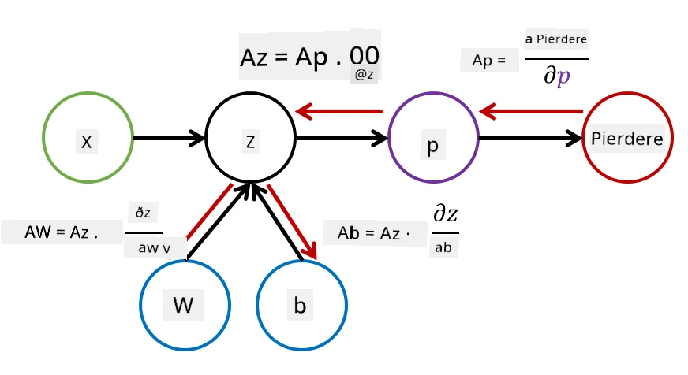

# Introducere în Rețele Neuronale. Perceptron Multi-Stratificat

În secțiunea anterioară, ai învățat despre cel mai simplu model de rețea neuronală - perceptronul cu un singur strat, un model liniar de clasificare în două clase.

În această secțiune vom extinde acest model într-un cadru mai flexibil, care ne va permite să:

* realizăm **clasificare multi-clasă** pe lângă clasificarea în două clase
* rezolvăm **probleme de regresie** pe lângă clasificare
* separăm clase care nu sunt liniar separabile

De asemenea, vom dezvolta propriul nostru cadru modular în Python, care ne va permite să construim diferite arhitecturi de rețele neuronale.

## [Chestionar înainte de lecție](https://ff-quizzes.netlify.app/en/ai/quiz/7)

## Formalizarea Învățării Automate

Să începem prin formalizarea problemei de Învățare Automată. Presupunem că avem un set de date de antrenament **X** cu etichete **Y**, și trebuie să construim un model *f* care să facă predicții cât mai precise. Calitatea predicțiilor este măsurată prin **funcția de pierdere** &lagran;. Următoarele funcții de pierdere sunt adesea utilizate:

* Pentru probleme de regresie, când trebuie să prezicem un număr, putem folosi **eroarea absolută** &sum;i|f(x(i))-y(i)| sau **eroarea pătratică** &sum;i(f(x(i))-y(i))2
* Pentru clasificare, folosim **pierdere 0-1** (care este, în esență, același lucru cu **acuratețea** modelului) sau **pierdere logistică**.

Pentru perceptronul cu un singur strat, funcția *f* a fost definită ca o funcție liniară *f(x)=wx+b* (aici *w* este matricea de greutăți, *x* este vectorul de caracteristici de intrare, iar *b* este vectorul de bias). Pentru diferite arhitecturi de rețele neuronale, această funcție poate lua o formă mai complexă.

> În cazul clasificării, este adesea de dorit să obținem probabilitățile claselor corespunzătoare ca ieșire a rețelei. Pentru a converti numere arbitrare în probabilități (de exemplu, pentru a normaliza ieșirea), folosim adesea funcția **softmax** &sigma;, iar funcția *f* devine *f(x)=&sigma;(wx+b)*

În definiția lui *f* de mai sus, *w* și *b* sunt numite **parametri** &theta;=⟨*w,b*⟩. Având setul de date ⟨**X**,**Y**⟩, putem calcula o eroare generală pe întregul set de date ca o funcție de parametri &theta;.

> ✅ **Scopul antrenării rețelei neuronale este de a minimiza eroarea prin variarea parametrilor &theta;**

## Optimizarea prin Gradient Descent

Există o metodă bine-cunoscută de optimizare a funcțiilor numită **gradient descent**. Ideea este că putem calcula o derivată (în cazul multidimensional numită **gradient**) a funcției de pierdere în raport cu parametrii și să variem parametrii astfel încât eroarea să scadă. Acest lucru poate fi formalizat astfel:

* Inițializați parametrii cu valori aleatorii w(0), b(0)
* Repetați următorul pas de mai multe ori:
    - w(i+1) = w(i)-&eta;&part;&lagran;/&part;w
    - b(i+1) = b(i)-&eta;&part;&lagran;/&part;b

În timpul antrenării, pașii de optimizare ar trebui să fie calculați luând în considerare întregul set de date (amintiți-vă că pierderea este calculată ca o sumă pentru toate exemplele de antrenament). Totuși, în practică, luăm porțiuni mici ale setului de date numite **minibatch-uri** și calculăm gradientele pe baza unui subset de date. Deoarece subsetul este luat aleator de fiecare dată, această metodă este numită **stochastic gradient descent** (SGD).

## Perceptron Multi-Stratificat și Backpropagation

Rețeaua cu un singur strat, așa cum am văzut mai sus, este capabilă să clasifice clase liniar separabile. Pentru a construi un model mai bogat, putem combina mai multe straturi ale rețelei. Matematic, aceasta ar însemna că funcția *f* ar avea o formă mai complexă și va fi calculată în mai mulți pași:
* z1=w1x+b1
* z2=w2&alpha;(z1)+b2
* f = &sigma;(z2)

Aici, &alpha; este o **funcție de activare non-liniară**, &sigma; este o funcție softmax, iar parametrii &theta;=<*w1,b1,w2,b2*>.

Algoritmul gradient descent ar rămâne același, dar ar fi mai dificil de calculat gradientele. Având regula de diferențiere în lanț, putem calcula derivatele astfel:

* &part;&lagran;/&part;w2 = (&part;&lagran;/&part;&sigma;)(&part;&sigma;/&part;z2)(&part;z2/&part;w2)
* &part;&lagran;/&part;w1 = (&part;&lagran;/&part;&sigma;)(&part;&sigma;/&part;z2)(&part;z2/&part;&alpha;)(&part;&alpha;/&part;z1)(&part;z1/&part;w1)

> ✅ Regula de diferențiere în lanț este utilizată pentru a calcula derivatele funcției de pierdere în raport cu parametrii.

Observați că partea din stânga a tuturor acestor expresii este aceeași, și astfel putem calcula eficient derivatele începând de la funcția de pierdere și mergând "înapoi" prin graful computațional. Astfel, metoda de antrenare a unui perceptron multi-stratificat este numită **backpropagation**, sau 'backprop'.

> TODO: citarea imaginii

> ✅ Vom acoperi backprop în mult mai multe detalii în exemplul nostru din notebook.  

## Concluzie

În această lecție, am construit propria noastră bibliotecă de rețele neuronale și am folosit-o pentru o sarcină simplă de clasificare bidimensională.

## 🚀 Provocare

În notebook-ul însoțitor, vei implementa propriul cadru pentru construirea și antrenarea perceptronilor multi-stratificați. Vei putea vedea în detaliu cum funcționează rețelele neuronale moderne.

Accesează notebook-ul [OwnFramework](OwnFramework.ipynb) și parcurge-l.

## [Chestionar după lecție](https://ff-quizzes.netlify.app/en/ai/quiz/8)

## Recapitulare și Studiu Individual

Backpropagation este un algoritm comun utilizat în AI și ML, merită studiat [în detaliu](https://wikipedia.org/wiki/Backpropagation)

## [Temă](lab/README.md)

În acest laborator, ți se cere să folosești cadrul pe care l-ai construit în această lecție pentru a rezolva clasificarea cifrelor scrise de mână din MNIST.

* [Instrucțiuni](lab/README.md)
* [Notebook](lab/MyFW_MNIST.ipynb)

---

