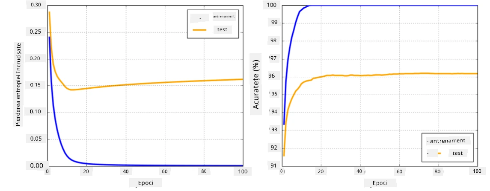

# Frameworkuri pentru Rețele Neuronale

Așa cum am învățat deja, pentru a putea antrena rețele neuronale eficient, trebuie să facem două lucruri:

* Să operăm pe tensori, de exemplu să multiplicăm, să adunăm și să calculăm funcții precum sigmoid sau softmax
* Să calculăm derivatele tuturor expresiilor, pentru a efectua optimizarea prin gradient descent

## [Chestionar înainte de lecție](https://ff-quizzes.netlify.app/en/ai/quiz/9)

Deși biblioteca `numpy` poate realiza prima parte, avem nevoie de un mecanism pentru a calcula derivatele. În [frameworkul nostru](../04-OwnFramework/OwnFramework.ipynb) pe care l-am dezvoltat în secțiunea anterioară, a trebuit să programăm manual toate funcțiile derivate în metoda `backward`, care realizează backpropagation. Ideal, un framework ar trebui să ne ofere posibilitatea de a calcula derivatele pentru *orice expresie* pe care o putem defini.

Un alt aspect important este să putem efectua calcule pe GPU sau pe alte unități de calcul specializate, cum ar fi [TPU](https://en.wikipedia.org/wiki/Tensor_Processing_Unit). Antrenarea rețelelor neuronale profunde necesită *foarte multe* calcule, iar posibilitatea de a paraleliza aceste calcule pe GPU-uri este esențială.

> ✅ Termenul 'paralelizare' înseamnă distribuirea calculelor pe mai multe dispozitive.

În prezent, cele mai populare frameworkuri pentru rețele neuronale sunt: [TensorFlow](http://TensorFlow.org) și [PyTorch](https://pytorch.org/). Ambele oferă o API de nivel scăzut pentru a opera cu tensori atât pe CPU, cât și pe GPU. Pe lângă API-ul de nivel scăzut, există și API-uri de nivel înalt, numite [Keras](https://keras.io/) și [PyTorch Lightning](https://pytorchlightning.ai), respectiv.

Low-Level API | [TensorFlow](http://TensorFlow.org) | [PyTorch](https://pytorch.org/)
--------------|-------------------------------------|--------------------------------
High-level API| [Keras](https://keras.io/) | [PyTorch Lightning](https://pytorchlightning.ai/)

**API-urile de nivel scăzut** din ambele frameworkuri permit construirea așa-numitelor **grafuri computaționale**. Acest graf definește modul de calcul al rezultatului (de obicei funcția de pierdere) cu parametrii de intrare dați și poate fi trimis pentru calcul pe GPU, dacă este disponibil. Există funcții pentru a diferenția acest graf computațional și a calcula derivatele, care pot fi apoi utilizate pentru optimizarea parametrilor modelului.

**API-urile de nivel înalt** consideră rețelele neuronale ca o **succesiune de straturi** și facilitează construirea majorității rețelelor neuronale. Antrenarea modelului necesită, de obicei, pregătirea datelor și apoi apelarea unei funcții `fit` pentru a realiza procesul.

API-ul de nivel înalt permite construirea rapidă a rețelelor neuronale tipice fără a fi nevoie să ne preocupăm de multe detalii. În același timp, API-ul de nivel scăzut oferă mult mai mult control asupra procesului de antrenare și, astfel, este utilizat frecvent în cercetare, atunci când se lucrează cu noi arhitecturi de rețele neuronale.

Este important de înțeles că ambele API-uri pot fi utilizate împreună. De exemplu, puteți dezvolta propria arhitectură de strat de rețea folosind API-ul de nivel scăzut și apoi să o utilizați într-o rețea mai mare construită și antrenată cu API-ul de nivel înalt. Sau puteți defini o rețea folosind API-ul de nivel înalt ca o succesiune de straturi și apoi să folosiți propriul ciclu de antrenare de nivel scăzut pentru optimizare. Ambele API-uri folosesc aceleași concepte de bază și sunt concepute să funcționeze bine împreună.

## Învățare

În acest curs, oferim majoritatea conținutului atât pentru PyTorch, cât și pentru TensorFlow. Puteți alege frameworkul preferat și să parcurgeți doar notebook-urile corespunzătoare. Dacă nu sunteți sigur ce framework să alegeți, citiți câteva discuții pe internet despre **PyTorch vs. TensorFlow**. De asemenea, puteți arunca o privire asupra ambelor frameworkuri pentru a înțelege mai bine.

Acolo unde este posibil, vom folosi API-uri de nivel înalt pentru simplitate. Totuși, considerăm că este important să înțelegem cum funcționează rețelele neuronale de la bază, astfel încât, la început, vom lucra cu API-uri de nivel scăzut și tensori. Cu toate acestea, dacă doriți să începeți rapid și nu vreți să petreceți mult timp învățând aceste detalii, puteți sări direct la notebook-urile cu API-uri de nivel înalt.

## ✍️ Exerciții: Frameworkuri

Continuați învățarea în următoarele notebook-uri:

Low-Level API | [TensorFlow+Keras Notebook](IntroKerasTF.ipynb) | [PyTorch](IntroPyTorch.ipynb)
--------------|-------------------------------------|--------------------------------
High-level API| [Keras](IntroKeras.ipynb) | *PyTorch Lightning*

După ce stăpâniți frameworkurile, să recapitulăm conceptul de overfitting.

# Overfitting

Overfitting este un concept extrem de important în învățarea automată și este esențial să îl înțelegem corect!

Luați în considerare următoarea problemă de aproximare a 5 puncte (reprezentate de `x` pe graficele de mai jos):

 | 
-------------------------|--------------------------
**Model liniar, 2 parametri** | **Model neliniar, 7 parametri**
Eroare de antrenare = 5.3 | Eroare de antrenare = 0
Eroare de validare = 5.1 | Eroare de validare = 20

* În stânga, vedem o aproximare bună cu o linie dreaptă. Deoarece numărul de parametri este adecvat, modelul înțelege corect distribuția punctelor.
* În dreapta, modelul este prea puternic. Deoarece avem doar 5 puncte și modelul are 7 parametri, acesta se poate ajusta astfel încât să treacă prin toate punctele, făcând eroarea de antrenare să fie 0. Totuși, acest lucru împiedică modelul să înțeleagă corect tiparul datelor, astfel încât eroarea de validare este foarte mare.

Este foarte important să găsim un echilibru corect între complexitatea modelului (numărul de parametri) și numărul de exemple de antrenare.

## De ce apare overfitting

  * Date de antrenare insuficiente
  * Model prea puternic
  * Prea mult zgomot în datele de intrare

## Cum detectăm overfitting

Așa cum se vede din graficul de mai sus, overfitting poate fi detectat printr-o eroare de antrenare foarte mică și o eroare de validare mare. În mod normal, în timpul antrenării, vom vedea atât erorile de antrenare, cât și cele de validare începând să scadă, iar apoi, la un moment dat, eroarea de validare poate înceta să scadă și să înceapă să crească. Acesta va fi un semn de overfitting și un indicator că ar trebui să oprim antrenarea în acel moment (sau cel puțin să facem un snapshot al modelului).

## Cum prevenim overfitting

Dacă observați că apare overfitting, puteți face următoarele:

 * Creșteți cantitatea de date de antrenare
 * Reduceți complexitatea modelului
 * Utilizați o [tehnică de regularizare](../../4-ComputerVision/08-TransferLearning/TrainingTricks.md), cum ar fi [Dropout](../../4-ComputerVision/08-TransferLearning/TrainingTricks.md#Dropout), pe care o vom analiza mai târziu.

## Overfitting și Compromisul Bias-Variance

Overfitting este, de fapt, un caz al unei probleme mai generale în statistică numită [Compromisul Bias-Variance](https://en.wikipedia.org/wiki/Bias%E2%80%93variance_tradeoff). Dacă luăm în considerare sursele posibile de eroare în modelul nostru, putem observa două tipuri de erori:

* **Erorile de bias** sunt cauzate de faptul că algoritmul nostru nu poate captura corect relația dintre datele de antrenare. Acest lucru poate rezulta din faptul că modelul nostru nu este suficient de puternic (**underfitting**).
* **Erorile de variație**, care sunt cauzate de modelul care aproximează zgomotul din datele de intrare în loc de relația semnificativă (**overfitting**).

În timpul antrenării, eroarea de bias scade (pe măsură ce modelul nostru învață să aproximeze datele), iar eroarea de variație crește. Este important să oprim antrenarea - fie manual (când detectăm overfitting), fie automat (prin introducerea regularizării) - pentru a preveni overfitting.

## Concluzie

În această lecție, ați învățat despre diferențele dintre diversele API-uri ale celor mai populare frameworkuri AI, TensorFlow și PyTorch. În plus, ați învățat despre un subiect foarte important, overfitting.

## 🚀 Provocare

În notebook-urile însoțitoare, veți găsi 'sarcini' la final; parcurgeți notebook-urile și completați sarcinile.

## [Chestionar după lecție](https://ff-quizzes.netlify.app/en/ai/quiz/10)

## Recapitulare și Studiu Individual

Faceți cercetări pe următoarele subiecte:

- TensorFlow
- PyTorch
- Overfitting

Întrebați-vă următoarele:

- Care este diferența dintre TensorFlow și PyTorch?
- Care este diferența dintre overfitting și underfitting?

## [Temă](lab/README.md)

În acest laborator, vi se cere să rezolvați două probleme de clasificare folosind rețele complet conectate cu un singur strat și cu mai multe straturi, utilizând PyTorch sau TensorFlow.

* [Instrucțiuni](lab/README.md)
* [Notebook](lab/LabFrameworks.ipynb)

---

