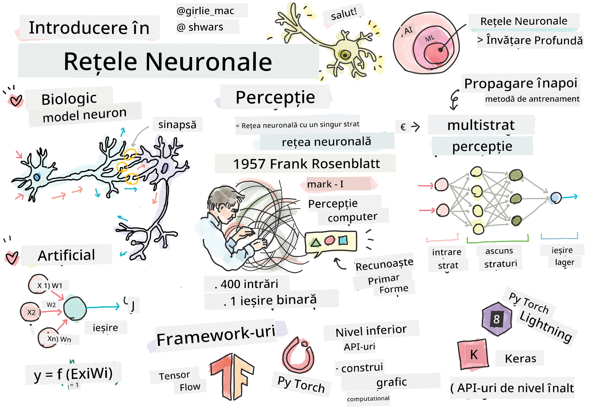
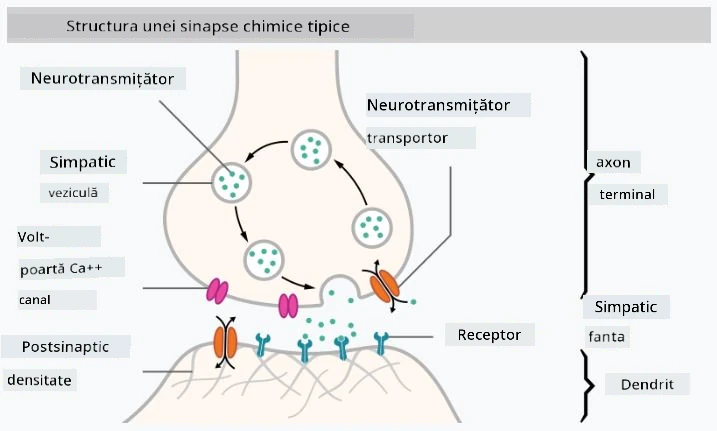

# Introducere în Rețele Neuronale

Așa cum am discutat în introducere, una dintre modalitățile de a obține inteligență este să antrenăm un **model computerizat** sau un **creier artificial**. Începând cu mijlocul secolului al XX-lea, cercetătorii au încercat diferite modele matematice, până când, în ultimii ani, această direcție s-a dovedit a fi extrem de eficientă. Aceste modele matematice ale creierului sunt numite **rețele neuronale**.

> Uneori, rețelele neuronale sunt numite *Rețele Neuronale Artificiale* sau ANNs, pentru a indica faptul că vorbim despre modele, nu despre rețele reale de neuroni.

## Învățare Automată

Rețelele Neuronale fac parte dintr-o disciplină mai largă numită **Învățare Automată** (Machine Learning), al cărei scop este să folosească datele pentru a antrena modele computerizate capabile să rezolve probleme. Învățarea Automată constituie o parte importantă a Inteligenței Artificiale, însă nu acoperim Învățarea Automată clasică în acest curriculum.

> Vizitați curriculumul nostru separat **[Machine Learning for Beginners](http://github.com/microsoft/ml-for-beginners)** pentru a învăța mai multe despre Învățarea Automată clasică.

În Învățarea Automată, presupunem că avem un set de date de exemple **X** și valorile de ieșire corespunzătoare **Y**. Exemplele sunt adesea vectori N-dimensionali care constau din **caracteristici**, iar ieșirile sunt numite **etichete**.

Vom analiza cele mai comune două probleme din Învățarea Automată:

* **Clasificare**, unde trebuie să clasificăm un obiect de intrare în două sau mai multe clase.
* **Regresie**, unde trebuie să prezicem un număr numeric pentru fiecare dintre mostrele de intrare.

> Când reprezentăm intrările și ieșirile ca tensori, setul de date de intrare este o matrice de dimensiune M&times;N, unde M este numărul de mostre și N este numărul de caracteristici. Etichetele de ieșire Y sunt un vector de dimensiune M.

În acest curriculum, ne vom concentra doar pe modelele de rețele neuronale.

## Un Model al unui Neuron

Din biologie, știm că creierul nostru este format din celule neuronale (neuroni), fiecare având multiple "intrări" (dendrite) și o singură "ieșire" (axon). Atât dendritele, cât și axonii pot conduce semnale electrice, iar conexiunile dintre ele — cunoscute sub numele de sinapse — pot prezenta grade variate de conductivitate, care sunt reglate de neurotransmițători.

 | 
----|----
Neuron Real *([Imagine](https://en.wikipedia.org/wiki/Synapse#/media/File:SynapseSchematic_lines.svg) de pe Wikipedia)* | Neuron Artificial *(Imagine de Autor)*

Astfel, cel mai simplu model matematic al unui neuron conține mai multe intrări X1, ..., XN și o ieșire Y, precum și o serie de ponderi W1, ..., WN. Ieșirea este calculată astfel:

unde f este o **funcție de activare** neliniară.

> Primele modele ale neuronului au fost descrise în lucrarea clasică [A logical calculus of the ideas immanent in nervous activity](https://www.cs.cmu.edu/~./epxing/Class/10715/reading/McCulloch.and.Pitts.pdf) de Warren McCullock și Walter Pitts în 1943. Donald Hebb, în cartea sa "[The Organization of Behavior: A Neuropsychological Theory](https://books.google.com/books?id=VNetYrB8EBoC)", a propus modul în care aceste rețele pot fi antrenate.

## În această Secțiune

În această secțiune vom învăța despre:
* [Perceptron](03-Perceptron/README.md), unul dintre cele mai vechi modele de rețele neuronale pentru clasificarea în două clase
* [Rețele multi-stratificate](04-OwnFramework/README.md) cu un notebook asociat [cum să construim propriul nostru framework](04-OwnFramework/OwnFramework.ipynb)
* [Framework-uri pentru Rețele Neuronale](05-Frameworks/README.md), cu aceste notebook-uri: [PyTorch](05-Frameworks/IntroPyTorch.ipynb) și [Keras/Tensorflow](05-Frameworks/IntroKerasTF.ipynb)
* [Overfitting](../../../../lessons/3-NeuralNetworks/05-Frameworks)

---

**Declinare de responsabilitate**:  
Acest document a fost tradus folosind serviciul de traducere AI [Co-op Translator](https://github.com/Azure/co-op-translator). Deși ne străduim să asigurăm acuratețea, vă rugăm să fiți conștienți că traducerile automate pot conține erori sau inexactități. Documentul original în limba sa natală ar trebui considerat sursa autoritară. Pentru informații critice, se recomandă traducerea profesională realizată de un specialist. Nu ne asumăm responsabilitatea pentru eventualele neînțelegeri sau interpretări greșite care pot apărea din utilizarea acestei traduceri.