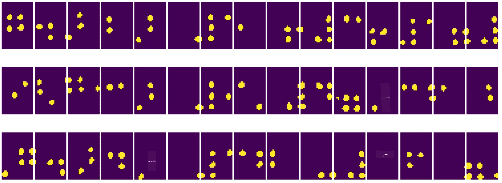

# Introducere în Viziunea Computațională

[Viziunea Computațională](https://wikipedia.org/wiki/Computer_vision) este o disciplină al cărei scop este să permită calculatoarelor să obțină o înțelegere de nivel înalt a imaginilor digitale. Aceasta este o definiție destul de largă, deoarece *înțelegerea* poate însemna multe lucruri diferite, inclusiv identificarea unui obiect într-o imagine (**detectarea obiectelor**), înțelegerea a ceea ce se întâmplă (**detectarea evenimentelor**), descrierea unei imagini în text sau reconstruirea unei scene în 3D. Există, de asemenea, sarcini speciale legate de imaginile umane: estimarea vârstei și emoțiilor, detectarea și identificarea fețelor, și estimarea poziției 3D, printre altele.

## [Chestionar înainte de lecție](https://ff-quizzes.netlify.app/en/ai/quiz/11)

Una dintre cele mai simple sarcini ale viziunii computaționale este **clasificarea imaginilor**.

Viziunea computațională este adesea considerată o ramură a inteligenței artificiale. În prezent, majoritatea sarcinilor de viziune computațională sunt rezolvate folosind rețele neuronale. Vom învăța mai multe despre tipul special de rețele neuronale utilizate pentru viziunea computațională, [rețele neuronale convoluționale](../07-ConvNets/README.md), pe parcursul acestei secțiuni.

Totuși, înainte de a transmite imaginea unei rețele neuronale, în multe cazuri are sens să folosești unele tehnici algoritmice pentru a îmbunătăți imaginea.

Există mai multe biblioteci Python disponibile pentru procesarea imaginilor:

* **[imageio](https://imageio.readthedocs.io/en/stable/)** poate fi utilizată pentru citirea/scrierea diferitelor formate de imagini. De asemenea, suportă ffmpeg, un instrument util pentru conversia cadrelor video în imagini.
* **[Pillow](https://pillow.readthedocs.io/en/stable/index.html)** (cunoscut și sub numele de PIL) este puțin mai puternică și suportă manipulări ale imaginilor, cum ar fi deformarea, ajustarea paletei și altele.
* **[OpenCV](https://opencv.org/)** este o bibliotecă puternică de procesare a imaginilor scrisă în C++, care a devenit standardul *de facto* pentru procesarea imaginilor. Are o interfață convenabilă pentru Python.
* **[dlib](http://dlib.net/)** este o bibliotecă C++ care implementează multe algoritmi de învățare automată, inclusiv unele dintre algoritmii de viziune computațională. Are și o interfață Python și poate fi utilizată pentru sarcini dificile, cum ar fi detectarea fețelor și a punctelor de reper faciale.

## OpenCV

[OpenCV](https://opencv.org/) este considerată standardul *de facto* pentru procesarea imaginilor. Conține o mulțime de algoritmi utili, implementați în C++. Poți apela OpenCV și din Python.

Un loc bun pentru a învăța OpenCV este [acest curs Learn OpenCV](https://learnopencv.com/getting-started-with-opencv/). În cadrul curriculumului nostru, scopul nu este să învățăm OpenCV, ci să îți arătăm câteva exemple despre când poate fi utilizat și cum.

### Încărcarea Imaginilor

Imaginile în Python pot fi reprezentate convenabil prin matrice NumPy. De exemplu, imaginile alb-negru cu dimensiunea de 320x200 pixeli ar fi stocate într-o matrice de 200x320, iar imaginile color de aceeași dimensiune ar avea forma 200x320x3 (pentru cele 3 canale de culoare). Pentru a încărca o imagine, poți folosi următorul cod:

```python
import cv2
import matplotlib.pyplot as plt

im = cv2.imread('image.jpeg')
plt.imshow(im)
```

În mod tradițional, OpenCV folosește codificarea BGR (Albastru-Verde-Roșu) pentru imaginile color, în timp ce restul instrumentelor Python utilizează codificarea RGB (Roșu-Verde-Albastru) mai tradițională. Pentru ca imaginea să arate corect, trebuie să o convertești în spațiul de culoare RGB, fie prin schimbarea dimensiunilor în matricea NumPy, fie prin apelarea unei funcții OpenCV:

```python
im = cv2.cvtColor(im,cv2.COLOR_BGR2RGB)
```

Aceeași funcție `cvtColor` poate fi utilizată pentru a efectua alte transformări ale spațiului de culoare, cum ar fi conversia unei imagini în alb-negru sau în spațiul de culoare HSV (Nuanță-Saturație-Valoare).

De asemenea, poți folosi OpenCV pentru a încărca cadre video unul câte unul - un exemplu este dat în exercițiul [OpenCV Notebook](OpenCV.ipynb).

### Procesarea Imaginilor

Înainte de a transmite o imagine unei rețele neuronale, poate fi necesar să aplici câțiva pași de preprocesare. OpenCV poate face multe lucruri, inclusiv:

* **Redimensionarea** imaginii folosind `im = cv2.resize(im, (320,200),interpolation=cv2.INTER_LANCZOS)`
* **Estomparea** imaginii folosind `im = cv2.medianBlur(im,3)` sau `im = cv2.GaussianBlur(im, (3,3), 0)`
* Schimbarea **luminozității și contrastului** imaginii poate fi realizată prin manipulări ale matricei NumPy, așa cum este descris [în această notă de pe Stackoverflow](https://stackoverflow.com/questions/39308030/how-do-i-increase-the-contrast-of-an-image-in-python-opencv).
* Utilizarea [thresholding](https://docs.opencv.org/4.x/d7/d4d/tutorial_py_thresholding.html) prin apelarea funcțiilor `cv2.threshold`/`cv2.adaptiveThreshold`, care este adesea preferabilă ajustării luminozității sau contrastului.
* Aplicarea diferitelor [transformări](https://docs.opencv.org/4.5.5/da/d6e/tutorial_py_geometric_transformations.html) imaginii:
    - **[Transformări afine](https://docs.opencv.org/4.5.5/d4/d61/tutorial_warp_affine.html)** pot fi utile dacă trebuie să combini rotația, redimensionarea și deformarea imaginii și cunoști locația sursă și destinație a trei puncte din imagine. Transformările afine păstrează liniile paralele.
    - **[Transformări de perspectivă](https://medium.com/analytics-vidhya/opencv-perspective-transformation-9edffefb2143)** pot fi utile atunci când cunoști pozițiile sursă și destinație ale 4 puncte din imagine. De exemplu, dacă faci o fotografie a unui document dreptunghiular cu o cameră de smartphone dintr-un anumit unghi și vrei să obții o imagine dreptunghiulară a documentului în sine.
* Înțelegerea mișcării din imagine folosind **[flux optic](https://docs.opencv.org/4.5.5/d4/dee/tutorial_optical_flow.html)**.

## Exemple de utilizare a Viziunii Computaționale

În [OpenCV Notebook](OpenCV.ipynb), oferim câteva exemple despre cum poate fi utilizată viziunea computațională pentru a îndeplini sarcini specifice:

* **Preprocesarea unei fotografii a unei cărți Braille**. Ne concentrăm pe modul în care putem utiliza thresholding, detectarea caracteristicilor, transformarea de perspectivă și manipulările NumPy pentru a separa simbolurile individuale Braille pentru clasificarea ulterioară de către o rețea neuronală.

 |  | 
----|-----|-----

> Imagine din [OpenCV.ipynb](OpenCV.ipynb)

* **Detectarea mișcării în video folosind diferența dintre cadre**. Dacă camera este fixă, atunci cadrele din fluxul camerei ar trebui să fie destul de similare între ele. Deoarece cadrele sunt reprezentate ca matrice, doar prin scăderea acestor matrice pentru două cadre consecutive vom obține diferența de pixeli, care ar trebui să fie mică pentru cadre statice și să devină mai mare odată ce există o mișcare semnificativă în imagine.


> Imagine din [OpenCV.ipynb](OpenCV.ipynb)

* **Detectarea mișcării folosind Flux Optic**. [Fluxul optic](https://docs.opencv.org/3.4/d4/dee/tutorial_optical_flow.html) ne permite să înțelegem cum se mișcă pixeli individuali pe cadrele video. Există două tipuri de flux optic:

   - **Flux Optic Dens** calculează câmpul vectorial care arată pentru fiecare pixel unde se mișcă.
   - **Flux Optic Rar** se bazează pe luarea unor caracteristici distinctive din imagine (de exemplu, margini) și construirea traiectoriei lor de la un cadru la altul.


> Imagine din [OpenCV.ipynb](OpenCV.ipynb)

## ✍️ Notebook-uri Exemplu: OpenCV [încearcă OpenCV în Acțiune](OpenCV.ipynb)

Hai să facem câteva experimente cu OpenCV explorând [OpenCV Notebook](OpenCV.ipynb)

## Concluzie

Uneori, sarcini relativ complexe, cum ar fi detectarea mișcării sau detectarea vârfurilor de degete, pot fi rezolvate pur și simplu prin viziune computațională. Astfel, este foarte util să cunoști tehnicile de bază ale viziunii computaționale și ce pot face bibliotecile precum OpenCV.

## 🚀 Provocare

Urmărește [acest video](https://docs.microsoft.com/shows/ai-show/ai-show--2021-opencv-ai-competition--grand-prize-winners--cortic-tigers--episode-32?WT.mc_id=academic-77998-cacaste) din AI Show pentru a afla despre proiectul Cortic Tigers și cum au construit o soluție bazată pe blocuri pentru democratizarea sarcinilor de viziune computațională prin intermediul unui robot. Fă cercetări despre alte proiecte similare care ajută la introducerea noilor învățăcei în acest domeniu.

## [Chestionar după lecție](https://ff-quizzes.netlify.app/en/ai/quiz/12)

## Recapitulare & Studiu Individual

Citește mai multe despre fluxul optic [în acest tutorial excelent](https://learnopencv.com/optical-flow-in-opencv/).

## [Temă](lab/README.md)

În acest laborator, vei filma un video cu gesturi simple, iar scopul tău este să extragi mișcările sus/jos/stânga/dreapta folosind flux optic.


---

