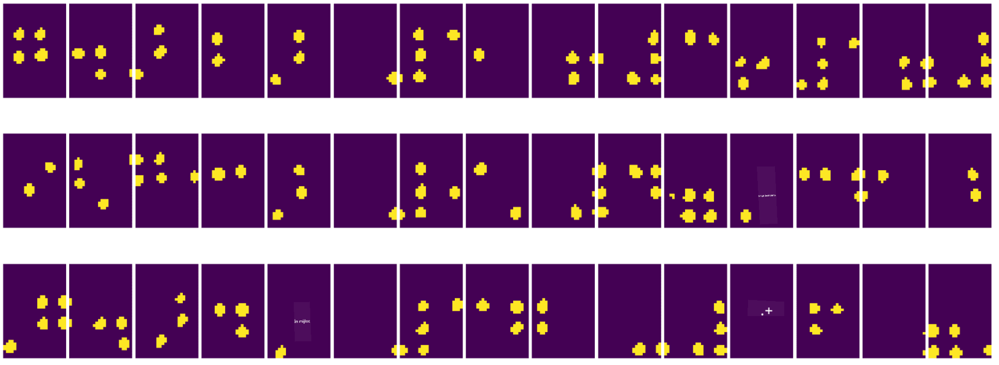

<!--
CO_OP_TRANSLATOR_METADATA:
{
  "original_hash": "4bedc8e702db17260cfe824d58b6cfd4",
  "translation_date": "2025-08-25T23:00:57+00:00",
  "source_file": "lessons/4-ComputerVision/06-IntroCV/README.md",
  "language_code": "ro"
}
-->
# Introducere în Viziunea Computațională

[Viziunea Computațională](https://wikipedia.org/wiki/Computer_vision) este o disciplină al cărei scop este să permită calculatoarelor să obțină o înțelegere de nivel înalt a imaginilor digitale. Aceasta este o definiție destul de largă, deoarece *înțelegerea* poate însemna multe lucruri, inclusiv găsirea unui obiect într-o imagine (**detecția obiectelor**), înțelegerea a ceea ce se întâmplă (**detecția evenimentelor**), descrierea unei imagini în text sau reconstrucția unei scene în 3D. Există, de asemenea, sarcini speciale legate de imaginile umane: estimarea vârstei și a emoțiilor, detectarea și identificarea fețelor, precum și estimarea poziției 3D, pentru a numi doar câteva.

## [Chestionar înainte de curs](https://ff-quizzes.netlify.app/en/ai/quiz/11)

Una dintre cele mai simple sarcini ale viziunii computaționale este **clasificarea imaginilor**.

Viziunea computațională este adesea considerată o ramură a inteligenței artificiale. În prezent, majoritatea sarcinilor de viziune computațională sunt rezolvate folosind rețele neuronale. Vom învăța mai multe despre tipul special de rețele neuronale utilizate pentru viziunea computațională, [rețele neuronale convoluționale](../07-ConvNets/README.md), pe parcursul acestei secțiuni.

Totuși, înainte de a trece o imagine printr-o rețea neuronală, în multe cazuri are sens să folosești câteva tehnici algoritmice pentru a îmbunătăți imaginea.

Există mai multe biblioteci Python disponibile pentru procesarea imaginilor:

* **[imageio](https://imageio.readthedocs.io/en/stable/)** poate fi utilizată pentru citirea/scrierea diferitelor formate de imagini. De asemenea, suportă ffmpeg, un instrument util pentru a converti cadre video în imagini.
* **[Pillow](https://pillow.readthedocs.io/en/stable/index.html)** (cunoscut și ca PIL) este puțin mai puternică și suportă, de asemenea, manipulări ale imaginilor, cum ar fi deformarea, ajustările paletei și altele.
* **[OpenCV](https://opencv.org/)** este o bibliotecă puternică de procesare a imaginilor scrisă în C++, care a devenit standardul *de facto* pentru procesarea imaginilor. Are o interfață convenabilă pentru Python.
* **[dlib](http://dlib.net/)** este o bibliotecă C++ care implementează multe algoritmi de învățare automată, inclusiv câțiva algoritmi de viziune computațională. Are, de asemenea, o interfață pentru Python și poate fi utilizată pentru sarcini complexe, cum ar fi detectarea fețelor și a punctelor de reper faciale.

## OpenCV

[OpenCV](https://opencv.org/) este considerată standardul *de facto* pentru procesarea imaginilor. Conține o mulțime de algoritmi utili, implementați în C++. Poți apela OpenCV și din Python.

Un loc bun pentru a învăța OpenCV este [acest curs Learn OpenCV](https://learnopencv.com/getting-started-with-opencv/). În cadrul acestui curriculum, scopul nostru nu este să învățăm OpenCV, ci să îți arătăm câteva exemple despre cum poate fi utilizat și în ce situații.

### Încărcarea imaginilor

Imaginile în Python pot fi reprezentate convenabil prin matrice NumPy. De exemplu, imaginile în tonuri de gri cu dimensiunea de 320x200 pixeli ar fi stocate într-o matrice 200x320, iar imaginile color de aceeași dimensiune ar avea forma 200x320x3 (pentru cele 3 canale de culoare). Pentru a încărca o imagine, poți folosi următorul cod:

```python
import cv2
import matplotlib.pyplot as plt

im = cv2.imread('image.jpeg')
plt.imshow(im)
```

În mod tradițional, OpenCV folosește codificarea BGR (Albastru-Verde-Roșu) pentru imaginile color, în timp ce restul instrumentelor Python folosesc codificarea mai tradițională RGB (Roșu-Verde-Albastru). Pentru ca imaginea să arate corect, trebuie să o convertești în spațiul de culoare RGB, fie prin schimbarea dimensiunilor în matricea NumPy, fie prin apelarea unei funcții OpenCV:

```python
im = cv2.cvtColor(im,cv2.COLOR_BGR2RGB)
```

Aceeași funcție `cvtColor` poate fi utilizată pentru a efectua alte transformări ale spațiului de culoare, cum ar fi conversia unei imagini în tonuri de gri sau în spațiul de culoare HSV (Nuanță-Saturație-Valoare).

De asemenea, poți folosi OpenCV pentru a încărca videoclipuri cadru cu cadru - un exemplu este oferit în exercițiul [OpenCV Notebook](../../../../../lessons/4-ComputerVision/06-IntroCV/OpenCV.ipynb).

### Procesarea imaginilor

Înainte de a introduce o imagine într-o rețea neuronală, este posibil să dorești să aplici câțiva pași de pre-procesare. OpenCV poate face multe lucruri, inclusiv:

* **Redimensionarea** imaginii folosind `im = cv2.resize(im, (320,200),interpolation=cv2.INTER_LANCZOS)`
* **Estomparea** imaginii folosind `im = cv2.medianBlur(im,3)` sau `im = cv2.GaussianBlur(im, (3,3), 0)`
* Schimbarea **luminozității și contrastului** imaginii poate fi realizată prin manipulări ale matricei NumPy, așa cum este descris [în această notă de pe Stackoverflow](https://stackoverflow.com/questions/39308030/how-do-i-increase-the-contrast-of-an-image-in-python-opencv).
* Utilizarea [binarizării](https://docs.opencv.org/4.x/d7/d4d/tutorial_py_thresholding.html) prin apelarea funcțiilor `cv2.threshold`/`cv2.adaptiveThreshold`, care este adesea preferabilă ajustării luminozității sau contrastului.
* Aplicarea diferitelor [transformări](https://docs.opencv.org/4.5.5/da/d6e/tutorial_py_geometric_transformations.html) imaginii:
    - **[Transformări afine](https://docs.opencv.org/4.5.5/d4/d61/tutorial_warp_affine.html)** pot fi utile dacă trebuie să combini rotația, redimensionarea și deformarea imaginii și cunoști locația sursă și destinație a trei puncte din imagine. Transformările afine păstrează liniile paralele.
    - **[Transformări de perspectivă](https://medium.com/analytics-vidhya/opencv-perspective-transformation-9edffefb2143)** pot fi utile atunci când cunoști pozițiile sursă și destinație ale 4 puncte din imagine. De exemplu, dacă faci o fotografie a unui document dreptunghiular cu o cameră de smartphone dintr-un anumit unghi și vrei să obții o imagine dreptunghiulară a documentului în sine.
* Înțelegerea mișcării din imagine folosind **[flux optic](https://docs.opencv.org/4.5.5/d4/dee/tutorial_optical_flow.html)**.

## Exemple de utilizare a Viziunii Computaționale

În [OpenCV Notebook](../../../../../lessons/4-ComputerVision/06-IntroCV/OpenCV.ipynb), oferim câteva exemple despre cum poate fi utilizată viziunea computațională pentru a realiza sarcini specifice:

* **Pre-procesarea unei fotografii a unei cărți Braille**. Ne concentrăm pe modul în care putem utiliza binarizarea, detectarea caracteristicilor, transformarea perspectivei și manipulările NumPy pentru a separa simbolurile Braille individuale pentru clasificarea ulterioară de către o rețea neuronală.

 |  | 
----|-----|-----

> Imagine din [OpenCV.ipynb](../../../../../lessons/4-ComputerVision/06-IntroCV/OpenCV.ipynb)

* **Detectarea mișcării în videoclip folosind diferența dintre cadre**. Dacă camera este fixă, atunci cadrele din fluxul video ar trebui să fie destul de similare între ele. Deoarece cadrele sunt reprezentate ca matrice, doar prin scăderea acestor matrice pentru două cadre consecutive vom obține diferența de pixeli, care ar trebui să fie mică pentru cadrele statice și să devină mai mare odată ce există o mișcare substanțială în imagine.


> Imagine din [OpenCV.ipynb](../../../../../lessons/4-ComputerVision/06-IntroCV/OpenCV.ipynb)

* **Detectarea mișcării folosind Fluxul Optic**. [Fluxul optic](https://docs.opencv.org/3.4/d4/dee/tutorial_optical_flow.html) ne permite să înțelegem cum se mișcă pixeli individuali pe cadrele video. Există două tipuri de flux optic:

   - **Flux optic dens** calculează câmpul vectorial care arată pentru fiecare pixel unde se mișcă.
   - **Flux optic rar** se bazează pe luarea unor caracteristici distinctive din imagine (de exemplu, margini) și construirea traiectoriei lor de la un cadru la altul.


> Imagine din [OpenCV.ipynb](../../../../../lessons/4-ComputerVision/06-IntroCV/OpenCV.ipynb)

## ✍️ Exemple de Notebook-uri: OpenCV [încearcă OpenCV în acțiune](../../../../../lessons/4-ComputerVision/06-IntroCV/OpenCV.ipynb)

Hai să facem câteva experimente cu OpenCV explorând [OpenCV Notebook](../../../../../lessons/4-ComputerVision/06-IntroCV/OpenCV.ipynb).

## Concluzie

Uneori, sarcini relativ complexe, cum ar fi detectarea mișcării sau detectarea vârfurilor de degete, pot fi rezolvate pur și simplu prin viziune computațională. Astfel, este foarte util să cunoști tehnicile de bază ale viziunii computaționale și ce pot face bibliotecile precum OpenCV.

## 🚀 Provocare

Urmărește [acest videoclip](https://docs.microsoft.com/shows/ai-show/ai-show--2021-opencv-ai-competition--grand-prize-winners--cortic-tigers--episode-32?WT.mc_id=academic-77998-cacaste) din seria AI Show pentru a afla despre proiectul Cortic Tigers și cum au construit o soluție bazată pe blocuri pentru a democratiza sarcinile de viziune computațională printr-un robot. Fă cercetări despre alte proiecte similare care ajută noii învățăcei să intre în acest domeniu.

## [Chestionar după curs](https://ff-quizzes.netlify.app/en/ai/quiz/12)

## Recapitulare și Studiu Individual

Citește mai multe despre fluxul optic [în acest tutorial excelent](https://learnopencv.com/optical-flow-in-opencv/).

## [Temă](lab/README.md)

În acest laborator, vei lua un videoclip cu gesturi simple, iar scopul tău este să extragi mișcările sus/jos/stânga/dreapta folosind fluxul optic.


**Declinare de responsabilitate**:  
Acest document a fost tradus folosind serviciul de traducere AI [Co-op Translator](https://github.com/Azure/co-op-translator). Deși ne străduim să asigurăm acuratețea, vă rugăm să fiți conștienți că traducerile automate pot conține erori sau inexactități. Documentul original în limba sa natală ar trebui considerat sursa autoritară. Pentru informații critice, se recomandă traducerea profesională realizată de un specialist uman. Nu ne asumăm responsabilitatea pentru eventualele neînțelegeri sau interpretări greșite care pot apărea din utilizarea acestei traduceri.