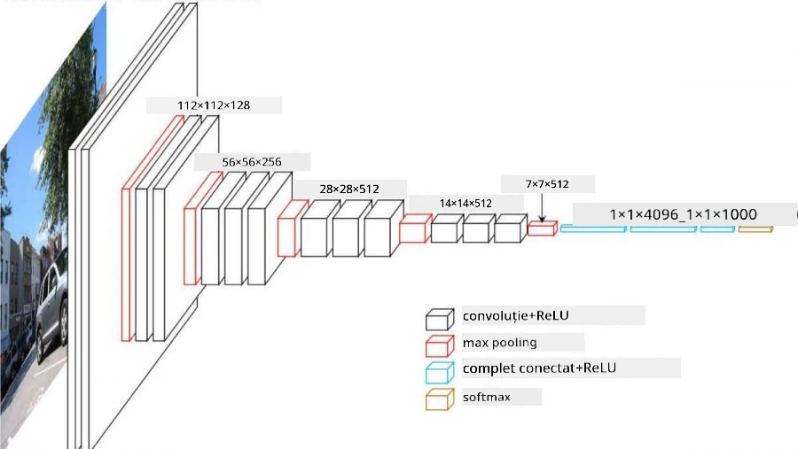
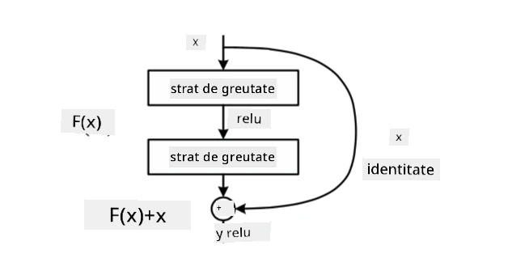
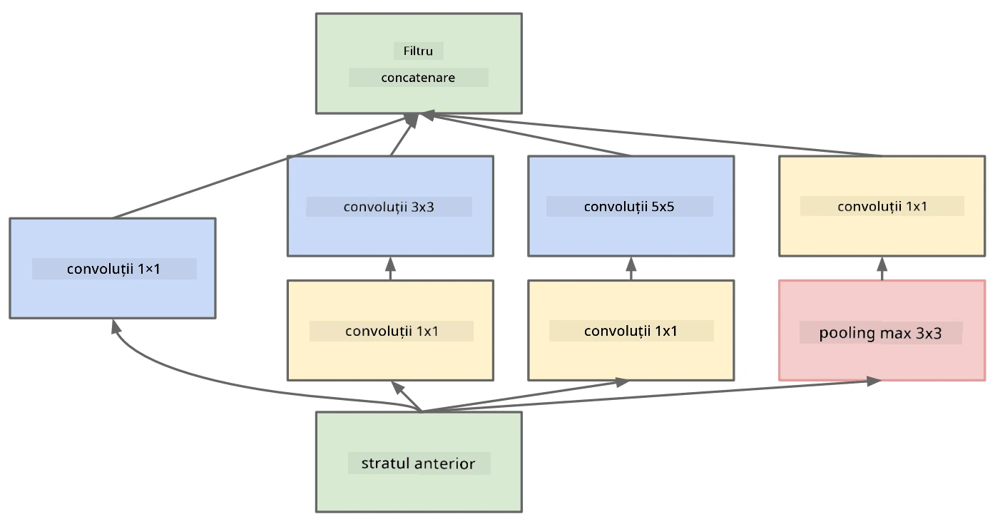

# Arhitecturi CNN Celebre

### VGG-16

VGG-16 este o rețea care a atins o acuratețe de 92.7% în clasificarea top-5 ImageNet în 2014. Structura sa de straturi este următoarea:

După cum se poate observa, VGG urmează o arhitectură tradițională de tip piramidă, care constă într-o secvență de straturi de convoluție și pooling.

> Imagine de la [Researchgate](https://www.researchgate.net/figure/Vgg16-model-structure-To-get-the-VGG-NIN-model-we-replace-the-2-nd-4-th-6-th-7-th_fig2_335194493)

### ResNet

ResNet este o familie de modele propusă de Microsoft Research în 2015. Ideea principală a ResNet este utilizarea **blocurilor reziduale**:

> Imagine din [acest articol](https://arxiv.org/pdf/1512.03385.pdf)

Motivul utilizării trecerii identitare este ca stratul să prezică **diferența** dintre rezultatul unui strat anterior și ieșirea blocului rezidual - de aici și numele *rezidual*. Aceste blocuri sunt mult mai ușor de antrenat, iar rețelele pot fi construite cu sute de astfel de blocuri (cele mai comune variante sunt ResNet-52, ResNet-101 și ResNet-152).

De asemenea, această rețea poate fi privită ca fiind capabilă să își ajusteze complexitatea în funcție de setul de date. Inițial, când începi să antrenezi rețeaua, valorile greutăților sunt mici, iar majoritatea semnalului trece prin straturile identitare. Pe măsură ce antrenamentul progresează și greutățile devin mai mari, semnificația parametrilor rețelei crește, iar rețeaua se ajustează pentru a acomoda puterea expresivă necesară clasificării corecte a imaginilor de antrenament.

### Google Inception

Arhitectura Google Inception duce această idee un pas mai departe și construiește fiecare strat al rețelei ca o combinație de mai multe căi diferite:

> Imagine de la [Researchgate](https://www.researchgate.net/figure/Inception-module-with-dimension-reductions-left-and-schema-for-Inception-ResNet-v1_fig2_355547454)

Aici, trebuie să subliniem rolul convoluțiilor 1x1, deoarece la început acestea nu par să aibă sens. De ce am avea nevoie să trecem prin imagine cu un filtru 1x1? Totuși, trebuie să ne amintim că filtrele de convoluție funcționează și cu mai multe canale de adâncime (inițial - culorile RGB, în straturile ulterioare - canale pentru diferite filtre), iar convoluția 1x1 este utilizată pentru a combina aceste canale de intrare folosind greutăți diferite, antrenabile. Poate fi privită și ca o reducere a dimensiunii (pooling) pe dimensiunea canalului.

Iată [un articol bun pe blog](https://medium.com/analytics-vidhya/talented-mr-1x1-comprehensive-look-at-1x1-convolution-in-deep-learning-f6b355825578) pe acest subiect și [articolul original](https://arxiv.org/pdf/1312.4400.pdf).

### MobileNet

MobileNet este o familie de modele cu dimensiuni reduse, potrivite pentru dispozitive mobile. Folosiți-le dacă aveți resurse limitate și puteți sacrifica puțin din acuratețe. Ideea principală din spatele lor este așa-numita **convoluție separabilă pe adâncime**, care permite reprezentarea filtrelor de convoluție printr-o compoziție de convoluții spațiale și convoluții 1x1 pe canalele de adâncime. Acest lucru reduce semnificativ numărul de parametri, făcând rețeaua mai mică ca dimensiune și mai ușor de antrenat cu mai puține date.

Iată [un articol bun pe blog despre MobileNet](https://medium.com/analytics-vidhya/image-classification-with-mobilenet-cc6fbb2cd470).

## Concluzie

În această unitate, ați învățat conceptul principal din spatele rețelelor neuronale pentru viziunea computerizată - rețelele convoluționale. Arhitecturile reale care stau la baza clasificării imaginilor, detectării obiectelor și chiar generării de imagini sunt toate bazate pe CNN-uri, doar cu mai multe straturi și câteva trucuri suplimentare de antrenament.

## 🚀 Provocare

În notebook-urile însoțitoare, există note la final despre cum să obțineți o acuratețe mai mare. Faceți câteva experimente pentru a vedea dacă puteți obține o acuratețe mai mare.

## [Quiz post-lectură](https://ff-quizzes.netlify.app/en/ai/quiz/14)

## Recapitulare & Studiu Individual

Deși CNN-urile sunt utilizate cel mai des pentru sarcini de viziune computerizată, ele sunt în general bune pentru extragerea de tipare de dimensiuni fixe. De exemplu, dacă lucrăm cu sunete, am putea dori să folosim CNN-uri pentru a căuta anumite tipare specifice în semnalul audio - caz în care filtrele ar fi unidimensionale (și acest CNN ar fi numit 1D-CNN). De asemenea, uneori se utilizează 3D-CNN pentru a extrage caracteristici în spațiul multidimensional, cum ar fi anumite evenimente care au loc într-un videoclip - CNN poate captura anumite tipare de schimbare a caracteristicilor în timp. Faceți o recapitulare și un studiu individual despre alte sarcini care pot fi realizate cu CNN-uri.

## [Temă](lab/README.md)

În acest laborator, aveți sarcina de a clasifica diferite rase de pisici și câini. Aceste imagini sunt mai complexe decât setul de date MNIST, au dimensiuni mai mari și există mai mult de 10 clase.

---

