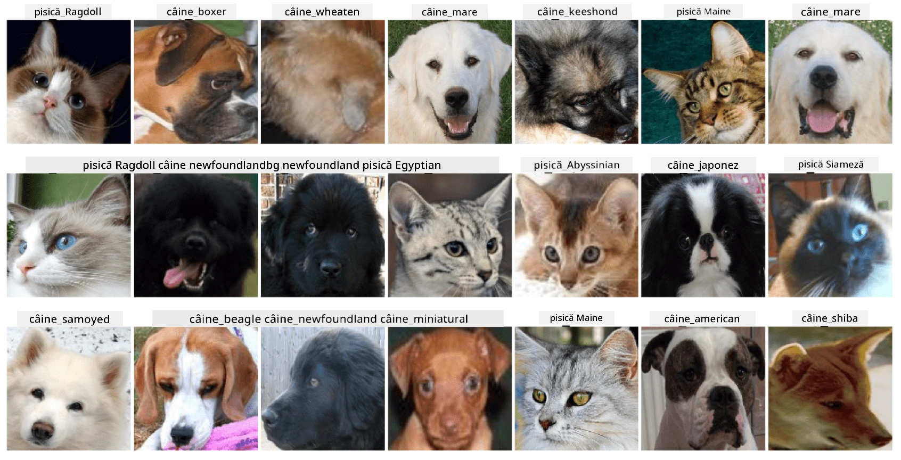

# Clasificarea Fețelor Animalelor de Companie

Temă de laborator din [Curriculum AI pentru Începători](https://github.com/microsoft/ai-for-beginners).

## Sarcina

Imaginează-ți că trebuie să dezvolți o aplicație pentru o grădiniță de animale de companie pentru a cataloga toate animalele. Una dintre funcțiile grozave ale unei astfel de aplicații ar fi identificarea automată a rasei dintr-o fotografie. Acest lucru poate fi realizat cu succes folosind rețele neuronale.

Trebuie să antrenezi o rețea neuronală convoluțională pentru a clasifica diferite rase de pisici și câini utilizând dataset-ul **Pet Faces**.

## Dataset-ul

Vom folosi [Oxford-IIIT Pet Dataset](https://www.robots.ox.ac.uk/~vgg/data/pets/), care conține imagini ale 37 de rase diferite de câini și pisici.



Pentru a descărca dataset-ul, folosește acest fragment de cod:

```python
!wget https://thor.robots.ox.ac.uk/~vgg/data/pets/images.tar.gz
!tar xfz images.tar.gz
!rm images.tar.gz
```

**Notă:** Imaginile din Oxford-IIIT Pet Dataset sunt organizate după numele fișierului (de exemplu, `Abyssinian_1.jpg`, `Bengal_2.jpg`). Notebook-ul include cod pentru organizarea acestor imagini în subdirectoare specifice rasei pentru o clasificare mai ușoară.

## Notebook-ul de Start

Începe laboratorul deschizând [PetFaces.ipynb](PetFaces.ipynb)

## Concluzie

Ai rezolvat o problemă relativ complexă de clasificare a imaginilor de la zero! Au fost destul de multe clase, și totuși ai reușit să obții o acuratețe rezonabilă! De asemenea, are sens să măsori acuratețea top-k, deoarece este ușor să confunzi unele clase care nu sunt clar diferite nici măcar pentru oameni.

---

**Declinare de responsabilitate**:  
Acest document a fost tradus folosind serviciul de traducere AI [Co-op Translator](https://github.com/Azure/co-op-translator). Deși ne străduim să asigurăm acuratețea, vă rugăm să fiți conștienți că traducerile automate pot conține erori sau inexactități. Documentul original în limba sa maternă ar trebui considerat sursa autoritară. Pentru informații critice, se recomandă traducerea profesională realizată de un specialist. Nu ne asumăm responsabilitatea pentru eventualele neînțelegeri sau interpretări greșite care pot apărea din utilizarea acestei traduceri.