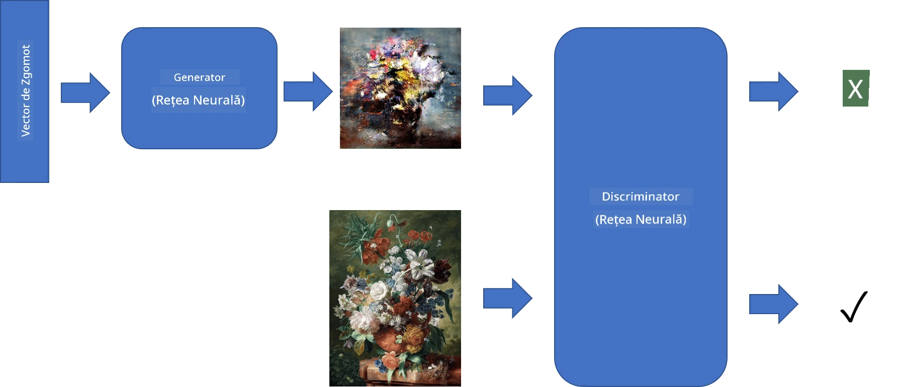
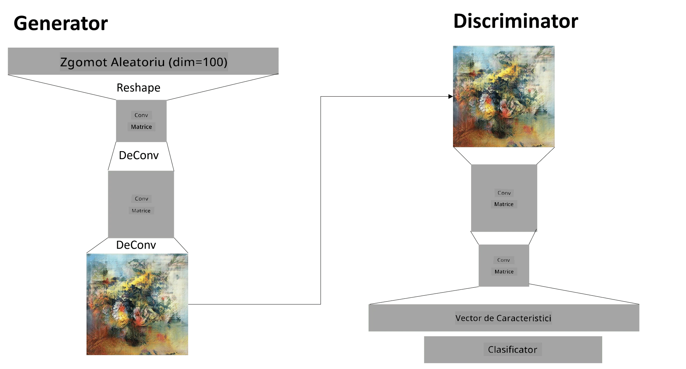

# Rețele Generative Adversariale

În secțiunea anterioară, am învățat despre **modele generative**: modele care pot genera imagini noi similare cu cele din setul de date de antrenament. VAE a fost un exemplu bun de model generativ.

## [Chestionar înainte de lecție](https://ff-quizzes.netlify.app/en/ai/quiz/19)

Totuși, dacă încercăm să generăm ceva cu adevărat semnificativ, cum ar fi o pictură la o rezoluție rezonabilă, folosind VAE, vom observa că antrenamentul nu converge bine. Pentru acest caz, ar trebui să învățăm despre o altă arhitectură special concepută pentru modele generative - **Rețele Generative Adversariale**, sau GAN-uri.

Ideea principală a unui GAN este să avem două rețele neuronale care vor fi antrenate una împotriva celeilalte:

> Imagine de [Dmitry Soshnikov](http://soshnikov.com)

> ✅ Un pic de vocabular:
> * **Generator** este o rețea care ia un vector aleator și produce o imagine ca rezultat.
> * **Discriminator** este o rețea care ia o imagine și trebuie să determine dacă este o imagine reală (din setul de date de antrenament) sau dacă a fost generată de un generator. Practic, este un clasificator de imagini.

### Discriminator

Arhitectura discriminatorului nu diferă de o rețea obișnuită de clasificare a imaginilor. În cel mai simplu caz, poate fi un clasificator complet conectat, dar cel mai probabil va fi o [rețea convoluțională](../07-ConvNets/README.md).

> ✅ Un GAN bazat pe rețele convoluționale se numește [DCGAN](https://arxiv.org/pdf/1511.06434.pdf)

Un discriminator CNN constă din următoarele straturi: mai multe straturi de convoluție+pooling (cu dimensiuni spațiale în scădere) și unul sau mai multe straturi complet conectate pentru a obține "vectorul de caracteristici", urmat de un clasificator binar final.

> ✅ 'Pooling' în acest context este o tehnică care reduce dimensiunea imaginii. "Straturile de pooling reduc dimensiunile datelor prin combinarea ieșirilor grupurilor de neuroni de la un strat într-un singur neuron în stratul următor." - [sursa](https://wikipedia.org/wiki/Convolutional_neural_network#Pooling_layers)

### Generator

Un Generator este puțin mai complicat. Îl puteți considera ca fiind un discriminator inversat. Pornind de la un vector latent (în locul unui vector de caracteristici), acesta are un strat complet conectat pentru a-l converti în dimensiunea/forma necesară, urmat de deconvoluții+scalare. Acest lucru este similar cu partea de *decoder* a unui [autoencoder](../09-Autoencoders/README.md).

> ✅ Deoarece stratul de convoluție este implementat ca un filtru liniar care traversează imaginea, deconvoluția este esențial similară cu convoluția și poate fi implementată folosind aceeași logică de strat.

> Imagine de [Dmitry Soshnikov](http://soshnikov.com)

### Antrenarea GAN-ului

GAN-urile sunt numite **adversariale** deoarece există o competiție constantă între generator și discriminator. În timpul acestei competiții, atât generatorul, cât și discriminatorul se îmbunătățesc, astfel încât rețeaua învață să producă imagini din ce în ce mai bune.

Antrenamentul se desfășoară în două etape:

* **Antrenarea discriminatorului**. Această sarcină este destul de simplă: generăm un lot de imagini cu ajutorul generatorului, etichetându-le cu 0, ceea ce înseamnă imagine falsă, și luăm un lot de imagini din setul de date de intrare (cu eticheta 1, imagine reală). Obținem o *pierdere discriminatorie* și efectuăm backpropagation.
* **Antrenarea generatorului**. Acest lucru este puțin mai complicat, deoarece nu știm direct rezultatul așteptat pentru generator. Luăm întreaga rețea GAN, formată dintr-un generator urmat de un discriminator, o alimentăm cu niște vectori aleatori și ne așteptăm ca rezultatul să fie 1 (corespunzător imaginilor reale). Apoi înghețăm parametrii discriminatorului (nu dorim să fie antrenat în acest pas) și efectuăm backpropagation.

În timpul acestui proces, pierderile generatorului și discriminatorului nu scad semnificativ. În situația ideală, acestea ar trebui să oscileze, corespunzând îmbunătățirii performanței ambelor rețele.

## ✍️ Exerciții: GAN-uri

* [Notebook GAN în TensorFlow/Keras](GANTF.ipynb)
* [Notebook GAN în PyTorch](GANPyTorch.ipynb)

### Probleme cu antrenarea GAN-urilor

GAN-urile sunt cunoscute pentru faptul că sunt deosebit de dificile de antrenat. Iată câteva probleme:

* **Colapsul modului**. Prin acest termen, ne referim la faptul că generatorul învață să producă o singură imagine de succes care păcălește discriminatorul, și nu o varietate de imagini diferite.
* **Sensibilitate la hiperparametri**. Adesea, se poate observa că un GAN nu converge deloc, iar apoi o scădere bruscă a ratei de învățare duce la convergență.
* Menținerea unui **echilibru** între generator și discriminator. În multe cazuri, pierderea discriminatorului poate scădea la zero relativ rapid, ceea ce face ca generatorul să nu mai poată fi antrenat. Pentru a depăși acest lucru, putem încerca să setăm rate de învățare diferite pentru generator și discriminator sau să sărim peste antrenarea discriminatorului dacă pierderea este deja prea mică.
* Antrenarea pentru **rezoluție înaltă**. Reflectând aceeași problemă ca în cazul autoencoderelor, această problemă apare deoarece reconstruirea prea multor straturi ale rețelei convoluționale duce la artefacte. Această problemă este de obicei rezolvată prin așa-numita **creștere progresivă**, când mai întâi câteva straturi sunt antrenate pe imagini de rezoluție mică, iar apoi straturile sunt "deblocate" sau adăugate. O altă soluție ar fi adăugarea de conexiuni suplimentare între straturi și antrenarea mai multor rezoluții simultan - vedeți acest [articol despre GAN-uri cu gradient multi-scală](https://arxiv.org/abs/1903.06048) pentru detalii.

## Transfer de Stil

GAN-urile sunt o modalitate excelentă de a genera imagini artistice. O altă tehnică interesantă este așa-numitul **transfer de stil**, care ia o **imagine de conținut** și o redesenează într-un stil diferit, aplicând filtre din **imaginea de stil**.

Cum funcționează:
* Începem cu o imagine de zgomot aleator (sau cu o imagine de conținut, dar pentru înțelegere este mai ușor să începem cu zgomot aleator).
* Scopul nostru este să creăm o imagine care să fie apropiată atât de imaginea de conținut, cât și de imaginea de stil. Acest lucru va fi determinat de două funcții de pierdere:
   - **Pierdere de conținut** este calculată pe baza caracteristicilor extrase de CNN la unele straturi din imaginea curentă și imaginea de conținut.
   - **Pierdere de stil** este calculată între imaginea curentă și imaginea de stil într-un mod ingenios folosind matrici Gram (mai multe detalii în [notebook-ul de exemplu](StyleTransfer.ipynb)).
* Pentru a face imaginea mai netedă și a elimina zgomotul, introducem și **Pierdere de variație**, care calculează distanța medie între pixeli vecini.
* Bucla principală de optimizare ajustează imaginea curentă folosind gradient descent (sau un alt algoritm de optimizare) pentru a minimiza pierderea totală, care este o sumă ponderată a tuturor celor trei pierderi.

## ✍️ Exemplu: [Transfer de Stil](StyleTransfer.ipynb)

## [Chestionar după lecție](https://ff-quizzes.netlify.app/en/ai/quiz/20)

## Concluzie

În această lecție, ați învățat despre GAN-uri și cum să le antrenați. De asemenea, ați învățat despre provocările speciale pe care acest tip de rețea neuronală le poate întâmpina și câteva strategii pentru a le depăși.

## 🚀 Provocare

Parcurgeți [notebook-ul Transfer de Stil](StyleTransfer.ipynb) folosind propriile imagini.

## Recapitulare și Studiu Individual

Pentru referință, citiți mai multe despre GAN-uri în aceste resurse:

* Marco Pasini, [10 lecții pe care le-am învățat antrenând GAN-uri timp de un an](https://towardsdatascience.com/10-lessons-i-learned-training-generative-adversarial-networks-gans-for-a-year-c9071159628)
* [StyleGAN](https://en.wikipedia.org/wiki/StyleGAN), o arhitectură GAN *de facto* de luat în considerare
* [Crearea artei generative folosind GAN-uri pe Azure ML](https://soshnikov.com/scienceart/creating-generative-art-using-gan-on-azureml/)

## Temă

Revedeți unul dintre cele două notebook-uri asociate acestei lecții și reantrenați GAN-ul pe propriile imagini. Ce puteți crea?

---

