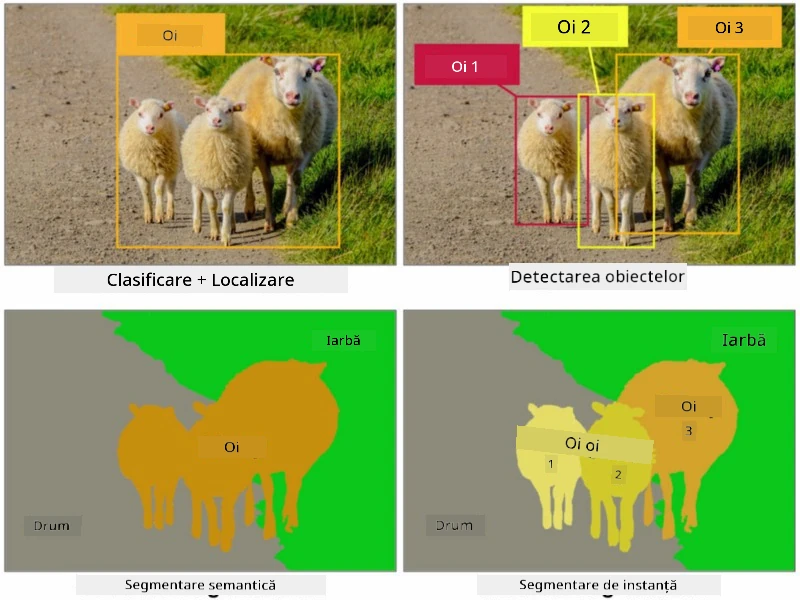
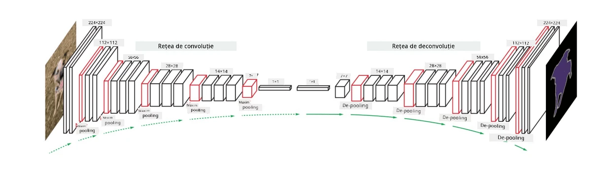

# Segmentare

Am învățat anterior despre Detectarea Obiectelor, care ne permite să localizăm obiectele din imagine prin prezicerea *cutiilor de delimitare*. Totuși, pentru unele sarcini nu avem nevoie doar de cutii de delimitare, ci și de o localizare mai precisă a obiectelor. Această sarcină se numește **segmentare**.

## [Chestionar înainte de lecție](https://ff-quizzes.netlify.app/en/ai/quiz/23)

Segmentarea poate fi privită ca **clasificarea pixelilor**, în care pentru **fiecare** pixel al imaginii trebuie să prezicem clasa sa (*fundalul* fiind una dintre clase). Există două algoritmi principali de segmentare:

* **Segmentarea semantică** indică doar clasa pixelului, fără a face distincție între diferite obiecte din aceeași clasă.
* **Segmentarea instanțelor** împarte clasele în instanțe diferite.

De exemplu, pentru segmentarea instanțelor, aceste oi sunt obiecte diferite, dar pentru segmentarea semantică toate oile sunt reprezentate de o singură clasă.

> Imagine din [acest articol de blog](https://nirmalamurali.medium.com/image-classification-vs-semantic-segmentation-vs-instance-segmentation-625c33a08d50)

Există diferite arhitecturi neuronale pentru segmentare, dar toate au aceeași structură. Într-un fel, este similar cu autoencoder-ul despre care ai învățat anterior, dar în loc să deconstruim imaginea originală, scopul nostru este să deconstruim o **mască**. Astfel, o rețea de segmentare are următoarele componente:

* **Encoder** extrage caracteristici din imaginea de intrare.
* **Decoder** transformă aceste caracteristici în **imaginea măștii**, cu aceeași dimensiune și număr de canale corespunzător numărului de clase.

> Imagine din [această publicație](https://arxiv.org/pdf/2001.05566.pdf)

Trebuie să menționăm în mod special funcția de pierdere utilizată pentru segmentare. Când folosim autoencoder-uri clasice, trebuie să măsurăm similaritatea dintre două imagini, și putem folosi eroarea medie pătratică (MSE) pentru aceasta. În segmentare, fiecare pixel din imaginea măștii țintă reprezintă numărul clasei (codificat one-hot pe a treia dimensiune), așa că trebuie să folosim funcții de pierdere specifice clasificării - pierderea de entropie încrucișată, mediată pe toți pixelii. Dacă masca este binară - se folosește **pierdere de entropie încrucișată binară** (BCE).

> ✅ Codificarea one-hot este o metodă de a codifica o etichetă de clasă într-un vector de lungime egală cu numărul de clase. Consultă [acest articol](https://datagy.io/sklearn-one-hot-encode/) pentru mai multe detalii despre această tehnică.

## Segmentare pentru Imagistica Medicală

În această lecție, vom vedea segmentarea în acțiune prin antrenarea unei rețele pentru a recunoaște nevi umani (cunoscuți și sub numele de alunițe) pe imagini medicale. Vom folosi <a href="https://www.fc.up.pt/addi/ph2%20database.html">Baza de Date PH2</a> de imagini dermoscopice ca sursă de imagini. Acest set de date conține 200 de imagini din trei clase: nevus tipic, nevus atipic și melanom. Toate imaginile conțin, de asemenea, o **mască** corespunzătoare care conturează nevusul.

> ✅ Această tehnică este deosebit de potrivită pentru acest tip de imagistică medicală, dar ce alte aplicații din lumea reală ai putea imagina?

> Imagine din Baza de Date PH2

Vom antrena un model pentru a segmenta orice nevus din fundalul său.

## ✍️ Exerciții: Segmentare Semantică

Deschide notebook-urile de mai jos pentru a afla mai multe despre diferite arhitecturi de segmentare semantică, pentru a exersa lucrul cu ele și pentru a le vedea în acțiune.

* [Segmentare Semantică Pytorch](SemanticSegmentationPytorch.ipynb)
* [Segmentare Semantică TensorFlow](SemanticSegmentationTF.ipynb)

## [Chestionar după lecție](https://ff-quizzes.netlify.app/en/ai/quiz/24)

## Concluzie

Segmentarea este o tehnică foarte puternică pentru clasificarea imaginilor, mergând dincolo de cutiile de delimitare până la clasificarea la nivel de pixel. Este o tehnică utilizată în imagistica medicală, printre alte aplicații.

## 🚀 Provocare

Segmentarea corpului este doar una dintre sarcinile comune pe care le putem realiza cu imagini ale oamenilor. Alte sarcini importante includ **detectarea scheletului** și **detectarea poziției**. Încearcă biblioteca [OpenPose](https://github.com/CMU-Perceptual-Computing-Lab/openpose) pentru a vedea cum poate fi utilizată detectarea poziției.

## Recapitulare & Studiu Individual

Acest [articol Wikipedia](https://wikipedia.org/wiki/Image_segmentation) oferă o bună prezentare generală a diferitelor aplicații ale acestei tehnici. Află mai multe pe cont propriu despre subdomeniile segmentării instanțelor și segmentării panoptice în acest domeniu de cercetare.

## [Temă](lab/README.md)

În acest laborator, încearcă **segmentarea corpului uman** folosind [Segmentation Full Body MADS Dataset](https://www.kaggle.com/datasets/tapakah68/segmentation-full-body-mads-dataset) de pe Kaggle.

---

