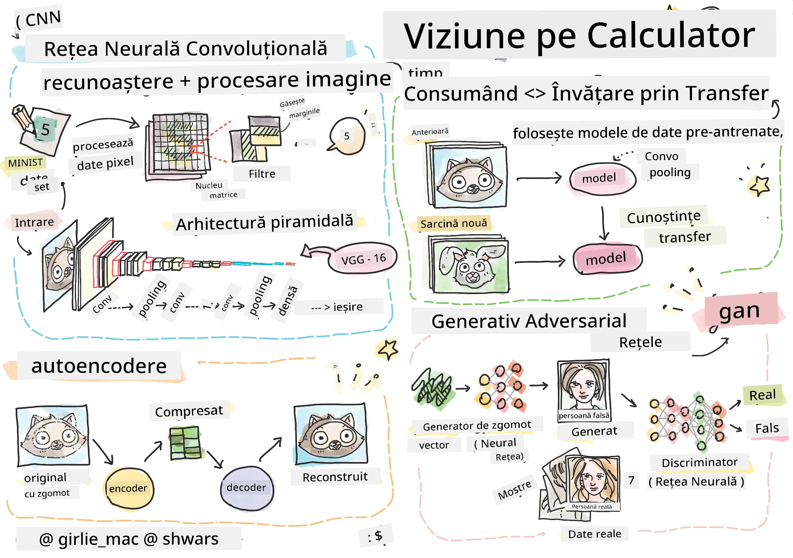

# Viziune Computerizată

În această secțiune vom învăța despre:

* [Introducere în Viziunea Computerizată și OpenCV](06-IntroCV/README.md)
* [Rețele Neuronale Convoluționale](07-ConvNets/README.md)
* [Rețele Pre-antrenate și Învățare prin Transfer](08-TransferLearning/README.md) 
* [Autoencodere](09-Autoencoders/README.md)
* [Rețele Generative Adversariale](10-GANs/README.md)
* [Detecția Obiectelor](11-ObjectDetection/README.md)
* [Segmentare Semantică](12-Segmentation/README.md)

**Declinare de responsabilitate**:  
Acest document a fost tradus folosind serviciul de traducere AI [Co-op Translator](https://github.com/Azure/co-op-translator). Deși ne străduim să asigurăm acuratețea, vă rugăm să fiți conștienți că traducerile automate pot conține erori sau inexactități. Documentul original în limba sa natală ar trebui considerat sursa autoritară. Pentru informații critice, se recomandă traducerea profesională realizată de un specialist uman. Nu ne asumăm responsabilitatea pentru eventualele neînțelegeri sau interpretări greșite care pot apărea din utilizarea acestei traduceri.