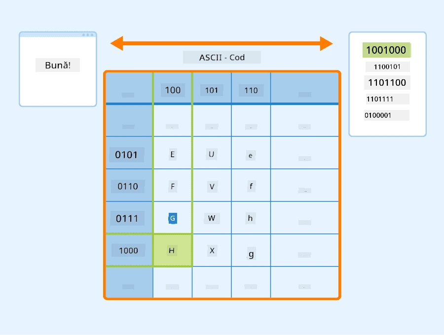
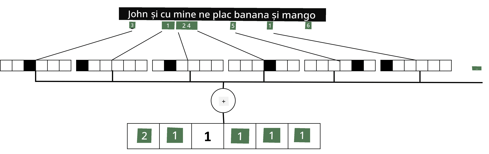

# Reprezentarea textului ca tensori

## [Chestionar înainte de lecție](https://ff-quizzes.netlify.app/en/ai/quiz/25)

## Clasificarea textului

În prima parte a acestei secțiuni, ne vom concentra pe sarcina de **clasificare a textului**. Vom utiliza setul de date [AG News](https://www.kaggle.com/amananandrai/ag-news-classification-dataset), care conține articole de știri precum următorul:

* Categorie: Știință/Tehnologie  
* Titlu: Ky. Company Wins Grant to Study Peptides (AP)  
* Corp: AP - O companie fondată de un cercetător în chimie de la Universitatea din Louisville a câștigat un grant pentru a dezvolta...

Obiectivul nostru va fi să clasificăm articolul de știri într-una dintre categorii pe baza textului.

## Reprezentarea textului

Dacă dorim să rezolvăm sarcini de Procesare a Limbajului Natural (NLP) cu rețele neuronale, avem nevoie de o modalitate de a reprezenta textul ca tensori. Calculatoarele deja reprezintă caracterele textuale ca numere care se mapează la fonturi pe ecranul tău, utilizând codificări precum ASCII sau UTF-8.

> [Sursa imaginii](https://www.seobility.net/en/wiki/ASCII)

Ca oameni, înțelegem ce **reprezintă** fiecare literă și cum toate caracterele se unesc pentru a forma cuvintele unei propoziții. Totuși, calculatoarele, prin ele însele, nu au o astfel de înțelegere, iar rețeaua neuronală trebuie să învețe semnificația în timpul antrenării.

Prin urmare, putem utiliza diferite abordări pentru a reprezenta textul:

* **Reprezentarea la nivel de caracter**, în care tratăm fiecare caracter ca un număr. Având *C* caractere diferite în corpusul nostru de text, cuvântul *Hello* ar fi reprezentat printr-un tensor de 5x*C*. Fiecare literă ar corespunde unei coloane tensoriale în codificarea one-hot.  
* **Reprezentarea la nivel de cuvânt**, în care creăm un **vocabular** al tuturor cuvintelor din textul nostru și apoi reprezentăm cuvintele utilizând codificarea one-hot. Această abordare este oarecum mai bună, deoarece fiecare literă, în sine, nu are prea multă semnificație, iar utilizând concepte semantice de nivel superior - cuvintele - simplificăm sarcina pentru rețeaua neuronală. Totuși, având în vedere dimensiunea mare a dicționarului, trebuie să gestionăm tensori sparse de dimensiuni mari.

Indiferent de reprezentare, mai întâi trebuie să convertim textul într-o secvență de **token-uri**, un token fiind fie un caracter, un cuvânt sau, uneori, chiar o parte a unui cuvânt. Apoi, convertim token-ul într-un număr, de obicei utilizând un **vocabular**, iar acest număr poate fi introdus într-o rețea neuronală utilizând codificarea one-hot.

## N-Grame

În limbajul natural, semnificația precisă a cuvintelor poate fi determinată doar în context. De exemplu, semnificațiile *rețea neuronală* și *rețea de pescuit* sunt complet diferite. Una dintre modalitățile de a ține cont de acest lucru este să construim modelul nostru pe perechi de cuvinte și să considerăm perechile de cuvinte ca token-uri separate în vocabular. În acest fel, propoziția *Îmi place să merg la pescuit* va fi reprezentată prin următoarea secvență de token-uri: *Îmi place*, *place să*, *să merg*, *merg la pescuit*. Problema cu această abordare este că dimensiunea dicționarului crește semnificativ, iar combinații precum *merg la pescuit* și *merg la cumpărături* sunt prezentate prin token-uri diferite, care nu împărtășesc nicio similaritate semantică, în ciuda aceluiași verb.

În unele cazuri, putem lua în considerare utilizarea tri-gramelor -- combinații de trei cuvinte -- de asemenea. Astfel, această abordare este adesea numită **n-grame**. De asemenea, are sens să utilizăm n-grame cu reprezentarea la nivel de caracter, caz în care n-gramele vor corespunde aproximativ diferitelor silabe.

## Bag-of-Words și TF/IDF

Când rezolvăm sarcini precum clasificarea textului, trebuie să fim capabili să reprezentăm textul printr-un vector de dimensiune fixă, pe care îl vom utiliza ca intrare pentru clasificatorul dens final. Una dintre cele mai simple modalități de a face acest lucru este să combinăm toate reprezentările individuale ale cuvintelor, de exemplu, prin adunarea lor. Dacă adunăm codificările one-hot ale fiecărui cuvânt, vom obține un vector de frecvențe, care arată de câte ori apare fiecare cuvânt în text. O astfel de reprezentare a textului se numește **bag of words** (BoW).

> Imagine de autor

Un BoW reprezintă esențialmente ce cuvinte apar în text și în ce cantități, ceea ce poate fi într-adevăr un bun indicator al subiectului textului. De exemplu, un articol de știri despre politică este probabil să conțină cuvinte precum *președinte* și *țară*, în timp ce o publicație științifică ar avea ceva de genul *colizor*, *descoperit*, etc. Astfel, frecvențele cuvintelor pot fi, în multe cazuri, un bun indicator al conținutului textului.

Problema cu BoW este că anumite cuvinte comune, precum *și*, *este*, etc., apar în majoritatea textelor și au cele mai mari frecvențe, mascând cuvintele care sunt cu adevărat importante. Putem reduce importanța acestor cuvinte ținând cont de frecvența cu care apar în întreaga colecție de documente. Aceasta este ideea principală din spatele abordării TF/IDF, care este acoperită în detaliu în notebook-urile atașate acestei lecții.

Totuși, niciuna dintre aceste abordări nu poate ține pe deplin cont de **semantica** textului. Avem nevoie de modele de rețele neuronale mai puternice pentru a face acest lucru, pe care le vom discuta mai târziu în această secțiune.

## ✍️ Exerciții: Reprezentarea textului

Continuă învățarea în următoarele notebook-uri:

* [Reprezentarea textului cu PyTorch](TextRepresentationPyTorch.ipynb)  
* [Reprezentarea textului cu TensorFlow](TextRepresentationTF.ipynb)  

## Concluzie

Până acum, am studiat tehnici care pot adăuga greutate frecvenței diferitelor cuvinte. Totuși, ele nu sunt capabile să reprezinte semnificația sau ordinea. După cum a spus faimosul lingvist J. R. Firth în 1935, "Semnificația completă a unui cuvânt este întotdeauna contextuală, și niciun studiu al semnificației în afara contextului nu poate fi luat în serios." Vom învăța mai târziu în curs cum să captăm informații contextuale din text utilizând modelarea limbajului.

## 🚀 Provocare

Încearcă alte exerciții utilizând bag-of-words și diferite modele de date. Poți fi inspirat de această [competiție pe Kaggle](https://www.kaggle.com/competitions/word2vec-nlp-tutorial/overview/part-1-for-beginners-bag-of-words)

## [Chestionar după lecție](https://ff-quizzes.netlify.app/en/ai/quiz/26)

## Recapitulare și Studiu Individual

Exersează-ți abilitățile cu tehnicile de embedding text și bag-of-words pe [Microsoft Learn](https://docs.microsoft.com/learn/modules/intro-natural-language-processing-pytorch/?WT.mc_id=academic-77998-cacaste)

## [Temă: Notebook-uri](assignment.md)

---

