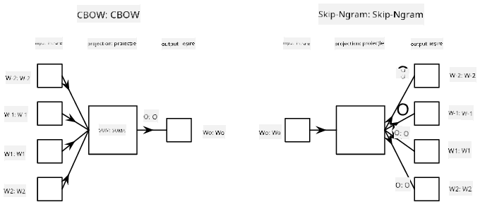

<!--
CO_OP_TRANSLATOR_METADATA:
{
  "original_hash": "31b46ba1f3aa78578134d4829f88be53",
  "translation_date": "2025-08-25T21:56:03+00:00",
  "source_file": "lessons/5-NLP/15-LanguageModeling/README.md",
  "language_code": "ro"
}
-->
# Modelarea Limbajului

Încorporările semantice, precum Word2Vec și GloVe, reprezintă de fapt un prim pas către **modelarea limbajului** - crearea unor modele care cumva *înțeleg* (sau *reprezintă*) natura limbajului.

## [Chestionar înainte de lecție](https://ff-quizzes.netlify.app/en/ai/quiz/29)

Ideea principală din spatele modelării limbajului este antrenarea acestora pe seturi de date neetichetate într-un mod nesupravegheat. Acest lucru este important deoarece avem la dispoziție cantități uriașe de text neetichetat, în timp ce cantitatea de text etichetat va fi întotdeauna limitată de efortul pe care îl putem depune pentru etichetare. De cele mai multe ori, putem construi modele de limbaj care pot **prezice cuvinte lipsă** în text, deoarece este ușor să mascăm un cuvânt aleatoriu din text și să-l folosim ca exemplu de antrenament.

## Antrenarea Încorporărilor

În exemplele anterioare, am folosit încorporări semantice pre-antrenate, dar este interesant să vedem cum pot fi antrenate aceste încorporări. Există mai multe idei posibile care pot fi utilizate:

* **Modelarea limbajului cu N-Gram**, unde prezicem un token analizând N token-uri anterioare (N-gram).
* **Continuous Bag-of-Words** (CBoW), unde prezicem token-ul din mijloc $W_0$ într-o secvență de token-uri $W_{-N}$, ..., $W_N$.
* **Skip-gram**, unde prezicem un set de token-uri vecine {$W_{-N},\dots, W_{-1}, W_1,\dots, W_N$} pornind de la token-ul din mijloc $W_0$.

> Imagine din [acest articol](https://arxiv.org/pdf/1301.3781.pdf)

## ✍️ Exemple de Notebook-uri: Antrenarea modelului CBoW

Continuă învățarea cu următoarele notebook-uri:

* [Antrenarea CBoW Word2Vec cu TensorFlow](../../../../../lessons/5-NLP/15-LanguageModeling/CBoW-TF.ipynb)
* [Antrenarea CBoW Word2Vec cu PyTorch](../../../../../lessons/5-NLP/15-LanguageModeling/CBoW-PyTorch.ipynb)

## Concluzie

În lecția anterioară am văzut că încorporările de cuvinte funcționează ca prin magie! Acum știm că antrenarea încorporărilor de cuvinte nu este o sarcină foarte complexă și ar trebui să putem antrena propriile încorporări pentru texte specifice unui domeniu, dacă este necesar.

## [Chestionar după lecție](https://ff-quizzes.netlify.app/en/ai/quiz/30)

## Recapitulare și Studiu Individual

* [Tutorial oficial PyTorch despre Modelarea Limbajului](https://pytorch.org/tutorials/beginner/nlp/word_embeddings_tutorial.html).
* [Tutorial oficial TensorFlow despre antrenarea modelului Word2Vec](https://www.TensorFlow.org/tutorials/text/word2vec).
* Utilizarea framework-ului **gensim** pentru a antrena cele mai utilizate încorporări în câteva linii de cod este descrisă [în această documentație](https://pytorch.org/tutorials/beginner/nlp/word_embeddings_tutorial.html).

## 🚀 [Temă: Antrenează Modelul Skip-Gram](lab/README.md)

În laborator, te provocăm să modifici codul din această lecție pentru a antrena un model skip-gram în loc de CBoW. [Citește detaliile](lab/README.md)

**Declinare de responsabilitate**:  
Acest document a fost tradus folosind serviciul de traducere AI [Co-op Translator](https://github.com/Azure/co-op-translator). Deși ne străduim să asigurăm acuratețea, vă rugăm să fiți conștienți că traducerile automate pot conține erori sau inexactități. Documentul original în limba sa natală ar trebui considerat sursa autoritară. Pentru informații critice, se recomandă traducerea profesională realizată de un specialist uman. Nu ne asumăm responsabilitatea pentru eventualele neînțelegeri sau interpretări greșite care pot apărea din utilizarea acestei traduceri.